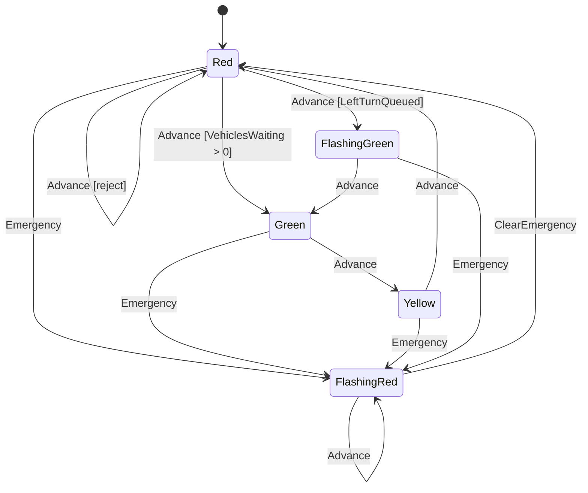

# Precept Authoring Workflow

Step-by-step companion to the precept-author agent for creating or editing a `.precept` file. Use this when you want the canonical sequence; the agent's body has the philosophy and the operating principles.

## Step 1: Orient (new sessions only)

Call `precept_quickstart` at the start of a new authoring session. It returns what Precept is, core concepts, a guide to all authoring tools, and minimal verified DSL examples. Skip if context from an earlier step in this session is already established.

## Step 2: Decide Stateful vs Stateless, then the Field-Presence Pattern

Before sketching anything, decide whether the entity needs a lifecycle.

- **Stateful** if the entity moves through discrete positions with *different rules in each*. Loan applications, hiring pipelines, insurance claims.
- **Stateless** if the entity is data with rules that always apply. Customer profiles, payment methods, fee schedules.

Default to stateless unless lifecycle is real. Every state must justify its existence by activating a distinct rule set.

**For stateful precepts, also pick the field-presence pattern** (see `precept_patterns` for full examples):

- **Free-Construction Pattern (Governed Draft) — the default for user-filled forms.** Start in a draft state with `editable` fields; no `initial` event (so `Create()` is parameterless); have the submit/commit event TRANSITION to the next state. Use this for any entity a user fills in over time: applications, claims, tickets, work orders, requests, registrations.

  Fields required *at commit* (but not at birth) are declared `optional`, then gated by event ensures on the commit event: `on Submit ensure Field is set because "..."`. Do NOT use `notempty` on these fields — `notempty` requires presence at every operation including Create(), which fails immediately.

  Anti-pattern (see `precept_patterns`): a self-looping commit event with `-> no transition` plus `when XxxAt is set` guards on later transitions. That is **"Sub-state encoded as a field-presence guard"** — pack two states into one and the guard does work the state should. Make the sub-state real.
- **Constructor Pattern — atomic-creation only.** Use ONLY when data arrives in full at creation from a non-user source (system event, batch import, single-API-call record, snapshot, scheduled job). Declare `event Create(...) initial`. If a human will be filling in any fields, this is the wrong pattern.
- **`omit` for lifecycle-absent fields** — when a field is meaningful in some states but not others, declare `in State omit Field` for the states where it doesn't belong. Pairs with `clear Field` on transitions OUT of present-states.

Anti-pattern: **sentinel defaults** (`default 0`, `default false`, `default ""`) on fields that should be absent in early states. Use `omit` instead.

## Step 3: Gather Local Conventions

Read one or more existing `.precept` files from the workspace to understand local style: naming conventions, comment placement, field ordering, guard patterns, quote style. The original samples (e.g., `loan-application.precept`, `apartment-rental-application.precept`, `hiring-pipeline.precept`, `customer-profile.precept`) are the canonical style reference. Match their **lighter prose-comment style** — short top-of-file domain explanation, single-line `# Fields` / `# Events` section headers where useful, inline comments only when the `because` clause doesn't carry the explanation. Do NOT use walls of `# ============` separators or ALL-CAPS section banners.

If no local files exist, the verified patterns from `precept_patterns` (Step 4) serve as the style reference.

## Step 4: Get Patterns Before Drafting

Call `precept_patterns` before writing the first draft. **Imitate the patterns, don't just read them.** When a pattern shows the canonical form for a construct (field declaration with modifiers, transition shape, computed-field arrow direction), use it rather than inventing an alternative idiom. The verified patterns and anti-patterns are the most efficient way to avoid mistakes that would require backtracking later.

In particular: **prefer structural modifiers over separate rules.** A required string is `string notempty maxlength N`, not `string default "" + rule X != ""`. A nonnegative integer is `integer nonnegative`, not `integer default 0 + rule X >= 0`. The first form is structural and proved at compile time; the second is checked at runtime and weakens the contract.

## Step 5: Design the Model

Before writing code, outline the domain model:

1. **Fields** — identify the data tracked. Choose types (`string`, `integer`, `number`, `boolean`, `money`, `quantity`, `date`, `time`, etc.), set defaults, mark optional fields. Prefer the most specific type the domain allows.
2. **Rules** — identify invariants that must hold in every state (or always, for stateless precepts). Add `when` guards where the rule applies only in specific scenarios.
3. **States** *(stateful only)* — identify the distinct lifecycle stages. Mark one as `initial`. Mark terminal stages as `terminal`.
4. **State constraints** *(stateful only)* — identify ensures that must hold when entering or remaining in a specific state.
5. **Write declarations** *(stateful only)* — identify which fields are directly editable in which states via `Update`.
6. **Events** *(stateful only)* — identify the actions that cause transitions. Define event arguments with types and defaults.
7. **Event ensures** *(stateful only)* — identify validation rules on event arguments.
8. **Transitions** *(stateful only)* — map out `from <State> on <Event>` rows with guards (`when`), field mutations (`set`/`clear`), and outcomes (`transition`, `no transition`, `reject`).

Get the user's agreement on this model before writing DSL.

## Step 6: Consult Reference Tools While Writing

Use these tools when you need authoritative answers while drafting:

- `precept_syntax` — syntax for a construct, action chain, operator, or grammar rule.
- `precept_types` — field types, modifiers (`optional`, `nonnegative`, `notempty`, `terminal`), or built-in functions.
- `precept_domains` — money, quantity, price, or temporal fields. Returns ISO 4217 currencies, UCUM units, SI prefixes, named physical dimensions.
- `precept_operations` — operator combinations for a given type (e.g., `Money + Money`, `Quantity * Number`). For comparison operators, check `qualifierMatch`: `Same` means both operands must have identical qualifiers (currency and unit for `price`; currency for `money`).
- `precept_proofs` — proof obligation catalog and runtime fault catalog. Use when writing `when` guards or `ensure` constraints.

## Step 7: Write the Precept

Author the `.precept` file in canonical order:

```
precept <Name>

# Description comment

# Fields
field <Name> as <type> [optional] [default <value>]

# Rules
rule <expr> [when <condition>] because "<message>"

# States                              (omit for stateless precepts)
state <Name> [initial] [terminal]

# State constraints + entry gates     (omit for stateless precepts)
in <State> [when <condition>] ensure <expr> because "<message>"
to <State> ensure <expr> because "<message>"

# Write declarations                  (omit for stateless precepts)
in <State> modify <Field1>, <Field2> editable

# Events                              (omit for stateless precepts)
event <Name>[(Arg as <type> [default <value>], ...)]
on <Event> ensure <expr> because "<message>"

# Transitions                         (omit for stateless precepts)
from <State|any> on <Event> [when <guard>]
    -> <action>
    -> <outcome>
```

**Outcomes:** `transition <State>`, `no transition`, `reject "<message>"`.
**Actions:** `set <field> = <expr>`, `clear <field>` (for optional fields).

Every `rule`, `ensure`, and `reject` carries a `because "<message>"`. Make the message a domain explanation, not "rule must hold."

## Step 8: Compile and Fix

Call `precept_compile` with the full text. Read all diagnostics:

- **Errors** — fix immediately; these prevent the definition from loading.
- **Warnings** — review each one. Common warnings include unreachable states, dead-end states, and shadowed transition rows.
- **Hints** — informational; address if they reveal design gaps.

For any diagnostic code you don't immediately understand, call `precept_diagnostic` with the code name (e.g., `UndeclaredField`) or PRE-number (e.g., `PRE0017`). It returns the trigger condition, recovery steps, and before/after fix examples. Don't guess — look it up.

Repeat until the definition compiles cleanly.

## Step 9: State Diagram (optional, often valuable)

For stateful precepts, generate a Mermaid `stateDiagram-v2` from the `transitions` array in the compile result. Often the fastest way for a domain expert to validate the model.

- Each unique `from → to` pair becomes an arrow.
- Label arrows with the event name.
- If a transition has a guard, append it in brackets: `Event [guard]`.
- Mark the initial state with `[*] --> StateName`.
- Reject outcomes: `StateName --> StateName : Event [reject]`.

Example:



## Common Patterns

### Guard priority
Place more specific guards before less specific ones. The first matching `from/on` row wins.

```
from Red on Advance when LeftTurnQueued -> ...
from Red on Advance when VehiclesWaiting > 0 -> ...
from Red on Advance -> reject "No demand"
```

### Catch-all events
Use `from any on <Event>` for events that apply regardless of state.

```
from any on VehiclesArrive -> set VehiclesWaiting = VehiclesWaiting + VehiclesArrive.Count -> no transition
```

### Clearing an optional field
Use `clear` to reset an optional field to unset.

```
from FlashingRed on ClearEmergency -> clear EmergencyReason -> transition Red
```

### Useful reject messages
Interpolate field values so the domain expert sees the actual data, not just the rule.

```
from Submitted on Approve
    -> reject "Approval requires income of at least {RequestedRent * 3} (yours: {MonthlyIncome})"
```

## When You Encounter a DSL Limitation

If a compile error, proof failure, or runtime constraint prevents you from expressing a business rule the way the DSL ought to allow, **do not author a hidden workaround.** Capture the bug, then decide whether to ship.

1. **Append an entry to `docs/Working/bugs.md`** using the BUG-NNN template at the top of that file. Include: discovery date, affected files, symptom (diagnostic code + message), minimal repro snippet, fix-complexity estimate.
2. **Decide:** skip the sample if no acceptable workaround exists; OR use a transparent workaround with a `# BUG-NNN: <one-line>` comment at the workaround site. Never bury it.
3. **Surface it in your final report** so the user can schedule fixes.

The proof engine `ConstraintContext` narrowing bug fixed in this spike is the precedent: discovered exactly this way, captured cleanly, then fixed as separate engineering work.

## After Every Sample: One-Line Self-Reflection

Include in your final report, for each sample authored:

- One thing that surprised you about the DSL or MCP tools
- Any limitation you encountered (whether or not it became a bug entry)
- Any guidance in this skill or the agent body you wish was sharper

Honest, terse, concrete. This feedback drives continuous improvement of the agent body.
