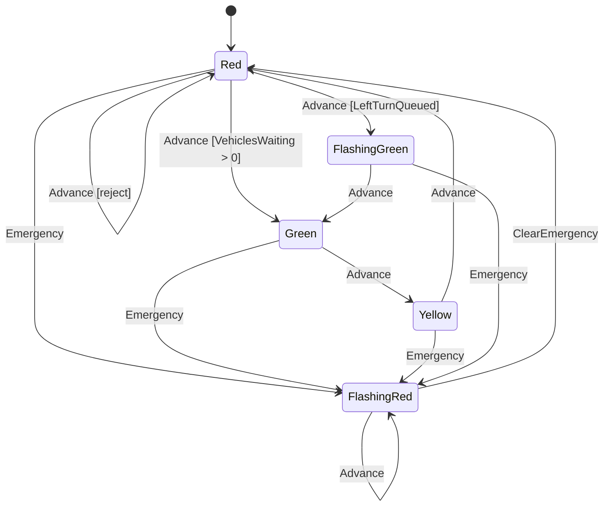

# Precept Authoring Workflow

Follow these steps when creating or editing a `.precept` file.

## Step 1: Orient (New Sessions Only)

Call `precept_quickstart` at the start of a new authoring session. It returns what Precept is, core concepts, a guide to all authoring tools, and minimal verified DSL examples. Skip if context from an earlier step in this session is already established.

## Step 2: Gather Local Conventions

Read one or more existing `.precept` files from the workspace to understand local style: naming conventions, comment placement, field ordering, and guard patterns. If no local files exist, the verified patterns from `precept_patterns` (Step 3) serve as the style reference.

## Step 3: Get Patterns Before Drafting

Call `precept_patterns` before writing the first draft. The 8 verified common patterns and 3 anti-patterns are the most efficient way to avoid mistakes that would require backtracking later.

## Step 4: Design the Model

Before writing code, outline the domain model:

1. **States** — identify the distinct lifecycle stages. Mark one as `initial`. Mark terminal stages as `terminal`.
2. **Fields** — identify the data tracked across states. Choose types (`string`, `integer`, `number`, `boolean`, `money`, `quantity`), set defaults, and mark optional fields.
3. **Events** — identify the actions that cause transitions. Define event arguments with types and defaults.
4. **Rules** — identify invariants that must hold in every state.
5. **State constraints** — identify ensures that must be true when entering or remaining in a specific state.
6. **Event ensures** — identify validation rules on event arguments.
7. **Transitions** — map out `from <State> on <Event>` rows with guards (`when`), field mutations (`set`/`clear`), and outcomes (`transition`, `no transition`, `reject`).
8. **Write declarations** — identify which fields are directly editable in which states.

## Step 5: Consult Reference Tools as Needed During Writing

Use these tools when you need authoritative answers while drafting:

- `precept_syntax` — when you need the syntax for a construct, action chain, operator, or grammar rule.
- `precept_types` — when declaring field types, choosing modifiers (`optional`, `nonnegative`, `notempty`, `terminal`), or using built-in functions.
- `precept_domains` — when working with money, quantity, price, or temporal fields. Returns ISO 4217 currencies, UCUM units, SI prefixes, and named physical dimensions.
- `precept_operations` — when you need to know what operator combinations work for a given type (e.g., `Money + Money`, `Quantity * Number`). Pass a type name as the optional category filter. For comparison operators (`>=`, `==`, etc.), check the `qualifierMatch` field: `Same` means both operands must have identical qualifiers (currency and unit for `price`; currency for `money`). Two `price` fields with different denominator units cannot be directly compared even though both are `price`.
- `precept_proofs` — when writing `when` guards or `ensure` constraints. Returns the proof obligation catalog and runtime fault catalog — what the proof engine verifies and what faults to prevent.

## Step 6: Write the Precept

Author the `.precept` file in this canonical order:

```
precept <Name>

# Description comment

# Fields
field <Name> as <type> [optional] [default <value>]

# Rules
rule <expr> [when <condition>] because "<message>"

# States
state <Name> [initial] [terminal]

# State constraints
in <State> [when <condition>] ensure <expr> because "<message>"

# Write declarations
in <State> modify <Field1>, <Field2> editable

# Events and event ensures
event <Name>[(Arg as <type> [default <value>], ...)]
on <Event> ensure <expr> because "<message>"

# Transitions
from <State|any> on <Event> [when <guard>]
    -> <action>
    -> <outcome>
```

Outcomes: `transition <State>`, `no transition`, `reject "<message>"`.
Actions: `set <field> = <expr>`, `clear <field>` (for optional fields).

## Step 7: Compile and Fix

Call `precept_compile` with the full text. Read all diagnostics:

- **Errors**: fix immediately — these prevent the definition from loading.
- **Warnings**: review each one. Common warnings include unreachable states, dead-end states, and shadowed transition rows.
- **Hints**: informational — address if they reveal design gaps.

For any diagnostic code you don't immediately understand, call `precept_diagnostic` with the code name (e.g., `UndeclaredField`) or PRE-number (e.g., `PRE0017`). It returns the trigger condition, recovery steps, and before/after fix examples. Don't guess — look it up.

Repeat until the definition compiles cleanly.

## Step 8: State Diagram (Optional)

After the precept compiles, generate a Mermaid `stateDiagram-v2` from the `transitions` array in the compile result. Use this when it adds clarity or the user asks.

- Each unique `from → to` pair becomes an arrow.
- Label arrows with the event name.
- If a transition has a guard, append it in brackets: `Event [guard]`.
- Mark the initial state with `[*] --> StateName`.
- Reject outcomes: `StateName --> StateName : Event [reject]`.
- Use the render tool rather than pasting raw Mermaid source unless the user asks for source or wants to save it to a file.
- If a guard-heavy label fails to render cleanly, simplify the label text for the diagram and explain that the exact guard remains in the precept source.

Example:



## Common Patterns

### Guard priority
Place more specific guards before less specific ones. The first matching `from/on` row wins.

```
from Red on Advance when LeftTurnQueued -> ...
from Red on Advance when VehiclesWaiting > 0 -> ...
from Red on Advance -> reject "No demand"
```

### Catch-all events
Use `from any on <Event>` for events that apply regardless of state.

```
from any on VehiclesArrive -> set VehiclesWaiting = VehiclesWaiting + VehiclesArrive.Count -> no transition
```

### Clearing an optional field
Use `clear` to reset an optional field to unset.

```
from FlashingRed on ClearEmergency -> clear EmergencyReason -> transition Red
```