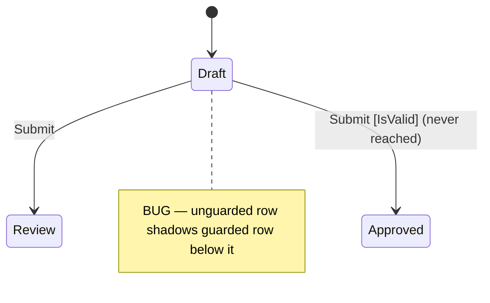

# Precept Debugging Workflow

Follow these steps when diagnosing problems in a `.precept` file.

When proposing a fix, match local `.precept` conventions when samples or nearby definitions already exist.

## Step 1: Compile First

Call `precept_compile` with the full precept text. This is always the first step — never skip it. It catches syntax errors, type errors, and structural issues and returns the full definition structure.

Read the diagnostics carefully:

- **Errors**: block the definition from loading. Fix these first.
- **Warnings**: reveal structural problems — unreachable states, dead-end states, unused fields, shadowed transitions.
- **Hints**: informational but may point to design gaps.

## Step 2: Look Up Each Diagnostic

For every diagnostic code in the compile output, call `precept_diagnostic` with the code name (e.g., `UndeclaredField`) or PRE-number (e.g., `PRE0017`). It returns the trigger condition, recovery steps, and before/after fix examples. Do not guess what a diagnostic means — look it up.

## Step 3: Understand the Structure

From the `precept_compile` output, review:

- **States**: which states exist, which is initial, which are terminal
- **Fields**: names, types, defaults, nullability
- **Events**: names, arguments, ensures
- **Transitions**: the full `from/on/when/actions` table — this is the core logic

If the user reports a specific problem, locate the relevant transition rows in this table.

## Step 4: Consult Reference Tools for Expression and Type Issues

Use these tools when the problem is in expression syntax, type usage, or operator combinations:

- `precept_syntax` — when the issue involves malformed construct syntax, incorrect action chain, or operator usage
- `precept_types` — when the issue involves field type declarations, modifier usage, or built-in function calls
- `precept_operations` — when the issue involves operator type mismatches (e.g., adding incompatible types); pass a type name to filter
- `precept_proofs` — when the issue involves guard evaluation or constraint violations; shows what the proof engine expects and what runtime faults result

## Step 5: Reason from the Compile Output

The runtime does not have MCP-accessible introspection tools. All diagnosis is static — from compile output, diagnostic lookup, and reasoning about the transition table. Do not suggest running or tracing execution.

Common patterns that can be fully diagnosed from the compile output:

### Guard ordering issues
Transition rows are evaluated top-to-bottom. The first matching `from/on` row wins. An unguarded catch-all row shadows any guarded rows below it.

```
# BUG: the unguarded row matches first — the guarded row is never reached
from Draft on Submit -> transition Review
from Draft on Submit when IsValid -> transition Approved
```

Move the guarded row above the catch-all.

### Unreachable states
A state has no incoming transitions. Either add a transition that targets it or remove the state.

### Dead-end states
A non-terminal state has no outgoing transitions. Check whether this is intentional or an omission.

### Constraint violations on transition
If a state constraint fails after a transition, check whether the `set` actions produce data satisfying the target state's `ensure` expressions.

### Event ensure rejection
If an `on <Event> ensure ...` fails, the event is rejected before transition logic runs. Check the provided event arguments, not the current state.

### Same-type comparison fails (qualifier mismatch)
`PriceGreaterThanOrEqualPrice`, `MoneyGreaterThanOrEqualMoney`, and all same-type comparison operators have `qualifierMatch: Same` — both operands must have identical qualifiers (currency AND unit for price; currency for money). Two `price` values with different denominator units (e.g., `price in 'USD' of 'SaleUnit'` vs `price in 'USD' of 'StockingUnit'`) will fail with a type mismatch even though both are `price`. Call `precept_operations` filtered by the operand type and check the `qualifierMatch` field on the failing operator before concluding the types themselves are wrong.

## Optional State Diagram for Diagnosis

When transition structure is the problem, a focused Mermaid `stateDiagram-v2` can make the bug obvious by revealing shadowed rows or unreachable states.

