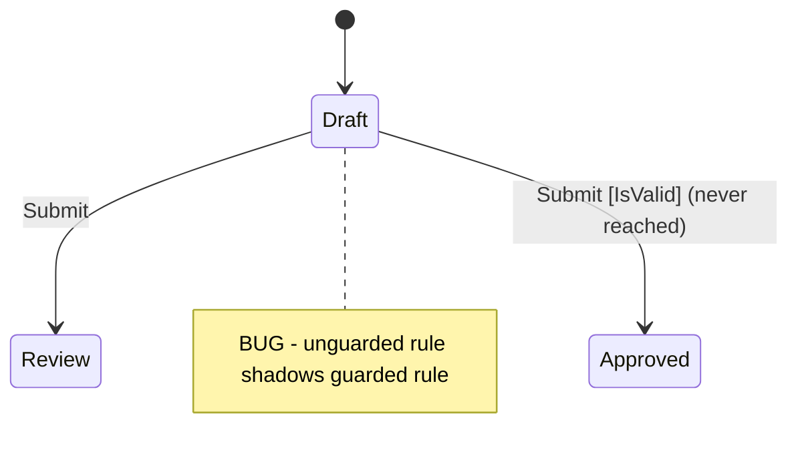

# Precept Debugging Workflow

Follow these steps when diagnosing problems in a `.precept` file.

Before guessing about DSL syntax, operators, or runtime semantics, call `precept_language`. It is the authoritative source for language behavior.

When proposing a fix, match local `.precept` conventions when samples or nearby definitions already exist.

## Step 1: Compile First

Call `precept_compile` with the full precept text. This is always the first step — it catches syntax errors, type errors, and structural issues before you look at runtime behavior.

Read the diagnostics carefully:
- **Errors** block the definition from loading. Fix these first.
- **Warnings** reveal structural problems: unreachable states, dead-end states, unused fields, shadowed transitions.
- **Hints** are informational but may point to design gaps.

## Step 2: Understand the Structure

From the `precept_compile` output, review:
- **States**: which states exist, which is initial
- **Fields**: names, types, defaults, nullability
- **Events**: names, arguments, ensures
- **Transitions**: the full `from/on/when/actions` table — this is the core logic

If the user reports a specific problem, locate the relevant transitions in this table.

## Step 3: Inspect from the Problem State

Use `precept_inspect` only after `precept_compile` succeeds.

Call `precept_inspect` with the precept text, the state where the problem occurs, and the current data snapshot. The response shows:
- Which events are available from this state
- What each event would do (transition target, field changes, or rejection)
- Which fields are editable in this state

This tells you what the runtime *would* do without actually executing anything.

## Step 4: Trace with Fire

Use `precept_fire` only after `precept_inspect` succeeds and the problem involves a specific event that still needs tracing. If inspect already answers the question, stop there.

If the problem involves a specific event, call `precept_fire` with the precept text, current state, event name, data, and event arguments. Compare the actual outcome against what the user expected. The mismatch reveals the bug.

Useful checkpoints when comparing outcomes:
1. Event ensures
2. Transition row selection
3. Guard pass or fail
4. Field mutations
5. State-entry constraints
6. Final outcome: transition, no transition, or reject

## Step 5: Test Field Edits

If the problem involves field editing or constraint violations during data entry, call `precept_update` with the precept text, current state, data, and the fields being changed. This tests the `in <State> edit` declarations and any associated constraints. Do not run `precept_update` speculatively when the issue is clearly about transition behavior rather than editable fields.

## Common Diagnostic Patterns

### Guard ordering issues
Transition rows are evaluated top-to-bottom. The first matching `from/on` row wins.

```
# BUG: the unguarded row matches first
from Draft on Submit -> transition Review
from Draft on Submit when IsValid -> transition Approved
```

Move the guarded row above the catch-all.

### Unreachable states
A state has no incoming transitions. Either add a transition that targets it or remove the state.

### Dead-end states
A state has no outgoing transitions. That can be valid for terminal states, but it is often accidental.

### Constraint violations on transition
If a state constraint fails after a transition, check whether the `set` actions produce the data that the target state's ensures require.

### Event ensure rejection
If an `on <Event> ensure ...` fails, the event is rejected before transition logic runs. Check the provided event arguments first.

## Optional State Diagram For Diagnosis

When transition structure is the problem, a focused Mermaid `stateDiagram-v2` can make the bug obvious.

