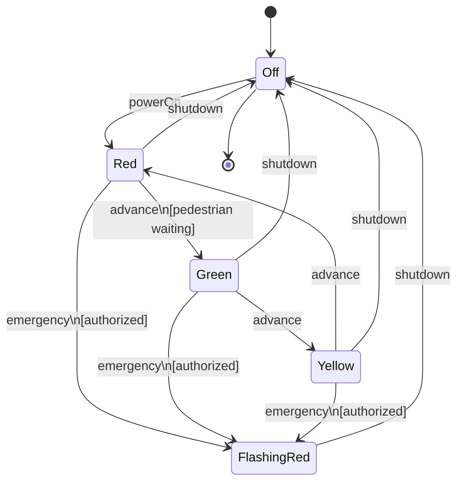
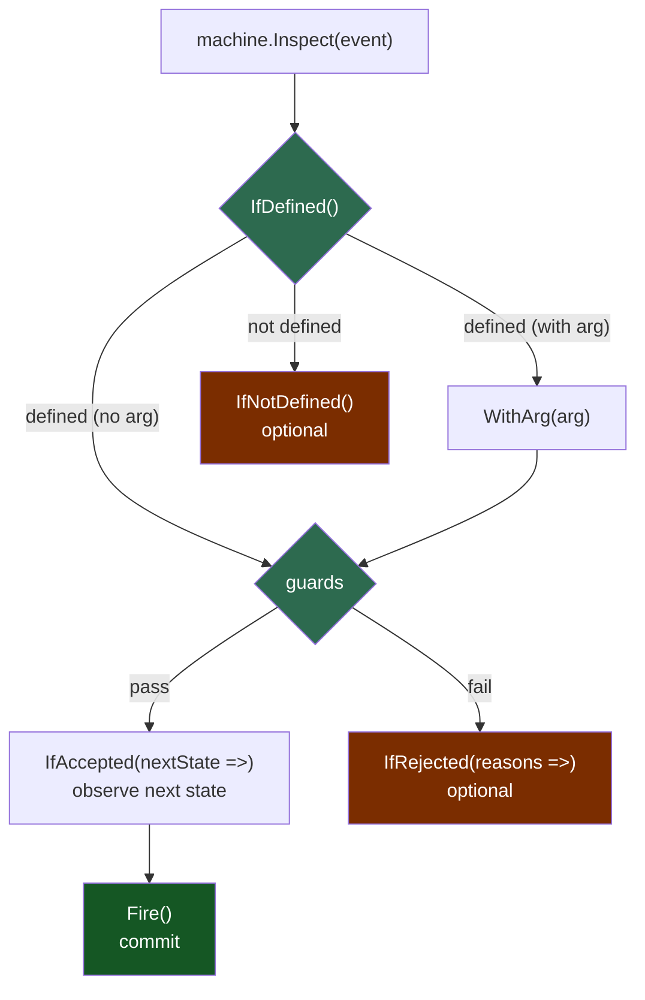

# StateMachine

A .NET state machine library that eliminates the split between domain state and domain data — transitions are the only way to change either.

- **Typed and immutable** — states and data records are part of the generic contract; the compiler enforces correctness
- **Builder pattern** — declare all valid states, events, guards, and transforms in one fluent expression; `Build()` returns a reusable, thread-safe template
- **Two modes** — state-only (track transitions, no data) or state+data (enforce that data and state change together, through transitions only)
- **Guards and transforms** — each event can validate pre-conditions and update the data record in one atomic operation
- **Inspect before firing** — evaluate transitions ahead of time to check validity, collect rejection reasons, or preview outcomes without side effects
- **Performance-conscious** — `Build()` compiles all transition logic once into a thread-safe template; `CreateInstance` is cheap enough to call per-entity or per-request; the inspect chain uses `readonly struct` types to avoid heap allocations on the hot path

## Installation

```sh
dotnet add package StateMachine
```

## Quick Start

**State-only** — track state transitions with no data:

```csharp
enum TrafficLight { Red, Green, Yellow }

// Build() returns an immutable template — stamp out independent instances from it
var template = StateMachine.CreateBuilder<TrafficLight>()
    .On(out var next)
        .WhenStateIs(TrafficLight.Red).TransitionTo(TrafficLight.Green)
        .WhenStateIs(TrafficLight.Green).TransitionTo(TrafficLight.Yellow)
        .WhenStateIs(TrafficLight.Yellow).TransitionTo(TrafficLight.Red)
    .Build();

var machine = template.CreateInstance(TrafficLight.Red);

machine.Inspect(next)
    .IfDefined()
        .IfAccepted()
            .Fire();
// machine.State == TrafficLight.Green
```

## State + Data

Adding `.WithData<TData>(d => d.State)` to the builder attaches an immutable record — both state and data can only be changed together through a transition:

```csharp
enum Light { Off, Red, Green, Yellow, FlashingRed }

record EmergencyOverride(string AuthorizedBy, string Reason);

record TrafficLightData(
    Light Light,
    bool PedestrianWaiting = false,
    string? Intersection = null,
    DateTime? LastEmergencyAt = null
);

var machine = StateMachine.CreateBuilder<Light>()
    .WithData<TrafficLightData>(d => d.Light)

    .On(out var powerOn)
        .WhenStateIs(Light.Off)
        .Transform(d => d with { PedestrianWaiting = false })
        .ThenTransitionTo(Light.Red)

    .On(out var requestWalk)                              // data update, state unchanged
        .WhenStateIs(Light.Red)
        .Transform(d => d with { PedestrianWaiting = true })
        .AndKeepSameState()

    .On(out var advance)                                  // multi-state: one event, three clauses
        .WhenStateIs(Light.Red)
        .If(d => d.PedestrianWaiting, "No pedestrian waiting")
        .Transform(d => d with { PedestrianWaiting = false })
        .ThenTransitionTo(Light.Green)
        .Else.KeepSameState()
        .WhenStateIs(Light.Green).TransitionTo(Light.Yellow)
        .WhenStateIs(Light.Yellow).TransitionTo(Light.Red)

    .On<EmergencyOverride>(out var emergency)             // guard uses both data and arg
        .WhenStateIs(Light.Red, Light.Green, Light.Yellow)
        .If((d, e) => !string.IsNullOrEmpty(e.AuthorizedBy), "Authorization required")
        .Transform((d, e) => d with { LastEmergencyAt = DateTime.Now })
        .ThenTransitionTo(Light.FlashingRed)

    .On(out var shutdown)                                 // RegardlessOfState — always defined
        .RegardlessOfState()
        .Transform(d => d with { PedestrianWaiting = false })
        .ThenTransitionTo(Light.Off)

    .Build()
    .CreateInstance(new TrafficLightData(Light.Off, Intersection: "Main St & 1st Ave"));

// Use the event tokens returned via 'out' with Inspect(...)
machine.Inspect(powerOn)
    .IfDefined()
        .IfAccepted()
            .Fire();
// machine.Data.Light == Light.Red
```



Note: `requestWalk` is a self-transition (`AndKeepSameState`) — it updates data without advancing state, so it is omitted from the diagram.

## Key Features

### Guards

Guards are pure functions — they may read the current data (and the event argument), but have no side effects or external dependencies. Both forms are shown here:

```csharp
// No-arg event — decision is made from current data alone
.If(d => d.PedestrianWaiting, "No pedestrian waiting")

// Parameterized event — decision uses both current data and the event argument
.If((d, e) => !string.IsNullOrEmpty(e.AuthorizedBy), "Authorization required")
```

A failing guard doesn't have to reject — `.Else` can route to an alternate state:

```csharp
.WhenStateIs(Light.Red)
.If(d => d.PedestrianWaiting, "No pedestrian waiting")
    .Transform(d => d with { PedestrianWaiting = false })
    .ThenTransitionTo(Light.Green)
.Else
    .TransitionTo(Light.FlashingRed)         // no activity — enter fail-safe mode
```

Guards chain with `Else.If(...)` for multi-branch routing. When all branches fail, reasons from every failing guard are aggregated and returned together:

```csharp
.If(condition1, "reason 1").TransitionTo(A).Else
.If(condition2, "reason 2").TransitionTo(B).Else
.TransitionTo(C)                             // unconditional fallback — always accepted
```

Every guarded branch requires a reason string. Unconditional `Else` has no reason because it always fires.

### Pre-Check with Inspect (Fluent)

`Inspect` evaluates definition and guards without firing the transition (dry-run), making the state machine **deterministic** — the outcome of any event can be inspected ahead of time. The chain enforces a deliberate decision tree: you must acknowledge each gate (`IfDefined`, `IfAccepted`) before the next step becomes available, and `Fire()` is only reachable after `IfAccepted`.



**No-arg event — the simple case:**

```csharp
// Full paths
machine.Inspect(advance)
    .IfDefined()
        .IfAccepted(nextState => Console.WriteLine($"Will transition to {nextState}"))
            .Fire()
        .IfRejected(reasons => Console.WriteLine(string.Join(", ", reasons)))
    .IfNotDefined(() => Console.WriteLine("advance is not valid here"));

// Minimal happy path
machine.Inspect(advance)
    .IfDefined()
        .IfAccepted()
            .Fire();
```

**Parameterized event:**

```csharp
// Full paths
var override = new EmergencyOverride("Officer Smith", "Accident at intersection");
machine.Inspect(emergency)
    .IfDefined()
        .WithArg(override)
            .IfAccepted(nextState => Console.WriteLine($"Will transition to {nextState}"))
                .Fire()
            .IfRejected(reasons => Console.WriteLine(string.Join(", ", reasons)))
    .IfNotDefined(() => Console.WriteLine("emergency override not valid from current state"));

// Minimal happy path
machine.Inspect(emergency)
    .IfDefined()
        .WithArg(override)
            .IfAccepted()
                .Fire();
```

`IfRejected` and `IfNotDefined` are optional — omitting them means silently ignoring that branch. `IfDefined` and `IfAccepted` are required gates — the compiler enforces that you cannot reach `Fire()` without passing through both.

The return type narrows at each step, exposing only the methods valid at that point:

```mermaid
flowchart LR
    A["Inspection#lt;TState,TArg#gt;"] -->|"IfDefined()"| B["Defined#lt;TState,TArg#gt;"]
    B -->|"WithArg(arg)"| C["Evaluated#lt;TState#gt;"]
    C -->|"IfAccepted(...)"| D["Accepted#lt;TState#gt;"]
    D -->|"IfRejected(...) — preview,\nbefore committing"| D
    D -->|"Fire()"| E["Rejected#lt;TState#gt;"]
    E -->|"IfRejected(...) — post-Fire,\nconcurrency guard"| F["Undefined#lt;TState#gt;"]
    F -->|"IfNotDefined(...)"| G["void"]

    A2["Inspection#lt;TState#gt;"] -->|"IfDefined()"| B2["Defined#lt;TState#gt;"]
    B2 -->|"IfAccepted(...)"| D
    style A fill:#1e3a5f,color:#fff
    style A2 fill:#1e3a5f,color:#fff
    style B fill:#0d6efd,color:#fff
    style B2 fill:#0d6efd,color:#fff
    style C fill:#0d6efd,color:#fff
    style D fill:#198754,color:#fff
    style E fill:#dc3545,color:#fff
    style F fill:#6c757d,color:#fff
    style G fill:#343a40,color:#fff
```



No-arg events (`Inspection<TState>`) skip `WithArg` entirely, going straight from `IfDefined()` to `IfAccepted(...)`.

`Inspect` is a pre-check. In concurrent scenarios, state may change between `Inspect()` and `Fire()`. `Fire()` always re-validates atomically under a lock before committing — if state has changed, it routes to `IfRejected` or `IfNotDefined` rather than committing a stale transition.

### Staged Inspection

The intermediate types returned by each step (`Defined<TState, TArg>`, `Accepted<TState>`, etc.) are plain objects that can be captured and reused across multiple call sites. This is useful in workflow UI scenarios where inspection happens in stages:

```csharp
// Step 1 — enable/disable toolbar buttons: definition check only (no guard evaluation)
void RenderToolbar()
{
    machine.Inspect(advance).IfDefined(ShowAdvanceButton);
    machine.Inspect(shutdown).IfDefined(ShowShutdownButton);
    machine.Inspect(emergency).IfDefined(ShowEmergencyButton); // only defined for Red/Green/Yellow
}

// Step 2 — operator clicks Emergency Override: capture the defined check, show the form
Defined<Light, EmergencyOverride> _defined;

void OnEmergencyClicked()
{
    _defined = machine.Inspect(emergency).IfDefined();
    ShowEmergencyForm();
}

// Step 3 — operator types into the form: evaluate guard live and preview next state
Accepted<Light> _accepted;

void OnFormChanged(EmergencyOverride args)
{
    _accepted = _defined
        .WithArg(args)
            .IfAccepted(nextState => ShowNextStatePreview(nextState));

    // IfRejected on Accepted (before Fire) — shows validation errors without committing
    _accepted.IfRejected(reasons => ShowValidationErrors(reasons));
    UpdateConfirmButton(_accepted.IsAccepted);
}

// Step 4 — operator confirms: fire from the pre-validated accepted inspection
void OnConfirmClicked()
{
    _accepted
        .Fire()
        .IfRejected(reasons => ShowValidationErrors(reasons)) // concurrent invalidation guard
        .IfNotDefined(() => ShowError("No longer available"));
}
```

The `IfRejected` and `IfNotDefined` handlers in Step 4 guard against concurrent transitions that may have invalidated the event between Step 3 and Step 4 — `Fire()` always re-validates atomically.

### When to Use Inspect

Practical rule of thumb:

- **Use the full inline chain** in API endpoints, command handlers, or orchestration code where all paths need explicit handling in one place.
- **Use staged capture** in UI or workflow engines where inspection happens across multiple user interactions — show available actions, preview outcomes, then commit.
- **Omit `IfRejected` and `IfNotDefined`** when you only care about the happy path and are comfortable silently ignoring failures.

### Transition Observation

Subscribe to state changes for side effects like logging, notifications, or persistence. This is the intended mechanism for side effects — keeping transforms pure while allowing external reactions:

```csharp
// State-level observation (available on all machines)
machine.Transitioned += args =>
{
    Console.WriteLine($"{args.EventName}: {args.FromState} → {args.ToState}");
};

// Data-level observation (available on data-ful machines)
machine.DataTransitioned += args =>
{
    SaveToDatabase(args.NewData);
    if (args.NewData.Light == Light.FlashingRed && args.OldData.Light != Light.FlashingRed)
        AlertTrafficControlCenter(args.NewData.Intersection, triggeredBy: args.EventName);
};
```

Callbacks fire after the transition commits. Treat the event args as the authoritative snapshot; handlers should be fast and non-blocking. Long-running work (sending emails, calling APIs) should be queued from the callback, not performed inline.

### Immutability Guarantees

Since `TData` is a C# record, the machine enforces immutability structurally:

- The user's `Transform()` function receives the current data and returns a new record
- The machine then stamps the new state onto the record (overwriting any state the user may have set in their transform)
- The old record is untouched — consumers holding a reference to previous data see no changes

This means **there is no way to modify the machine's data except through a transition**.

### Async Workflows (Saga Pattern)

This library intentionally does not support `async` transitions. Because transforms are pure functions (`(TData) => TData`), they are inherently synchronous — there is nothing to `await`.

When a workflow requires an asynchronous step (calling an external API, waiting for human approval, running a long computation), model it as **intermediate states** with the async work happening *between* transitions:

```csharp
// States include intermediate "pending" states for async steps
enum Status { Draft, PendingValidation, Validated, PendingApproval, Approved, Rejected }

record WorkOrder(Status Status, string Description, string? ValidationResult = null, string? Approver = null);

var machine = StateMachine.CreateBuilder<Status>()
    .WithData<WorkOrder>(d => d.Status)

    // Synchronous: move to a "waiting" state
    .On(out var submit)
        .WhenStateIs(Status.Draft)
        .TransitionTo(Status.PendingValidation)

    // Async result arrives later as a separate event
    .On<string>(out var validationSucceeded)
        .WhenStateIs(Status.PendingValidation)
        .Transform((data, result) => data with { ValidationResult = result })
        .ThenTransitionTo(Status.Validated)

    .On<string>(out var validationFailed)
        .WhenStateIs(Status.PendingValidation)
        .Transform((data, reason) => data with { ValidationResult = reason })
        .ThenTransitionTo(Status.Draft)

    .On<string>(out var approve)
        .WhenStateIs(Status.Validated)
        .Transform((data, approver) => data with { Approver = approver })
        .ThenTransitionTo(Status.Approved)

    .On(out var reject)
        .WhenStateIs(Status.Validated)
        .TransitionTo(Status.Rejected)

    .Build()
    .CreateInstance(new WorkOrder(Status.Draft, "Install HVAC"));
```

The orchestrator (a background service, message handler, or saga coordinator) drives the workflow by subscribing to observation events and firing the next event when the async work completes:

```csharp
machine.DataTransitioned += args =>
{
    if (args.NewData.Status == Status.PendingValidation)
    {
        // Kick off async work outside the machine
        Task.Run(async () =>
        {
            try
            {
                var result = await externalValidator.ValidateAsync(args.NewData);
                machine.Inspect(validationSucceeded)
                    .IfDefined()
                        .WithArg(result)
                            .IfAccepted()
                                .Fire();
            }
            catch (Exception ex)
            {
                machine.Inspect(validationFailed)
                    .IfDefined()
                        .WithArg(ex.Message)
                            .IfAccepted()
                                .Fire();
            }
        });
    }
};

// Start the workflow
machine.Inspect(submit)
    .IfDefined()
        .IfAccepted()
            .Fire();
```

This keeps the state machine purely synchronous while the saga layer handles async coordination. Each pending state is explicitly visible in the state enum, making it easy to query, persist, and resume workflows.

## Design Intent

The goal is to provide a **single, self-contained object** that encapsulates both workflow state and business data for a domain entity — eliminating the common disconnect between "what state is this thing in?" and "what data does it carry?"

Traditional state machine libraries (like Stateless) manage state transitions but leave data management to the consumer. This creates a split where the domain object mutates freely outside the state machine's control, and the machine only governs which transitions are legal. That split is a source of bugs: data can be modified without going through a transition, and transitions can fire without updating data consistently.

This library takes a different approach: **the state machine owns the data**. Business data is stored as an immutable C# record. Every transition produces a new record — the original is never mutated. The state and data are always consistent, always serializable as a single unit, and always under the machine's control.

### What This Enables

- **Business objects as state machines**: A work order, insurance claim, or loan application can be fully represented as a state machine with co-located data. The machine enforces what can happen, when, and how data changes as a result.
- **Deterministic transitions**: The outcome of any event can be evaluated before firing it (via `Inspect(...)`). Guards are pure functions of the current data and event arguments — no hidden external state.
- **Trivial persistence**: Since the entire machine state is one record, saving and restoring is just serializing/deserializing a single object. No separate "state" column plus "data" blob.
- **Audit trail by design**: Because each transition produces a new immutable record, keeping a history of transitions (with before/after snapshots) is trivial. Subscribe to `DataTransitioned` and you get full replay capability.
- **Testable business logic**: Guard conditions and data transforms are pure functions — they can be unit tested in isolation without constructing a state machine.

## Design Philosophy

This library treats a state machine as a **typed reducer** — each transition produces a new immutable data record, ensuring correctness, testability, and thread safety by design.

### Core Principles

- **Immutable data**: Business data is stored as C# records. Transitions produce new records via `with` expressions — the original is never mutated.
- **State on the record**: The state enum is a property on the data record, identified via an expression selector (`d => d.State`). This makes serialization and snapshotting trivial — one object = full machine state.
- **Pure transforms**: The `Transform()` method accepts a pure function `(TData) => TData` or `(TData, TArg) => TData`. Side effects (email, logging) are handled externally by subscribing to the `Transitioned` / `DataTransitioned` observation events.
- **Fluent builder**: The builder API uses interface narrowing so that only valid next steps are available at each point in the chain. The compiler enforces correct construction — you cannot define an incomplete or structurally invalid state machine.
- **Sequential enum constraint**: The `TState` enum must be contiguous and zero-based (e.g., `Off, Red, Green, Yellow` → 0, 1, 2, 3). This is validated once at build time, and enum values are then cast directly to `int` for O(1) array indexing with no boxing or lookup. Sparse or `[Flags]` enums are rejected immediately with a clear error message.
- **Sealed after build**: States and events cannot be added after construction. This enables a lightweight array-based transition table using enum ordinals for O(1) transition lookup — the same efficient data structure used in classical finite state machine implementations.
- **Thread-safe after build**: The built machine uses `lock` to ensure transitions are atomic (read state → evaluate guards → run transform → set new data). The builder itself is not thread-safe and is discarded after `Build()`.
- **Template-first model**: `Build()` returns an immutable template. Call `CreateInstance(...)` once per entity — useful in server apps where hundreds of independent instances (one per work order, claim, loan) share the same machine definition.
- **Event tokens**: `On(out var approve)` captures the event name via `CallerArgumentExpression` and returns a strongly-typed event token that you pass to `Inspect(...)`.
- **Multi-state source**: `WhenStateIs(params TState[] states)` lets one event clause cover multiple originating states without repetition.

### What the Machine Can Answer

The built machine is designed to answer these questions at runtime:

1. Which events can currently be fired, and which states will they transition to?
2. If an event cannot be triggered, why not — is it not defined for the current state, or is a guard failing (and which one)?
3. What are all the valid states and events, regardless of current state — enabling visualization of the full workflow graph?

## Exception Reference

| Exception | When thrown |
|---|---|
| `InvalidTransitionException` | An event is fired in a state where it has no defined transition rule |
| `GuardFailedException` | All guard conditions on a conditional event fail (no `Else` branch); aggregates reasons from every failing guard |
| `StaleStateException` | `Fire()` is called on a captured `Accepted<TState>`, but the machine state changed concurrently since `Inspect()` ran |

When using the full fluent Inspect chain, concurrent state changes are surfaced as control flow — `Fire()` routes to `IfRejected(...)` or `IfNotDefined(...)` on the returned value rather than throwing. These exceptions apply only to direct trigger calls made outside the Inspect chain.

## Design Decisions

| Decision | Choice | Rationale |
|---|---|---|
| Instance model | Build immutable template, then stamp instances | Define once; create many identical machines |
| Data ownership | Machine owns immutable `TData` record | Prevents external mutation, trivial serialization |
| State location | Property on `TData`, identified by expression selector | Single source of truth |
| Undefined transition | `Inspect(...)` rejects (`IsDefined == false`) | Lets callers handle invalid events as control flow |
| All guards fail without Else | `Inspect(...)` rejects with aggregated reasons | Provides actionable feedback |
| Build-time validation | Error on empty events and duplicate transitions | Catch construction mistakes early |
| Enum constraint | `TState` must be contiguous and zero-based | Enables direct cast to `int` for O(1) array indexing — no `Array.IndexOf`, no boxing |
| Transform semantics | Pure: `(TData) => TData` | Testable, no hidden dependencies |
| Transform vs state order | Transform first, then state change | If transform throws, nothing changes |
| Thread safety | `lock` around full transition; sealed after build | Sync transforms keep it simple; O(1) array lookup |
| Pre-check API | `Inspect(...)` staged fluent chain | Enforced decision tree: `IfDefined → WithArg → IfAccepted → Fire`; each gate is a required acknowledgement; intermediate types are capturable for multi-step UI workflows |
| Async events | Not supported | Pure transforms are synchronous; async side effects go in observers |
| Side effects | Via `Transitioned` / `DataTransitioned` observation events | Keeps transforms pure, decouples concerns |
| Guard reasons | Required on every guard | Ensures rejected events always explain why |

## Comparison with Existing Libraries

| Library | State Machine | Immutable Data | Guards | Fluent Builder | Pure Transforms |
|---|---|---|---|---|---|
| **Stateless** (C#) | Yes | No | Yes | Yes | No |
| **MassTransit Automatonymous** | Yes | No | Yes | Yes | No |
| **XState** (JS) | Yes | Yes (context) | Yes | No (JSON config) | Yes (assign) |
| **This library** | Yes | Yes | Yes | Yes | Yes |

The closest analogue is **XState** in the JavaScript ecosystem. This library brings that concept to .NET with compile-time type safety and a fluent construction API. The key differentiator is the combination of **immutable records as the data model** with **a fluent builder that enforces correct construction at compile time**.

**When to choose this library:**

- **Over Stateless**: When you need business data co-located and owned by the state machine, not just transition rules. Stateless manages state; this library manages state *and* data together, with immutability guarantees. Also when you want `Inspect`-before-fire (dry-run) as a first-class API contract.
- **Over MassTransit Saga**: When you don't need a distributed messaging infrastructure. Sagas are the right tool for durable, cross-service workflows; this library is better suited to in-process domain objects (work orders, approvals, claims) where persistence is a single serialized record.
- **Over XState**: When you want compile-time type safety and a C# fluent API rather than JSON/JavaScript configuration. XState's `context` model directly inspired this library's data ownership design — XState is still the better choice if you need visual editor tooling or cross-platform portability.

## Project Structure

```
src/StateMachine/
    Interfaces.cs          — Public interfaces, event types, exceptions, fluent builder contracts
    Inspection.cs          — Inspect API types (`Inspection`, `Defined`, `Evaluated`, `Accepted`, `Rejected`, `Undefined`)
    StateMachine.cs        — Entry point, machine implementations, builder stubs
    FiniteStateMachine.cs  — Legacy implementation (two type parameters: TState + TEvent)
    IStateful.cs           — Legacy interface

test/StateMachine.Tests/
    StateMachineTests.cs   — Tests for the new fluent builder API
    FiniteStateMachineTests.cs — Tests for the legacy implementation
```