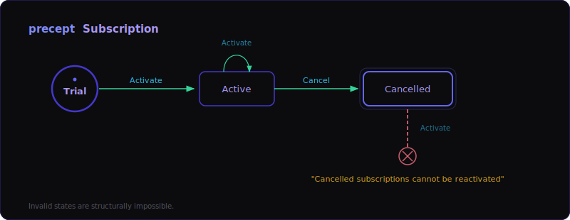

# Precept

[](https://www.nuget.org/packages/Precept)
[](https://opensource.org/licenses/MIT)

> **pre·cept** *(noun)*: A general rule intended to regulate behavior or thought.

**Precept is a domain integrity engine for .NET.** By treating business constraints as unbreakable precepts, it binds state machines, validation, and business rules into a single executable contract where invalid states are structurally impossible.

---

## Quick Example

> Temporary hero sample — using the current top-rated Subscription Billing candidate while the final hero decision stays open.



**The Contract**

Here’s the DSL inline so the full rule set is visible at a glance.

<pre style="background:#0c0c0f; color:#e5e5e5; border:1px solid #27272a; border-radius:6px; padding:16px; overflow-x:auto; font-family:'Cascadia Cove','Cascadia Code',Consolas,monospace; font-size:13px; line-height:1.6;"><code><span style="color:#4338CA; font-weight:700;">precept</span> Subscription

<span style="color:#4338CA; font-weight:700;">field</span> <span style="color:#B0BEC5;">PlanName</span> <span style="color:#6366F1;">as</span> <span style="color:#9AA8B5;">string</span> <span style="color:#6366F1;">nullable</span>
<span style="color:#4338CA; font-weight:700;">field</span> <span style="color:#B0BEC5;">MonthlyPrice</span> <span style="color:#6366F1;">as</span> <span style="color:#9AA8B5;">number</span> <span style="color:#6366F1;">default</span> <span style="color:#84929F;">0</span>

<span style="color:#4338CA; font-weight:700;">invariant</span> <span style="color:#B0BEC5;">MonthlyPrice</span> &gt;= <span style="color:#84929F;">0</span> <span style="color:#6366F1;">because</span> <span style="color:#FBBF24;">"Monthly price cannot be negative"</span>

<span style="color:#4338CA; font-weight:700;">state</span> <span style="color:#A898F5;">Trial</span> <span style="color:#6366F1;">initial</span>, <span style="color:#A898F5;">Active</span>, <span style="color:#A898F5;">Cancelled</span>

<span style="color:#4338CA; font-weight:700;">event</span> <span style="color:#30B8E8;">Activate</span> <span style="color:#6366F1;">with</span> <span style="color:#B0BEC5;">Plan</span> <span style="color:#6366F1;">as</span> <span style="color:#9AA8B5;">string</span>, <span style="color:#B0BEC5;">Price</span> <span style="color:#6366F1;">as</span> <span style="color:#9AA8B5;">number</span>
<span style="color:#4338CA; font-weight:700;">on</span> <span style="color:#30B8E8;">Activate</span> <span style="color:#4338CA; font-weight:700;">assert</span> <span style="color:#B0BEC5;">Price</span> &gt; <span style="color:#84929F;">0</span> <span style="color:#6366F1;">because</span> <span style="color:#FBBF24;">"Plan price must be positive"</span>

<span style="color:#4338CA; font-weight:700;">event</span> <span style="color:#30B8E8;">Cancel</span>

<span style="color:#4338CA; font-weight:700;">from</span> <span style="color:#A898F5;">Trial</span> <span style="color:#4338CA; font-weight:700;">on</span> <span style="color:#30B8E8;">Activate</span> <span style="color:#4338CA; font-weight:700;">when</span> <span style="color:#B0BEC5;">PlanName</span> == <span style="color:#84929F;">null</span>
  -&gt; <span style="color:#4338CA; font-weight:700;">set</span> <span style="color:#B0BEC5;">PlanName</span> = <span style="color:#30B8E8;">Activate</span>.<span style="color:#B0BEC5;">Plan</span>
  -&gt; <span style="color:#4338CA; font-weight:700;">set</span> <span style="color:#B0BEC5;">MonthlyPrice</span> = <span style="color:#30B8E8;">Activate</span>.<span style="color:#B0BEC5;">Price</span>
  -&gt; <span style="color:#4338CA; font-weight:700;">transition</span> <span style="color:#A898F5;">Active</span>
<span style="color:#4338CA; font-weight:700;">from</span> <span style="color:#A898F5;">Active</span> <span style="color:#4338CA; font-weight:700;">on</span> <span style="color:#30B8E8;">Activate</span> -&gt; <span style="color:#4338CA; font-weight:700;">set</span> <span style="color:#B0BEC5;">MonthlyPrice</span> = <span style="color:#30B8E8;">Activate</span>.<span style="color:#B0BEC5;">Price</span> -&gt; <span style="color:#4338CA; font-weight:700;">no</span> <span style="color:#4338CA; font-weight:700;">transition</span>
<span style="color:#4338CA; font-weight:700;">from</span> <span style="color:#A898F5;">Active</span> <span style="color:#4338CA; font-weight:700;">on</span> <span style="color:#30B8E8;">Cancel</span> -&gt; <span style="color:#4338CA; font-weight:700;">transition</span> <span style="color:#A898F5;">Cancelled</span>
<span style="color:#4338CA; font-weight:700;">from</span> <span style="color:#A898F5;">Cancelled</span> <span style="color:#4338CA; font-weight:700;">on</span> <span style="color:#30B8E8;">Activate</span> -&gt; <span style="color:#4338CA; font-weight:700;">reject</span> <span style="color:#FBBF24;">"Cancelled subscriptions cannot be reactivated"</span></code></pre>

**The Execution**

```csharp
var def = PreceptParser.Parse(dslText);
var eng = PreceptCompiler.Compile(def);
var inst = eng.CreateInstance(state, data);
var result = eng.Fire(inst, "Activate", args);
// result.IsSuccess, result.UpdatedInstance
```

---

## Getting Started

**Prerequisite:** [.NET 10 SDK](https://dotnet.microsoft.com/download)

### 1. Install the VS Code Extension

```bash
code --install-extension sfalik.precept-vscode
```

Syntax highlighting and live diagnostics are active immediately.

### 2. Create Your First Precept File

Create `Subscription.precept` and type along with the temporary example above. The language server provides completions, hover docs, and error detection in real time.

### 3. Add the NuGet Package

```bash
dotnet add package Precept
```

See the [Quickstart Guide](docs/RuntimeApiDesign.md) for a complete runtime integration walkthrough.

---

## What Makes Precept Different

**AI-Native Tooling** — MCP server with 5 core tools, GitHub Copilot plugin, and language server give AI agents structured access to validate, inspect, and iterate on `.precept` files.

**Unified Domain Integrity** — State machines, validators, and rules engines often disagree when split across libraries. Precept unifies them into one definition.

- Prevention, not detection — invalid states are structurally impossible
- One file, all rules — guards, constraints, invariants, and transitions together
- Full inspectability — preview any action's outcome without executing it
- Compile-time checking — unreachable states and type errors caught before runtime

**Live Editor Experience** — Completions, semantic highlighting, inline diagnostics, and a live state diagram preview in VS Code.

---

## Learn More

| Resource | Description |
|----------|-------------|
| [Language Reference](docs/PreceptLanguageDesign.md) | Full DSL syntax and construct reference |
| [Sample Catalog](samples/) | 20+ domain models in `.precept` |
| [Quickstart Guide](docs/RuntimeApiDesign.md) | Step-by-step integration walkthrough |
| [MCP Server Docs](docs/McpServerDesign.md) | Tool reference for AI agent integration |

---

## Contributing

Precept is built with .NET 10.0 and TypeScript.

```bash
dotnet build            # Build everything
dotnet test             # Run all tests
```

| What you changed | Command | Reload? |
|------------------|---------|---------|
| C# runtime or language server | `Ctrl+Shift+B` | No |
| TypeScript, webview, or syntax | Task: `extension: install` | Yes |
| Agent or skill markdown | Reload Window | Yes |

See [Contributing Guide](CONTRIBUTING.md) for full workflow details.

---

## License

MIT — see [LICENSE](LICENSE) for details.
