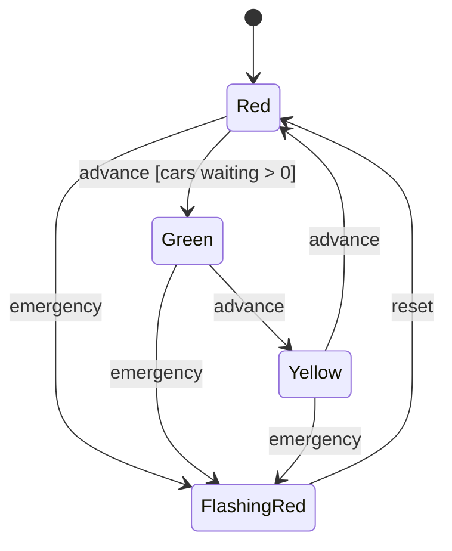
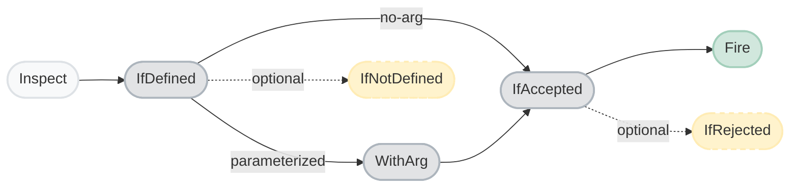

# StateMachine 🚦

A modern, fluent .NET state machine library that finally bridges the gap between your domain state and your domain data. 

Traditional state machines track *what state you're in*, but leave you to manage the data yourself. StateMachine enforces that **state and data change together, as a single atomic operation**.

## ✨ Why choose StateMachine?

- **🛡️ Type-safe & Immutable** — States and data records are part of the generic contract. The compiler has your back.
- **🏗️ Fluent Builder** — Declare your states, events, guards, and data transforms in one clean, readable expression.
- **🔍 Inspect Before Firing** — Safely evaluate transitions ahead of time. Check validity, collect rejection reasons, or preview outcomes without side effects.
- **⚡ Built for Performance** — Templates are compiled once and thread-safe. Instances are cheap to create. Zero heap allocations on the hot path using `readonly struct` types.
- **✌️ Two Modes** — Keep it simple with state-only workflows, or attach immutable data records for rich domain models.

## 📦 Installation

```sh
dotnet add package StateMachine
```

## 🚀 Quick Start

State and data change together, atomically, through a valid transition. `.WithData<TData>(d => d.State)` binds an immutable C# record to the machine — state is a property on the record, owned by the machine. The original record is never mutated; every transition produces a new one.

```csharp
enum TrafficLight { Red, Green, Yellow, FlashingRed }

record LightData(TrafficLight Light, int CarsWaiting = 0, string? EmergencyReason = null);

// Define the machine once, create many independent instances from the template
var template = StateMachine.CreateBuilder<TrafficLight>()
    .WithData<LightData>(d => d.Light)       // state lives on the record

    .On(out var carArrived)                  // updates data, state stays the same
        .WhenStateIs(TrafficLight.Red)
        .Transform(d => d with { CarsWaiting = d.CarsWaiting + 1 })
        .AndKeepSameState()

    .On(out var advance)                     // one event, three state clauses
        .WhenStateIs(TrafficLight.Green).TransitionTo(TrafficLight.Yellow)
        .WhenStateIs(TrafficLight.Yellow).TransitionTo(TrafficLight.Red)
        .WhenStateIs(TrafficLight.Red)
            .If(d => d.CarsWaiting > 0, "No cars waiting")
            .Transform(d => d with { CarsWaiting = 0 })
            .ThenTransitionTo(TrafficLight.Green)
            .Else.KeepSameState()

    .On<string>(out var emergency)           // parameterized event
        .WhenStateIs(TrafficLight.Red, TrafficLight.Green, TrafficLight.Yellow)
        .Transform((d, reason) => d with { EmergencyReason = reason })
        .ThenTransitionTo(TrafficLight.FlashingRed)

    .On(out var reset)                       // exit emergency mode
        .WhenStateIs(TrafficLight.FlashingRed)
        .Transform(d => d with { EmergencyReason = null })
        .ThenTransitionTo(TrafficLight.Red)

    .Build();

var light = template.CreateInstance(new LightData(TrafficLight.Red));

// 1. Car arrives at the red light
light.Inspect(carArrived).IfDefined().IfAccepted().Fire();
// light.Data.CarsWaiting == 1

// 2. Advance the light (guard passes because a car is waiting)
light.Inspect(advance)
    .IfDefined()
        .IfAccepted(next => Console.WriteLine($"Moving to {next}"))
            .Fire()
        .IfRejected(reasons => Console.WriteLine(string.Join(", ", reasons)));
// light.Data.Light == TrafficLight.Green
// light.Data.CarsWaiting == 0

// 3. Emergency override
light.Inspect(emergency)
    .IfDefined()
        .WithArg("Ambulance approaching")
            .IfAccepted()
                .Fire();
// light.Data.Light == TrafficLight.FlashingRed
// light.Data.EmergencyReason == "Ambulance approaching"

// 4. Clear emergency
light.Inspect(reset).IfDefined().IfAccepted().Fire();
// light.Data.Light == TrafficLight.Red
// light.Data.EmergencyReason == null
```



## 🛠️ Deep Dive

### 🛡️ Guards

Guards let you block transitions based on your data. They are pure functions — they can read the current data (and the event argument), but have no side effects or external dependencies. Both forms are shown here:

```csharp
// No-arg event — decision is made from current data alone
.If(d => d.CarsWaiting > 0, "No cars waiting")

// Parameterized event — decision uses both current data and the event argument
.If((d, reason) => !string.IsNullOrEmpty(reason), "Reason required")
```

A failing guard doesn't have to reject — `.Else` can route to an alternate state:

```csharp
.WhenStateIs(TrafficLight.Red)
.If(d => d.CarsWaiting > 0, "No cars waiting")
    .Transform(d => d with { CarsWaiting = 0 })
    .ThenTransitionTo(TrafficLight.Green)
.Else
    .KeepSameState()                         // no cars — stay red
```

Every guard requires a reason string. An unconditional `Else` branch has no reason because it always fires.

### 🔍 Look Before You Leap: The `Inspect` API

`Inspect` allows you to evaluate potential state transitions in context of the current state without actually committing them. This makes the state machine **deterministic** — you can always ask "is this event valid right now, and what would the new state be if I fired it?" ahead of time. 

The fluent api enforces a deliberate, step-by-step decision tree at compile time. You must explicitly check that an event is valid (`IfDefined`) and that its guards pass (`IfAccepted`) before the compiler will allow you to call `Fire()`. This eliminates runtime exceptions.



**No-arg event — the simple case:**

```csharp
// Full paths
light.Inspect(advance)
    .IfDefined()
        .IfAccepted(nextState => Console.WriteLine($"Will transition to {nextState}"))
            .Fire()
        .IfRejected(reasons => Console.WriteLine(string.Join(", ", reasons)))
    .IfNotDefined(() => Console.WriteLine("advance is not valid here"));

// Minimal happy path
light.Inspect(advance)
    .IfDefined()
        .IfAccepted()
            .Fire();
```

**Parameterized event:**

```csharp
// Full paths
light.Inspect(emergency)
    .IfDefined()
        .WithArg("Ambulance approaching")
            .IfAccepted(nextState => Console.WriteLine($"Will transition to {nextState}"))
                .Fire()
            .IfRejected(reasons => Console.WriteLine(string.Join(", ", reasons)))
    .IfNotDefined(() => Console.WriteLine("emergency override not valid from current state"));

// Minimal happy path
light.Inspect(emergency)
    .IfDefined()
        .WithArg("Ambulance approaching")
            .IfAccepted()
                .Fire();
```

`IfRejected` and `IfNotDefined` are optional — omitting them means silently ignoring that branch. `IfDefined` and `IfAccepted` are required gates — the compiler enforces that you cannot reach `Fire()` without passing through both.

The return type narrows at each step, exposing only the methods valid at that point:

```csharp
Inspection<TState, TArg> step1 = light.Inspect(emergency);
   Defined<TState, TArg> step2 = step1.IfDefined();
       Evaluated<TState> step3 = step2.WithArg("reason");
        Accepted<TState> step4 = step3.IfAccepted();
        Rejected<TState> step5 = step4.Fire();
```

No-arg events (`Inspection<TState>`) skip `WithArg` entirely, going straight from `IfDefined()` to `IfAccepted(...)`.

`Inspect` is a pre-check. In concurrent scenarios, state may change between `Inspect()` and `Fire()`. `Fire()` always re-validates atomically under a lock before committing — if state has changed, it routes to `IfRejected` or `IfNotDefined` rather than committing a stale transition.

### 🎭 Building UIs with Staged Inspection

The intermediate types returned by each step (`Defined<TState, TArg>`, `Accepted<TState>`, etc.) are plain objects that can be captured and reused across multiple call sites. This is perfect for UI workflows where inspection happens in stages:

```csharp
// Step 1 — enable/disable toolbar buttons: definition check only (no guard evaluation)
void RenderToolbar()
{
    light.Inspect(advance).IfDefined(ShowAdvanceButton);
    light.Inspect(emergency).IfDefined(ShowEmergencyButton); // only defined for Red/Green/Yellow
    light.Inspect(reset).IfDefined(ShowResetButton);         // only defined for FlashingRed
}

// Step 2 — operator clicks Emergency Override: capture the defined check, show the form
Defined<TrafficLight, string> _defined;

void OnEmergencyClicked()
{
    _defined = light.Inspect(emergency).IfDefined();
    ShowEmergencyForm();
}

// Step 3 — operator types into the form: evaluate guard live and preview next state
Accepted<TrafficLight> _accepted;

void OnFormChanged(string reason)
{
    _accepted = _defined
        .WithArg(reason)
            .IfAccepted(nextState => ShowNextStatePreview(nextState));

    // IfRejected on Accepted (before Fire) — shows validation errors without committing
    _accepted.IfRejected(reasons => ShowValidationErrors(reasons));
    UpdateConfirmButton(_accepted.IsAccepted);
}

// Step 4 — operator confirms: fire from the pre-validated accepted inspection
void OnConfirmClicked()
{
    _accepted
        .Fire()
        .IfRejected(reasons => ShowValidationErrors(reasons)) // concurrent invalidation guard
        .IfNotDefined(() => ShowError("No longer available"));
}
```

The `IfRejected` and `IfNotDefined` handlers in Step 4 guard against concurrent transitions that may have invalidated the event between Step 3 and Step 4 — `Fire()` always re-validates atomically.

### 🤔 Choosing the Right Pattern

Practical rule of thumb:

- **Use the full inline chain** in API endpoints, command handlers, or orchestration code where all paths need explicit handling in one place.
- **Use staged capture** in UI or workflow engines where inspection happens across multiple user interactions — show available actions, preview outcomes, then commit.
- **Omit `IfRejected` and `IfNotDefined`** when you only care about the happy path and are comfortable silently ignoring failures.

### 📡 Reacting to Transitions

Subscribe to state changes for side effects like logging, notifications, or persistence. This is the intended mechanism for side effects — keeping your transforms pure while allowing external reactions:

```csharp
// State-level observation (available on all machines)
light.Transitioned += args =>
{
    Console.WriteLine($"{args.EventName}: {args.FromState} → {args.ToState}");
};

// Data-level observation (available on data-ful machines)
light.DataTransitioned += args =>
{
    SaveToDatabase(args.NewData);
    if (args.NewData.Light == TrafficLight.FlashingRed && args.OldData.Light != TrafficLight.FlashingRed)
        AlertTrafficControlCenter(reason: args.NewData.EmergencyReason);
};
```

Callbacks fire after the transition commits. Treat the event args as the authoritative snapshot; handlers should be fast and non-blocking. Long-running work (sending emails, calling APIs) should be queued from the callback, not performed inline.

### 🔒 Why Immutability?

Because `TData` is a C# record, the machine enforces immutability structurally:

- Your `Transform()` function receives the current data and returns a *new* record.
- The machine stamps the new state onto the record (overwriting any state you may have set in your transform).
- The old record is untouched — consumers holding a reference to previous data see no changes.

This means **there is no way to modify the machine's data except through a transition**.

### ⏳ What about Async and Sagas?

This library intentionally does not support `async` transitions. Because transforms are pure functions (`(TData) => TData`), they are inherently synchronous — there is nothing to `await`.

When a workflow requires an asynchronous step (calling an external API, waiting for human approval, running a long computation), model it as **intermediate states** with the async work happening *between* transitions:

```csharp
// States include intermediate "pending" states for async steps
enum Status { Draft, PendingValidation, Validated, PendingApproval, Approved, Rejected }

record WorkOrder(Status Status, string Description, string? ValidationResult = null, string? Approver = null);

var machine = StateMachine.CreateBuilder<Status>()
    .WithData<WorkOrder>(d => d.Status)

    // Synchronous: move to a "waiting" state
    .On(out var submit)
        .WhenStateIs(Status.Draft)
        .TransitionTo(Status.PendingValidation)

    // Async result arrives later as a separate event
    .On<string>(out var validationSucceeded)
        .WhenStateIs(Status.PendingValidation)
        .Transform((data, result) => data with { ValidationResult = result })
        .ThenTransitionTo(Status.Validated)

    .On<string>(out var validationFailed)
        .WhenStateIs(Status.PendingValidation)
        .Transform((data, reason) => data with { ValidationResult = reason })
        .ThenTransitionTo(Status.Draft)

    .On<string>(out var approve)
        .WhenStateIs(Status.Validated)
        .Transform((data, approver) => data with { Approver = approver })
        .ThenTransitionTo(Status.Approved)

    .On(out var reject)
        .WhenStateIs(Status.Validated)
        .TransitionTo(Status.Rejected)

    .Build()
    .CreateInstance(new WorkOrder(Status.Draft, "Install HVAC"));
```

The orchestrator (a background service, message handler, or saga coordinator) drives the workflow by subscribing to observation events and firing the next event when the async work completes:

```csharp
machine.DataTransitioned += args =>
{
    if (args.NewData.Status == Status.PendingValidation)
    {
        // Kick off async work outside the machine
        Task.Run(async () =>
        {
            try
            {
                var result = await externalValidator.ValidateAsync(args.NewData);
                machine.Inspect(validationSucceeded)
                    .IfDefined()
                        .WithArg(result)
                            .IfAccepted()
                                .Fire();
            }
            catch (Exception ex)
            {
                machine.Inspect(validationFailed)
                    .IfDefined()
                        .WithArg(ex.Message)
                            .IfAccepted()
                                .Fire();
            }
        });
    }
};

// Start the workflow
machine.Inspect(submit)
    .IfDefined()
        .IfAccepted()
            .Fire();
```

This keeps the state machine purely synchronous while the saga layer handles async coordination. Each pending state is explicitly visible in the state enum, making it easy to query, persist, and resume workflows.

## 💡 Why We Built This

The goal is to provide a **single, self-contained object** that encapsulates both workflow state and business data for a domain entity — eliminating the common disconnect between "what state is this thing in?" and "what data does it carry?"

Traditional state machine libraries (like Stateless) manage state transitions but leave data management to you. This creates a split where your domain object mutates freely outside the state machine's control, and the machine only governs which transitions are legal. That split is a source of bugs: data can be modified without going through a transition, and transitions can fire without updating data consistently.

This library takes a different approach: **the state machine owns the data**. 

Business data is stored as an immutable C# record. Every transition produces a new record — the original is never mutated. The state and data are always consistent, always serializable as a single unit, and always under the machine's control.

### What This Enables

- **Business objects as state machines**: A work order, insurance claim, or loan application can be fully represented as a state machine with co-located data. The machine enforces what can happen, when, and how data changes as a result.
- **Deterministic transitions**: The outcome of any event can be evaluated before firing it (via `Inspect(...)`). Guards are pure functions of the current data and event arguments — no hidden external state.
- **Trivial persistence**: Since the entire machine state is one record, saving and restoring is just serializing/deserializing a single object. No separate "state" column plus "data" blob.
- **Audit trail by design**: Because each transition produces a new immutable record, keeping a history of transitions (with before/after snapshots) is trivial. Subscribe to `DataTransitioned` and you get full replay capability.
- **Testable business logic**: Guard conditions and data transforms are pure functions — they can be unit tested in isolation without constructing a state machine.

## ⚙️ Under the Hood

This library treats a state machine as a **typed reducer** — each transition produces a new immutable data record, ensuring correctness, testability, and thread safety by design.

### 📐 Core Principles

- **Immutable Data**: Business data is stored as C# records. Transitions produce new records via `with` expressions — the original is never mutated.
- **State on the Record**: The state enum is a property on the data record, identified via an expression selector (`d => d.State`). This makes serialization and snapshotting trivial — one object = full machine state.
- **Pure Transforms**: The `Transform()` method accepts a pure function `(TData) => TData` or `(TData, TArg) => TData`. Side effects (email, logging) are handled externally by subscribing to the `Transitioned` / `DataTransitioned` observation events.
- **Fluent Builder**: The builder API uses interface narrowing so that only valid next steps are available at each point in the chain. The compiler enforces correct construction — you cannot define an incomplete or structurally invalid state machine.
- **Sequential Enum Constraint**: The `TState` enum must be contiguous and zero-based (e.g., `Off, Red, Green, Yellow` → 0, 1, 2, 3). This is validated once at build time, and enum values are then cast directly to `int` for O(1) array indexing with no boxing or lookup. Sparse or `[Flags]` enums are rejected immediately with a clear error message.
- **Sealed After Build**: States and events cannot be added after construction. This enables a lightweight array-based transition table using enum ordinals for O(1) transition lookup — the same efficient data structure used in classical finite state machine implementations.
- **Thread-Safe After Build**: The built machine uses `lock` to ensure transitions are atomic (read state → evaluate guards → run transform → set new data). The builder itself is not thread-safe and is discarded after `Build()`.
- **Template-First Model**: `Build()` returns an immutable template. Call `CreateInstance(...)` once per entity — useful in server apps where hundreds of independent instances (one per work order, claim, loan) share the same machine definition.
- **Event Tokens**: `On(out var approve)` captures the event name via `CallerArgumentExpression` and returns a strongly-typed event token that you pass to `Inspect(...)`.
- **Multi-State Source**: `WhenStateIs(params TState[] states)` lets one event clause cover multiple originating states without repetition.

### 🔮 What the Machine Can Answer

The built machine is designed to answer these questions at runtime:

1. Which events can currently be fired, and which states will they transition to?
2. If an event cannot be triggered, why not — is it not defined for the current state, or is a guard failing (and which one)?
3. What are all the valid states and events, regardless of current state — enabling visualization of the full workflow graph?

## 💥 Exception Reference

| Exception | When thrown |
|---|---|
| `InvalidTransitionException` | An event is fired in a state where it has no defined transition rule. |
| `GuardFailedException` | All guard conditions on a conditional event fail (no `Else` branch); aggregates reasons from every failing guard. |
| `StaleStateException` | `Fire()` is called on a captured `Accepted<TState>`, but the machine state changed concurrently since `Inspect()` ran. |

> **Note:** When using the full fluent `Inspect` chain, concurrent state changes are surfaced as control flow — `Fire()` routes to `IfRejected(...)` or `IfNotDefined(...)` on the returned value rather than throwing. These exceptions apply only to direct trigger calls made outside the `Inspect` chain.

## 🧠 Design Decisions

| Decision | Choice | Rationale |
|---|---|---|
| **Instance model** | Build immutable template, then stamp instances | Define once; create many identical machines |
| **Data ownership** | Machine owns immutable `TData` record | Prevents external mutation, trivial serialization |
| **State location** | Property on `TData`, identified by expression selector | Single source of truth |
| **Undefined transition** | `Inspect(...)` rejects (`IsDefined == false`) | Lets callers handle invalid events as control flow |
| **All guards fail without Else** | `Inspect(...)` rejects with aggregated reasons | Provides actionable feedback |
| **Build-time validation** | Error on empty events and duplicate transitions | Catch construction mistakes early |
| **Enum constraint** | `TState` must be contiguous and zero-based | Enables direct cast to `int` for O(1) array indexing — no `Array.IndexOf`, no boxing |
| **Transform semantics** | Pure: `(TData) => TData` | Testable, no hidden dependencies |
| **Transform vs state order** | Transform first, then state change | If transform throws, nothing changes |
| **Thread safety** | `lock` around full transition; sealed after build | Sync transforms keep it simple; O(1) array lookup |
| **Pre-check API** | `Inspect(...)` staged fluent chain | Enforced decision tree: `IfDefined → WithArg → IfAccepted → Fire`; each gate is a required acknowledgement; intermediate types are capturable for multi-step UI workflows |
| **Async events** | Not supported | Pure transforms are synchronous; async side effects go in observers |
| **Side effects** | Via `Transitioned` / `DataTransitioned` observation events | Keeps transforms pure, decouples concerns |
| **Guard reasons** | Required on every guard | Ensures rejected events always explain why |

## 🥊 Comparison with Existing Libraries

| Library | State Machine | Immutable Data | Guards | Fluent Builder | Pure Transforms |
|---|:---:|:---:|:---:|:---:|:---:|
| **Stateless** (C#) | ✅ | ❌ | ✅ | ✅ | ❌ |
| **MassTransit Automatonymous** | ✅ | ❌ | ✅ | ✅ | ❌ |
| **XState** (JS) | ✅ | ✅ (context) | ✅ | ❌ (JSON config) | ✅ (assign) |
| **StateMachine** (This library) | ✅ | ✅ | ✅ | ✅ | ✅ |

The closest analogue is **XState** in the JavaScript ecosystem. This library brings that concept to .NET with compile-time type safety and a fluent construction API. The key differentiator is the combination of **immutable records as the data model** with **a fluent builder that enforces correct construction at compile time**.

### When to choose this library:

- **Over Stateless**: When you need business data co-located and owned by the state machine, not just transition rules. Stateless manages state; this library manages state *and* data together, with immutability guarantees. Also when you want `Inspect`-before-fire (dry-run) as a first-class API contract.
- **Over MassTransit Saga**: When you don't need a distributed messaging infrastructure. Sagas are the right tool for durable, cross-service workflows; this library is better suited to in-process domain objects (work orders, approvals, claims) where persistence is a single serialized record.
- **Over XState**: When you want compile-time type safety and a C# fluent API rather than JSON/JavaScript configuration. XState's `context` model directly inspired this library's data ownership design — XState is still the better choice if you need visual editor tooling or cross-platform portability.

## 📁 Project Structure

```text
src/StateMachine/
    Interfaces.cs          — Public interfaces, event types, exceptions, fluent builder contracts
    Inspection.cs          — Inspect API types (Inspection, Defined, Evaluated, Accepted, Rejected, Undefined)
    StateMachine.cs        — Entry point, machine implementations, builder stubs
    FiniteStateMachine.cs  — Legacy implementation (two type parameters: TState + TEvent)
    IStateful.cs           — Legacy interface

test/StateMachine.Tests/
    StateMachineTests.cs   — Tests for the new fluent builder API
    FiniteStateMachineTests.cs — Tests for the legacy implementation
```