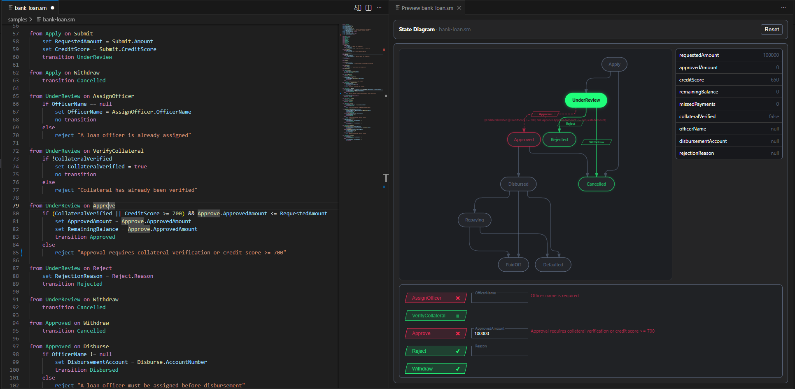

# Precept 🛡️

[](https://www.nuget.org/packages/Precept)
[](https://github.com/OwnerName/Precept/actions)
[](https://opensource.org/licenses/MIT)
[](https://marketplace.visualstudio.com/items?itemName=OwnerName.precept-vscode)

> **pre·​cept** *(noun)*: A general rule intended to regulate behavior or thought; a strict command or principle of action.

**Precept is a domain integrity engine for .NET.** It binds an entity's state, data, and business rules into a single, executable contract. By treating your business constraints as unbreakable *precepts*, the engine ensures that invalid states and illegal data mutations are fundamentally impossible.

---

## 🚀 Quick Start

1. **Install the .NET package:**
   ```bash
   dotnet add package Precept
   ```
2. **Install the VS Code extension:** Search for `Precept DSL` in the marketplace or run:
   ```bash
   code --install-extension AuthorName.precept-vscode
   ```

---

## 💡 The "Aha!" Moment

With Precept, you define the rules of your entity in a clean, domain-readable DSL, and then execute those exact rules deterministically in C#.

### 1. The Contract (`bank-loan.precept`)

```
precept BankLoan

// Fields with defaults and invariants
field RequestedAmount as number default 0
field ApprovedAmount as number default 0
field CreditScore as number default 0
field RemainingBalance as number default 0
invariant RemainingBalance >= 0 because "Remaining balance cannot be negative"
invariant ApprovedAmount <= RequestedAmount because "Approved amount must not exceed requested amount"

// State progression
state Apply initial
state UnderReview
state Approved
state Rejected

// Events with typed arguments and asserts
event Submit with Amount as number, CreditScore as number
on Submit assert Amount > 0 because "Amount must be positive"
on Submit assert CreditScore >= 300 because "Credit score must be at least 300"

event Approve with ApprovedAmount as number
on Approve assert ApprovedAmount > 0 because "Approved amount must be positive"

event Reject with Reason as string
field RejectionReason as string nullable

// Flat transition rows — first matching row wins
from Apply on Submit -> set RequestedAmount = Submit.Amount -> set CreditScore = Submit.CreditScore -> transition UnderReview
from UnderReview on Approve when CreditScore >= 700 && Approve.ApprovedAmount <= RequestedAmount -> set ApprovedAmount = Approve.ApprovedAmount -> set RemainingBalance = Approve.ApprovedAmount -> transition Approved
from UnderReview on Approve -> reject "Approval requires credit score >= 700 and valid amount"
from UnderReview on Reject -> set RejectionReason = Reject.Reason -> transition Rejected
```

### 2. The Execution (C#)

Because guard expressions are purely evaluative, `Inspect` safely previews any action without touching your database.

```csharp
using Precept;

// Parse the DSL and compile to an engine (do this once at startup)
var definition = PreceptParser.Parse(File.ReadAllText("bank-loan.precept"));
var engine = PreceptCompiler.Compile(definition);

// Restore an instance from your database
var instance = engine.CreateInstance(
    "UnderReview",
    new Dictionary<string, object?>
    {
        ["RequestedAmount"] = 50_000.0,
        ["CreditScore"] = 720.0,
        ["ApprovedAmount"] = 0.0,
        ["RemainingBalance"] = 0.0,
    });

// Safely inspect — no mutation
var preview = engine.Inspect(instance, "Approve", new Dictionary<string, object?>
{
    ["ApprovedAmount"] = 45_000.0
});

if (preview.Outcome == PreceptOutcomeKind.Rejected)
{
    // Output: "Approval requires credit score >= 700 and valid amount"
    Console.WriteLine(string.Join(", ", preview.Reasons));
}
else
{
    // Transition is valid — fire and persist
    var result = engine.Fire(instance, "Approve", new Dictionary<string, object?>
    {
        ["ApprovedAmount"] = 45_000.0
    });

    if (result.Outcome == PreceptOutcomeKind.Accepted)
    {
        var updated = result.UpdatedInstance!;
        Console.WriteLine($"State: {updated.CurrentState}"); // Approved
        await repository.SaveAsync(updated.InstanceData);
    }
}

// Direct field editing — no event needed (fields declared with `in <State> edit`)
var editResult = engine.Update(instance, patch => patch
    .Set("Notes", "Customer called back"));

if (editResult.Outcome == PreceptUpdateOutcome.Updated)
{
    instance = editResult.UpdatedInstance!;
    // Invariants and state asserts are enforced — same safety net as Fire
}
```

---

## 🛠️ World-Class Tooling

Precept isn't just a library; it's an authoring experience. The accompanying VS Code extension provides:
- **Context-Aware IntelliSense:** Completions respect DSL scope and the current grammar step, so declarations suggest the next required keywords and types, invariants and state asserts suggest data fields, event asserts suggest the active event's arguments, and guarded rows hand off to `->` once the guard is complete.
- **Hover + Go to Definition:** Hover a field, state, event, event arg, collection accessor, or DSL keyword to see its meaning and syntax form, then jump to declarations directly from references.
- **Document Outline:** The editor exposes a structured symbol tree for the precept, including fields, states, events, and event arguments.
- **Structural Diagnostics:** Real-time diagnostics now surface unreachable states, dead-end states, orphaned events, and reject-only state/event pairs that likely model unsupported events as explicit rejections.
- **Quick Fixes:** Reject-only state/event pair warnings offer a quick fix to remove the rows and restore `NotDefined` semantics for unsupported events, and orphaned event warnings offer a quick fix to remove the unused event declaration and its event asserts.
- **Interactive Inspector:** Fire events and edit data against a live, mock instance in VS Code. The preview behaves like Markdown preview by default: one right-side preview follows the active `.precept` editor, and you can lock it to the current file with **Toggle Preview Locking**. Field edits use explicit **Edit** mode with **Save/Cancel**; validation runs live via inspect while typing, field-level errors stay attached only to the fields that caused them, and values are committed only when **Save** is clicked.
- **Live Diagramming:** A dynamic state-transition diagram renders as you type.
- **Null-Flow Analysis:** Real-time squiggles warn you if a guard path might access an unsafe null value.



---

## 🤖 MCP Server (Copilot Integration)

Precept includes an MCP (Model Context Protocol) server that exposes DSL parsing, validation, structural analysis, and runtime execution as tools callable by Copilot and any MCP-compatible host. This enables semantic understanding of `.precept` files beyond plain text reading.

### Tools

| Tool | Purpose |
|------|---------|
| `precept_validate` | Parse and compile a `.precept` file, return structured diagnostics |
| `precept_schema` | Return the full typed structure — states, fields, events, transitions |
| `precept_audit` | Graph analysis — reachability, dead ends, terminal states, orphaned events |
| `precept_run` | Execute a step-by-step event scenario, return outcomes |
| `precept_language` | Full DSL reference — vocabulary, constructs, constraints, pipeline |
| `precept_inspect` | From a state+data snapshot, preview what every event would do |

### Setup

The workspace includes a `.vscode/mcp.json` that registers the server with Copilot automatically. No manual configuration is required — Copilot discovers the six tools when the workspace is open.

The server runs via stdio and is launched on demand through the workspace launcher:
```
node tools/Precept.VsCode/scripts/start-precept-mcp.js
```

On each launch, the launcher builds `tools/Precept.Mcp/Precept.Mcp.csproj` into `temp/dev-mcp`, copies that build into a fresh shadow runtime under `temp/dev-mcp/runtime/run-*`, and runs the copied `Precept.Mcp.dll`. This keeps the live MCP process off the default `bin/Debug` output so rebuilding the project does not collide with the running server.

---

## 🧠 The Problem It Solves

Most complex entities start simple. But as business requirements grow, the rules governing their lifecycles scatter across your codebase:
- **State transitions** land in `switch` statements or scattered handler logic.
- **Data validation** gets pushed into ORMs, FluentValidation, or entity constructors.
- **Side effects** trigger asynchronously with no guarantee the data is ready.

Eventually, the system drifts. An entity ends up in a `Shipped` state without a `TrackingNumber`. When stakeholders ask, "Under what exact conditions can an Order be refunded?", developers have to traverse six different classes to find the answer.

Precept fixes this by treating the lifecycle of an entity as an executable contract.

## 🏗️ The Pillars of Precept

### 1. The Universal Safety Net (`invariant`)
In most systems, validation is bound to *actions* (e.g., "Validate this API payload"). In Precept, constraints are bound to the *data itself*.

When you declare `invariant Balance >= 0 because "Balance cannot be negative"`, that precept is absolute. Whether a complex workflow transition deducts from the balance, or a user directly edits a field via an administrative override, the engine enforces the invariant upon completion. If it fails, the entire transaction rolls back.

State-scoped asserts (`in <State> assert ... because "..."`) and event-scoped asserts (`on <Event> assert ... because "..."`) let you enforce constraints exactly where they apply.

### 2. Pure Inspection (`Inspect` before `Fire`)
Because Precept enforces rigorous grammar constraints—expressions evaluate, statements mutate—it is impossible for a transition guard to accidentally mutate data. This allows the `Inspect` API to safely preview any action, returning a precise outcome with specific error reasons—all without saving a thing.

### 3. Atomic, Deterministic Mutations
A Precept transition either completely succeeds or entirely rolls back. Every evaluation is deterministic: the same definitions and the same data will *always* result in the same outcome.

### 4. Two Mutational Paths
Precept acknowledges that entirely different ceremonies apply to different types of data updates:
* **Transitions (`event`):** For lifecycle changes where routing, auditing, and complex state progression matter.
* **Direct Edits (`edit`):** For simple data mutations where event ceremony is overkill.

Both paths are safely watched by the exact same invariant engine. Direct editing isn't a hack; it is a first-class feature protected by the same ironclad invariants.

## VS Code Extension Local Loop (Contributors)

Use the installed extension in your normal VS Code window.

Recommended setup: keep `local.precept-vscode` installed for day-to-day work in that window. Use the packaging tasks only when you need to refresh the installed extension code after TypeScript or webview changes.

When you change C# language-server or runtime code:

1. Run `Build Task` / `Ctrl+Shift+B`.
2. The default `build` task compiles `tools/Precept.LanguageServer/Precept.LanguageServer.csproj` into `temp/dev-language-server` with `--artifacts-path`.
3. The installed extension detects the new DLL, creates a fresh shadow copy under `temp/dev-language-server/runtime`, and restarts the language client automatically.

When you change TypeScript extension-host code or webview code:

1. Run `extension: loop local install`.
2. Run `Developer: Reload Window`.

When you change MCP server code:

1. Run `Developer: Reload Window`.
2. Trigger any MCP-backed action.
3. The launcher rebuilds `tools/Precept.Mcp` into `temp/dev-mcp`, creates a fresh shadow copy under `temp/dev-mcp/runtime`, and starts the new runtime on demand.

On first activation, the installed extension bootstraps the dev language-server artifacts under `temp/dev-language-server` if they are missing.

The status bar shows `Precept LS: Dev`. Click it, or run `Precept: Show Language Server Mode`, to inspect the active launch paths in the output channel.

Use `npm run loop:local` only as the command-line equivalent of `extension: loop local install`.

Use `extension: loop local uninstall` or `npm run loop:local:uninstall` only if you want to remove the installed local VSIX from your profile.