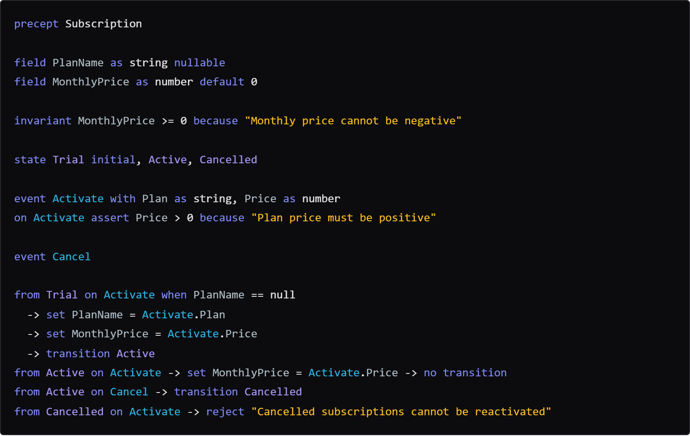

# Precept

[](https://www.nuget.org/packages/Precept)
[](https://opensource.org/licenses/MIT)

> **pre·cept** *(noun)*: A general rule intended to regulate behavior or thought.

**Precept is a domain integrity engine for .NET.** Most systems scatter business rules across validators, handlers, and state checks — independent, forgettable, gaps waiting to happen. Precept compiles them into unbreakable precepts, a single contract where invalid configurations are structurally impossible and every operation enforces the complete logic.

Precept treats AI as a first-class author. A dedicated MCP server exposes five typed tools — compile, inspect, fire, update, and language reference — so AI agents operate on definitions with the same precision as the runtime itself. A Copilot agent and purpose-built skills complete the AI authoring loop. Humans get a VS Code extension with live preview, syntax highlighting, and IntelliSense. Compile the definition, enforce the contract, produce the same outcome every time. AI is unpredictable. Precept is not.

---

## Quick Example


**The Contract**



<details>
<summary>Copyable DSL</summary>

```precept
precept Subscription

field PlanName as string nullable
field MonthlyPrice as number default 0

rule MonthlyPrice >= 0 because "Monthly price cannot be negative"

state Trial initial, Active, Cancelled

event Activate with Plan as string, Price as number
on Activate ensure Price > 0 because "Plan price must be positive"

event Cancel

from Trial on Activate when PlanName == null
  -> set PlanName = Activate.Plan
  -> set MonthlyPrice = Activate.Price
  -> transition Active
from Active on Activate -> set MonthlyPrice = Activate.Price -> no transition
from Active on Cancel -> transition Cancelled
from Cancelled on Activate -> reject "Cancelled subscriptions cannot be reactivated"
```
</details>

**The Execution**

```csharp
var def = PreceptParser.Parse(dslText);
var eng = PreceptCompiler.Compile(def);
var inst = eng.CreateInstance(state, data);
var result = eng.Fire(inst, "Activate", args);
// result.IsSuccess, result.UpdatedInstance
```

---

## Getting Started

**Prerequisite:** [.NET 10 SDK](https://dotnet.microsoft.com/download)

### 1. Install the VS Code Extension

```bash
code --install-extension sfalik.precept-vscode
```

Syntax highlighting, live diagnostics, and AI tooling are active immediately.

### 2. Add the Copilot Plugin

Install the Precept plugin from the GitHub Copilot or Claude marketplace. It adds five MCP tools, a dedicated Precept Author agent, and two skills (authoring and debugging) — so AI agents can compile, inspect, fire events, and iterate on `.precept` definitions with full type safety.

### 3. Create Your First Precept File

Create `Subscription.precept` and type along with the example above. The language server provides completions, hover docs, and error detection in real time. The Copilot plugin gives AI agents the same structured access.

> **Implementation track note:** This repository currently has two documentation tracks. For `src/Precept.Next` / the v2 clean-room pipeline, start in [docs.next/README.md](docs.next/README.md). The [docs/](docs/) folder remains the legacy/current reference set for the implemented v1 surface, product reference, and historical context.

### 4. Integrate the Runtime

```bash
dotnet add package Precept
```

See the [Quickstart Guide](docs/RuntimeApiDesign.md) for a complete runtime integration walkthrough.

---

## What Makes Precept Different

**AI-First Authoring** — The Copilot plugin gives AI agents five MCP tools to compile, inspect, fire events, and validate `.precept` definitions — no guessing at syntax or semantics. The VS Code extension provides completions, semantic highlighting, inline diagnostics, and a live state diagram that updates as you edit. AI brings the fluency; the engine brings the guarantee.

**Unified Domain Integrity** — In most codebases, entity governance is scattered: validators in one layer, state checks in another, editability rules in a third, conditional logic in service handlers that bypass everything else. Each layer exists because the one before it wasn't enough. Precept consolidates all of it into a single `.precept` declaration that the runtime compiles and enforces structurally — no code path outside the contract, no window where an invalid configuration can exist.

- Prevention, not detection — invalid configurations are structurally impossible, not caught after the fact
- One file, all rules — guards, constraints, rules, and transitions together
- Lifecycle optional — stateless precepts enforce field declarations, rules, and constraints without a state machine
- Full inspectability — preview any action's outcome without executing it
- Compile-time proof engine — a unified interval + relational inference engine that proves numeric properties at compile time, before any instance exists. Catches divisor safety (C92/C93), sqrt safety (C76), assignment constraint violations (C94), contradictory rules (C95), vacuous rules (C96), dead guards (C97), and tautological guards (C98). Proof covers compound operands, sum-on-RHS rules, computed-field intermediaries, transitive ordering chains, and 10 built-in numeric functions. All diagnostics include source attribution so authors see what was proved and why.
- **Stateful or stateless** — precepts can govern stateful workflows (with lifecycle states and transitions) or stateless domain objects (fields and edit rules only, no states)
- **Conditional declarations** — `when` guards on rules, ensures, and edit blocks make rules apply only when a precondition is met
- **Conditional expressions** — `if...then...else` selects between values inline, replacing row duplication for data-dependent field assignments
- **Computed fields** — `field X as number -> A + B` declares a derived value that recomputes automatically after every mutation, eliminating manual synchronization

Precept is not a workflow orchestrator, event sourcing framework, or ORM — it integrates with all of them. It governs the entity contract; they handle orchestration, persistence, and storage. Think: scattered governance across six service classes — Precept puts it in one file.

---

## Learn More

| Resource | Description |
|----------|-------------|
| [Product Philosophy](docs/philosophy.md) | What Precept governs, how it's positioned, and why |
| [Language Reference](docs/PreceptLanguageDesign.md) | Full DSL syntax and construct reference |
| [Quickstart Guide](docs/RuntimeApiDesign.md) | Step-by-step runtime integration walkthrough |
| [MCP Server Docs](docs/McpServerDesign.md) | Tool reference for AI agent integration |
| [Sample Catalog](samples/) | 28 domain models in `.precept` |

**Highlighted samples:**

| Sample | Pattern |
|--------|---------|
| [Loan Application](samples/loan-application.precept) | Multi-stage approval with cross-field guards |
| [Insurance Claim](samples/insurance-claim.precept) | Claims lifecycle with conditional rules |
| [Hiring Pipeline](samples/hiring-pipeline.precept) | Pipeline stages with typed event arguments |
| [Subscription Retention](samples/subscription-cancellation-retention.precept) | Retention flow with branching outcomes |
| [Traffic Light](samples/trafficlight.precept) | Minimal lifecycle — great starting point |

---

## Contributing

See [CONTRIBUTING.md](CONTRIBUTING.md) for the development workflow, build commands, first-time setup, and reload rules.

---

## License

MIT — see [LICENSE](LICENSE) for details.
