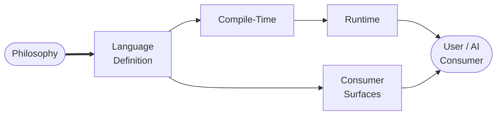
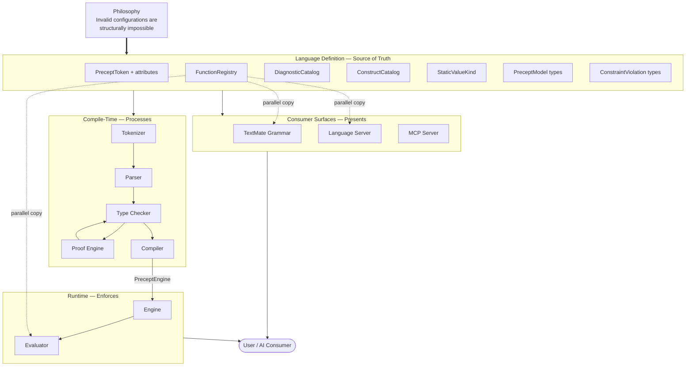
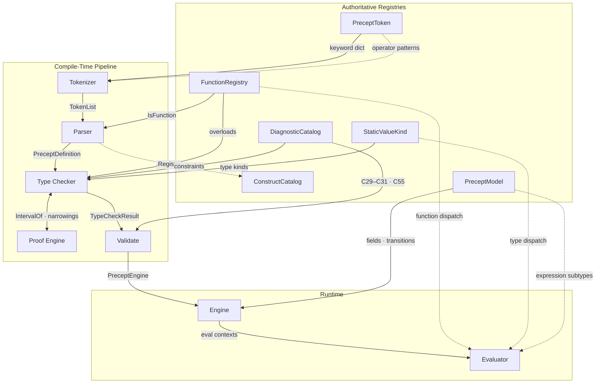
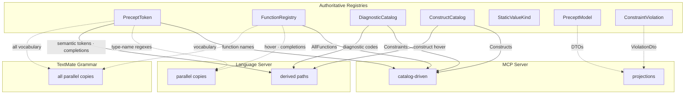

# Architectural Coherence Design

Date: 2026-04-19

Status: **Draft** — Phase 1 skeleton. Section headings and thesis established. Body content pending design review.

> **Research grounding:** [ComponentAlignmentInventory.md](ComponentAlignmentInventory.md) (50-edge alignment map, 22 components, 12 enforcement mechanisms). Architecture context: [ArchitectureDesign.md](ArchitectureDesign.md) (two-phase architecture, 8 principles). Product philosophy: [philosophy.md](philosophy.md).

> **Supersedes:** [CatalogInfrastructureDesign.md](CatalogInfrastructureDesign.md) (3-tier catalog infrastructure). The catalog design is absorbed into this document's broader architectural coherence framework. The original file is retained for reference but is no longer the governing design.

> **Dependency:** Issue [#115](https://github.com/sfalik/Precept/issues/115) (evaluator semantic fidelity rewrite) is blocked on this design. The evaluator is the highest-drift component in the codebase — its function dispatch, operator dispatch, and member accessor tables are all hand-coded parallel copies with no structural link to their authoritative registries. The coherence framework established here defines the enforcement architecture that #115's rewrite must satisfy.

> **Related issues:** [#111](https://github.com/sfalik/Precept/issues/111) (compile-time enforcement C94–C99) adds new diagnostic codes and constraint kinds that must propagate coherently through the type checker, evaluator, language server, and MCP surfaces. [#107](https://github.com/sfalik/Precept/issues/107) (temporal type system — 8 NodaTime-backed types) is the largest upcoming language surface expansion; every new type, operator, accessor, and postfix unit must satisfy the coherence boundaries defined here. [#95](https://github.com/sfalik/Precept/issues/95) (currency, money, quantity, unit-of-measure investigation) would extend the same postfix grammar and type-family dispatch, further stressing the alignment edges this document governs.

---

## Overview

Precept's philosophy promises that invalid configurations are structurally impossible. That guarantee begins in the language definition itself — the registries, enums, and catalogs that authoritatively define what the DSL contains — and must propagate faithfully through every component that processes, enforces, or presents the language: parser, type checker, proof engine, evaluator, engine, language server, MCP server, TextMate grammar. A soundness gap at any boundary (a function the type checker accepts but the evaluator doesn't implement, a keyword the parser recognizes but completions don't offer, a constraint the engine enforces but MCP doesn't surface) silently weakens the guarantee that reaches the user.

This document defines the language's authoritative structure, traces how that structure must flow through the component pipeline, and establishes the enforcement mechanisms that prevent coherence failures. The enforcement mechanisms — Roslyn analyzers, drift tests, registry-driven derivation — are not the thesis; they serve it. The thesis is architectural coherence: the language definition is the single source of truth, and every component that participates in delivering the philosophy's promise must derive from that truth completely, consistently, and verifiably. The product's own core principle — prevention, not detection — applies recursively to the codebase itself.

---

## Architecture

*The three-tier model of language knowledge — authoritative registries, pipeline stages, and consumer surfaces — and the coherence relationships between them. This is the structural foundation the rest of the document operates on.*

> **Diagram note:** Solid lines = derived (structural coherence). Dotted lines = parallel copies (drift risk — the alignment edges this document's enforcement architecture targets).

The language exists in three categories of artifacts:

**Authoritative registries** are the single-source-of-truth artifacts that define what the language contains. Nothing else in the codebase *decides* what the language is — these do:

- `PreceptToken` enum + attributes — the complete vocabulary: every keyword, operator, punctuation symbol, and literal kind, annotated with `[TokenCategory]`, `[TokenDescription]`, and `[TokenSymbol]`
- `FunctionRegistry` — the function library: names, overloads, parameter types, return types, argument constraints
- `DiagnosticCatalog` — the constraint surface: every compile-time and runtime diagnostic (C1–C99), with phase, severity, and message template
- `ConstructCatalog` — the grammar documentation: every parseable construct with form, context, description, and example
- `StaticValueKind` enum — the type system's internal representation of value kinds
- `PreceptModel` types — the structural model: `PreceptDefinition`, `PreceptField`, `PreceptState`, `PreceptEvent`, `PreceptExpression` hierarchy, `FieldConstraint` hierarchy, outcome types
- `ConstraintViolation` types — the failure model: `ConstraintTarget` and `ConstraintSource` hierarchies

**Pipeline stages** are the components that process language knowledge into validated engines. Each stage consumes authoritative definitions and must handle the full surface they define:

- Tokenizer → Parser → Type Checker ↔ Proof Engine → Compiler → Engine → Evaluator

**Consumer surfaces** are the components that present language knowledge to users and tooling. Each surface carries its own representation of language knowledge:

- TextMate grammar (syntax highlighting)
- Language server (completions, hover, diagnostics, semantic tokens)
- MCP server (tool DTOs, serialization)
- VS Code extension (preview, commands)

The coherence problem is the gap between these categories. Every pipeline stage and consumer surface carries its own representation of language knowledge. When those representations are *derived* from the authoritative registries, coherence is structural — a new keyword in the token enum automatically appears in the tokenizer, in semantic tokens, in MCP vocabulary. When they are *hand-coded parallel copies*, coherence depends on discipline — and discipline fails. The evaluator's function switch, the grammar's keyword alternation, the language server's hover content dictionary are all parallel copies today. This document's enforcement architecture exists to close those gaps.

---

## Philosophy-Rooted Design Principles

The following principles govern every decision in this document. They operate on the three-tier architecture above — authoritative registries, pipeline stages, consumer surfaces — and extend Precept's core philosophy (prevention, one-file completeness, inspectability, determinism) from the DSL runtime to the codebase that delivers it.

1. **The registries are the origin of the guarantee.** The philosophy promises prevention. That promise is anchored in the authoritative registries that define what the language *is*. Every pipeline stage and consumer surface derives its understanding of the language from these sources. If a registry is incomplete, no amount of downstream correctness can restore the guarantee. If a pipeline stage or consumer surface diverges from a registry, the guarantee is broken at that boundary.

2. **The guarantee is only as strong as the weakest boundary.** The guarantee flows from registries through pipeline stages to consumer surfaces. If any stage silently drops a construct — a function that `FunctionRegistry` defines and the type checker validates but the evaluator doesn't implement, a keyword that `PreceptToken` declares but the TextMate grammar doesn't highlight — the user encounters detection where they were promised prevention. Coherence across every registry → consumer edge is the mechanism that makes prevention real across the full surface.

3. **Prevention applies inward.** The product prevents invalid entity configurations. The codebase must prevent invalid component configurations. A parallel copy in the evaluator that drifts from `FunctionRegistry` is a detection failure — caught only when a user hits the gap. A Roslyn analyzer that refuses to compile when the evaluator's switch and the registry disagree is prevention. The enforcement hierarchy must prefer structural prevention over after-the-fact detection at every tier.

4. **Derive from registries, never duplicate them.** When a pipeline stage or consumer surface needs a fact that an authoritative registry already defines — a keyword list, a function name, a diagnostic code — it must derive that fact, not maintain a parallel copy. Derivation eliminates the class of drift where two independent copies fall out of sync. Where derivation is not yet feasible, the gap must be covered by the highest-tier enforcement mechanism available.

5. **Coherence is auditable.** For every alignment edge between a registry and a consumer (pipeline stage or surface), it must be possible to answer: what is the authoritative source, what is the derivation or enforcement mechanism, and what is the current status? If an edge cannot be audited, it cannot be trusted.

6. **Enforcement is tiered by cost of failure.** Not all alignment gaps carry the same risk. A missing keyword in the TextMate grammar degrades the authoring experience; a missing expression subtype in the evaluator produces a runtime crash. The enforcement tier must match the severity: compile-time Roslyn errors for soundness-critical pipeline boundaries, drift tests for consumer surface fidelity, registry derivation for vocabulary propagation.

7. **Registries are uniform by convention.** The authoritative registries today are scattered across different files, use different structural patterns (attribute-decorated enums, static class registrations, parser-time side effects), and expose their data through different access patterns. This inconsistency makes derivation harder and enforcement mechanisms non-reusable. To whatever extent possible, registries should follow a consistent structural pattern — same location conventions, same attribute/metadata approach, same reflection surface — so that a single derivation mechanism or Roslyn rule can cover an entire class of alignment edges rather than requiring bespoke logic per registry.

---

## Guarantee Flow Model

*How correctness propagates from the language definition through compile-time, runtime, and consumer surfaces. The architectural path the guarantee travels — starting from the authoritative registries — and the boundaries where coherence must hold.*

### The Path

The guarantee begins in the authoritative registries and must arrive, intact, at the user. Between origin and destination lie nine pipeline stages and four consumer surfaces, each of which carries language knowledge in a different representation. The guarantee is not a single fact that flows through a single pipe — it is a set of overlapping knowledge claims (vocabulary, types, functions, constraints, proof facts, outcome semantics) that must be independently represented at every stage while remaining mutually consistent. This section traces those claims through the system, names the form each takes at each boundary crossing, and identifies where the path branches into parallel representations that can drift.

> **Diagram key.** Solid lines (→): the consumer derives from the registry by structural reference, reflection, or API call — coherence is built in. Dotted lines (⇢): the consumer carries a parallel copy that was authored independently of the registry — coherence depends on discipline, and discipline fails.

### Stage-by-Stage Knowledge Flow

**Registries → Tokenizer.** The tokenizer is the first consumer. It needs two things from `PreceptToken`: keyword text-to-token mappings (which keywords exist and what token each produces) and operator/punctuation recognition patterns (which character sequences are operators). The keyword mapping is **derived** — `PreceptTokenMeta.BuildKeywordDictionary()` reads `[TokenSymbol]` attributes at startup and produces the keyword dictionary by reflection. A new keyword token with a `[TokenSymbol]` attribute is recognized by the tokenizer automatically. The operator/punctuation mapping is **hardcoded** — each operator token requires an explicit `builder.Match()` call with `Span.EqualTo()` or `Character.EqualTo()`. This is the first boundary where knowledge can be lost: a new operator token in the enum with no matching tokenizer pattern will never be produced.

**Tokenizer → Parser.** The tokenizer emits a `TokenList<PreceptToken>` — a sequence of typed token values with source positions. The parser consumes these via Superpower combinators that reference `PreceptToken` enum members directly (`Token.EqualTo(PreceptToken.Field)`). The parser also consults `FunctionRegistry.IsFunction()` to recognize function names during parsing — a direct structural reference, not a parallel copy. The knowledge crossing this boundary is the token stream itself plus function-name recognition. The parser also populates `ConstructCatalog` via `.Register()` extension methods on parser combinators — this is the reverse direction, where the parser writes back into a registry. A parser combinator that omits `.Register()` produces an undocumented construct.

**Parser → Type Checker.** The parser emits a `PreceptDefinition` — the complete structural model of the `.precept` file: fields, states, events, transition rows, rules, ensures, edit blocks, computed fields, collection fields, and the `PreceptExpression` AST for every expression position. This is the richest single boundary crossing in the pipeline. The type checker consumes it alongside two registries directly: `FunctionRegistry` (for overload resolution and argument constraint validation) and `DiagnosticCatalog` (for diagnostic generation). It also consumes `StaticValueKind` as the currency of type inference.

**Type Checker ↔ Proof Engine.** This is the only bidirectional boundary in the pipeline, and the information flow has direction. The type checker orchestrates: it walks the definition model, writes narrowing facts into `ProofContext` as it processes guards and assignments, and queries the proof engine via `IntervalOf(expr)` at six defined integration points (C94 assignment validation, C92/C93 divisor safety, C76 sqrt operand, C97/C98 guard analysis, C95/C96 rule analysis, compound RHS inference). The proof engine responds with `ProofResult` — a `NumericInterval` and a `ProofAttribution` naming the source constraints. The knowledge crossing this boundary is numeric: intervals, relational orderings, sign facts. The type checker translates these into diagnostics; the proof engine never generates diagnostics directly.

**Type Checker → Compiler → Engine.** The type checker produces a `TypeCheckResult`: diagnostics, `PreceptTypeContext` (resolved type per expression position), `ComputedFieldOrder` (topological evaluation sequence for computed fields), and `GlobalProofContext`. The compilation stage — `PreceptRuntime.Validate()`, labeled "Validate" in the pipeline diagram (there is no standalone `PreceptCompiler` class) — orchestrates three validation passes: (1) `PreceptTypeChecker.Check()` for type and expression semantics, (2) `CollectCompileTimeDiagnostics()` for structural enforcement — C29 rule-at-defaults validation, C30 initial-state ensures at defaults, C31 event ensures at defaults, C55 root edit block validation, and structural duplicate-ensure detection — and (3) `PreceptAnalysis.Analyze()` for dead-state analysis. The validation stage is a thin orchestrator for type and expression semantics, but it **owns** structural enforcement checks that neither the type checker nor the parser performs. The `PreceptEngine` is gated on the full validation output across all three passes, not just the type checker result. If any pass produces errors, engine construction does not proceed. The `PreceptEngine` is the **phase boundary** — the single object that separates compile-time from runtime. It carries the field map, transition table, computed field order, edit permissions, and state action map. It does not carry the type context, the proof context, or the diagnostic surface. Those are compile-time artifacts that do not cross into runtime.

**Engine → Evaluator.** The engine never evaluates expressions directly. For every guard, assignment, rule, ensure, and computed field recomputation, it builds an evaluation context and delegates to `PreceptExpressionRuntimeEvaluator.Evaluate()`. Three context builders serve different pipeline stages: `BuildEvaluationData` produces a static snapshot of current field values and event arguments for standard expression evaluation; `BuildEvaluationDataWithCollections` produces a read-your-writes snapshot including uncommitted collection mutations for rule and assignment evaluation within a transition; `BuildDirectEvaluationData` produces an event-args-only context — no instance data — for Stage 1 event ensure evaluation, where the engine must validate argument constraints before the instance is consulted. The evaluator receives the `PreceptExpression` AST and the evaluation data dictionary; it returns an `EvaluationResult` (success/failure + value).

The *architectural* boundary is engine → evaluator (where expression evaluation is delegated via evaluation contexts). But the *knowledge agreement* boundary is type checker ↔ evaluator: the knowledge the evaluator needs to do its job — which functions exist, what operators are legal for which type families, which member accessors are valid — is **not passed to it by the engine and not read from any registry.** It is independently coded in the evaluator's own switch statements. This is the parallel-copy problem at its most acute: the evaluator carries its own copy of function dispatch (18 functions, each hand-coded), operator dispatch (every operator × type-family combination, independently implemented), and member accessor dispatch (`count`, `min`, `max`, `peek`, `length` — hardcoded strings). The type checker and the evaluator must agree on what is legal, but there is no structural mechanism ensuring they do.

### The Fan-Out

> The pipeline diagram (above) shows `StaticValueKind` feeding the type checker and evaluator. In the fan-out, type vocabulary reaches consumer surfaces through `PreceptToken` — type keywords are token enum members with `[TokenCategory(Type)]` — so `SVK` is included here for completeness but has no direct consumer-surface edges.

The compile-time pipeline is a serial chain: tokenizer → parser → type checker → compiler → engine → evaluator. Knowledge flows forward, and each stage can structurally derive from the one before it (with the evaluator as the critical exception). But the same registries that feed the pipeline must also feed three consumer surfaces that branch off independently:

**TextMate Grammar.** The grammar needs the complete vocabulary — every keyword, type name, constraint name, function name, operator, and accessor — as regex alternation patterns in a JSON file. It cannot call .NET reflection. It cannot read `[TokenSymbol]` attributes. Every vocabulary fact must be independently transcribed into regex strings. This makes the grammar a **total parallel copy** of every vocabulary-bearing registry. Seven vocabulary categories must be independently transcribed (keywords, types, constraints, operators, function names, collection accessors, string accessors), all enforced by convention only — zero structural enforcement. The fan-out diagram consolidates these into two registry edges (`PreceptToken` → Grammar and `FunctionRegistry` → Grammar) because accessors and type names originate from the same registries, but each category is an independent maintenance surface. The grammar is the highest-maintenance consumer in the system.

**Language Server.** The language server is a hybrid. Its **semantic tokens** derive from `PreceptTokenMeta.GetCategory()` via a startup-built `SemanticTypeMap` — zero drift by construction. Its **keyword completions** derive from the same attribute-driven pattern: `BuildKeywordItems()` iterates `Enum.GetValues<PreceptToken>()`, reads `PreceptTokenMeta.GetCategory()` and `GetSymbol()`, and builds the completion list by reflection — zero drift by construction. Its **diagnostics** derive from `TypeCheckResult` diagnostics mapped to LSP codes via `DiagnosticCatalog.ToDiagnosticCode()` — zero drift. Its **construct hover content** reads `ConstructCatalog.Constructs` directly — zero drift. The parallel-copy risks in the language server are concentrated in three areas: **function hover content** (`FunctionHoverContent` — 18 hand-maintained entries that must track `FunctionRegistry`), **type-name regexes** hardcoded in context-detection logic (parallel copies of `PreceptToken` type vocabulary, shown as a dotted edge in the fan-out diagram), and **function completion lists** that are independently maintained rather than registry-driven. The language server occupies the uncomfortable middle: its four derived paths (semantic tokens, keyword completions, diagnostics, construct hover) are structurally sound, while its parallel-copy paths (function hover, type-name regexes, function completions) are conventional maintenance surfaces where drift accumulates silently.

**MCP Server.** The MCP server is the best-aligned consumer surface. Its vocabulary output reflects `PreceptToken` attributes directly. Its constraint output reads `DiagnosticCatalog.Constraints`. Its construct output reads `ConstructCatalog.Constructs`. Its function output reads `FunctionRegistry.AllFunctions`. These are catalog-driven derivations — zero drift by construction. The residual risk is in projection: `CompileTool` DTOs mirror `PreceptModel` types via manual property mapping; `ViolationDtoMapper` switches on `ConstraintTarget` and `ConstraintSource` subtypes; `FirePipeline`, `ExpressionScopes`, and `OutcomeKinds` are hardcoded arrays. The catalog-driven core is solid; the projection periphery is a conventional maintenance surface.

### The Three Guarantee Surfaces

The knowledge flow through pipeline and fan-out creates three distinct guarantee surfaces, each with its own failure mode and cost of failure:

**Compile-time soundness.** The guarantee that the compile-time gate is trustworthy — that every expression the type checker accepts is well-typed, every constraint the proof engine proves is sound, every structural invariant the compiler enforces is correctly checked, and every definition the compiler accepts will not produce a runtime type error. This surface lives in the serial pipeline: registries → tokenizer → parser → type checker ↔ proof engine → compiler. The boundaries are registry-to-pipeline (does the type checker handle every `StaticValueKind` flag? every `PreceptExpression` subtype? every `FunctionRegistry` overload?) and pipeline-internal (does the type checker correctly consult the proof engine at every integration point? does the compiler's structural enforcement catch every C29, C55, and duplicate-ensure violation?). A gap here means "it compiles but it shouldn't have" — a silent violation of the prevention guarantee.

**Runtime fidelity.** The guarantee that what compiles also runs correctly — that the evaluator faithfully implements every operation the type checker approves. This surface lives at the engine → evaluator boundary, and it is where coherence is weakest. The evaluator must independently implement every function, every operator × type-family combination, and every member accessor that the type checker blesses. There is no structural link. The type checker says "this division is safe because the divisor is provably nonzero"; the evaluator must actually perform the division correctly for every numeric type family. The type checker says "`floor(x)` returns an integer"; the evaluator must actually return a `long`. A gap here means "it compiles, the type checker says it's valid, but the evaluator produces the wrong result or crashes." This is the highest-cost boundary in the system — and the one with the least enforcement.

**Consumer surface completeness.** The guarantee that the user and AI consumer see the full language — every keyword highlighted, every function in completions, every diagnostic surfaced, every construct documented. This surface lives in the fan-out to grammar, language server, and MCP server. A gap here does not break correctness — a missing keyword in the grammar does not cause a runtime error. But it breaks the philosophy's inspectability promise: if the tooling surface is incomplete, the author's understanding of the language is incomplete, and the AI agent's understanding is incomplete. The cost is not failure; it is degraded trust. And degraded trust compounds — an author who learns they cannot rely on completions stops using completions, and the tooling surface becomes irrelevant.

### Why These Boundaries

Each guarantee surface groups a set of boundaries that share a failure mode and a cost tier. Compile-time soundness boundaries protect the prevention guarantee — their failure is a type-system hole. Runtime fidelity boundaries protect the execution contract — their failure is a crash or wrong result. Consumer surface completeness boundaries protect the inspectability promise — their failure is a tooling gap.

This tiering is not arbitrary. It follows directly from Principle 6 (enforcement is tiered by cost of failure) and Principle 2 (the guarantee is only as strong as the weakest boundary). The highest-cost boundaries — type checker ↔ evaluator knowledge agreement for runtime fidelity, `PreceptExpression` switch exhaustiveness for compile-time soundness — require the strongest enforcement. The lowest-cost boundaries — `FirePipeline` array freshness in MCP for consumer completeness — can tolerate weaker enforcement without endangering the core guarantee.

The Coherence Boundaries section that follows takes each guarantee surface and inventories the specific boundaries within it: what registry knowledge must cross, what form it takes on each side, and what happens when the two sides disagree.

---

## Coherence Boundaries

*The specific component boundaries where the guarantee must be preserved as language knowledge flows from authoritative registries through pipeline stages and into consumer surfaces. Organized by guarantee surface — not by enforcement mechanism.*

### Compile-Time Soundness

*Boundaries where authoritative registries meet the compile-time pipeline: token enum → tokenizer, function registry → type checker, type checker ↔ proof engine, expression subtypes → type checker switch dispatch. What must hold for the compile-time gate to be trustworthy.*

*(Phase 3 — content forthcoming.)*

### Runtime Fidelity

*Boundaries where compile-time validation hands off to runtime execution: function registry → evaluator, operator type inference → operator dispatch, expression subtypes → evaluator switch dispatch, member accessor names → evaluator accessor dispatch. What must hold for "if it compiles, it runs correctly."*

*(Phase 3 — content forthcoming.)*

### Consumer Surface Completeness

*Boundaries where authoritative registries meet tooling consumers: token enum → TextMate grammar, function registry → completions/hover, diagnostic catalog → language server, model types → MCP DTOs. What must hold for the user and AI consumer to see the full language.*

*(Phase 3 — content forthcoming.)*

---

## Enforcement Architecture

*The mechanisms that prevent coherence failures, organized by enforcement tier. Each mechanism is justified by which guarantee surface it protects.*

### Tier 1: Structural Derivation

*Registry-driven code paths that eliminate drift by construction — zero manual sync required.*

*(Phase 4 — content forthcoming.)*

### Tier 2: Compile-Time Enforcement (Roslyn Analyzers)

*Roslyn diagnostic rules that refuse to compile when a registry and its consumer disagree. PREC002–PREC011 specifications.*

*(Phase 4 — content forthcoming.)*

### Tier 3: Automated Drift Detection (Tests)

*Drift tests that verify alignment relationships hold. Catalog drift tests, grammar drift tests, construct-example round-trip tests.*

*(Phase 4 — content forthcoming.)*

### Tier 4: Structural Markers (SYNC Comments)

*Convention-backed traceability markers validated by reflection tests and (once shipped) Roslyn rules.*

*(Phase 4 — content forthcoming.)*

### Tier 5: Human Review

*Alignment relationships that cannot yet be mechanically enforced. The residual — minimized by promoting edges to higher tiers.*

*(Phase 4 — content forthcoming.)*

---

## Design Decisions

*Rationale for key architectural choices. Each entry: decision, rationale, alternatives considered, tradeoff accepted.*

### DD1: Top-down guarantee framing, not bottom-up inventory

**Decision:** Organize the document by guarantee surface (compile-time soundness, runtime fidelity, consumer surface completeness) rather than by component pair or enforcement mechanism.

**Rationale:** The research artifact ([ComponentAlignmentInventory.md](ComponentAlignmentInventory.md)) inventories 22 components, 50 alignment edges, and 12 enforcement mechanisms bottom-up. That framing treats coherence as a maintenance hygiene problem — keeping things in sync. The top-down framing starts from the philosophy's guarantee and asks how the component architecture must be structured to deliver it. Enforcement mechanisms serve that thesis; they are not the thesis.

**Alternative considered:** Organize by enforcement mechanism (Roslyn rules, drift tests, registry derivation). Rejected because it centers the tooling rather than the architectural argument, and makes it harder to reason about whether the guarantee is complete at each surface.

**Tradeoff accepted:** The bottom-up edge inventory is still needed as a reference — it lives in the appendix rather than driving the document structure. Readers who want the per-edge detail must look there.

### DD2: Registry uniformity is foundational, not aspirational

**Decision:** Principle 7 (registries are uniform by convention) is a non-negotiable design principle, not a future improvement.

**Rationale:** Principles 1 and 4 require that every pipeline stage and consumer surface derive from authoritative registries. Derivation at scale requires that registries follow consistent structural patterns — same attribute conventions, same reflection surface, same metadata access patterns. Without uniformity, every Roslyn rule and every drift test requires bespoke logic per registry, and systematic enforcement is not achievable. Registry uniformity is the prerequisite that makes the enforcement architecture work generically across an entire class of alignment edges.

**Alternative considered:** Treat uniformity as a north-star aspiration and handle each registry individually in the meantime. Rejected because it perpetuates the exact problem the document exists to solve — bespoke enforcement that doesn't scale as the language surface grows.

**Tradeoff accepted:** Achieving full uniformity may require refactoring existing registries (e.g., `FunctionRegistry` uses a different pattern than `PreceptToken` attributes). That refactoring cost is accepted as necessary infrastructure.

<!-- Additional design decisions populated as sections are written -->

---

## Test Obligations

*What must be tested to verify architectural coherence holds. Organized by enforcement tier.*

<!-- Populated during Phase 4 -->

---

## Future Considerations

*Planned improvements: registry-driven evaluator (DD24/DD25), expression subtype exhaustiveness via discriminated unions, promotion of Tier 3–5 edges to higher tiers.*

<!-- Populated as sections are written -->

---

## Appendix: Component Alignment Edge Map

*The full 50-edge alignment map from the research inventory, annotated with enforcement tier, current status, and owning design decision. Summary in body; detailed table here.*

<!-- Phase 5 content -->
