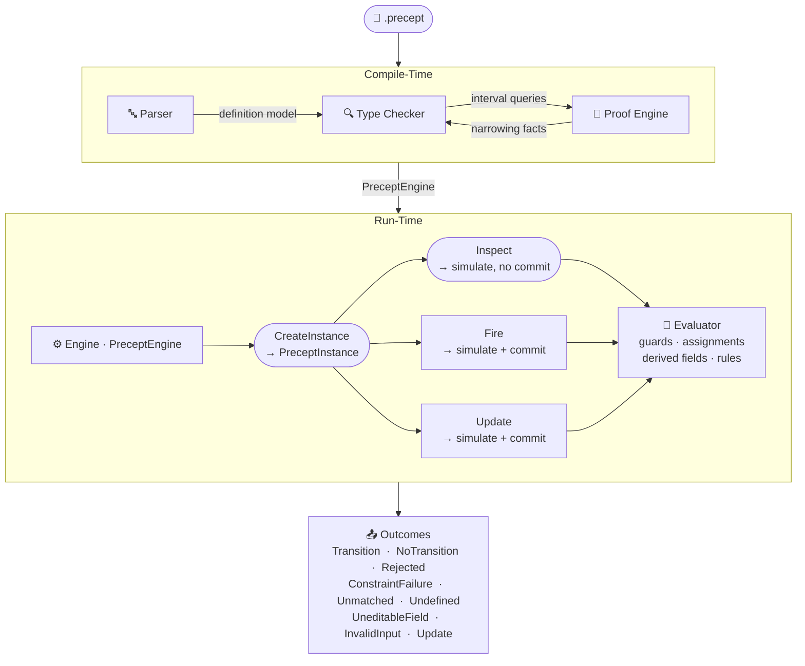

# Architecture Design

Date: 2026-04-19

Status: **Implemented** — Two-phase compile-time/run-time architecture fully operational. All five components (Parser, Type Checker, Proof Engine, Engine, Evaluator) shipped. Operation surface (CreateInstance, Inspect, Fire, Update) active across all precept kinds.

> **Research grounding:** Component design docs: [TypeCheckerDesign.md](TypeCheckerDesign.md), [ProofEngineDesign.md](ProofEngineDesign.md), [EvaluatorDesign.md](EvaluatorDesign.md) *(draft — issue #115, pending design review)*. Public API surface: [RuntimeApiDesign.md](RuntimeApiDesign.md). Product philosophy: [philosophy.md](philosophy.md).

> **⚠ EvaluatorDesign.md is a draft.** References to the Evaluator in this document describe current implemented behavior. The draft design doc covers planned semantic fidelity improvements (issue #115) and is not yet settled architecture.

---

## Overview

Precept's architecture divides cleanly into two phases separated by a validation gate.

The **Compile-Time phase** takes a `.precept` source file and produces either a `PreceptEngine` (on success) or diagnostics (on failure). An invalid definition cannot become an engine. This is a hard architectural boundary — not a convention, not a best practice, but a structural constraint enforced by the compiler. The run-time phase never operates on an unvalidated definition.

The **Run-Time phase** accepts a `PreceptEngine` and exposes an instance lifecycle: create an entity instance, inspect what events would do, fire events to commit transitions and mutations, or edit fields directly. Every operation routes through the same expression evaluator — the same component that enforces the evaluation guarantees (determinism, purity, totality) at every invocation.

> **Diagram note:** The diagram is an overview; see [EngineDesign.md](EngineDesign.md) for the full operation-level execution model.

The architecture is grounded in three philosophy commitments:

1. **Prevention, not detection.** Invalid configurations are structurally impossible: the compile-time gate is a hard boundary, not a convention. `PreceptEngine` cannot be constructed from an invalid definition. The run-time phase never encounters an unvalidated definition — and because five structural conditions hold (opaque construction, total validation, immutability, phase segregation, one-file completeness), it never can.

2. **Full inspectability.** `Inspect` is a first-class operation with the same depth as `Fire` — it executes the complete event pipeline (guards, state actions, mutations, derived field recomputation, constraint evaluation) on a working copy, without committing. Inspectability is not a reporting layer added to the architecture; it is part of the operation surface from the start. The same data the engine uses is available through every tooling surface — language server, MCP tools, and AI agents.

3. **Determinism.** Same definition, same data, same outcome — always. The compile pipeline, proof engine, and evaluator are all deterministic. No non-deterministic solvers, no timing-dependent analysis, no culture-dependent operations. This is what makes the engine trustworthy as a business rules host and auditable as an AI agent tool.

### Properties

- **Construction invariant.** `PreceptEngine` cannot be constructed from an invalid definition. There is no bypass, no partial-engine, no "compile later" mode.
- **Atomic mutations.** `Fire` and `Update` operate on working copies. An invalid configuration is never written, even transiently.
- **Evaluator purity.** The expression evaluator cannot mutate entity state or observe anything outside its provided context. This is an architectural property, not a caller convention.
- **One-file completeness.** All rules, constraints, states, events, fields, and guards derive from a single `.precept` file. No imports, no external oracles, no cross-file resolution.
- **Deterministic.** Same source always produces the same engine; same engine and same instance data always produce the same outcome.

---

## Scope

This document describes the architecture at the system level: component roles, phase boundaries, information flow, the operation surface, and how the architecture realizes Precept's philosophy. It does not describe component internals. For internal design of each component, see the dedicated design docs listed in the research grounding above.

---

## Philosophy-Rooted Architecture Principles

The following principles trace the architecture's key design decisions to Precept's core philosophy. They are not aspirational — they describe constraints that the architecture already satisfies and that every future architectural change must preserve.

1. **The compile-time gateway is the prevention mechanism.** `PreceptEngine` is immutable and can only be constructed from a validated definition. `PreceptCompiler` enforces this — there is no constructor bypass, no partial-engine, no "compile later" mode. The guarantee is a *construction invariant*: `PreceptEngine` cannot be constructed from an invalid definition. Five structural conditions hold the invariant: (1) opaque construction — the only path to a `PreceptEngine` is `PreceptCompiler.Compile`; (2) total validation — `TypeChecker.Check` must produce no errors; (3) immutability — the engine cannot be modified after construction; (4) phase segregation — no shared mutable state between phases; (5) one-file completeness — no external definition sources exist. The run-time phase never encounters an unvalidated definition. *(Philosophy: "Prevention, not detection.")*

2. **The architectural boundary between phases is the contract.** Everything left of the `TC →|PreceptEngine|→ ENG` edge in the diagram is compile-time; everything right is run-time. The `PreceptEngine` at the boundary is the contract object — it carries only what the compiler decided is valid. It holds no mutable diagnostic state, no parse tree, no source reference. This clean boundary is what makes the run-time phase safe to run in any context. *(Philosophy: "One file, complete rules.")*

3. **The Type Checker / Proof Engine relationship is not symmetric.** The diagram shows a bidirectional arrow, but the information flow has direction. The type checker owns diagnostic generation and orchestrates the validation walk. The proof engine owns interval inference and relational reasoning. The type checker consults the proof engine via `IntervalOf` at defined integration points; the proof engine does not call back into the type checker. The `ProofContext` is the shared state: the type checker writes narrowing facts into it as it walks guards and assignments; the proof engine reads from and maintains it. Understanding this direction matters when extending either component. *(Philosophy: "Nothing is hidden" — proof reasoning must be auditable through the type checker's controlled interface.)*

4. **Inspect is a first-class architectural operation, not a utility.** Inspect has the same depth as Fire — it executes the full event pipeline on a working copy, including guard evaluation, state actions, mutations, derived field recomputation, and constraint evaluation. Its non-mutating property is not disciplinary ("we just don't commit"); it is architectural ("the evaluator is expression-isolated"). This architectural position is what makes inspectability real: you can always ask what would happen, and the answer is honest. *(Philosophy: "Full inspectability. Nothing is hidden.")*

5. **Atomicity is the run-time realization of prevention.** `Fire` and `Update` both execute on working copies, evaluate all applicable constraints, and commit only if every constraint holds. This working-copy/commit pattern means an invalid configuration is never written, even transiently. There is no window where a partially-committed mutation with a violated rule exists in the instance. *(Philosophy: "Invalid configurations structurally impossible.")*

6. **The evaluator's purity is the foundation of Inspect.** The evaluator cannot mutate entity state, trigger side effects, or observe anything outside its evaluation context. This is an architectural property of the evaluator, not a caller convention. Inspect can call the evaluator against a working copy knowing that no state anywhere will be affected. The purity is what makes Inspect's non-mutating guarantee reliable at scale — not discipline, not wrapping, not reverting changes after the fact. *(Philosophy: "Full inspectability — preview every possible action without executing anything.")*

7. **One-file completeness is structurally enforced.** The parser accepts a single `.precept` file. The type checker validates a single `PreceptDefinition` model with no cross-file references. The proof engine derives facts only from that model's fields, rules, guards, and ensures. There is no import mechanism, no cross-file identifier resolution, no external rule injection. The architecture makes it impossible for the contract to live anywhere other than the single file. *(Philosophy: "One file, complete rules.")*

8. **Tooling inspectability is architectural, not optional.** The language server and MCP server are first-class consumers of the compile and runtime APIs, not afterthoughts. Diagnostics, proof hover, Inspect previews, and Fire/Update traces are all available through the same components that power the runtime. This is the mechanism that makes "nothing is hidden" real for both developers and AI agents — the same data available to the engine is available to every tooling surface. *(Philosophy: "Full inspectability. The engine exposes the complete reasoning.")*

---

## Two-Phase Architecture

### Compile-Time Phase

The Compile-Time phase validates a `.precept` definition and, if valid, produces an immutable `PreceptEngine`. The phase has three components and a thin orchestrator.

**Parser** (`PreceptParser.cs`, `PreceptTokenizer.cs`). The parser converts `.precept` source text into a `PreceptDefinition` — the structured definition model. It is responsible for syntactic validity only: are the tokens well-formed, are the constructs recognized, does the structure parse without ambiguity? It does not type-check, does not evaluate expressions, and does not validate constraints. Its output is a `PreceptDefinition` model consumed by the type checker.

**Type Checker** (`PreceptTypeChecker.cs`). The type checker validates the entire definition model — expression types, null-flow narrowing, field constraints, guard validity, computed field dependency analysis, transition row type checking, rule validation, collection mutations, and proof-backed safety assessments. It produces the diagnostic surface (constraint codes C1–C99) and, on a clean definition, a `TypeCheckResult` containing a `PreceptTypeContext` (resolved types per expression), `ComputedFieldOrder` (topological evaluation order), and a `GlobalProofContext` (the full set of proven intervals and relational facts). See [TypeCheckerDesign.md](TypeCheckerDesign.md).

**Proof Engine** (`ProofContext`, `LinearForm`, `RelationalGraph`). The proof engine is a compile-time reasoning layer that infers numeric intervals and relational facts from field constraints, rules, guards, and ensures. It is not a standalone pass — the type checker owns the diagnostic surface and consults the proof engine via the `IntervalOf` query at specific integration points: divisor safety (C92/C93), sqrt argument safety (C76), assignment constraint checking (C94), and structural integrity analysis (C95–C98). The proof engine updates its own `ProofContext` when the type checker applies narrowing from guards and assignments. The information flow is: the type checker orchestrates; the proof engine provides interval facts on demand and accumulates facts as the type checker walks the definition. See [ProofEngineDesign.md](ProofEngineDesign.md).

**Compile pipeline** (`PreceptCompiler`). `PreceptCompiler` is a thin orchestrator. It has two entry points:

| Entry point | Behavior on errors |
|---|---|
| `CompileFromText(string text)` | Returns `CompileFromTextResult` containing diagnostics and, if valid, a `PreceptEngine`. Never throws. |
| `Compile(PreceptDefinition model)` | Returns `PreceptEngine` directly. Throws if the definition is invalid. |

The pipeline is: parse → `TypeChecker.Check` (which internally consults the proof engine) → if any errors: return diagnostics only; if clean: construct `PreceptEngine`. The `ComputedFieldOrder` produced by the type checker is injected into the engine at construction — the engine does not independently determine evaluation order for computed fields.

The `PreceptEngine` is immutable after construction. Once constructed, the engine cannot be modified. The only path to a `PreceptEngine` is through a successful compile — not a parameterized constructor, not a factory bypass, not a default state. This is the structural mechanism that enforces "prevention, not detection" at the system level.

### Run-Time Phase

The Run-Time phase is owned by `PreceptEngine`. The engine holds the compiled definition state — field map, transition table, collection field map, computed field order, edit permissions, state action map — and exposes an instance lifecycle API.

The instance lifecycle has four operations, all taking a `PreceptInstance` and returning an outcome:

| Operation | What it does | Commits? |
|---|---|---|
| `CreateInstance` | Constructs a new entity instance in its initial state with field defaults | N/A — first instance |
| `Inspect` | Simulates every requested event against the instance without committing any change | No |
| `Fire` | Executes a named event: resolves guards, executes mutations, evaluates constraints, commits on success | Yes |
| `Update` | Directly edits named fields: checks editability, executes mutations, evaluates constraints, commits on success | Yes |

All three of `Inspect`, `Fire`, and `Update` route through the **Evaluator** (`PreceptExpressionRuntimeEvaluator`). The evaluator is expression-isolated — it cannot mutate entity state, trigger side effects, or observe anything outside its evaluation context (current field values and event arguments). This isolation is what makes `Inspect` safe to call at any time: calling `Inspect` on an instance is guaranteed to have no effect on that instance.

`Fire` and `Update` use an **atomic execution model**: all mutations execute on a working copy of the instance data; constraints are evaluated against the working copy; if all constraints pass, the working copy is promoted to a new `PreceptInstance`; if any constraint fails, the working copy is discarded and the caller's instance is unchanged. See [EngineDesign.md](EngineDesign.md) for the full execution pipeline per operation.

---

## Component Inventory

| Component | Role | Primary File(s) | Design Doc |
|---|---|---|---|
| Parser | Source text → `PreceptDefinition` model | `PreceptParser.cs`, `PreceptTokenizer.cs` | [PreceptLanguageDesign.md](PreceptLanguageDesign.md) |
| Type Checker | Definition model → diagnostics + `TypeCheckResult` | `PreceptTypeChecker*.cs` (6 partial classes) | [TypeCheckerDesign.md](TypeCheckerDesign.md) |
| Proof Engine | Numeric interval inference + safety proofs | `ProofContext.cs`, `LinearForm.cs`, `RelationalGraph.cs` | [ProofEngineDesign.md](ProofEngineDesign.md) |
| Engine | Run-time host; instance lifecycle API | `PreceptRuntime.cs` (`PreceptEngine`) | [EngineDesign.md](EngineDesign.md) |
| Evaluator | Expression evaluation against live entity data | `PreceptRuntime.cs` (`PreceptExpressionRuntimeEvaluator`) | [EvaluatorDesign.md](EvaluatorDesign.md) *(draft)* |
| Compiler | Thin orchestrator; compile pipeline entry point | `PreceptRuntime.cs` (`PreceptCompiler`) | [RuntimeApiDesign.md](RuntimeApiDesign.md) |

---

## Operation Surface

The four runtime operations are the complete public surface for working with entity instances.

**CreateInstance** produces the initial `PreceptInstance` for a given engine. For stateful precepts, it validates the initial state (must be declared; must have at least one reachable transition or be a valid terminal state). For all precepts, it initializes field values from defaults and evaluates computed fields. It does not evaluate rules or state ensures — rule satisfaction at creation time is guaranteed at compile time (C29/C30). The result is an immutable `PreceptInstance` record: `(WorkflowName, CurrentState, LastEvent, UpdatedAt, InstanceData)`.

**Inspect** is the inspectability operation. It simulates what a named event would do against the current instance — without committing anything. The simulation is not a lookup; it is a full execution of the event pipeline (guard evaluation, exit state actions, row mutations, entry state actions, derived field recomputation, constraint evaluation) on a working copy. The result describes the predicted outcome: `Transition`, `NoTransition`, `Rejected`, `ConstraintFailure`, `Unmatched`, or `Undefined`. Inspect is the mechanism that makes Precept's "full inspectability" commitment operational — you can always ask what would happen, from any state, without executing anything.

**Fire** is the mutating operation. It executes a named event: validates event arguments, resolves guards via first-match routing, executes the event pipeline (exit actions → row mutations → entry actions → derived fields → constraint evaluation), and commits on success. On any constraint failure or rejection, the instance is unchanged. The result is a `FireResult` carrying the outcome and, on success, an updated `PreceptInstance`.

**Update** directly edits named fields without firing an event. It checks editability (both static edit blocks and guarded edit blocks that pass their guards), validates types, executes mutations atomically, and evaluates rules and in-state ensures. Unlike `Fire`, `Update` does not evaluate event ensures, exit actions, or entry actions — those are event-scoped, not field-edit-scoped. The result is an `UpdateResult` carrying the outcome and, on success, an updated `PreceptInstance`.

---

## Outcomes

Every runtime operation produces a typed outcome. The outcome carries diagnostic meaning — not just pass/fail.

| Outcome | Produced by | Meaning |
|---|---|---|
| `Transition` | Fire | Event fired; state changed; instance updated |
| `NoTransition` | Fire | Event fired; in-place mutations committed; no state change |
| `Rejected` | Fire, Inspect | Explicit `reject` row matched — a designed prohibition in the definition |
| `ConstraintFailure` | Fire, Inspect, Update | Mutations would violate a rule or ensure; rolled back |
| `UneditableField` | Update | Patch targets a field not editable in the current state |
| `InvalidInput` | Update | Patch is structurally malformed — conflict, empty patch, computed field target, type error, or unsupported operation |
| `Update` (outcome) | Update | Direct field edit committed; instance updated |
| `Unmatched` | Fire, Inspect | Transition rows exist for the event but all guards failed |
| `Undefined` | Fire, Inspect | No transition rows defined for this event in the current state |

`Rejected` and `ConstraintFailure` are architecturally distinct: `Rejected` is a designed prohibition authored into the precept definition; `ConstraintFailure` means the operation was structurally valid but its result would violate a data rule. These require different responses from callers and different diagnostic framing.

`Unmatched` and `Undefined` are architecturally distinct: `Undefined` means no routing surface exists for this event in this state (a definition gap); `Unmatched` means routing exists but the current data does not satisfy any guard (an instance data condition).

`Transition` and `NoTransition` are both successes (`IsSuccess = true`). Both produce an updated `PreceptInstance`. `NoTransition` represents an event that executes mutations without moving to a new state — a deliberate design allowing in-place data changes to be event-driven without triggering entry/exit actions.

---

## Tooling Attachment

The compile-time and run-time phases are both exposed through tooling surfaces that realize Precept's inspectability commitment in the development environment and in AI agent tooling.

| Tool | Attaches to | What it provides |
|---|---|---|
| Language Server (`Precept.LanguageServer`) | Compile pipeline (diagnostics, `TypeCheckResult`) | Real-time diagnostics, completions, hover (field types, proof ranges), go-to-definition, semantic tokens, document preview |
| MCP Server (`Precept.Mcp`) | Compile pipeline + all four runtime operations | 5 MCP tools: `precept_language` (vocabulary), `precept_compile` (parse + typecheck + analyze), `precept_inspect` (read-only preview), `precept_fire` (single-event execution), `precept_update` (direct field edit) |
| VS Code Extension (`Precept.VsCode`) | Language server (LSP client) + preview webview | Syntax highlighting, preview panel, command palette integration |

The language server and MCP server are independent consumers of the same core APIs. They do not share state. The MCP server exposes the full runtime operation surface to AI agents, making Inspect, Fire, and Update programmatically accessible without a language server or editor session.

---

## Cross-Cutting Properties

These properties hold for the architecture as a whole — not for any single component in isolation.

**Determinism.** Same definition, same data, same outcome. The compile-time phase is deterministic (same source → same diagnostics, same proof facts, same engine). The run-time phase is deterministic (same engine, same instance, same event → same outcome). Neither phase uses non-deterministic solvers, random initialization, or culture-dependent operations.

**Single-pass expression evaluation.** The expression evaluator operates in a single forward pass over each expression tree — no fixpoint computation, no iterative widening, no reconverging flow. This is a structural consequence of Precept's flat execution model: no loops, no control-flow branches, no reconverging paths. The type checker's `ComputedFieldOrder` resolution involves two sequential micro-passes — a topological sort (determines computed field evaluation order) followed by the full type-check and proof traversal — but both are linear passes with no back-edges or iteration.

**Completeness (per entity, per file).** All proof facts — field constraints, rules, guards, ensures, assignments — derive from a single `.precept` file. There are no cross-file references, no external oracles, no incremental partial-validation modes. The architecture enforces one-file completeness structurally, not by convention.

**Stateless and stateful support.** The same architecture governs both lifecycle entities (stateful precepts with declared states and transitions) and data-integrity entities (stateless precepts with no lifecycle). The compiler, type checker, engine, and evaluator all handle both modes. `IsStateless` is derived from `States.Count == 0` and controls branching throughout the engine.

---

## Future Considerations

The following items are genuine open questions or longer-range evolution triggers. They do not reflect planned near-term changes.

**1. Incremental compilation.** Two near-term wins are available in the language server without changing the core: `TextDocumentSyncKind.Incremental` (narrows parse work to changed ranges) and a compile debounce (avoids redundant full checks mid-edit). When `.precept` files routinely exceed ~1,500 lines, K2/FIR-style phase formalization — explicit phase boundaries between topological sort, interval injection, and type check — would support partial re-check without full recompilation. See `research/architecture/incremental-compilation-patterns.md`.

**2. Parser combinator evolution trigger.** The recursive-descent parser is the correct choice for the current grammar. The specific trigger to watch: *angle-bracket type syntax in expression position* would make `<` ambiguous with the comparison operator, requiring PEG-style or parser-combinator parsing. As long as type annotations remain declaration-only, the current parser handles all cases without lookahead. See `research/language/parser-combinator-scalability.md`.

**3. Hierarchical state modeling.** Precept's first-match flat routing is formally equivalent to the flat-state fragment of SCXML DocumentOrder. Adding hierarchical states (parent/child, parallel regions) is a ground-up redesign — it touches the parser, type checker, engine, evaluator, proof engine, and all tooling outputs simultaneously. Tracked as a long-range design question. See `research/architecture/first-match-routing-state-machine-theory.md`.
