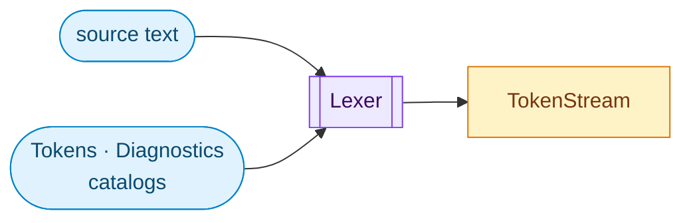
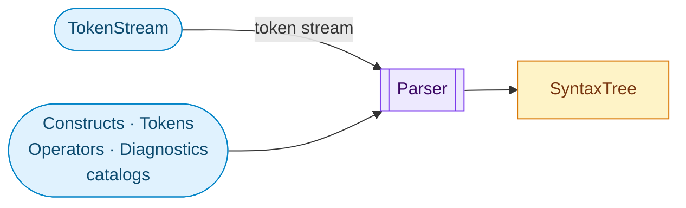
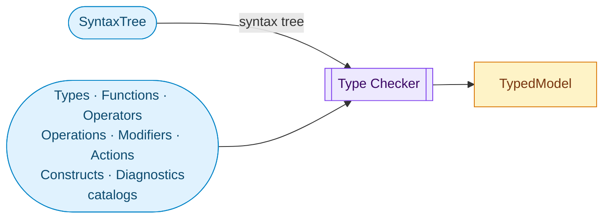
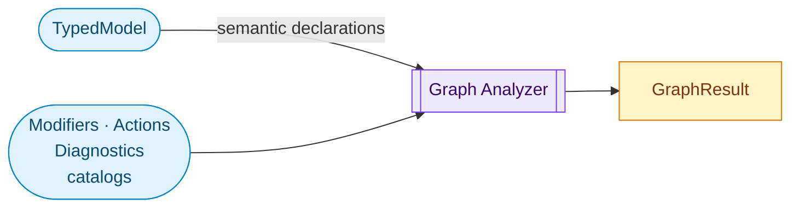
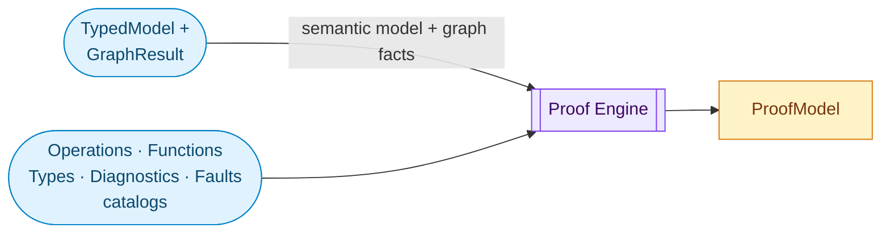
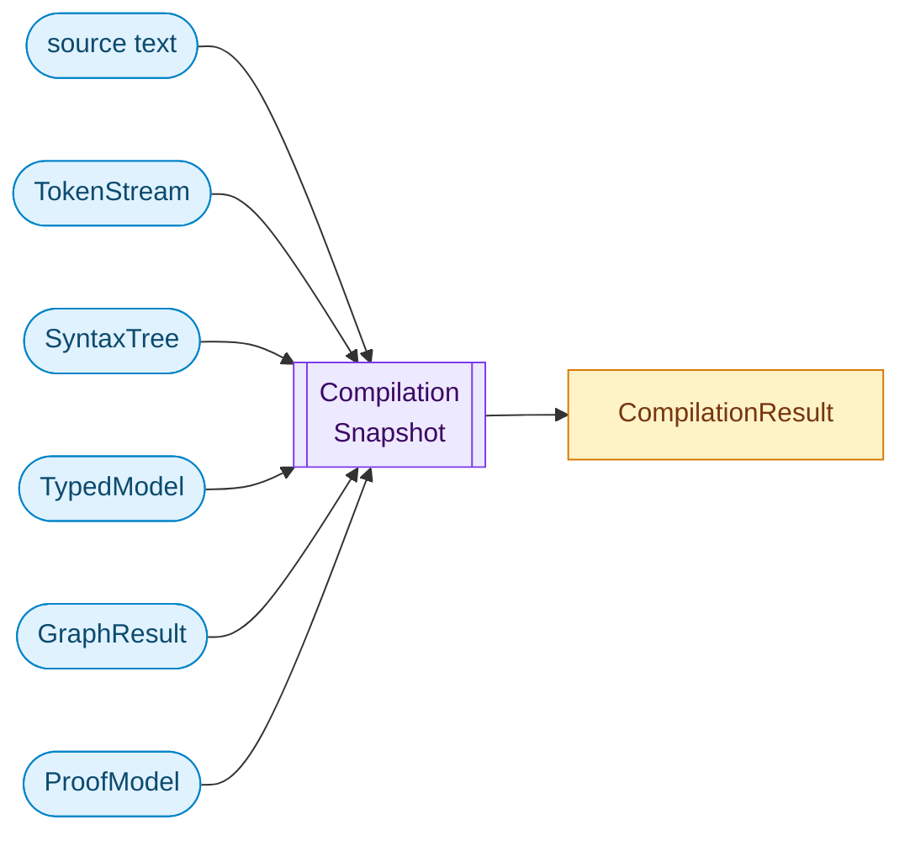
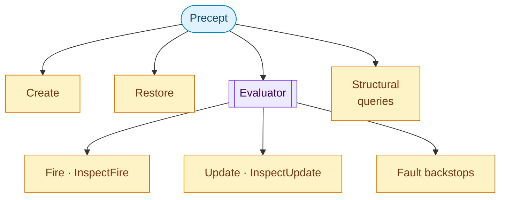

# Precept Compiler and Runtime Design

> **Status:** Approved working architecture
> **Audience:** compiler, runtime, language-server, MCP, and documentation authors

**How to read this document.** Sections 1–3 establish what Precept promises, its architectural approach (catalog-driven, purpose-built, unified pipeline), and the end-to-end pipeline overview — read these first for the design's spine. Sections 4–10 are per-stage contracts (Lexer through Lowering), each opening with how that stage serves the structural guarantee; read them in order for the compilation story, or jump to a specific stage when doing component work. Sections 11–14 cover the runtime surface, tooling integration (TextMate grammar generation, MCP, language server), and Appendix A tracks implementation status — these are the consumer-facing contracts that tie compilation output to real product surfaces.

## 1. What Precept promises

Precept is a domain integrity engine for .NET. A single declarative contract governs how a business entity's data evolves under business rules across its lifecycle, making invalid configurations structurally impossible. You declare fields, constraints, lifecycle states, and transitions in one `.precept` file. The runtime compiles that declaration into an immutable engine that enforces every rule on every operation. No invalid combination of lifecycle position and field data can persist.

This is not validation. Validation checks data at a moment in time, when called. Precept declares what the data is allowed to become and enforces that declaration structurally, on every operation, with no code path that bypasses the contract.

The guarantee is **prevention, not detection.** Invalid entity configurations cannot exist — they are structurally prevented before any change is committed. The engine is deterministic: same definition, same data, same outcome. At any point, you can preview every possible action and its outcome without executing anything. Nothing is hidden.

Everything in this document — every pipeline stage, every artifact, every runtime operation — exists to deliver that guarantee.

## 2. Architectural approach

### Catalog-driven design

Precept keeps its language purposely simple. Rather than embedding domain knowledge in pipeline stage implementations (as traditional compilers do), Precept externalizes the entire language definition as structured metadata in ten catalogs. Pipeline stages are generic machinery that reads this metadata.

This inverts the traditional compiler model. In Roslyn, GCC, or TypeScript, domain knowledge is scattered across pipeline stage implementations. Adding a language feature means touching dozens of files. In Precept, adding a language feature means adding an enum member and filling an exhaustive switch — the C# compiler refuses to build if any member lacks metadata, and propagation to every consumer (grammar, completions, hover, MCP, semantic tokens) is automatic.

The ten catalogs fall into two groups:

**Language definition** — what the language IS: `Tokens` (lexical vocabulary), `Types` (type system families), `Functions` (built-in function library), `Operators` (operator symbols with precedence/associativity/arity), `Operations` (typed operator combinations — which `(op, lhs, rhs)` triples are legal), `Modifiers` (declaration-attached modifiers as a discriminated union with five subtypes), `Actions` (state-machine action verbs), `Constructs` (grammar forms and declaration shapes).

**Failure modes** — how it reports problems: `Diagnostics` (compile-time rules), `Faults` (runtime failure modes).

Their union IS the language specification in machine-readable form. No consumer maintains a parallel copy. Every downstream artifact — the TextMate grammar, LS completions, LS hover, MCP vocabulary, semantic tokens, type-checker behavior — derives from catalog metadata.

The architectural principle: **if something is domain knowledge, it is metadata; if it is metadata, it has a declared shape; if shapes vary by kind, the shape is a discriminated union.** Pipeline stages, tooling, and consumers derive from the metadata — they never encode language knowledge in their own logic. See `docs/language/catalog-system.md` for the full catalog system design.

> **Precept Innovations**
> - **Catalog-as-spec inversion.** Traditional compilers scatter language knowledge across pipeline implementations. Precept externalizes the entire language specification as ten machine-readable catalogs — their union IS the spec, and every consumer derives from them. No other DSL tooling in this category has this property.
> - **Single-act feature propagation.** Adding a language feature is one enum member with an exhaustive metadata switch. The C# compiler refuses to build if metadata is missing, and propagation to grammar, completions, hover, MCP vocabulary, and semantic tokens is automatic.
> - **Grammar generation from catalogs.** The TextMate grammar, LS completions, and MCP vocabulary are generated artifacts, not hand-edited — they cannot drift from the language specification because they ARE the specification, projected to different surfaces.

### Purpose-built

Precept's pipeline is not a general-purpose compiler framework. It is designed for Precept's specific shape: a declarative DSL with fields, states, events, transitions, constraints, and guards. Every stage knows what it is building toward — an executable model that structurally prevents invalid configurations. The pipeline does not need to be extensible to other languages. It needs to be correct for this one.

### Unified pipeline

The system has compilation phases (lexing, parsing, type checking, graph analysis, proof) and runtime phases (lowering, evaluation, constraint enforcement, structured outcomes). These are sequential stages of one system. They share the same catalog metadata. They produce artifacts that flow forward. Compilation builds understanding; runtime acts on it.

Two top-level products emerge from this pipeline:

**`CompilationResult`** — the immutable analysis snapshot. Always produced, even from broken input. Authoring surfaces (language server, MCP compile) need the full picture — including syntax errors, unresolved references, and unproven safety obligations — to provide diagnostics, completions, and navigation.

**`Precept`** — the executable runtime model. Produced only from error-free compilations via `Precept.From(compilation)`. This is the sealed model that runtime operations execute against. It carries lowered descriptor tables, execution plans, and constraint indexes — not syntax trees or proof graphs.

The relationship is straightforward: analysis builds `CompilationResult`; lowering transforms it into `Precept`; runtime operations execute against `Precept`. Authoring tools read `CompilationResult`. Execution tools read `Precept`.

## 3. The pipeline

```mermaid
flowchart TD
    classDef input fill:#dbeafe,stroke:#60a5fa,color:#1e3a5f
    classDef stage fill:#ede9fe,stroke:#a78bfa,color:#3b1f7e
    classDef artifact fill:#fef3c7,stroke:#f59e0b,color:#78350f
    classDef runtime fill:#d1fae5,stroke:#34d399,color:#064e3b
    classDef leaf fill:#a7f3d0,stroke:#10b981,color:#064e3b

    src([Source text]):::input
    cat([Catalogs]):::input

    subgraph compile [Compile-time pipeline]
        direction LR
        L(Lexer):::stage --> P(Parser):::stage --> TC(TypeChecker):::stage --> GA(GraphAnalyzer):::stage --> PE(ProofEngine):::stage
    end

    src --> compile
    cat -. feeds all stages .-> compile

    compile --> CR[CompilationResult]:::artifact
    CR -- "only when !HasErrors" --> PF(Precept.From):::artifact

    subgraph runtime [Runtime operations]
        C(Create):::runtime
        R(Restore):::runtime
        E(Evaluator):::runtime
        SQ(Structural queries):::runtime
    end

    PF --> C
    PF --> R
    PF --> E
    PF --> SQ

    E --> FI([Fire / InspectFire]):::leaf
    E --> UI([Update / InspectUpdate]):::leaf
    E --> FB([Fault backstops]):::leaf
```



Every stage begins from two roots. The `.precept` source text is the author-owned program. The catalogs are the language specification. Catalogs enter as early as they are knowable — later stages carry catalog-stamped identity forward, never recreating it from hardcoded switches.

### Artifact inventory

| Artifact | Owner | Classification |
|---|---|---|
| `TokenStream` | Lexer | compile-time |
| `SyntaxTree` | Parser | compile-time |
| `TypedModel` | TypeChecker | compile-time |
| `GraphResult` | GraphAnalyzer | compile-time |
| `ProofModel` | ProofEngine | compile-time |
| `CompilationResult` | Compiler | compile-time aggregate |
| Descriptor tables, slot layout, dispatch indexes, constraint-plan indexes, fault-site backstops | `Precept.From` (lowering) | runtime |
| `Precept` | `Precept.From` | runtime executable model |
| `Version` | runtime operations | runtime entity snapshot |
| `EventOutcome`, `UpdateOutcome`, `RestoreOutcome` | Evaluator | runtime results |
| `ConstraintResult`, `ConstraintViolation` | Evaluator | runtime results |
| `Fault` | Evaluator | runtime backstop (impossible-path only) |

### What crosses the lowering boundary

`Precept.From()` lowers analysis knowledge into runtime-native shapes. Runtime types hold no references to compile-stage artifacts — but the knowledge those artifacts contain crosses in lowered form.

- **Transition dispatch index** — state × event → target state. This is graph topology, lowered into a routing table the evaluator and inspection surfaces consume directly.
- **State descriptor table** — all named states with metadata (display name, terminal flag, initial/required/irreversible modifiers, available events). Enables structural queries ("what states exist?", "what modifiers apply?").
- **Event availability index** — valid events per state. Enables "what can I do from here?" queries for MCP, AI agents, and UI consumers.
- **Reachability index** — states reachable from a given state. Enables structural navigation without re-running the compiler.
- **Pathfinding residue** — enough topology for shortest-path navigation from current state to a target. The graph analog of `ConstraintInfluenceMap` — causal reasoning over lifecycle structure.
- **`ConstraintDescriptor`** — expression text, source lines, scope targets, guard metadata, `ConstraintActivation` anchor.
- **`ConstraintInfluenceMap`** — constraint → contributing fields with expression-text excerpts. Enables "which field change would fix this?" without reverse-engineering.
- **Structured violation shapes** — `ConstraintViolation` carries failing constraint descriptor, evaluated field values, guard context, and failing sub-expression.
- **Fault-site backstops** — `FaultSite` descriptors linked to `FaultCode` and the compiler-owned prevention `DiagnosticCode`.

`SyntaxTree`, `TokenStream`, parser recovery, and the `ProofModel` graph structure don't cross — nothing at runtime needs them.

> **Precept Innovations**
> - **Unified pipeline.** Compilation and runtime are sequential stages of one system sharing the same catalog metadata — not two separate systems bolted together. There is no "compile step" followed by a "runtime step" from the user's perspective; the pipeline flows from source text to executable enforcement in one continuous transformation.
> - **CompilationResult as an always-available intelligence snapshot.** Even broken programs produce a full `CompilationResult` with partial analysis — language server and MCP tools always have something to work with. Traditional compilers stop at the first error boundary; Precept provides progressive intelligence across all stages.
> - **Lowering as selective transformation.** The boundary between analysis and execution is not a wall — it is a selective transformation that carries exactly the analysis knowledge the runtime needs in runtime-native shapes, while preventing runtime types from depending on compile-time artifacts.
> - **Graph topology as a first-class runtime artifact.** The `Precept` model carries a full lowered topology — transition dispatch index, state descriptor table, reachability index, pathfinding residue — not just an opaque executor. Runtime consumers (MCP, AI agents, UI) can ask "what states exist?", "what can I do from here?", "how do I reach state X?" These are structural guarantee questions, answerable without re-running the compiler. No other state machine library in this category exposes lifecycle topology as a queryable runtime surface.

## 4. Lexer

The lexer converts raw text into classified tokens with exact spans. It has no semantic opinion. The key design choice: `TokenKind` comes directly from catalog metadata (`Tokens.GetMeta`), not from a parallel enum maintained by the lexer. The lexer is a vocabulary consumer, not a vocabulary owner.



**Takes in:** `string source`; catalogs: `Tokens`, `Diagnostics`

**Produces:** `TokenStream`
- `ImmutableArray<Token>` — each token carries `TokenKind Kind`, `string Text`, and `SourceSpan Span`
- `ImmutableArray<Diagnostic>` — lex-phase diagnostics

**Catalog entry:** `TokenKind` comes directly from `Tokens.GetMeta(...)` / `Tokens.Keywords`. Token categories, TextMate scope, semantic token type, and completion hints remain derivable from `TokenMeta`.

**Consumed by:** Parser, `CompilationResult`, LS lexical tokenization and grammar tooling

**How it serves the guarantee:** The lexer ensures that every character of source text is accounted for and classified according to catalog-defined vocabulary. No ambiguity in token identity propagates downstream.

**Implementation status:** This is the one materially implemented compiler stage.

> **Precept Innovations**
> - **Catalog-driven token recognition.** `TokenKind` derives from catalog metadata, not a parallel enum. The lexer is a vocabulary consumer — adding a keyword to the `Tokens` catalog automatically makes it lexable, highlightable, and completable.
> - **No vocabulary ownership at the lexer level.** Traditional lexers own a hardcoded keyword table. Precept's lexer reads its vocabulary from the same metadata that drives every other consumer.

## 5. Parser

The parser builds the source-structural model of the authored program. Its key design choice: `SyntaxTree` preserves the author's source structure — including recovery shape for broken programs — without resolving names, types, or overloads. Tooling needs source-faithful structure (folding, outline, recovery context) independently of semantic resolution.



**Takes in:** `TokenStream`; catalogs: `Constructs`, `Tokens`, `Operators`, `Diagnostics`

**Produces:** `SyntaxTree`
- `PreceptSyntax Root` — source-faithful declaration and expression nodes with missing-node representation and span ownership
- `ImmutableArray<Diagnostic>` — parse-phase diagnostics
- (Current shape: diagnostics-only stub.)

**Catalog entry:** The parser stamps syntax-level identities as soon as syntax alone can know them: construct kind, anchor keyword, action keyword, operator token, literal segment form.

**Consumed by:** TypeChecker, LS syntax-facing features (outline, folding, recovery-aware local context)

**How it serves the guarantee:** Structural fidelity means the type checker and downstream stages work from a faithful representation of the author's intent, including malformed programs — authoring tools can diagnose problems precisely because the structure is preserved, not discarded on error.

**Implementation status:** `Parser.Parse` is a stub; the contract is designed but not implemented.

### Parser/TypeChecker contract boundary

The parser guarantees to the type checker:

- Every declaration is structurally well-formed — required slots are filled, or represented as `MissingNode` (never silently absent). The type checker does not re-validate structural completeness.
- All identifiers in keyword positions have been resolved to catalog-defined keywords. The type checker does not re-resolve keyword identity.
- `ConstructKind`, `ActionKind`, `OperatorKind`, `TypeKind` (on `TypeRef`), and `ModifierKind` are stamped on every applicable node. The type checker can assume these are present and correct.

What the parser does NOT guarantee: name resolution, type compatibility, overload selection, or semantic legality. The type checker owns all semantic resolution.

### Error recovery

Error recovery is construct-level, not token-level. When the parser encounters a malformed construct, it emits a diagnostic and skips to the next newline-anchored declaration keyword (`field`, `state`, `event`, `rule`, `from`, `in`, `to`, `on`). This is panic-mode recovery with synchronization at declaration boundaries.

Malformed input is represented as `MissingNode` for required slots that could not be parsed and `SkippedTokens` trivia attached to the nearest valid node for tokens that could not be incorporated into any construct. A `MissingNode` carries the expected `ConstructSlot` identity and the span where the parser expected content. The tree always accounts for every character of source text — no input is silently discarded.

### Node inventory

The parser produces one syntax node type per `ConstructKind`, with child nodes corresponding to `ConstructSlot` entries from the `Constructs` catalog. The root is `PreceptSyntax`, containing declaration nodes:

- `FieldDeclarationSyntax` — field name, type reference, modifiers, default/computed expression
- `StateBlockSyntax` — state name, modifiers, nested state-scoped declarations
- `EventDeclarationSyntax` — event name, modifiers, arg declarations
- `TransitionRowSyntax` — anchor (`from`/`to`/`in`/`on`), state/event references, guard, action chain
- `RuleDeclarationSyntax` — guard (optional), ensure expression, because clause
- `EnsureDeclarationSyntax` — state/event-scoped constraint with because clause
- `AccessDeclarationSyntax` — edit/readonly declarations per field per state

Expression nodes: `BinaryExpressionSyntax`, `UnaryExpressionSyntax`, `LiteralExpressionSyntax`, `FieldReferenceSyntax`, `EventArgReferenceSyntax`, `FunctionCallSyntax`, `IfThenElseSyntax`, `MemberAccessSyntax`, `IsSetExpressionSyntax`, `ContainsExpressionSyntax`.

### Catalog-to-grammar mapping

Catalog metadata factors into parsing decisions at specific points. The parser uses `Constructs.GetMeta()` to determine legal declaration forms — each `ConstructKind` defines the expected slot sequence, and the parser validates that slots appear in the declared order with declared optionality. The parser uses `Operators.GetMeta()` for expression parsing — operator precedence and associativity come from catalog metadata, not a hardcoded table. Keyword recognition is inherited from the lexer's catalog-driven `TokenKind` assignments; the parser dispatches on `TokenKind`, not on string comparison.

### Anti-Roslyn guidance

Precept's grammar is **not** a general-purpose programming language grammar. Implementers must not default to conventional compiler patterns:

- **No red/green tree architecture.** Precept's grammar is flat and line-oriented — there is no deep nesting, no brace-delimited scopes, no expression statements. Red/green trees solve a problem Precept does not have.
- **Error recovery is skip-to-next-declaration-keyword.** Not token-level insertion/deletion with cost models. The 64KB source ceiling and line-oriented grammar make construct-level panic recovery both sufficient and correct.
- **Expressions only appear in specific slots** — guards, action RHS, ensure clauses, computed fields, if/then/else, and because clauses. The parser does not need a general-purpose expression parser for the full language.
- **Operator precedence comes from `Operators.GetMeta()`.** Not a hardcoded precedence table. The correct pattern is precedence-climbing, not Pratt parsing or ANTLR grammar generation.
- **The grammar is LL(1) with single-token lookahead** in most positions, given the keyword-anchored, line-oriented design.

### `ActionKind` dual-use note

`set` appears as both an action keyword (`TokenCategory.Action` — e.g., `set Amount to 100`) and a type keyword (`TokenCategory.Type` — e.g., `field Tags as set of string`). The parser disambiguates by position context: after `->` or in action position = action; after `as`/`of` or in type position = type. This disambiguation is a parser responsibility, not a catalog lookup — the catalog correctly classifies `set` under both categories.

**Implementation status:** `Parser.Parse` is a stub; the contract is designed but not implemented.

> **Precept Innovations**
> - **Flat, declaration-oriented grammar.** No nesting beyond expression-within-declaration. This makes the grammar trivially parseable, the error recovery model simple and predictable, and the SyntaxTree shape directly useful for tooling without the complexity budget of a general-purpose language parser.
> - **Precedence from catalog metadata.** Operator precedence and associativity are not hardcoded — they derive from `Operators.GetMeta()`. Changing precedence is a catalog edit, not a parser rewrite.
> - **One node type per `ConstructKind`.** The node inventory is catalog-derived — each construct in the `Constructs` catalog maps to exactly one syntax node with slots matching `ConstructSlot` entries. The parser shape IS the grammar shape.

### `SyntaxTree` vs `TypedModel`

These are distinct artifacts with distinct jobs.

`SyntaxTree` owns what the author wrote — source-faithful, recovery-aware, with exact token adjacency and spans on malformed input. Its consumers are parser diagnostics, folding, and source tools.

`TypedModel` owns what the program means — semantic, normalized, with resolved names/types/overloads and operation identity. Its consumers are LS intelligence, graph analysis, proof, and lowering.

Example: for `Approve.Amount <= RequestedAmount`, the syntax tree holds a member-access node over exact tokens and spans. The typed model holds a resolved event-arg symbol, a resolved field symbol, a resolved `OperationKind`, and a result type of `boolean`.

The typed layer must feel like a semantic database, not an AST with annotations.

**Required `TypedModel` inventory:**

- **Declaration symbols** — stable semantic identities for fields, states, events, args, and constraint-bearing declarations, each with declaration-origin handles for diagnostics and navigation.
- **Reference bindings** — every semantic identifier/expression site binds directly to a symbol, overload, accessor, operator, or action identity.
- **Normalized declarations** — rules, `in`/`to`/`from`/`on` ensures, transition rows, access declarations, state hooks, and stateless hooks live in semantic inventories shaped for analysis and lowering, not parser nesting.
- **Typed expressions** — expression nodes carry resolved result type plus resolved operation/function/accessor identity and semantic subjects.
- **Typed actions** — semantic action families resolve to one of three named shapes (see Type Checker below) with catalog-defined operand and binding contracts.
- **Dependency facts** — computed-field dependencies, arg dependencies, referenced-field sets, and semantic edge data required by graph/proof/lowering.
- **Source-origin handles** — semantic sites keep stable links back to authored source spans/lines for diagnostics, hover, and go-to-definition without inheriting token adjacency.

**Anti-mirroring rules:** (1) `TypedModel` must not preserve parser child layout, missing-node shape, or recovery nullability as its primary contract. (2) Hover, go-to-definition, semantic tokens, and semantic completions must be satisfiable from `TypedModel` bindings plus source-origin handles — if they need to walk parser structure, the typed boundary is underspecified. (3) Graph, proof, and lowering consume normalized semantic inventories, not syntax nodes. (4) `SyntaxTree` remains the sole owner of recovery, token grouping, exact authored ordering, and malformed-construct shape.

## 6. Type Checker

The type checker is the first stage that reasons about semantics. Its key design choice: type resolution is a separate pass from parsing — `TypedModel` is a projection of `SyntaxTree`, not an in-place annotation — because tooling and downstream stages need to reason about source structure and semantic meaning independently.



**Takes in:** `SyntaxTree`; catalogs: `Types`, `Functions`, `Operators`, `Operations`, `Modifiers`, `Actions`, `Constructs`, `Diagnostics`

**Produces:** Semantic model artifacts (current shape: diagnostics-only stub)
- Semantic symbol tables and binding indexes
- Normalized declaration inventories
- Typed expressions and actions
- Dependency facts and source-origin handles
- Diagnostics

**Catalog entry:** This is the first stage that resolves `TypeKind`, `FunctionKind`, `OperatorKind`, `OperationKind`, `ModifierMeta`, `ActionMeta`, `FunctionOverload`, `TypeAccessor`, and attached `ProofRequirement` records into semantic identity.

**Consumed by:** GraphAnalyzer, ProofEngine, LS semantic tooling, MCP compile output, lowering

**How it serves the guarantee:** The type checker catches semantic defects — type mismatches, illegal operations, invalid modifier combinations, unresolved references — before the program reaches graph analysis or runtime. Every expression and declaration that passes type checking has a resolved, catalog-backed semantic identity. This is where the structural guarantee begins to take shape: if it type-checks, its operations are legal.

**Implementation status:** `TypeChecker.Check` is stubbed; the semantic model contract is ahead of implementation.

### Anti-pattern: per-construct check methods

The type checker should NOT have a `CheckFieldDeclaration()`, `CheckTransitionRow()`, `CheckRuleDeclaration()` method per construct kind. The correct model is generic resolution passes that read construct metadata from catalogs — catalog-resolvable checks are generic passes, and only construct-specific structural validation that genuinely differs by kind (field declarations vs. transition rows have different type-checking needs) warrants per-kind methods. The type checker builds semantic symbol tables and binding indexes — a symbol-table-driven approach — not a parallel tree that mirrors `SyntaxTree` with type annotations added.

### Typed action family — three shapes only

Actions in the typed model resolve to exactly one of three semantic shapes:

- **`TypedAction`** (base) — verbs like `clear`, `reset`. No operand; value ownership is internal.
- **`TypedInputAction`** (operand-bearing) — verbs like `set`, `add`, `remove`, `enqueue`, `push`. Carries `InputExpression: TypedExpression`.
- **`TypedBindingAction`** (binding) — verbs like `dequeue`, `pop`. Carries `Binding: TypedBinding`.

The partition reflects verb-surface ownership. A flat shape with optional fields would require nullable fields on the majority of members.

Field naming discipline:

| Correct | Do not use |
|---|---|
| `InputExpression` | `Value`, `Input` |
| `Binding` | `IntoTarget` |
| `ConstraintActivation` | `EnsureBucketType` |
| `FaultSite` | `RuntimeCheckLocation` |

Lowering produces the matching executable family: `ExecutableAction`, `ExecutableInputAction`, `ExecutableBindingAction`. Same naming discipline.

### Earliest-knowable kind assignment

| Stage | Kinds assigned |
|---|---|
| Parser | `ConstructKind`, `ActionKind`, `OperatorKind`, `TypeKind` on `TypeRef` nodes, `ModifierKind` |
| Type checker | `OperationKind`, `FunctionKind`, resolved `TypeAccessor`, resolved result `TypeKind` on typed expressions |

The parser stamps everything that syntax alone can determine. The type checker stamps everything that requires name, type, or overload resolution. A kind that requires name resolution does not appear in `SyntaxTree`; a kind that syntax alone determines does not wait for the type checker.

> **Precept Innovations**
> - **Catalog-driven resolution passes.** Type checking resolves against catalog metadata (`Operations`, `Functions`, `Types`, `Modifiers`, `Actions`) rather than encoding per-construct behavior in checker logic. Adding a new operation or function to the catalog automatically makes it resolvable — no checker code changes required.
> - **Semantic projection, not annotated syntax.** The `TypedModel` is a semantic database of symbols, bindings, and normalized declarations — not an AST with types bolted on. This makes downstream consumers (graph analysis, proof, lowering) independent of source structure.
> - **Three-shape typed action family.** Actions resolve to exactly one of three semantic shapes (`TypedAction`, `TypedInputAction`, `TypedBindingAction`), enforced by the DU pattern. A flat shape with optional nullable fields is prohibited — the type system prevents invalid action representations.

## 7. Graph Analyzer

The graph analyzer derives lifecycle structure from semantic declarations. Its key design choice: graph analysis consumes the resolved `TypedModel` — not syntax — because reachability, dominance, and topology require resolved state/event/transition identity, not source-structural nesting.



**Takes in:** `TypedModel`; catalogs: `Modifiers`, `Actions`, `Diagnostics`

**Produces:** Graph facts keyed by semantic identities, plus diagnostics (current shape: diagnostics-only stub)

**Catalog entry:** State semantics (`initial`, `terminal`, `required`, `irreversible`, `success`, `warning`, `error`) come from modifier metadata already resolved by the type checker; the analyzer must not reinterpret raw syntax.

**Consumed by:** ProofEngine, `Precept.From`, LS structural diagnostics, runtime structural precomputation

**How it serves the guarantee:** The graph analyzer detects lifecycle defects — unreachable states, terminal states with outgoing edges, required-state dominance violations, irreversible back-edges — that would make the state machine unsound. These are structural problems in the contract itself, caught before any instance exists.

**Proposed `GraphResult` facts:**

- **Reachability** — initial state, reachable states, unreachable states.
- **Topology** — edges, predecessors, successors, event coverage per state.
- **Structural validity** — terminal outgoing-edge violations, required-state dominance, irreversible back-edge violations.
- **Runtime indexes** — available events by state, state-scoped routing buckets, target-state facts lowering can reuse.

**Implementation status:** `GraphAnalyzer.Analyze` is stubbed.

> **Precept Innovations**
> - **Reachability as a first-class design artifact.** Graph analysis produces reachable/unreachable state sets, structural validity facts, and runtime indexes — not just a pass/fail check. These facts flow into proof obligations and runtime precomputation.
> - **Lifecycle soundness as a compile-time guarantee.** Unreachable states, terminal outgoing-edge violations, required-state dominance violations, and irreversible back-edges are all caught before any instance exists. No state machine library in this category provides this level of static lifecycle verification.
> - **Structural cycle and dominance detection.** The graph analyzer reasons about structural properties (dominance, predecessor/successor relationships, event coverage per state) that would otherwise require runtime observation to discover.

## 8. Proof Engine

The proof engine is the last analysis stage before lowering — and the compile-time half of the structural guarantee. It discharges statically preventable runtime hazards: if it can prove an operation is safe at compile time, no runtime check is needed; if it cannot, the compiler emits a diagnostic and the author must fix the source before an executable model is produced. Its key design choice: proof is bounded — four strategies only, no general SMT solver — and proof stops at analysis. The runtime receives only lowered fault-site residue for defense-in-depth, not the proof graph itself.



**Takes in:** `TypedModel`, `GraphResult`; catalogs: `Operations`, `Functions`, `Types`, `Diagnostics`, `Faults`

**Produces:** Proof model artifacts (current shape: diagnostics-only stub)
- Obligations and evidence
- Dispositions and preventable-fault links
- Diagnostics and semantic site attribution

**Catalog entry:** Proof obligations originate in metadata: `BinaryOperationMeta.ProofRequirements`, `FunctionOverload.ProofRequirements`, `TypeAccessor.ProofRequirements`, and action metadata. `FaultCode` ↔ `DiagnosticCode` linkage remains catalog-owned as a prevention/backstop relationship.

**Consumed by:** `CompilationResult`, LS/MCP proof reporting, lowering of fault residue into runtime backstops

### Proof strategy set

The proof engine operates over a bounded, non-extensible strategy set:

- **Literal proof** — the value is a known compile-time literal; outcome is directly knowable.
- **Modifier proof** — the value flows through a catalog-defined modifier chain whose output bounds are statically determined.
- **Guard-in-path proof** — a guard expression in the control flow statically establishes a sufficient range or type constraint.
- **Straightforward flow narrowing** — if a guard clause in the same transition row establishes a constraint on a field, that constraint is available as evidence for proof obligations on expressions within that row's action chain. This is type-state narrowing through the immediately enclosing control path, not general dataflow analysis.

Any obligation outside this set is unresolvable by the compiler and emits a `Diagnostic`. New strategies are language changes, not tooling extensions. Each strategy is a simple predicate function, not a solver — literal proof checks a compile-time constant, modifier proof checks a modifier chain, guard-in-path proof checks enclosing guard subsumption, flow narrowing checks immediate control-path type state.

**Proof coverage boundary:** The four strategies must be validated against the sample corpus (20 files in `samples/`). If cross-field comparison obligations (e.g., `ApprovedAmount <= RequestedAmount`) cannot be discharged by any of the four strategies, a fifth strategy (e.g., relational pair narrowing) is needed before v1. This is the highest-risk unknown in the proof engine — the value proposition depends on coverage being sufficient for real-world programs.

### Initial-state satisfiability

If default field values and initial-state constraints are both statically known, the proof engine verifies satisfiability at compile time and emits a diagnostic if no valid initial configuration exists. An author who writes `field X as number default 0` and `in Draft ensure X > 5` gets a compile-time error, not a runtime `EventConstraintsFailed` on create. This is threaded through the proof/fault chain: `ProofRequirement` (initial-state satisfiability) → `ProofObligation` (specific field/constraint pair) → `DiagnosticCode` (unsatisfiable initial configuration). This check applies to `Create` without initial event; `Create` with initial event evaluates satisfiability through the normal fire-path proof chain.

### Proof/fault chain

The end-to-end prevention/backstop chain:

```
catalog metadata → ProofRequirement → ProofObligation → DiagnosticCode → FaultCode → FaultSiteDescriptor
```

- **Catalog metadata → `ProofRequirement`** — catalog entries declare what must be provable at each call site.
- **`ProofRequirement` → `ProofObligation`** — the proof engine instantiates the requirement against a specific semantic site.
- **`ProofObligation` → `DiagnosticCode`** — an unresolved obligation becomes an authoring-time diagnostic.
- **`DiagnosticCode` → `FaultCode`** — each diagnostic has a prevention counterpart: the fault that would occur if this site somehow reached runtime.
- **`FaultCode` → `FaultSiteDescriptor`** — if the site survives to runtime (defense-in-depth only), lowering plants a backstop.

`FaultSiteDescriptor` is the runtime face of an impossible path that a correct program never reaches.

**Implementation status:** `ProofEngine.Prove` is stubbed; only the catalog-side proof vocabulary exists today.

> **Precept Innovations**
> - **Compile-time satisfiability checking.** The proof engine guarantees that initial-state configurations are satisfiable at compile time — no validator, state machine library, or rules engine in this category provides this. It is the proof engine's signature contribution.
> - **`ConstraintInfluenceMap`.** Lowering can produce a precomputed map from constraints to contributing fields (with expression-text excerpts). This makes AI inspection structurally superior — an agent can answer "which field change would satisfy this constraint?" without reverse-engineering expressions. This is a structural differentiator for the MCP surface.
> - **Structured "why not" explanations.** Constraint violations carry structured explanation depth — the failing expression, evaluated field values, guard context, and failing sub-expression — not just a boolean status. This transforms MCP tools from status reporters to causal reasoning engines.
> - **Bounded, non-extensible strategy set.** Four strategies only, each a simple predicate function — not a general solver framework. This makes the proof engine predictable, auditable, and implementable without external dependencies.

## 9. Compilation Snapshot

`CompilationResult` is an aggregation boundary, not a reasoning stage — but it is the artifact that makes the guarantee inspectable. It captures the complete analysis pipeline as one immutable snapshot so consumers can access any stage's output without re-running the pipeline. Even broken programs produce a `CompilationResult` with partial analysis.



**Takes in:** Raw source + the five pipeline stages

**Produces:** `CompilationResult`
- `TokenStream Tokens`
- `SyntaxTree SyntaxTree`
- `TypedModel Model`
- `GraphResult Graph`
- `ProofModel Proof`
- `ImmutableArray<Diagnostic> Diagnostics`
- `bool HasErrors`

**Consumed by:** LS, MCP `precept_compile`, `Precept.From`

### Incremental compilation model

Given the 64KB ceiling on `.precept` definition size, **re-run everything on change** is the intended compilation model. A keystroke re-lexes, re-parses, re-typechecks, re-analyzes, and re-proves the entire file. There is no incremental invalidation boundary. The size ceiling is the performance argument: at 64KB, full recompilation is fast enough for keystroke-level responsiveness without the complexity of incremental pipelines.

### Contract digest hash

`CompilationResult` should emit a deterministic hash of the compiled definition's semantic content — fields, types, constraints, states, transitions — excluding whitespace and comments. This **contract digest** lets host applications detect definition changes without diffing source text, and grounds the definition versioning story (see below). Paired with a structural diff API (`ContractDiff(old, new)` → added/removed/changed fields, states, constraints), it provides a production deployment safety net.

### Definition versioning

When a `.precept` file changes (field added, state renamed, constraint tightened), persisted `Version` instances compiled against the old definition may fail `Restore` under the new definition's constraints. **This is a known gap — definition migration is out of scope for v1.** The contract digest hash provides change detection; a structural diff API provides change enumeration; but automated migration is deferred. Host applications that need to handle definition evolution must manage the migration externally. The gap is acknowledged so downstream design does not assume migration exists.

**Implementation status:** The wiring exists and merges diagnostics correctly, but four of the five stages are still hollow.

> **Precept Innovations**
> - **Contract digest hash.** A deterministic semantic hash enables definition-change detection without source diffing — no other DSL runtime provides this. It grounds deployment safety and the future migration story.
> - **Always-available analysis snapshot.** `CompilationResult` is produced even from broken input — authoring surfaces always have diagnostics, partial structure, and whatever analysis succeeded. This is not error tolerance; it is progressive intelligence.
> - **Full-pipeline re-run as the correct model.** The 64KB ceiling makes incremental compilation unnecessary, eliminating an entire class of invalidation bugs that plague larger language tooling.

## 10. Lowering

Lowering is the transformation from analysis to execution — and the stage that makes the structural guarantee executable. The evaluator becomes a plan executor that does not reason about semantics at runtime because lowering has already resolved all semantic questions into executable plans. `Precept.From(CompilationResult)` is the sole owner of this transformation — no other code path builds the runtime model. It selectively transforms analysis knowledge into runtime-native shapes rather than copying or referencing compile-time artifacts.


**Takes in:** Error-free `CompilationResult`; semantic inputs from `TypedModel`, `GraphResult`, and proof residue from `ProofModel`. Lowering reads catalog metadata transitively through already-resolved model identities (e.g., for default-value computation, constraint text extraction, fault-site descriptor construction), but does not perform fresh catalog lookups for classification purposes.

**Produces:** `Precept` as a sealed executable model
- Descriptor tables and slot layout
- Dispatch indexes
- Lowered execution plans
- Explicit constraint-plan indexes
- Reachability and topology indexes
- Inspection metadata
- Fault-site backstops

**Catalog entry:** Catalog metadata reaches runtime only in lowered semantic form: descriptor identity, resolved operation/function/action identity, constraint descriptors, and proof-owned fault-site residue.

**Consumed by:** `Precept.Create`, `Precept.Restore`, `Version` operations, MCP runtime tools, host applications

### Lowered executable-model contract

| Runtime concern | Lowered structure | Consumed by |
|---|---|---|
| identity | descriptor tables: `FieldDescriptor`, `StateDescriptor`, `EventDescriptor`, `ArgDescriptor`, `ConstraintDescriptor` | every runtime API surface |
| storage | slot layout, field-to-slot map, default-value plan, omission metadata | create, restore, fire, update |
| routing | per-state and stateless event-row dispatch indexes, target-state routing metadata | fire and inspect fire |
| topology | reachability index (state → reachable states), pathfinding residue (goal-directed navigation) | structural queries, MCP, AI navigation, inspect |
| execution | lowered flat evaluation plans: slot-addressed opcodes with field-slot references, literal constants, operation codes, and result slots — keyed to descriptors and resolved semantic identities | evaluator |
| recomputation | dependency graph and evaluation order for computed fields | fire, update, restore, inspect |
| access | per-state field access-mode index and query surface | update and inspect update |
| constraints | explicit executable plan indexes for `always`, `in`, `to`, `from`, and `on` anchors | create, restore, fire, update, inspect |
| inspection | row/source/result-shaping metadata for `EventInspection`, `RowInspection`, `UpdateInspection`, `ConstraintResult`, `FieldSnapshot` | inspection surfaces |
| fault backstops | `FaultSite`/fault-site descriptors linked to `FaultCode` and prevention `DiagnosticCode` | impossible-path defense only |

### Descriptor type shapes

The descriptor types referenced throughout this document are first-class sealed types, not string aliases:

- **`FieldDescriptor`** — field name, `TypeKind`, slot index, modifiers (optional, required, computed, readonly, etc.), default-value expression, source origin.
- **`StateDescriptor`** — state name, modifier set (initial, terminal, required, irreversible, success, warning, error), source origin.
- **`EventDescriptor`** — event name, modifier set (initial, forbidden, etc.), arg descriptors, source origin.
- **`ArgDescriptor`** — arg name, `TypeKind`, optionality, default expression, source origin.
- **`ConstraintDescriptor`** — constraint kind (rule/ensure), anchor family, expression text, because text, guard context, source lines, scope targets, `ConstraintActivation`.

These are the runtime face of declarations. Every runtime API surface routes through descriptor identity.

### Expression evaluation model

The executable model is a **flat evaluation plan** — precomputed slot references, operation opcodes, literal constants, and result slots — not a recursive tree interpreter. Think of it as register-based bytecode where "registers" are field slots. This makes evaluation predictable-time, cache-friendly, and trivially serializable for inspection. Tree-walk interpretation is explicitly rejected: it would be correct but would sacrifice the performance, inspectability, and determinism properties that make Precept's runtime distinctive.

### Anti-pattern: serialized TypedModel

The runtime model is organized for execution, not for semantic analysis. Constraint plans are grouped by activation anchor, not by source declaration order. Action plans are grouped by transition row, not by field. The runtime model is a dispatch-optimized index, not a renamed analysis model. An implementer must NOT map `TypedModel` types 1:1 to runtime types — lowering is a selective, restructuring transformation.

### Constraint activation indexes

The five constraint-plan families (`always`, `in`, `to`, `from`, `on`) are accessed through four precomputed activation indexes, built once during lowering and keyed to descriptor identity:

- **Always index** (global) — rules and ensures with no state or event anchor; active on every operation.
- **State activation index** (`StateDescriptor`, `ConstraintActivation`) — `InState`, `FromState`, and `ToState` anchors.
- **Event activation index** (`EventDescriptor`) — `on Event ensure` anchors.
- **Event availability index** (`StateDescriptor?`, `EventDescriptor`) — available-event scope; null state key for stateless precepts.

The `ConstraintActivation` discriminant distinguishes whether a constraint binds to the current state, the source state, or the target state of a transition. Callers look up a prebuilt bucket, not compute activation at dispatch time. **`ConstraintActivation` should be cataloged** — it is language-surface knowledge that consumers (type checker, lowering, evaluator, MCP, LS) need as structured metadata, not an internal implementation enum.

### `Version` serialization contract

Host applications must persist and hand back to `Restore` the following: the current state name (or stateless marker), and field values keyed by field name. The serialization shape is `(string StateName, IDictionary<string, object?> FieldValues)` — or equivalently, `(StateDescriptor?, SlotArray)` at the descriptor level. Hosts own the serialization format (JSON, binary, database columns); Precept owns the contract for what data is required. `Restore` validates the supplied data against the current definition's constraints — it does not trust the persisted shape.

### Current surface

The stable runtime contract is descriptor-backed. Current public stubs still expose string placeholders and string-selected entry points. Those strings are provisional implementation placeholders, not the architectural end state.

**Implementation status:** `Precept.From` currently checks `HasErrors` and then throws `NotImplementedException`.

> **Precept Innovations**
> - **Flat evaluation plans with slot-addressed opcodes.** Expressions are not tree-walked — they are precomputed into flat, cache-friendly execution plans with field-slot references and operation codes. This makes evaluation predictable-time and trivially inspectable. No other DSL runtime in this category commits to flat evaluation.
> - **Dispatch-optimized constraint indexes.** Constraints are grouped by activation anchor into precomputed buckets — the evaluator never scans or filters at dispatch time. Five anchor families, four activation indexes, built once during lowering.
> - **`ConstraintInfluenceMap` as a lowered artifact.** The dependency from constraints to contributing fields, with expression-text excerpts, becomes a first-class runtime artifact — enabling AI agents to reason causally about constraint satisfaction.

## 11. Runtime surface and operations

Once a valid `Precept` exists, four operations govern entity lifecycle. The evaluator is a shared plan executor — it consumes only lowered artifacts and executes prebuilt plans. Execution semantics are fully determined at lowering time.



### Evaluator

**Takes in:** `Precept`, `Version`, descriptor-keyed arguments or patches, lowered execution plans, explicit constraint-plan indexes, fault-site backstops

**Produces:** Runtime outcomes and inspections
- `EventOutcome`, `UpdateOutcome`, `RestoreOutcome` — commit-path results
- `EventInspection`, `UpdateInspection`, `RowInspection` — inspect-path results
- Impossible-path breaches classify as `Fault`

Valid executable models do not produce in-domain runtime errors. Expected runtime behavior is expressed as structured outcomes and inspections. `Fault` is reserved for defense-in-depth classification of impossible-path engine invariant breaches.

**Implementation status:** `Evaluator` exists, but every operation body is a stub. `Fail(FaultCode, ...)` already routes through `Faults.Create(...)`.

### Constraint evaluation matrix

Every operation evaluates constraints through the same lowered plan indexes. Access-mode checks and row dispatch are independent of constraint evaluation.

| Operation | Access-mode checks | Row dispatch | Constraint plans evaluated |
|---|---|---|---|
| `Fire` | no | yes | `always`, `from <current>`, `on <event>`, `to <target>` |
| `InspectFire` | no | yes | same as `Fire` |
| `Update` | yes | no | `always`, `in <current>` |
| `InspectUpdate` | yes | no | same as `Update`, plus event-prospect evaluation over hypothetical state |
| `Create` with initial event | no | yes (initial event) | `always`, plus initial-event fire-path plans |
| `Create` without initial event | no | no | `always`, `in <initial>` |
| `Restore` | no | no | `always`, `in <current>` |

Two rules: (1) `Restore` bypasses access-mode checks and row dispatch but does **not** bypass constraint evaluation. (2) `to` ensures are transitional — they do not participate in `in`-anchor evaluation.

Inspection and commit paths execute the same lowered plans. Disposition alone differs — report vs. enforce.

### Create

Create constructs the first valid `Version`, optionally by atomically firing the declared initial event. Creation with an initial event reuses the full fire-path execution — not a separate code path — so initial-event constraints, actions, and transitions apply identically.

**Takes in:** `Precept`; lowered defaults, `InitialState`, `InitialEvent`, arg descriptors, fire-path runtime plans

**Produces:** `EventOutcome` (commit) or `EventInspection` (inspect). Success yields `Applied(Version)` or `Transitioned(Version)`.

### Restore

Restore reconstitutes persisted data under the current definition. It validates rather than trusts — it runs constraint evaluation but intentionally bypasses access-mode restrictions, because persisted data represents a prior valid state, not an active field edit. **Restore recomputes computed fields BEFORE constraint evaluation, not after** — persisted data may include stale computed-field values, and constraints must evaluate against recomputed results.

**Takes in:** `Precept`; caller-supplied persisted state and fields; lowered descriptors, slot validation, recomputation, restore constraint plans

**Produces:** `RestoreOutcome` — `Restored(Version)`, `RestoreConstraintsFailed(IReadOnlyList<ConstraintViolation>)`, or `RestoreInvalidInput(string Reason)`

### Fire

Fire is the core state-machine operation. Routing, action execution, transition, recomputation, and constraint evaluation are a single atomic pipeline — not composable steps callers assemble — because partial execution would violate the determinism guarantee.

**Takes in:** `Version`; event descriptors, arg descriptors, row dispatch tables, lowered action plans, recomputation index, anchor-plan indexes, fault sites

**Produces:** `EventOutcome` — `Transitioned`, `Applied`, `Rejected`, `InvalidArgs`, `EventConstraintsFailed`, `Unmatched`, current provisional `UndefinedEvent`. `EventInspection` / `RowInspection` for inspect.

Constraint identity survives into `ConstraintResult` and `ConstraintViolation` through `ConstraintDescriptor`. Routing uses descriptor-backed row identity.

### Update

Update governs direct field edits under access-mode declarations and constraint evaluation. `InspectUpdate` additionally evaluates the event landscape over the hypothetical post-patch state.

**Takes in:** `Version`; field descriptors, per-state access facts, recomputation dependencies, `always`/`in` constraint plans, event-prospect evaluation

**Produces:** `UpdateOutcome` — `FieldWriteCommitted`, `UpdateConstraintsFailed`, `AccessDenied`, `InvalidInput`. `UpdateInspection` for inspect.

### Structured outcomes

The structural guarantee means that a valid executable model communicates entirely through structured outcomes. There are three result families, and collapsing them would undermine the guarantee:

**Diagnostics** — produced by the compiler pipeline. Authoring-time findings against source. Error diagnostics block `Precept` construction.

**Runtime outcomes** — produced by runtime operations. Expected success, domain rejection, or boundary-validation results. These are normal, in-domain behavior:
- Business outcomes: `Rejected`, `EventConstraintsFailed`, `UpdateConstraintsFailed`, `RestoreConstraintsFailed`
- Routing/availability: `Unmatched`, current provisional `UndefinedEvent`
- Boundary validation: `InvalidArgs`, `InvalidInput`, `RestoreInvalidInput`, `AccessDenied`

**Faults** — produced only by the evaluator backstop. Impossible-path engine invariant breaches. Every `FaultCode` has a compiler-owned diagnostic counterpart (the prevention rule that should have blocked the site). But many diagnostics have no fault counterpart, and many runtime outcomes are intentionally modeled as normal results, not faults.

| Category | Compile-time surface | Runtime surface |
|---|---|---|
| Authoring defect | `Diagnostic` only | no runtime surface; `Precept` not constructed |
| Unresolved proof obligation | `Diagnostic` only | no runtime surface; `Precept` not constructed |
| Business prohibition or rule failure | may have no compile-time issue | structured domain outcome |
| Routing/availability result | may have no compile-time issue | structured boundary outcome |
| Caller input/data mismatch | descriptor/type contracts exist | structured boundary-validation outcome |
| Impossible-path invariant breach | compiler-owned prevention rule | `Fault` (defense-in-depth; should be unreachable) |

### Commit outcomes by operation

| Operation | Success | Domain outcome | Boundary-validation | Invariant breach |
|---|---|---|---|---|
| `Create` / `Fire` | `Applied`, `Transitioned` | `Rejected`, `EventConstraintsFailed`, `Unmatched` | `InvalidArgs`, provisional `UndefinedEvent` | `Fault` |
| `Update` | `FieldWriteCommitted` | `UpdateConstraintsFailed`, `AccessDenied` | `InvalidInput` | `Fault` |
| `Restore` | `Restored` | `RestoreConstraintsFailed` | `RestoreInvalidInput` | `Fault` |

### Inspection

`EventInspection` provides the reduced event-level landscape. `RowInspection` provides per-row prospect, effect, snapshots, and constraints. `UpdateInspection` provides hypothetical field state plus the resulting event landscape. `ConstraintResult` carries evaluation status referencing `ConstraintDescriptor`. `FieldSnapshot` captures resolved or unresolved field value in hypothetical state.

Inspection shares the same lowered plans as commit. It is not a second evaluator.

### Constraint query contract

Three tiers, additive in specificity:

- **Definition** — `Precept.Constraints`: every declared `ConstraintDescriptor` in the definition. Always available from the lowered model.
- **Applicable** — `Version.ApplicableConstraints`: the zero-cost subset active for the current state and context. Available from any live `Version`. (This is a runtime convenience for API consumers, not an evaluation necessity — the evaluator always uses activation indexes directly.)
- **Evaluated** — `ConstraintResult` / `ConstraintViolation`: what was actually checked during a specific operation. Embedded in outcome and inspection results only.

### Structured "why not" violation explanations

When `Fire` returns `Rejected` or `EventConstraintsFailed`, or `Update` returns `UpdateConstraintsFailed`, the outcome carries `ConstraintViolation` objects with **structured explanation depth**: the failing constraint descriptor, the expression text, the evaluated field values at the point of failure (`{ field: value }` pairs), the guard context that scoped the constraint (if guarded), and the specific sub-expression that failed. This is not a formatting concern — it is cheap to compute during evaluation and transforms MCP and inspection from "it failed" to "it failed because X was 3 and the constraint requires X > 5."

### Operation-facing plan selection

| Operation | Required lowered contract |
|---|---|
| `Create` | default-value plan, initial-state seed, optional initial-event descriptor/arg contract, then shared fire-path execution |
| `Restore` | slot population, descriptor validation, recomputation, `always` + `in <current>` constraint plans; no access checks, no row dispatch |
| `Fire` | row dispatch, action plans, recomputation, `always` + `from <current>` + `on <event>` + `to <target>` constraint plans |
| `Update` | access-mode index, patch validation, recomputation, `always` + `in <current>` constraint plans; inspect additionally runs event-prospect evaluation |

> **Precept Innovations**
> - **Structured outcomes taxonomy.** Every runtime operation communicates through a structured outcome — success, domain rejection, boundary validation, or impossible-path fault. There are no exceptions, no error codes, no untyped failures. An AI agent or host application can pattern-match on outcome type and always know what happened and why.
> - **Inspection API.** `InspectFire` and `InspectUpdate` preview every possible action and its outcome without executing anything — using the same lowered plans as commit. No other state machine library or rules engine provides read-only preview of transitions with full constraint evaluation before committing.
> - **Causal violation explanations.** Constraint violations carry structured explanation depth — evaluated field values, guard context, failing sub-expression — not just a boolean. This makes MCP tools causal reasoning engines, not status reporters.
> - **Restore with recomputation-first constraint evaluation.** Persisted data is never trusted — Restore recomputes computed fields before evaluating constraints, catching stale computed values that would otherwise pass through silently.

## 12. Type and immutability strategy

All compile-time and runtime types in Precept are deeply immutable. This is not a style preference — it is a correctness requirement imposed by the language server's concurrency model. On every document edit, the LS runs the full pipeline and atomically swaps the held `CompilationResult` reference via `Interlocked.Exchange`. A handler thread that read the old reference before the swap must see a fully consistent snapshot, with no possibility of torn state. Deep immutability — `ImmutableArray<T>` and `ImmutableDictionary<TK,TV>` for all collections, `init`-only properties on all record types, no mutable types exposed — is what makes this guarantee structural rather than convention-dependent.

The choice of C# type kind for each artifact follows from its role. Stage artifacts (`TokenStream`, `SyntaxTree`, `TypedModel`, `GraphResult`, `ProofModel`) and `CompilationResult` are `sealed record class` — immutable snapshots with value equality, making test assertions direct structural comparisons rather than field-by-field checks. `Diagnostic` is `readonly record struct` — small, value-typed, and zero-allocation when stored in collections, reflecting its high-volume, short-lived role. `Precept` is `sealed class`, not a record — it has factory methods (`From`) and carries behavior, making it a behavior-bearing object rather than a data bag. `Version` is `sealed record class` — an immutable entity snapshot with value equality, consistent with its role as the atomic unit of state that operations return. There are no interfaces and no abstract classes: each type has exactly one implementation. Interfaces are added only when a second implementation appears or a consumer requires substitution — never speculatively.

On every document edit, the language server runs the full pipeline (`Compiler.Compile(source)`) and atomically replaces its held `CompilationResult` reference. Incremental compilation infrastructure — Roslyn's red-green trees, rust-analyzer's salsa database — solves a general-purpose-scale problem that does not exist at Precept's DSL scale, where the full pipeline runs in microseconds. The surveyed DSL-scale systems (Regal/OPA, CEL, Pkl) all use full recompile on edit. The swap is safe for concurrent LSP requests because `CompilationResult` is fully immutable — no locks are needed beyond `Interlocked.Exchange` on the reference itself.

The language server calls `Compiler.Compile(source)` directly — same process, no published NuGet package, no serialization boundary. This is the dominant pattern at DSL scale, where the LS-to-compiler code ratio is 1:3 to 1:10. Single-process integration eliminates serialization overhead, IPC latency, and version-mismatch risk. A separate compiler process or package is warranted only when the compiler is shared across multiple host tools with independent release cycles — a threshold Precept has not reached and may never reach.

> **Precept Innovations**
> - **Immutability as a correctness property, not just a style preference.** The LS atomic swap pattern depends on deep immutability — it is not optional. This propagates through every artifact type in the system.
> - **Full recompile as a deliberate, researched choice.** Not a simplification or a TODO — a surveyed, right-sized decision. DSL-scale systems universally use full recompile; incremental infrastructure would add complexity with no user-visible benefit at this scale.

## 13. TextMate grammar generation

The TextMate grammar (`tools/Precept.VsCode/syntaxes/precept.tmLanguage.json`) is a **generated artifact**, not a hand-edited file. The grammar generator reads catalog metadata and emits the complete grammar — keyword patterns, operator patterns, type name patterns, declaration-level patterns, and block delimiters. This means the grammar is always in sync with the language specification: no drift between syntax highlighting and actual grammar is possible.

### Catalog contributions to the grammar

| Catalog | What it contributes |
|---|---|
| `Tokens` | Keyword patterns (alternation of all `TokenCategory.Keyword` members), operator patterns (symbol sequences from `TokenMeta`), punctuation patterns |
| `Types` | Built-in type name patterns (alternation of all surfaced `TypeKind` display names) |
| `Constructs` | Declaration-level patterns (anchor keywords for each `ConstructKind`), block delimiters, slot-level structure hints |
| `Operators` | Operator precedence groups (used for scope nesting in the grammar to support bracket matching and indentation) |

The same catalog metadata drives LS completions, LS hover content, LS semantic tokens, and MCP `precept_language` vocabulary. Adding a keyword, type, or operator to the appropriate catalog automatically updates every surface — grammar, completions, hover, semantic tokens, and MCP output.

### Anti-pattern

Do NOT add patterns directly to `tmLanguage.json`. Add the language element to the appropriate catalog, and let the grammar generator pick it up. Hand-editing the grammar file creates drift between the grammar and the language specification — the exact problem the catalog-driven architecture is designed to prevent.

> **Precept Innovations**
> - **Single source of truth for language surface.** Grammar, completions, hover, semantic tokens, and MCP vocabulary are all derived from the same catalog definitions. No other DSL tooling in this category has this level of surface coherence — most maintain separate grammar files, completion lists, and documentation that drift independently.
> - **Grammar generation, not grammar authoring.** The TextMate grammar is a build output. Syntax highlighting correctness is a property of catalog completeness, not of grammar maintenance. A new keyword highlights correctly the moment its catalog entry is added.
> - **Zero-drift guarantee.** Because the grammar is generated from the same metadata the parser and type checker consume, it is structurally impossible for syntax highlighting to disagree with actual parse behavior.

## 14. MCP integration

Precept ships five MCP tools as **primary distribution surfaces** — not integrations bolted on afterward. The MCP server is an AI-first design concern: every architectural decision accounts for AI agent consumers alongside human developers.

### Tool inventory

| Tool | Purpose | Core API surface |
|---|---|---|
| `precept_language` | Complete DSL vocabulary — keywords, operators, scopes, constraints, pipeline stages | Catalogs directly |
| `precept_compile(text)` | Parse, type-check, analyze; returns typed structure + diagnostics | `CompilationResult` |
| `precept_inspect(text, currentState, data, eventArgs?)` | Read-only preview of what each event would do | `Precept` + inspection runtime |
| `precept_fire(text, currentState, event, data?, args?)` | Single-event execution for step-by-step tracing | `Precept` / `Version.Fire` |
| `precept_update(text, currentState, data, fields)` | Direct field editing to test `edit` declarations and constraints | `Precept` / `Version.Update` |

### Architectural principles

**Thin wrappers.** MCP tools are thin wrappers around core APIs — domain logic lives in `src/Precept/`, not in the MCP layer. If a tool method exceeds ~30 lines of non-serialization code, the logic belongs in the core.

**Catalog-derived vocabulary.** The `precept_language` tool derives its vocabulary directly from catalog metadata. When a new keyword, type, or construct is added to the catalogs, it appears in `precept_language` output automatically — no MCP code change required.

**Structured outcomes for AI consumption.** Fire, inspect, and update return structured outcomes designed for AI agent consumption — causal reasoning, not just status codes. Constraint violations carry expression text, evaluated values, and guard context. Inspection results carry per-row prospects, effects, and constraint results.

**MCP as the primary research instrument.** The intended workflow for both AI agents and human developers: use `precept_compile` and `precept_language` BEFORE reading source code. The MCP tools provide the authoritative view of what the language is and what a definition means.

### AI-first design principle

Public API contracts, diagnostic structures, and DSL constructs must be understandable by AI agents without contextual human knowledge. This means: structured types over string messages, deterministic output shapes, causal explanations in violation results, and complete vocabulary exposure through `precept_language`.

The `ConstraintInfluenceMap` (§8 innovation) would make MCP tools causal reasoning engines: given a constraint failure, an AI agent could determine "which field change would satisfy this constraint?" without reverse-engineering expression semantics — the influence map provides the dependency graph directly.

> **Precept Innovations**
> - **MCP vocabulary from catalogs.** The `precept_language` vocabulary is generated from the same catalogs that drive grammar and completions. A developer (human or AI) who knows the MCP vocabulary already knows the language surface — no redundancy, no drift.
> - **Inspection as a first-class MCP operation.** `precept_inspect` provides read-only preview of every possible transition from any state — with full constraint evaluation, per-row prospects, and structured outcomes. No other MCP tool in any category provides this depth of preview.
> - **Causal reasoning in tool output.** Structured "why not" explanations in fire/update results transform MCP from status reporting to causal reasoning — an AI agent can explain failures without access to source code.
> - **AI-first, not AI-adapted.** The MCP surface was designed alongside the core API, not retrofitted. Structured outcomes, deterministic shapes, and complete vocabulary exposure are architectural requirements, not afterthoughts.

## 15. Language-server integration

The language server consumes pipeline artifacts by responsibility. Each LS feature reads from exactly the artifact that owns the information it needs.

**Lexical classification** (keyword, operator, punctuation, literal, comment) — reads `TokenStream` + `TokenMeta`. Not `SyntaxTree`, not `TypedModel`.

**Syntax-aware features** (outline, folding, recovery) — reads `SyntaxTree`. Not `TypedModel`.

**Diagnostics** — reads merged `CompilationResult.Diagnostics`. Not per-stage polling.

**Semantic tokens for identifiers** — reads `TypedModel` symbol/reference bindings + semantic source-origin spans. Not token categories alone.

**Completions** — reads catalogs for candidate inventory, `SyntaxTree` for local parse context, `TypedModel` for scope/binding/expected type. Not `GraphResult` or `ProofModel`.

**Hover** — reads `TypedModel` semantic site + catalog documentation/signatures. Not raw syntax.

**Go-to-definition** — reads `TypedModel` reference binding + declaration-origin handles. Not syntax-tree guessing.

**Preview/inspect** — reads lowered `Precept` + runtime inspection, only when `!HasErrors`. Not `CompilationResult` after lowering.

**Graph/proof explanation** — reads `GraphResult` and `ProofModel` when explicitly surfacing unreachable-state or proof information. Not for everyday completion/hover/tokenization.

Two hard rules: (1) Do not make semantic LS features consume `SyntaxTree` because the typed layer is underspecified. (2) Do not make preview/runtime LS features consume `CompilationResult` after lowering succeeds.

### Consumer artifact map

| Consumer | Correct artifact |
|---|---|
| LS diagnostics / semantic tokens / completions / hover / definition | `CompilationResult` |
| MCP `precept_language` | catalogs directly |
| MCP `precept_compile` | `CompilationResult` |
| MCP `precept_inspect` | `Precept` + inspection runtime |
| MCP `precept_fire` | `Precept` / `Version.Fire` |
| MCP `precept_update` | `Precept` / `Version.Update` |
| Host application authoring-time validation | `CompilationResult` |
| Host application execution | `Precept` + `Version` |

**Current LS reality:** `tools\Precept.LanguageServer\Program.cs` only boots the server and waits for exit. The matrix above is a contract for later implementation.

---

## Appendix A: Implementation status

*Implementation status changes on a different cadence than architectural decisions. This appendix tracks current reality; the main document tracks the stable contract.*

| Area | Current state | Required state |
|---|---|---|
| Lexer | implemented | keep as lexical truth source |
| Parser | stub | build real `SyntaxTree.Root` and recovery shape |
| Typed model | diagnostics-only stub | semantic model with anti-mirroring contract |
| Graph | diagnostics-only stub | real topology and runtime indexes |
| Proof | diagnostics-only stub | obligations, evidence, and preventable-fault links |
| Lowering | error guard + stub | descriptors, plans, and executable indexes |
| Runtime operations | public shapes, no bodies | full evaluator-driven behavior |
| Language server | bootstrap only | consume tokens/tree/model/runtime by responsibility |
| Runtime API identity | string placeholders | descriptor-based public API |

### Implementation action items

1. **Define concrete descriptor types.** `FieldDescriptor`, `StateDescriptor`, `EventDescriptor`, `ArgDescriptor`, and `ConstraintDescriptor` as first-class sealed types — not string aliases. Every runtime API surface routes through descriptor identity.

2. **Define lowered constraint anchor shapes.** Each anchor family (`always`, `in`, `to`, `from`, `on`) requires a distinct internal lowered shape. A single flat constraint record is prohibited; the evaluation matrix depends on families being separately addressable.

3. **Thread `FaultSiteDescriptor` through evaluator dispatch.** Every backstop site must carry a resolved `FaultSiteDescriptor` linked to its `FaultCode`. Unadorned `Fault` calls with no site context are incomplete.

4. **Update LS and MCP DTOs.** When descriptor types are defined, LS and MCP data-transfer objects must match. Parallel string-keyed shapes are provisional scaffolding.

5. **Add drift tests.** Tests that fail if any consumer maintains a parallel copy of catalog-defined vocabulary. Catalogs are the single source; consumer-local kind tables are an invariant breach.
