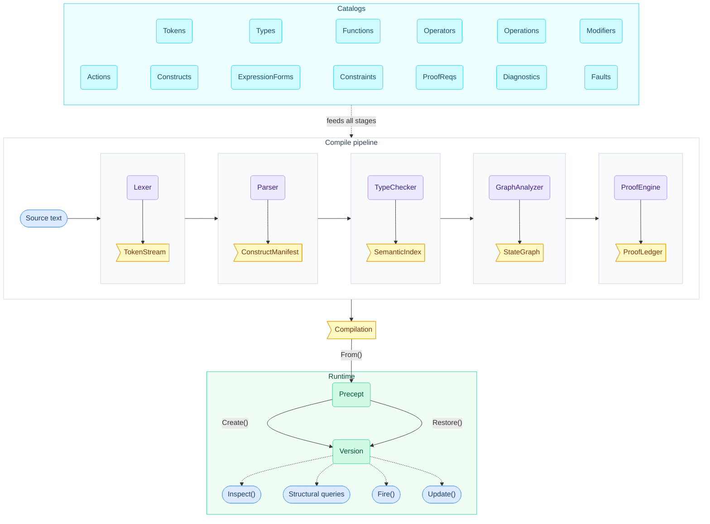
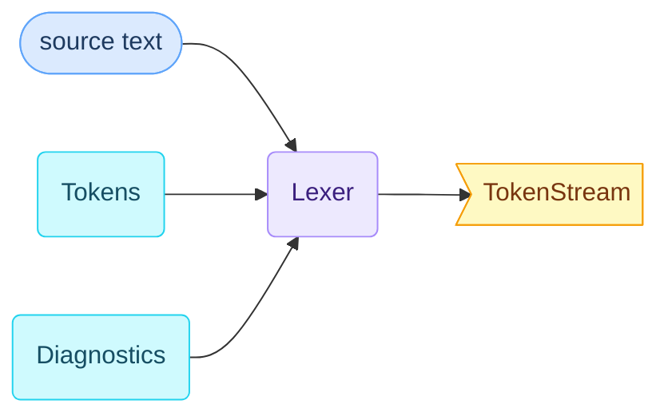
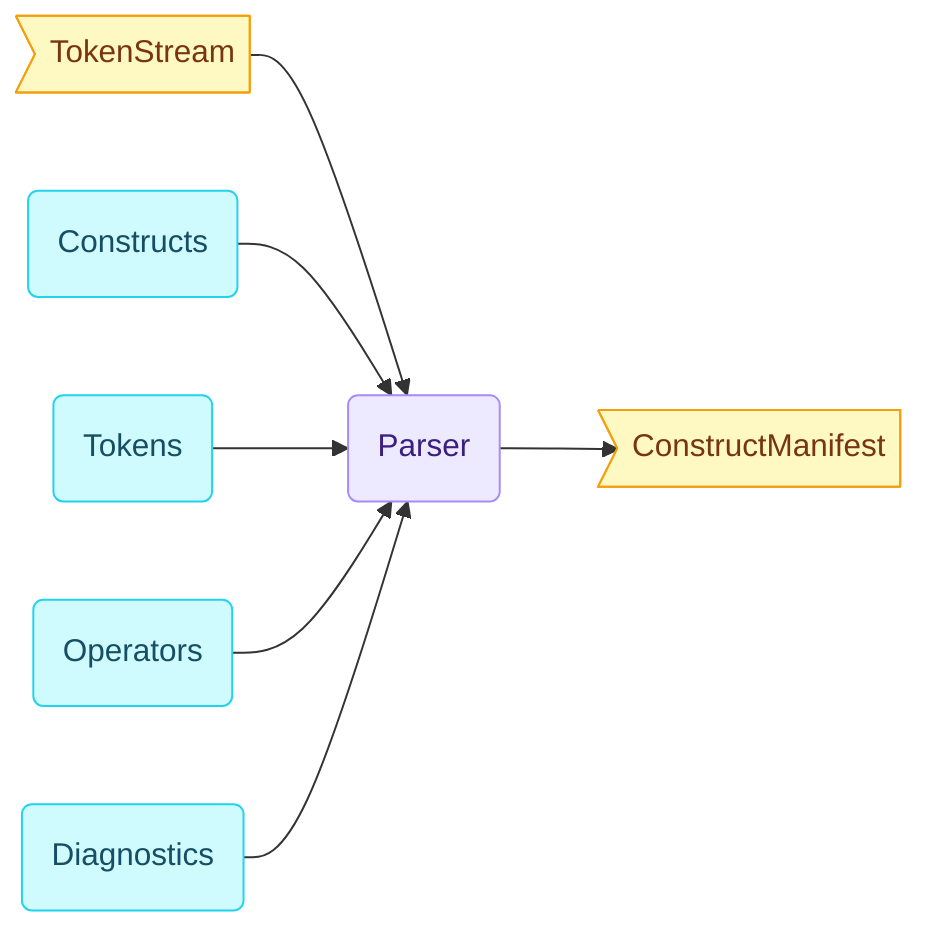
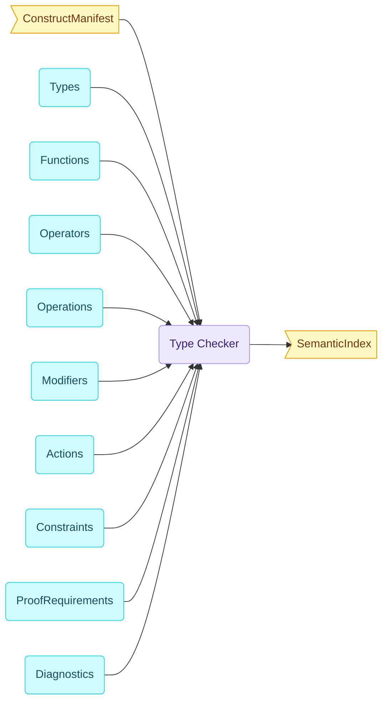
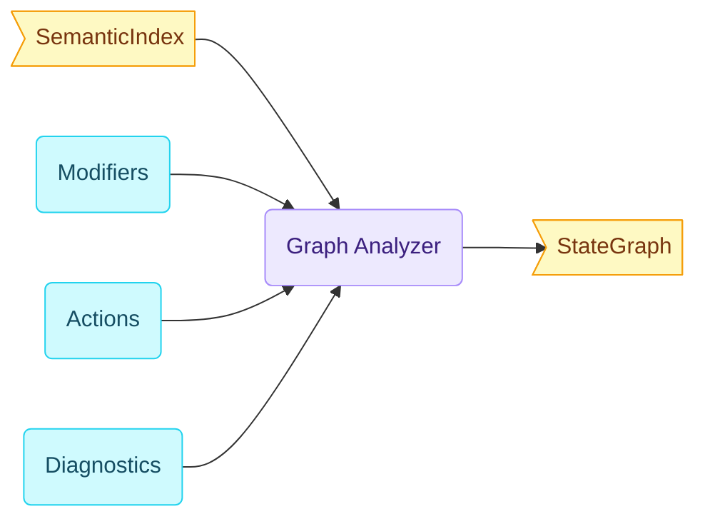
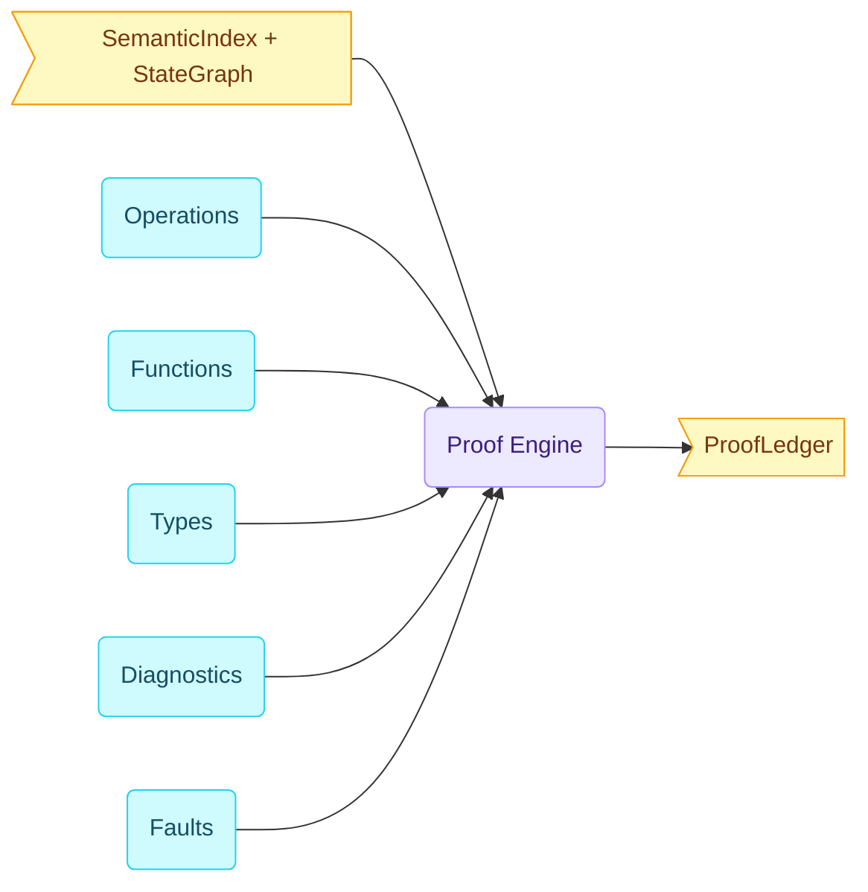
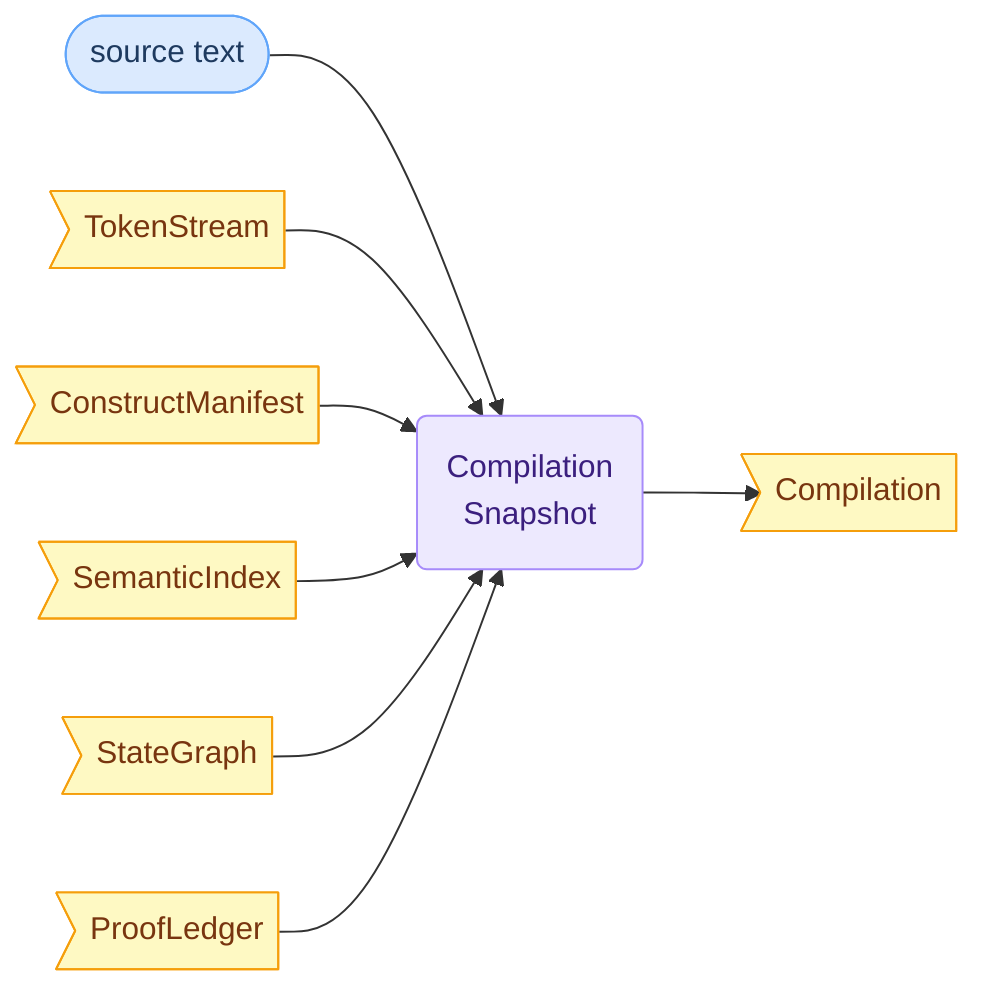
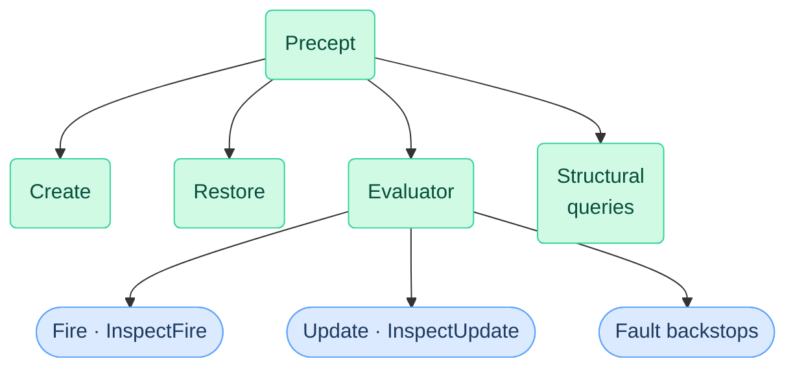

# Precept Compiler and Runtime Design

> **Status:** Canonical design — catalog-first pipeline
> **Audience:** compiler, runtime, language-server, MCP, and documentation authors

**How to read this document.** Sections 1–3 establish what Precept promises, its architectural approach (catalog-driven, purpose-built, unified pipeline), and the end-to-end pipeline overview — read these first for the design's spine. Sections 4–5 cover Lexer and Parser. Sections 6–10 are the per-stage contracts (Type Checker through Precept Builder), each opening with how that stage serves the structural guarantee; read them in order for the compilation story, or jump to a specific stage when doing component work. Section 6 (Type Checker) also defines the `SemanticIndex` artifact — its flat semantic-inventory shape, syntax-node back-pointers, and the anti-mirroring rules that keep downstream consumers independent of source structure. Section 11 covers the runtime surface and operations. Section 12 covers type and immutability strategy — a cross-cutting architectural concern that governs every artifact in the pipeline; it is placed here because it is most meaningful after seeing the full compilation and runtime picture. Sections 13–15 cover tooling integration (TextMate grammar generation, MCP, language server) — the consumer-facing contracts that tie compilation output to real product surfaces.

## 1. What Precept promises

Precept is a domain integrity engine for .NET. A single declarative contract governs how a business entity's data evolves under business rules across its lifecycle, making invalid configurations structurally impossible. You declare fields, constraints, lifecycle states, and transitions in one `.precept` file. The runtime compiles that declaration into an immutable engine that enforces every rule on every operation. No invalid combination of lifecycle position and field data can persist.

This is not validation. Validation checks data at a moment in time, when called. Precept declares what the data is allowed to become and enforces that declaration structurally, on every operation, with no code path that bypasses the contract.

The guarantee is **prevention, not detection.** Invalid entity configurations cannot exist — they are structurally prevented before any change is committed. The engine is deterministic: same definition, same data, same outcome. At any point, you can preview every possible action and its outcome without executing anything. Nothing is hidden.

Everything in this document — every pipeline stage, every artifact, every runtime operation — exists to deliver that guarantee.

## 2. Architectural approach

### Catalog-driven design

Precept keeps its language purposely simple. Rather than embedding domain knowledge in pipeline stage implementations (as traditional compilers do), Precept externalizes the entire language definition as structured metadata in thirteen catalogs. Pipeline stages are generic machinery that reads this metadata.

This inverts the traditional compiler model. In general-purpose compilers (Roslyn, GCC, TypeScript), domain knowledge is scattered across pipeline stage implementations — adding a language feature means touching dozens of files. The surveyed DSL-scale systems take a different approach: CEL centralizes its language definition in `Env` declarations, OPA/Rego externalizes rule indexing and type environments in `ast.Compiler`, and CUE's lattice-based evaluation derives behavior from schema declarations. Precept takes this pattern further — adding a language feature means adding a catalog entry: a structured metadata record. Pipeline stages are generic machinery that reads catalog metadata; they contain no per-member knowledge and no per-feature switch to fill in. Discriminated union shapes enforce that catalog entries are fully specified at the point of declaration, and propagation to every consumer (grammar, completions, hover, MCP, semantic tokens) is automatic because consumers derive behavior from catalog metadata.

The thirteen catalogs fall into two groups:

**Language definition** — what the language IS: `Tokens` (lexical vocabulary), `Types` (type system families), `Functions` (built-in function library), `Operators` (operator symbols with precedence/associativity/arity), `Operations` (typed operator combinations — which `(op, lhs, rhs)` triples are legal; `BidirectionalLookup` entries declare commutative operations once so `money * decimal` and `decimal * money` resolve to the same entry without duplicate definitions), `Modifiers` (declaration-attached modifiers as a discriminated union with five subtypes), `Actions` (state-machine action verbs), `Constructs` (grammar forms and declaration shapes), `ExpressionForms` (expression grammar forms — expression node kinds: literal, identifier, binary op, function call, quantifier, CI function call), `Constraints` (constraint kinds and activation anchor metadata), `ProofRequirements` (proof obligation kinds and qualifier compatibility metadata).

**Failure modes** — how it reports problems: `Diagnostics` (compile-time rules), `Faults` (runtime failure modes). The diagnostic-and-output-design survey confirms that Precept's catalog-based separation of diagnostic rule definition (`DiagnosticCode` in the `Diagnostics` catalog) from diagnostic instance (`Diagnostic` with source location, severity, and message arguments) follows the Roslyn pattern (`DiagnosticDescriptor` / `Diagnostic`) — the most explicit rule-vs-instance separation in the surveyed systems. TypeScript uses a similar `DiagnosticMessage` / `Diagnostic` split. The survey also reveals a severity-level divide: all surveyed DSL-scale systems (CEL, OPA/Rego, CUE, Dhall, Jsonnet, Pkl, Starlark) have error-only diagnostics — no warnings, no hints. Only general-purpose compilers (Roslyn, TypeScript, Rust, Swift) define 4+ severity levels. Precept's `Diagnostics` catalog defines severity levels beyond error, which is an intentional choice above DSL-scale norms, driven by the authoring-surface ambition of the language server and MCP tools.

Their union IS the language specification in machine-readable form. No consumer maintains a parallel copy. Every downstream artifact — the TextMate grammar, LS completions, LS hover, MCP vocabulary, semantic tokens, type-checker behavior — derives from catalog metadata.

The architectural principle: **if something is domain knowledge, it is metadata; if it is metadata, it has a declared shape; if shapes vary by kind, the shape is a discriminated union.** Pipeline stages, tooling, and consumers derive from the metadata — they never encode language knowledge in their own logic. See `docs/language/catalog-system.md` for the full catalog system design.

> **Precept Innovations**
> - **Catalog-as-spec inversion.** Traditional compilers scatter language knowledge across pipeline implementations — adding a feature means touching dozens of files and hoping every consumer gets updated. Precept externalizes the entire language specification as thirteen machine-readable catalogs; their union IS the spec. Without this, grammar, completions, hover, and MCP vocabulary would drift independently and require manual synchronization on every language change.
> - **Single-act feature propagation.** Adding a language feature is one catalog entry — a structured metadata record. Discriminated union record shapes enforce that every entry is fully specified at catalog declaration time; the C# compiler refuses to build if any required DU field is absent. No per-feature switch exists in pipeline stages — consumers derive behavior from catalog metadata generically — so propagation to grammar, completions, hover, MCP vocabulary, and semantic tokens is automatic.
> - **Grammar generation from catalogs.** The TextMate grammar, LS completions, and MCP vocabulary are generated artifacts, not hand-edited — they cannot drift from the language specification because they ARE the specification, projected to different surfaces.

### Purpose-built

Precept's pipeline is purpose-built for Precept's specific shape: a declarative DSL with fields, states, events, transitions, constraints, and guards. Every stage knows what it is building toward — an executable model that structurally prevents invalid configurations. This is the norm at DSL scale. The surveyed systems — CEL (single-expression safety language), OPA/Rego (policy evaluation), Dhall (configuration with guaranteed termination), Pkl (structured configuration), CUE (constraint-based configuration) — all build purpose-specific pipelines tuned to their domain, not extensible compiler frameworks. Precept follows the same principle: the pipeline does not need to be extensible to other languages. It needs to be correct for this one.

### Unified pipeline

The system has compilation phases (lexing, parsing, type checking, graph analysis, proof) and runtime phases (Precept building, evaluation, constraint enforcement, structured outcomes). These are sequential stages of one system. They share the same catalog metadata. They produce artifacts that flow forward. Compilation builds understanding; runtime acts on it.

Two top-level products emerge from this pipeline:

**`Compilation`** — the immutable analysis snapshot. Always produced, even from broken input. Authoring surfaces (language server, MCP compile) need the full picture — including syntax errors, unresolved references, and unproven safety obligations — to provide diagnostics, completions, and navigation. This follows the error-tolerant compilation model established by Roslyn (full syntax trees from broken input) and adopted across the surveyed systems: OPA's compiler collects errors without short-circuiting; CEL's `Compile()` returns `Issues` alongside partial ASTs; Dhall's LSP runs the full pipeline and pushes all diagnostics.

**`Precept`** — the executable runtime model. Produced only from error-free compilations via `Precept.From(compilation)`. This is the sealed model that runtime operations execute against. It carries descriptor tables, prebuilt execution plans, and constraint indexes — not syntax trees or proof ledgers.

The relationship is straightforward: analysis builds `Compilation`; the Precept Builder transforms it into `Precept`; runtime operations execute against `Precept`. Authoring tools read `Compilation`. Execution tools read `Precept`.

## 3. The pipeline

**End-to-end pipeline** — source and catalogs feed the compile stages; each runtime operation produces a new immutable `Version`:



The first thing to notice is the boundary itself — one call produces one aggregate. This makes the compiler/runtime divide explicit and auditable.

```csharp
Compilation compilation = Compiler.Compile(source);
```

`Compiler.Compile(source)` is the full compile pipeline entry point. It exists to turn author-owned `.precept` text into a stable compile-time aggregate that preserves everything the downstream system needs: stage outputs, diagnostics, and a single `HasErrors` summary. That separation matters because later steps should consume prior analysis, not repeat it. The compiler's job is to concentrate compile-time knowledge into one object that can be inspected, validated, and then handed to runtime construction.

To see what that call actually does, zoom in on the compiler itself. Notice what is NOT here — no incremental invalidation, no partial-result short-circuit, no stage-level error barrier. The pipeline runs to completion regardless of errors, because authoring surfaces need everything it produces.

```csharp
// Inside Compiler.Compile
TokenStream   tokens    = Lexer.Lex(source);
// ConstructManifest carries ImmutableArray<ParsedConstruct> Constructs — no per-construct AST node types.
// ParsedConstruct: (ConstructMeta Meta, ImmutableArray<SlotValue> Slots, SourceSpan Span)
// ⚠ SlotValue subtype field shapes have open mismatches between parser.md and type-checker.md — see parser.md open questions
ConstructManifest manifest   = Parser.Parse(tokens);
SemanticIndex semantics = TypeChecker.Check(manifest);
StateGraph    graph     = GraphAnalyzer.Analyze(semantics);
ProofLedger   proof     = ProofEngine.Prove(semantics, graph);

ImmutableArray<Diagnostic> diagnostics =
[
    ..tokens.Diagnostics,
    ..manifest.Diagnostics,   // parse-phase diagnostics on ConstructManifest.Diagnostics
    ..semantics.Diagnostics,
    ..graph.Diagnostics,
    ..proof.Diagnostics,
];

return new Compilation(
    Tokens:      tokens,
    ConstructManifest:  manifest,
    Semantics:   semantics,
    Graph:       graph,
    Proof:       proof,
    Diagnostics: diagnostics,
    HasErrors:   diagnostics.Any(d => d.Severity == Severity.Error)
);
```

Every stage starts from two roots. The first root is the `.precept` source text: the program the author wrote. The second root is the catalogs: the language specification that supplies the identities and metadata the compiler must preserve. Those catalogs enter as soon as a stage can know something from them, and later stages carry that catalog-stamped identity forward instead of reconstructing it with hardcoded switches.

The stages produce progressively richer artifacts. Lexing produces a `TokenStream`. Parsing produces a `ConstructManifest` of `ParsedConstruct` nodes — one uniform type per construct carrying `ConstructMeta`, slot values, and a source span, with no per-construct AST node types. Type checking produces a `SemanticIndex`. Graph analysis produces a `StateGraph`. Proof analysis produces a `ProofLedger`. `Compilation` is the aggregate over those artifacts plus the merged diagnostic stream and the `HasErrors` summary. It is the compiler's complete output, not a success token.

`Compilation` is the last compile-time aggregate. Execution starts only when that aggregate is transformed into runtime-native structures.

```csharp
Precept     precept     = Precept.From(compilation);        // requires !HasErrors
```

`Precept.From()` is the transformation boundary. It takes the knowledge already established by compilation and re-expresses the runtime-relevant parts in executable form. What crosses the boundary is not the compile artifacts themselves, but the information runtime must execute and answer structural questions. What does not cross is equally important: runtime types do not hold references to tokens, syntax trees, parser recovery state, or proof artifacts. The design keeps execution independent from compiler internals while still preserving the results of analysis in shapes the evaluator can use directly.

### Artifact inventory

The artifact inventory — what each stage produces and how artifacts are classified — is covered in §9 alongside the Compilation snapshot that aggregates them.

### What crosses into the executable model

`Precept.From()` transforms analysis knowledge into runtime-native shapes.

- **Transition dispatch index** — state × event → target state. This is graph topology, built into a routing table the evaluator and inspection surfaces consume directly.
- **State descriptor table** — all named states with metadata (display name, terminal flag, initial/required/irreversible modifiers, available events). Enables structural queries ("what states exist?", "what modifiers apply?").
- **Event availability index** — valid events per state. Enables "what can I do from here?" queries for MCP, AI agents, and UI consumers.
- **Reachability index** — states reachable from a given state. Enables structural navigation without re-running the compiler.
- **Pathfinding residue** — enough topology for shortest-path navigation from current state to a target. The graph analog of `ConstraintInfluenceMap` — causal reasoning over lifecycle structure.
- **`ConstraintDescriptor`** — expression text, source lines, scope targets, guard metadata, `ConstraintKind` anchor.
- **`ConstraintInfluenceMap`** — constraint → contributing fields with expression-text excerpts. Enables "which field change would fix this?" without reverse-engineering.
- **Structured violation shapes** — `ConstraintViolation` carries failing constraint descriptor, evaluated field values, guard context, and failing sub-expression.
- **Fault-site backstops** — `FaultSite` descriptors linked to `FaultCode` and the compiler-owned prevention `DiagnosticCode`.

The complete severance contract — what crosses into the executable model and what does not — is defined in §10.

Once the executable model exists, runtime operations work entirely on runtime objects.

Notice the shape of progression: every operation produces a new immutable `Version` — the caller extracts results from the outcome and passes the new snapshot forward. There is no accumulated mutable state.

```csharp
EventOutcome created = precept.Create(args);                // Applied or Transitioned
Version version = created switch
{
    Applied a      => a.Result,
    Transitioned t => t.Result,
    _              => throw new InvalidOperationException()
};

EventOutcome outcome = version.Fire("Approve", args);       // each Fire → new Version
Version version2 = outcome switch
{
    Applied a      => a.Result,
    Transitioned t => t.Result,
    _              => throw new InvalidOperationException()
};
```

This closes the loop on the earlier boundary. `precept.Create(args)` produces an `EventOutcome`, from which the caller extracts a `Version` snapshot. `version.Fire("Approve", args)` evaluates against that snapshot and returns another `EventOutcome` and another `Version`. Runtime progression therefore happens by producing explicit results over the executable model built by `Precept.From()`, not by consulting or mutating compiler artifacts.

> **Precept Innovations**
> - **Unified pipeline.** Compilation and runtime are sequential stages of one system sharing the same catalog metadata — not two separate systems bolted together. There is no "compile step" followed by a "runtime step" from the user's perspective; the pipeline flows from source text to executable enforcement in one continuous transformation.
> - **Compilation as an always-available intelligence snapshot.** Even broken programs produce a full `Compilation` with partial analysis — language server and MCP tools always have something to work with. Traditional compilers stop at the first error boundary; Precept provides progressive intelligence across all stages.
> - **Precept building as selective transformation.** The boundary between analysis and execution is not a wall — it is a selective transformation that carries exactly the analysis knowledge the runtime needs in runtime-native shapes, while preventing runtime types from depending on compile-time artifacts.
> - **Graph topology as a first-class runtime artifact.** The `Precept` model carries a full executable topology — transition dispatch index, state descriptor table, reachability index, pathfinding residue — not just an opaque executor. Runtime consumers (MCP, AI agents, UI) can ask "what states exist?", "what can I do from here?", "how do I reach state X?" These are structural guarantee questions, answerable without re-running the compiler. No other state machine library in this category exposes lifecycle topology as a queryable runtime surface.

## 4. Lexer

The lexer converts raw text into classified tokens with exact spans. It has no semantic opinion. The key design choice: `TokenKind` comes directly from catalog metadata (`Tokens.GetMeta`), not from a parallel enum maintained by the lexer. The lexer is a vocabulary consumer, not a vocabulary owner.



```
TokenStream
├── Token[0]   TokenKind + Text + SourceSpan
├── Token[1]   TokenKind + Text + SourceSpan
├── Token[2]   TokenKind + Text + SourceSpan
└── Token[n]   … ordered flat token sequence
```

| **Output** | `TokenStream` — `ImmutableArray<Token>` (each: `Kind`, `Text`, `Span` (`SourceSpan`)) plus lex-phase diagnostics |
|---|---|
| **Catalog role** | `TokenKind` comes from `Tokens.GetMeta(...)` / `Tokens.Keywords`. Token categories, TextMate scope, semantic token type, and completion hints derive from `TokenMeta`. |
| **Consumers** | Parser, `Compilation`, LS lexical tokenization and grammar tooling |

### Completion filtering via `ValidAfter`

The language server's completion logic uses `TokenMeta.ValidAfter` to filter candidates: for each `TokenKind` that is a completion candidate, its `ValidAfter` array declares which preceding token kinds make it legal in context. A completion candidate is only offered if the token immediately preceding the cursor appears in the candidate's `ValidAfter` set. This is catalog-declared positional grammar — the LS does not hardcode which completions follow which keywords; it reads the constraint from the metadata.

**How it serves the guarantee:**The lexer ensures that every character of source text is accounted for and classified according to catalog-defined vocabulary. No ambiguity in token identity propagates downstream.

> **Precept Innovations**
> - **Catalog-driven token recognition.** `TokenKind` derives from catalog metadata, not a parallel enum. The lexer is a vocabulary consumer — adding a keyword to the `Tokens` catalog automatically makes it lexable, highlightable, and completable.
> - **No vocabulary ownership at the lexer level.** Traditional lexers own a hardcoded keyword table. Precept's lexer reads its vocabulary from the same metadata that drives every other consumer.

See [`docs/compiler/lexer.md`](./compiler/lexer.md) for the full stage design.

## 5. Parser

The parser transforms a token stream into a `ConstructManifest` containing `ParsedConstruct` nodes. Its key design choice: a **catalog-driven generic interpreter** — the parser contains no per-construct parsing logic encoded in source code. Instead, construct metadata in the `Constructs` catalog drives a single generic slot-walking engine. There are no per-construct AST node types.



| **Output** | `ConstructManifest` — `ImmutableArray<ParsedConstruct> Constructs` (each node: `ConstructMeta Meta`, `ImmutableArray<SlotValue> Slots`, `SourceSpan Span`) plus parse-phase diagnostics |
|---|---|
| **Catalog role** | The parser stamps kind identities at parse time: `ConstructKind` via `Meta.Kind`, `ActionKind` into `ActionChainSlot`, `ModifierKind` into `ModifierListSlot`. `TypeKind` is NOT stamped at parse time — `TypeExpressionSlot` carries `SourceSpan`; the type checker resolves type references. |
| **Consumers** | TypeChecker, LS syntax-facing features (outline, folding, span-based context) |

**How it serves the guarantee:** Structural fidelity means the type checker and downstream stages work from a faithful representation of the author's intent, including malformed programs — authoring tools can diagnose problems precisely because the structure is preserved, not discarded on error.

### Parser/TypeChecker contract boundary

The parser guarantees to the type checker:

- Every parsed region produces a `ParsedConstruct` node. Missing or invalid slots produce synthesized placeholder `SlotValue` instances — required content is never silently absent. The type checker does not re-validate structural completeness.
- The `ConstructKind` for each construct is stamped via `Meta.Kind` at parse time. `ActionKind` and `ModifierKind` are resolved and stored in `ActionChainSlot` and `ModifierListSlot` subtypes at parse time.
- `TypeKind` is NOT stamped at parse time — `TypeExpressionSlot` carries `SourceSpan`; the type checker resolves type references by looking up the span in the `Types` catalog.

What the parser does NOT guarantee: name resolution, type compatibility, overload selection, or semantic legality. The type checker owns all semantic resolution.

### Error recovery

Error recovery is construct-level, not token-level. When the parser encounters a malformed construct, it emits a diagnostic and skips to the next newline-anchored declaration keyword (`field`, `state`, `event`, `rule`, `from`, `in`, `to`, `on`). This is panic-mode recovery with synchronization at declaration boundaries.

For slots where expected tokens are absent, the parser synthesizes a placeholder `SlotValue` for the slot kind and continues. The parser always terminates; every syntax error produces a `Diagnostic`; partial constructs are emitted with available slots populated.

### Output: `ParsedConstruct` and `SlotValue`

The parser produces one output type for all constructs:

```csharp
public sealed record ParsedConstruct(
    ConstructMeta Meta,
    ImmutableArray<SlotValue> Slots,
    SourceSpan Span);
```

- **Meta** — The `Constructs` catalog entry describing this construct's kind, slots, and routing
- **Slots** — Parsed values in declaration order matching `Meta.Slots`
- **Span** — Source location from first to last consumed token

There are no per-construct AST node types. The old typed-class hierarchy (`FieldDeclarationSyntax`, `StateBlockSyntax`, `EventDeclarationSyntax`, `TransitionRowSyntax`, etc.) has been deleted. Consumers work with `ParsedConstruct` uniformly, dispatching on `ConstructKind` via `Meta.Kind` when construct-specific handling is needed.

`SlotValue` is a 17-subtype discriminated union, one per `ConstructSlotKind`. Expression-carrying slots (`ComputeExpressionSlot`, `GuardClauseSlot`, `OutcomeSlot`, `EnsureClauseSlot`, `RuleExpressionSlot`) currently carry only `SourceSpan` — expression tree design is deferred. See [`docs/compiler/parser.md`](./compiler/parser.md) for the full slot subtype inventory and open questions.

> **Open Question (inherited from parser.md):** Expression-carrying slots hold `SourceSpan` only. The eventual expression parser will be a Pratt parser (operator-precedence) using the `Operators` catalog for precedence/associativity metadata. Three representation options remain under consideration: Roslyn-style per-expression-kind node types; uniform S-expression `(op, args...)`; or span + lazy parse on demand. Design review required before implementation. This blocks expression resolution in the type checker.

> **Open Question (inherited from parser.md):** `parser.md` and `type-checker.md` disagree on the concrete contents of several `SlotValue` subtypes. `ModifierListSlot` carries `ImmutableArray<ModifierKind>` per `parser.md` but `ImmutableArray<TokenKind>` per `type-checker.md`. The same conflict exists for `AccessModeSlot` (`SourceSpan` vs `TokenKind`) and `BecauseClauseSlot` (`string` vs `SourceSpan`). This overview follows `type-checker.md` for `TypeExpressionSlot` (`SourceSpan`, not `TypeMeta`) but follows `parser.md` for `ModifierKind` in `ModifierListSlot` — that inconsistency is intentional (these are unresolved). The §6 "Earliest-knowable kind assignment" table follows the same `parser.md` view for `ModifierKind`. Which shapes are canonical is unresolved; see `parser.md` open questions for full detail.

### Catalog-to-grammar mapping

Catalog metadata factors into parsing decisions at specific points. The parser uses `Constructs.GetMeta()` to determine legal declaration forms — each `ConstructKind` defines the expected slot sequence via `ConstructSlot` entries, each carrying whether the slot is required or optional and its expected position. The parser validates that slots appear in the declared order with declared optionality. Slot validation is catalog-driven: there is no per-construct parser logic that hardcodes what a `field` declaration requires vs. what a `from` row requires. Add a new required slot to a `ConstructKind` in the catalog, and the parser diagnoses all existing declarations that are missing it. The parser uses `Operators.GetMeta()` for expression parsing — operator precedence and associativity come from catalog metadata, not a hardcoded table. Keyword recognition is inherited from the lexer's catalog-driven `TokenKind` assignments; the parser dispatches on `TokenKind`, not on string comparison.

### Right-sized parser patterns

Precept's grammar calls for parser patterns scaled to a flat, keyword-anchored, line-oriented DSL — not patterns designed for deeply nested general-purpose languages. The surveyed DSL-scale systems confirm what works at this scale:

- **Flat parse trees.** Precept's grammar has no deep nesting, no brace-delimited scopes, no expression statements. Red/green tree architectures (Roslyn, rust-analyzer) solve incremental reparsing of deeply nested, brace-delimited structures — a problem that does not exist in flat, line-oriented grammars. CEL produces a flat protobuf AST; OPA/Rego produces module-level `Rule` lists; Dhall and Jsonnet both produce single-expression trees with no incremental infrastructure.
- **Declaration-boundary error recovery.** When the parser encounters a malformed construct, it skips to the next newline-anchored declaration keyword (`field`, `state`, `event`, `rule`, `from`, `in`, `to`, `on`). This is panic-mode recovery with synchronization at declaration boundaries. Token-level insertion/deletion with cost models (as in Roslyn or GCC) is designed for statement-level grammars where recovery points are ambiguous. Precept's keyword-anchored lines provide unambiguous synchronization. OPA's parser similarly synchronizes at rule boundaries; Pkl's tree-sitter grammar provides node-level error recovery.
- **Expressions only in specific slots** — guards, action RHS, ensure clauses, computed fields, if/then/else, and because clauses. CEL is a single-expression language; OPA confines expressions to rule bodies and comprehensions. Precept follows the same containment pattern — the parser does not need a general-purpose expression parser for the full language.
- **Operator precedence from metadata.** Operator precedence comes from `Operators.GetMeta()`, not a hardcoded table. The correct pattern is precedence-climbing — a standard technique for expression parsing at this scale (CEL uses a similar approach in its ANTLR-generated parser with explicit precedence levels; OPA's parser embeds precedence in its recursive descent structure).
- **LL(1) with single-token lookahead** in most positions, given the keyword-anchored, line-oriented design. This is simpler than the LL(k) or GLR techniques general-purpose languages require.

### `ActionKind` dual-use note

`set` appears as both an action keyword (`TokenCategory.Action` — e.g., `set Amount to 100`) and a type keyword (`TokenCategory.Type` — e.g., `field Tags as set of string`). The parser disambiguates by position context: after `->` or in action position = action; after `as`/`of` or in type position = type. This disambiguation is a parser responsibility, not a catalog lookup — the catalog correctly classifies `set` under both categories.

> **Precept Innovations**
> - **Flat, declaration-oriented grammar.** No nesting beyond expression-within-declaration. This makes the grammar trivially parseable, the error recovery model simple and predictable, and the `ConstructManifest` shape directly useful for tooling without the complexity budget of a general-purpose language parser.
> - **Precedence from catalog metadata.** Operator precedence and associativity are not hardcoded — they derive from `Operators.GetMeta()`. Changing precedence is a catalog edit, not a parser rewrite.
> - **Catalog-driven generic interpreter.** The parser contains no per-construct parsing logic — it is a generic slot-walking engine driven by `Constructs` catalog metadata. There are no per-construct AST node types: a single `ParsedConstruct(ConstructMeta, ImmutableArray<SlotValue>, SourceSpan)` is the parser's universal output type. Adding a new construct requires only a catalog entry, not parser code changes.

See [`docs/compiler/parser.md`](./compiler/parser.md) for the full stage design including slot subtype inventory, disambiguation protocol, and routing family details.

## 6. Type Checker

The type checker is the first stage that reasons about semantics. Its key design choice: type resolution produces a flat semantic inventory (`SemanticIndex`) rather than annotating syntax nodes in-place — because downstream consumers (graph analysis, proof, the Precept Builder) and LS semantic features need normalized declarations and resolved identities, not decorated source structure. The inventory's shape is driven by consumer needs, not by parser layout.



| **Output** | `SemanticIndex` — semantic symbol tables and binding indexes, normalized declaration inventories, typed expressions and actions, dependency facts, and syntax-node back-pointers, plus diagnostics. |
|---|---|
| **Catalog role** | First stage to resolve `TypeKind`, `FunctionKind`, `OperatorKind`, `OperationKind`, `ModifierMeta`, `ActionMeta`, `FunctionOverload`, `TypeAccessor`, and attached `ProofRequirement` records into semantic identity. |
| **Consumers** | GraphAnalyzer, ProofEngine, LS semantic tooling, MCP compile output, Precept Builder |

**How it serves the guarantee:** The type checker catches semantic defects — type mismatches, illegal operations, invalid modifier combinations, unresolved references — before the program reaches graph analysis or runtime. Every expression and declaration that passes type checking has a resolved, catalog-backed semantic identity. This is where the structural guarantee begins to take shape: if it type-checks, its operations are legal.

### SemanticIndex: flat semantic inventory, not a mirrored tree

The `SemanticIndex` is not a second tree that mirrors parser structure with types bolted on. It is a flat semantic inventory — declarations organized by semantic role, not by source position. Rules, `in`/`to`/`from`/`on` ensures, transition rows, access declarations, state hooks, and stateless hooks live in normalized inventories shaped for what downstream consumers need, not for what the parser produces. Typed expressions still carry structure — a resolved event-arg symbol, a resolved field symbol, a resolved `OperationKind`, a result type — but the top-level organization is inventory-shaped.

**Why inventory-shaped.** Graph analysis needs transition rows keyed by state/event identity. Proof needs constraint expressions with resolved types and dependency facts. The Precept Builder needs normalized declaration sets it can transform into descriptor tables. The LS needs symbol tables for hover, go-to-definition, and semantic tokens. None of these consumers want a tree walk over parser nesting — they want declarations indexed by semantic role. The `SemanticIndex` shape reflects this: flat at the declaration level, structured within typed expressions.

**Syntax-node back-pointers.** Semantic entries hold direct references to their originating `ParsedConstruct` nodes — a `TypedField` points to its source `ParsedConstruct`; a `TypedExpression` points to the `SourceSpan` it was resolved from; a `TypedTransitionRow` points to its source `ParsedConstruct`. The pointer is a direct object reference, not a span lookup or index-based correlation.

This is the right trade for Precept. The LS runs in the same process as the compiler — no serialization boundary, both artifacts on the same heap — so a direct reference is the simplest linking strategy. Precept recompiles the entire file on every change (§9), producing a fresh, immutable `Compilation` each time, so back-pointers never dangle. At Precept's scale (flat grammar, shallow trees, 64KB ceiling), the memory cost of holding both artifacts plus cross-references is negligible. And when an LS feature needs new source-structural context (e.g., the exact span of a guard clause for a diagnostic underline), the back-pointer makes it immediately available without extending the `SemanticIndex` contract.

The back-pointer is a navigation convenience for LS features and diagnostic rendering — not a license for semantic consumers to depend on syntax structure. Graph analysis, proof, and the Precept Builder consume the semantic inventories. They must not traverse syntax nodes via back-pointers, even though the pointers make them reachable. If graph analysis walked syntax to extract transition topology, a change to parser recovery shape could break it. These stages consume normalized semantic declarations and should continue to work correctly regardless of how the parser evolves.

### SemanticIndex inventory

The semantic inventory is organized by role, not by source position. Each entry carries a back-pointer (→ syntax) to its originating syntax node for diagnostics and LS navigation — but downstream stages consume the semantic columns, not the pointer.

```
SemanticIndex                              ◄ flat inventory, not a tree
│
├── Symbols ─────────────────────────────────────────────────────
│   TypedField    "Amount"    number   [required]       → ParsedConstruct (FieldDeclaration)
│   TypedField    "Status"    string   [computed]        → ParsedConstruct (FieldDeclaration)
│   TypedState    "Draft"     [initial]                  → ParsedConstruct (StateDeclaration)
│   TypedState    "Approved"  [terminal]                 → ParsedConstruct (StateDeclaration)
│   TypedEvent    "Submit"    args: [Approver]           → ParsedConstruct (EventDeclaration)
│   TypedArg      "Approver"  string   [required]        → slot within ParsedConstruct
│
├── Bindings ────────────────────────────────────────────────────
│   expr site  "Amount > 0"   →  OperationKind.GreaterThan(number, number)
│   field ref  "Amount"       →  TypedField "Amount"
│   action     "set"          →  ActionMeta (input shape)
│   type ref   "number"       →  TypeKind.Number + TypeAccessor
│
├── Normalized Declarations ─────────────────────────────────────
│   TransitionRow   (Draft, Submit, Review)    guard + action chain
│   Rule            constraint-1               ensure Amount > 0
│   Ensure          (in Draft, constraint-2)   ensure Status == "new"
│   Access          (Draft, Amount)            edit
│
├── Typed Expressions ───────────────────────────────────────────
│   Amount > 0       →  result: bool   op: GreaterThan   → expr syntax
│   arg.Approver     →  result: string                    → expr syntax
│
└── Dependency Facts ────────────────────────────────────────────
    computed "Status"  depends-on: [Amount, State]
    constraint-1       references: [Amount]
```

**Symbols** — stable semantic identities

| Symbol | Key | Semantic content | → syntax |
|---|---|---|---|
| `TypedField` | field name | `TypeKind`, modifiers, default/computed expression | `ParsedConstruct` |
| `TypedState` | state name | modifier set (initial, terminal, required, …) | `ParsedConstruct` |
| `TypedEvent` | event name | modifier set, arg symbols | `ParsedConstruct` |
| `TypedArg` | event + arg name | `TypeKind`, optionality, default expression | slot within `ParsedConstruct` |

**Bindings** — every reference site resolved to its target

| Binding site | Resolves to |
|---|---|
| identifier in expression | field symbol, arg symbol, or function overload |
| operator in expression | `OperationKind` (from `Operations` catalog) |
| type reference | `TypeKind` + `TypeAccessor` |
| action verb | `ActionMeta` shape (base / input / binding) |

`TypeAccessor` is a discriminated union — its subtypes carry different proof obligation metadata. Accessing `.peek` on a queue-typed field resolves to a `TypeAccessor` subtype that carries a `ProofRequirement` for non-emptiness: the proof engine must establish that the collection is non-empty before the access is safe. The accessor shape — not the type checker — owns this obligation declaration. This means new container operations get proof obligations by updating catalog metadata, not by modifying checker logic.

**Normalized declarations** — inventories shaped for analysis, not parser nesting

| Inventory | Keyed by | Content |
|---|---|---|
| Transition rows | (source state, event, target state) | guard, action chain, typed expressions |
| Rules | constraint identity | guard, ensure expression, because clause |
| Ensures | (scope anchor, constraint identity) | `in`/`to`/`from`/`on`-scoped constraints |
| Access declarations | (state, field) | edit / readonly mode |
| State hooks | state identity | hook entries |
| Stateless hooks | — | hook entries |

**Typed expressions** — resolved result type, resolved operation/function/accessor identity, semantic subjects, with → syntax back-pointer.

**Typed actions** — resolve to one of three shapes: `TypedAction` (no operand), `TypedInputAction` (carries `InputExpression`), `TypedBindingAction` (carries `Binding`).

**Dependency facts** — computed-field dependencies, arg dependencies, referenced-field sets, and semantic edge data required by graph/proof/the Precept Builder.

### Anti-mirroring rules

These rules constrain the `SemanticIndex` shape. They are architectural constraints on the artifact boundary — not algorithmic guidance for the type checker implementation:

1. **No parser layout inheritance.** `SemanticIndex` must not preserve parser child layout, missing-node shape, or recovery nullability as its primary contract. The semantic inventory is organized by semantic role, not by source structure.
2. **Semantic LS features must not walk syntax.** Hover, go-to-definition, semantic tokens, and semantic completions must be satisfiable from `SemanticIndex` bindings plus back-pointers to originating syntax nodes. If an LS feature must walk parser structure to answer a semantic question, the `SemanticIndex` is underspecified — fix the inventory, not the LS feature.
3. **Downstream stages consume semantic inventories.** Graph analysis, proof, and the Precept Builder consume normalized semantic inventories. They must not traverse syntax nodes via back-pointers. If a downstream stage needs source-structural information, the `SemanticIndex` is missing a semantic fact.
4. **`ConstructManifest` retains sole ownership of source shape.** Recovery, construct ordering, span information, and parse-phase slot layout belong to `ConstructManifest`/`ParsedConstruct` exclusively. `SemanticIndex` entries hold back-pointers for navigation, not syntax fragments for reconstruction.

### Right-sized type checking: generic resolution passes

The type checker should NOT have a `CheckFieldDeclaration()`, `CheckTransitionRow()`, `CheckRuleDeclaration()` method per construct kind. The surveyed DSL-scale type checkers confirm the right pattern for this scale: CEL's checker walks the AST once, resolving types against its `Env` environment with overload dispatch from a centralized function registry; OPA's type checker (`ast/check.go`) makes a single pass over rules against a `TypeEnv`. The correct model for Precept is the same — generic resolution passes that read construct metadata from catalogs. Catalog-resolvable checks are generic passes; only construct-specific structural validation that genuinely differs by kind (field declarations vs. transition rows have different type-checking needs) warrants per-kind methods. The type checker builds semantic symbol tables and binding indexes — a symbol-table-driven approach — not a parallel tree that mirrors `ConstructManifest` with type annotations added. Type widening rules and implied modifiers are catalog-declared: `TypeMeta.WidensTo` lists the types a given type automatically widens to (e.g., `integer` widens to `number`; `money` widens to a notempty context), and `TypeMeta.ImpliedModifiers` lists modifiers a type carries by virtue of its kind (e.g., `money` implies `notempty`). The type checker reads these from catalog metadata — there are no hardcoded widening chains or modifier-implication switches in the checker logic.

### Typed action family — three shapes only

Actions in the typed model resolve to exactly one of three semantic shapes:

- **`TypedAction`** (base) — verbs like `clear`. No operand; value ownership is internal.
- **`TypedInputAction`** (operand-bearing) — verbs like `set`, `add`, `remove`, `enqueue`, `push`. Carries `InputExpression: TypedExpression`.
- **`TypedBindingAction`** (binding) — verbs like `dequeue`, `pop`. Carries `Binding: TypedBinding`.

The partition reflects verb-surface ownership. A flat shape with optional fields would require nullable fields on the majority of members.

Field naming discipline:

| Correct | Do not use |
|---|---|
| `InputExpression` | `Value`, `Input` |
| `Binding` | `IntoTarget` |
| `ConstraintKind` | `EnsureBucketType` |
| `FaultSite` | `RuntimeCheckLocation` |

The Precept Builder produces the matching executable family: `ExecutableAction`, `ExecutableInputAction`, `ExecutableBindingAction`. Same naming discipline.

### Earliest-knowable kind assignment

| Stage | Kinds assigned |
|---|---|
| Parser | `ConstructKind`, `ActionKind`, `OperatorKind`, `ModifierKind` — stamped into `SlotValue` subtypes at parse time |
| Type checker | `TypeKind`, `OperationKind`, `FunctionKind`, resolved `TypeAccessor`, resolved result types on typed expressions |

The parser stamps everything that syntax alone can determine. The type checker stamps everything that requires name, type, or overload resolution. A kind that requires name resolution does not appear in `ConstructManifest`; a kind that syntax alone determines does not wait for the type checker. (See §5 open question on `SlotValue` subtype shapes — the `ModifierKind` entry above follows `parser.md`; `type-checker.md` lists `ImmutableArray<TokenKind>` for `ModifierListSlot`.)

> **Precept Innovations**
> - **Catalog-driven resolution passes.** Type checking resolves against catalog metadata (`Operations`, `Functions`, `Types`, `Modifiers`, `Actions`, `Constraints`, `ProofRequirements`) rather than encoding per-construct behavior in checker logic. Adding a new operation or function to the catalog automatically makes it resolvable — no checker code changes required.
> - **Flat semantic inventory, not annotated syntax.** The `SemanticIndex` is a flat inventory of symbols, bindings, and normalized declarations — not an AST with types bolted on. The shape is driven by what graph analysis, proof, the Precept Builder, and the LS need, not by what the parser produces. The anti-mirroring rules enforce this structurally.
> - **Syntax-node back-pointers with consumer discipline.** Semantic entries hold direct references to originating `ParsedConstruct` nodes — cheap LS navigation without span correlation. But downstream stages (graph, proof, the Precept Builder) consume only the semantic inventories, never the syntax structure behind the pointers. The back-pointer is a navigation convenience, not a structural dependency.
> - **Three-shape typed action family.** Actions resolve to exactly one of three semantic shapes (`TypedAction`, `TypedInputAction`, `TypedBindingAction`), enforced by the DU pattern. A flat shape with optional nullable fields is prohibited — the type system prevents invalid action representations.

> **Open Question (inherited from type-checker.md):** Expression-carrying slots (`ComputeExpressionSlot`, `GuardClauseSlot`, `EnsureClauseSlot`, `RuleExpressionSlot`, `OutcomeSlot`) currently carry only `SourceSpan`. The expression resolution sub-engine (§7.2 in type-checker.md) is fully designed but cannot be exercised until the parser produces expression trees. Implementation is blocked pending expression tree design.

See [`docs/compiler/type-checker.md`](./compiler/type-checker.md) for the full stage design including `SemanticIndex` record types, 2-pass architecture, and expression resolution strategy.

## 7. Graph Analyzer

The graph analyzer derives lifecycle structure from semantic declarations. Its key design choice: graph analysis consumes the resolved `SemanticIndex` — not syntax — because reachability, dominance, and topology require resolved state/event/transition identity, not source-structural nesting.



| **Output** | `StateGraph` — graph facts keyed by semantic identities, plus diagnostics. |
|---|---|
| **Catalog role** | State semantics (`initial`, `terminal`, `required`, `irreversible`, `success`, `warning`, `error`) come from modifier metadata already resolved by the type checker; the analyzer must not reinterpret raw syntax. |
| **Consumers** | ProofEngine, `Precept.From`, LS structural diagnostics, runtime structural precomputation |

**How it serves the guarantee:** The graph analyzer detects lifecycle defects — unreachable states, terminal states with outgoing edges, required-state dominance violations, irreversible back-edges — that would make the state machine unsound. These are structural problems in the contract itself, caught before any instance exists. The surveyed state-graph analysis systems confirm the value of compile-time structural verification: SPIN/Promela performs reachability and deadlock detection on state models; Alloy Analyzer checks structural properties of relational models; NuSMV/nuXmv performs CTL/LTL model checking for reachability and liveness; XState's `@xstate/graph` computes reachable states and transition paths. Precept's graph analyzer applies these same structural analysis patterns — reachability, dead-state detection, topological validation — at compile time rather than as a separate verification step.

### StateGraph inventory

The artifact is **topology** (the directed edge set) plus **derived facts** (structural properties computed from that topology).

```
StateGraph                             ◄ graph + derived facts
│
│  ┌─────────── Topology ───────────┐
│  │                                │
│  │   Draft ──Submit──> Review     │
│  │   Review ──Approve──> Approved │
│  │   Review ──Reject───> Draft    │
│  │                                │
│  └────────────────────────────────┘
│
├── Adjacency            Draft   → { Submit→Review }
│                        Review  → { Approve→Approved, Reject→Draft }
├── Predecessor Index    Review  → { Draft }
│                        Draft   → { Review }
│                        Approved→ { Review }
├── Successor Index      Draft   → { Review }
│                        Review  → { Approved, Draft }
├── Reachability         reachable: {Draft, Review, Approved}
│                        unreachable: ∅    terminal: {Approved}
│
└── Derived Facts ───────────────────────────────────────
    DominanceFact          Review dominates path to Approved
    EventCoverage          Draft: [Submit ✓]  Review: [Approve ✓, Reject ✓]
    ProofForwardingFact    (none — no structural defects)
```

**Topology — adjacency and navigation indexes**

| Structure | Shape | Purpose |
|---|---|---|
| `TransitionAdjacency` | state → { event → target states } | directed edge set of the lifecycle graph |
| `PredecessorIndex` | state → { predecessor states } | reverse-edge lookup |
| `SuccessorIndex` | state → { successor states } | forward-edge lookup |
| `ReachabilitySet` | reachable / unreachable / terminal partitions | state partitioning relative to initial state |

Example adjacency (from a three-state lifecycle):
```
Draft   ──Submit──>  Review
Review  ──Approve──> Approved  (terminal)
Review  ──Reject───> Draft
```

**Derived facts — structural verdicts and proof inputs**

| Fact | What it captures |
|---|---|
| `DominanceFact` | required-state modifier mandates all paths to terminal pass through it |
| `TerminalOutgoingViolation` | terminal state has outgoing transitions — structural defect |
| `IrreversibleBackEdgeViolation` | transition re-enters an irreversible state from downstream |
| `EventCoverageEntry` | per-state inventory: which events have declared rows, which do not |
| `ProofForwardingFact` | reachability gaps, dominance violations, structural defects forwarded to proof engine |

> **Precept Innovations**
> - **Reachability as a first-class design artifact.** Graph analysis produces reachable/unreachable state sets, structural validity facts, and runtime indexes — not just a pass/fail check. These facts flow into proof obligations and runtime precomputation.
> - **Lifecycle soundness as a compile-time guarantee.** Unreachable states, terminal outgoing-edge violations, required-state dominance violations, and irreversible back-edges are all caught before any instance exists. Without this analysis stage, these defects would surface as runtime surprises — an entity that can never reach a terminal state, a transition that violates an irreversibility promise — with no static signal to the author.
> - **Structural cycle and dominance detection.** The graph analyzer reasons about structural properties (dominance, predecessor/successor relationships, event coverage per state) that would otherwise require runtime observation to discover.

See [`docs/compiler/graph-analyzer.md`](./compiler/graph-analyzer.md) for the full stage design.

## 8. Proof Engine

The proof engine is the last analysis stage before the Precept Builder — and the compile-time half of the structural guarantee. It discharges statically preventable runtime hazards: if it can prove an operation is safe at compile time, no runtime check is needed; if it cannot, the compiler emits a diagnostic and the author must fix the source before an executable model is produced. Its key design choice: proof is bounded — four strategies only, no general SMT solver — and proof stops at analysis. The runtime receives only built fault-site residue for defense-in-depth, not the proof ledger itself.



| **Output** | `ProofLedger` — obligations and evidence, dispositions and preventable-fault links, diagnostics with semantic site attribution. |
|---|---|
| **Catalog role** | Proof obligations originate in metadata: `BinaryOperationMeta.ProofRequirements`, `FunctionOverload.ProofRequirements`, `TypeAccessor.ProofRequirements`, and action metadata. `FaultCode` ↔ `DiagnosticCode` linkage is catalog-owned. |
| **Consumers** | `Compilation`, LS/MCP proof reporting, Precept Builder fault backstops |

### ProofLedger inventory

The artifact is an **obligation ledger** — every provable claim the compiler must discharge, with its verdict, strategy, and downstream linkage.

```
ProofLedger                              ◄ obligation ledger
│
│  OBLIGATION                          DISP.        STRATEGY            CHAIN
│  ─────────────────────────────────── ──────────── ─────────────────── ──────────────────────
│  Amount > 0  at set Amount           proved       literal proof       ─
│  Approver is-set  at Submit guard    proved       guard-in-path       ─
│  ApprovedAmt ≤ RequestedAmt         unresolvable ─                   → DiagnosticCode.E042
│  initial-state satisfiability        proved       literal proof       ─
│
├── Fault-Site Links ────────────────────────────────────────────
│   E042  →  FaultSiteDescriptor { FaultCode.DivisionOverflow, DiagnosticCode.E042 }
│
├── Constraint Influence ────────────────────────────────────────
│   constraint-1  →  fields: [Amount]        expr: "Amount > 0"
│   constraint-2  →  fields: [Status]        expr: "Status == \"new\""
│
└── Coverage Map ────────────────────────────────────────────────
    3 proved / 1 unresolvable  — 4 total obligations
```

| Obligation entry | Columns |
|---|---|
| `ProofObligation` | semantic site · originating `ProofRequirement` · **disposition** (`proved` · `unresolvable`) · strategy used · `DiagnosticCode` if unresolvable |
| `FaultSiteLink` | obligation → `FaultSiteDescriptor` (threads the proof/fault chain so the Precept Builder can plant runtime backstops) |
| `ConstraintInfluenceEntry` | constraint → contributing fields + expression-text excerpts (the Precept Builder reads these to build `ConstraintInfluenceMap`) |
| `InitialStateSatisfiabilityResult` | (field, constraint) → satisfiable / unsatisfiable + diagnostic reference |
| `ObligationCoverageRecord` | obligation → discharging strategy (auditable coverage map across the strategy set) |

Each row in the ledger resolves to an explicit **disposition**, not a binary pass/fail. The disposition is the proof engine's primary output — `proved` means no runtime check needed; `unresolvable` means the compiler emits a diagnostic and the author must fix the source.

### Proof strategy set

The proof engine operates over a bounded, non-extensible strategy set:

- **Literal proof** — the value is a known compile-time literal; outcome is directly knowable.
- **Modifier proof** — the value flows through a catalog-defined modifier chain whose output bounds are statically determined.
- **Guard-in-path proof** — a guard expression in the control flow statically establishes a sufficient range or type constraint.
- **Straightforward flow narrowing** — if a guard clause in the same transition row establishes a constraint on a field, that constraint is available as evidence for proof obligations on expressions within that row's action chain. This is type-state narrowing through the immediately enclosing control path, not general dataflow analysis.

Any obligation outside this set is unresolvable by the compiler and emits a `Diagnostic`. New strategies are language changes, not tooling extensions. Each strategy is a simple predicate function, not a solver — literal proof checks a compile-time constant, modifier proof checks a modifier chain, guard-in-path proof checks enclosing guard subsumption, flow narrowing checks immediate control-path type state. This bounded approach is a deliberate design decision: the surveyed verification systems (SPARK Ada/GNATprove, Dafny, Liquid Haskell, CBMC) all depend on external SMT solvers (Z3, CVC4/5) or SAT solvers for general proof discharge, introducing significant implementation complexity and non-deterministic verification times. Precept's four-strategy set avoids external solver dependencies entirely — at the cost of proof coverage breadth — which is appropriate for a DSL where the expression language is intentionally constrained and the obligation space is bounded.

### Per-obligation disposition model

Each proof obligation resolves to an explicit disposition — not a binary pass/fail. The surveyed verification systems confirm the value of per-obligation disposition granularity: CBMC reports `SUCCESS`, `FAILURE`, or `UNKNOWN` per property; Frama-C/WP reports `Valid`, `Unknown`, `Invalid`, or `Timeout` per ACSL annotation; Dafny tracks per-method `PipelineStatistics` with `ErrorCount`, `InconclusiveCount`, `TimeoutCount`, and `OutOfResourceCount`. Precept's proof model follows this pattern — each `ProofObligation` carries a disposition (proved, unresolvable) and the strategy that discharged it (or the diagnostic emitted). The disposition is the proof engine's primary output; the proof/fault chain (below) threads it into the rest of the system.

SPARK GNATprove additionally provides a `Justified` disposition for checks that cannot be proved but have been manually annotated as acceptable (`pragma Annotate(GNATprove, False_Positive|Intentional, Pattern, Reason)`). Precept does not need this mechanism today — the bounded strategy set and constrained expression language should cover the obligation space — but if the proof coverage boundary (below) reveals uncoverable obligations, a justification mechanism would be the precedented response.

**Proof coverage boundary:** The four strategies must be validated against the sample corpus (20 files in `samples/`). If cross-field comparison obligations (e.g., `ApprovedAmount <= RequestedAmount`) cannot be discharged by any of the four strategies, a fifth strategy (e.g., relational pair narrowing) is needed before v1. This is the highest-risk unknown in the proof engine — the value proposition depends on coverage being sufficient for real-world programs.

### Initial-state satisfiability

If default field values and initial-state constraints are both statically known, the proof engine verifies satisfiability at compile time and emits a diagnostic if no valid initial configuration exists. An author who writes `field X as number default 0` and `in Draft ensure X > 5` gets a compile-time error, not a runtime `EventConstraintsFailed` on create. This is threaded through the proof/fault chain: `ProofRequirement` (initial-state satisfiability) → `ProofObligation` (specific field/constraint pair) → `DiagnosticCode` (unsatisfiable initial configuration). This check applies to `Create` without initial event; `Create` with initial event evaluates satisfiability through the normal fire-path proof chain.

### Proof/fault chain

The end-to-end prevention/backstop chain:

```
catalog metadata → ProofRequirement → ProofObligation → DiagnosticCode → FaultCode → FaultSiteDescriptor
```

- **Catalog metadata → `ProofRequirement`** — catalog entries declare what must be provable at each call site.
- **`ProofRequirement` → `ProofObligation`** — the proof engine instantiates the requirement against a specific semantic site.
- **`ProofObligation` → `DiagnosticCode`** — an unresolved obligation becomes an authoring-time diagnostic.
- **`DiagnosticCode` → `FaultCode`** — each diagnostic has a prevention counterpart: the fault that would occur if this site somehow reached runtime.
- **`FaultCode` → `FaultSiteDescriptor`** — if the site survives to runtime (defense-in-depth only), the Precept Builder plants a backstop.

`FaultSiteDescriptor` is the runtime face of an impossible path that a correct program never reaches.

> **Precept Innovations**
> - **Catalog-declared proof obligations.** Proof obligations originate in catalog metadata (`BinaryOperationMeta.ProofRequirements`, `FunctionOverload.ProofRequirements`, `TypeAccessor.ProofRequirements`) — not in hardcoded obligation lists in the proof engine. The proof engine is a generic obligation-discharger, not a domain-knowledge owner. Adding a new operation to the catalog automatically adds its proof obligations to the discharge queue.
> - **Build-time fault/diagnostic chain integrity.** Every `FaultCode` member carries `[StaticallyPreventable(DiagnosticCode.X)]` — a C# attribute declaring which diagnostic code is responsible for preventing that fault at compile time. Roslyn analyzers PRECEPT0001 and PRECEPT0002 verify at build time that every `FaultCode` has this attribute and that the referenced `DiagnosticCode` exists. If the linkage is broken — a new fault code added without a prevention diagnostic, or the diagnostic renamed — the project fails to build. The proof/fault chain is a compile-time invariant, not a convention.
> - **Compile-time satisfiability checking.** The proof engine guarantees that initial-state configurations are satisfiable at compile time. Without this, an author can write contradictory defaults and constraints (e.g., `default 0` with `ensure X > 5`) and not discover the contradiction until a `Create` call fails at runtime. It is the proof engine's signature contribution.
> - **`ConstraintInfluenceMap`.** The Precept Builder can produce a precomputed map from constraints to contributing fields (with expression-text excerpts). This makes AI inspection structurally superior — an agent can answer "which field change would satisfy this constraint?" without reverse-engineering expressions. This is a structural differentiator for the MCP surface.
> - **Structured "why not" explanations.** Constraint violations carry structured explanation depth — the failing expression, evaluated field values, guard context, and failing sub-expression — not just a boolean status. This transforms MCP tools from status reporters to causal reasoning engines.
> - **Bounded, non-extensible strategy set.** Four strategies only, each a simple predicate function — not a general solver framework. This makes the proof engine predictable, auditable, and implementable without external dependencies.

See [`docs/compiler/proof-engine.md`](./compiler/proof-engine.md) for the full stage design including strategy details and the proof/fault chain.

## 9. Compilation

`Compilation` is an aggregation boundary, not a reasoning stage — but it is the artifact that makes the guarantee inspectable. It captures the complete analysis pipeline as one immutable snapshot so consumers can access any stage's output without re-running the pipeline. Even broken programs produce a `Compilation` with partial analysis.



| **Output** | `Compilation` — `TokenStream Tokens`, `ConstructManifest ConstructManifest`, `SemanticIndex Semantics`, `StateGraph Graph`, `ProofLedger Proof`, `ImmutableArray<Diagnostic> Diagnostics`, `bool HasErrors` |
|---|---|
| **Consumers** | LS, MCP `precept_compile`, `Precept.From` |

### Artifact inventory

| Artifact | Owner | Classification |
|---|---|---|
| `TokenStream` | Lexer | compile-time |
| `ConstructManifest` | Parser | compile-time |
| `SemanticIndex` | TypeChecker | compile-time |
| `StateGraph` | GraphAnalyzer | compile-time |
| `ProofLedger` | ProofEngine | compile-time |
| `Compilation` | Compiler | compile-time aggregate |
| Descriptor tables, slot layout, dispatch indexes, constraint-plan indexes, fault-site backstops | `Precept Builder` (`Precept.From`) | runtime |
| `Precept` | `Precept Builder` (`Precept.From`) | runtime executable model |
| `Version` | runtime operations | runtime entity snapshot |
| `EventOutcome`, `UpdateOutcome`, `RestoreOutcome` | Evaluator | runtime results |
| `ConstraintResult`, `ConstraintViolation` | Evaluator | runtime results |
| `Fault` | Evaluator | runtime backstop (impossible-path only) |

### Incremental compilation model

**Re-run everything on change** is the intended compilation model — no incremental invalidation boundary, no partial-pipeline short-circuits. The rationale and surveyed evidence are in §12.

### Contract digest hash

`Compilation` should emit a deterministic hash of the compiled definition's semantic content — fields, types, constraints, states, transitions — excluding whitespace and comments. This **contract digest** lets host applications detect definition changes without diffing source text, and grounds the definition versioning story (see below). Paired with a structural diff API (`ContractDiff(old, new)` → added/removed/changed fields, states, constraints), it provides a production deployment safety net.

### Definition versioning

When a `.precept` file changes (field added, state renamed, constraint tightened), persisted `Version` instances compiled against the old definition may fail `Restore` under the new definition's constraints. **This is a known gap — definition migration is out of scope for v1.** The contract digest hash provides change detection; a structural diff API provides change enumeration; but automated migration is deferred. Host applications that need to handle definition evolution must manage the migration externally. The gap is acknowledged so downstream design does not assume migration exists.

> **Precept Innovations**
> - **Contract digest hash.** A deterministic semantic hash enables definition-change detection without source diffing. Without it, host applications would need to compare source text (fragile — comments and whitespace cause false positives) or track file modification times (wrong — doesn't detect semantic equivalence). It grounds deployment safety and the future migration story.
> - **Always-available analysis snapshot.** `Compilation` is produced even from broken input — authoring surfaces always have diagnostics, partial structure, and whatever analysis succeeded. This is not error tolerance; it is progressive intelligence.
> - **Full-pipeline re-run as the correct model.** The 64KB ceiling makes incremental compilation unnecessary, eliminating an entire class of invalidation bugs that plague larger language tooling.

## 10. Precept Builder

The Precept Builder is the transformation from analysis to execution — and the stage that makes the structural guarantee executable. The evaluator becomes a plan executor that does not reason about semantics at runtime because the build step has already resolved all semantic questions into executable plans. `Precept.From(Compilation)` is the sole owner of this transformation — no other code path builds the runtime model. It selectively transforms analysis knowledge into runtime-native shapes rather than copying or referencing compile-time artifacts.


| **Output** | `Precept` — sealed executable model: descriptor tables and slot layout, dispatch indexes, prebuilt execution plans, constraint-plan indexes, reachability/topology indexes, inspection metadata, fault-site backstops |
|---|---|
| **Catalog role** | Catalog metadata reaches runtime only in built semantic form: descriptor identity, resolved operation/function/action identity, constraint descriptors, and proof-owned fault-site residue. The Precept Builder reads catalog metadata transitively through already-resolved model identities — it does not perform fresh catalog lookups for classification. |
| **Consumers** | `Precept.Create`, `Precept.Restore`, `Version` operations, MCP runtime tools, host applications |

### Precept inventory

The executable model is organized as **descriptor tables** (identity), **dispatch indexes** (routing), and **execution plans** (action). Every runtime lookup is an index hit — no scanning, no filtering.

```
Precept                                 ◄ sealed dispatch map
│
├── Descriptor Tables ───────────────────────────────────────────
│   Fields      [0] Amount: number  [1] Status: string  [2] Tags: set
│   States      Draft [initial]   Review []   Approved [terminal]
│   Events      Submit { Approver: string }   Reject { Reason: string }
│   Constraints C1: "Amount > 0" always   C2: "Status=new" in Draft
│   FaultSites  F1: DivisionOverflow → E042  (defense-in-depth)
│
├── Dispatch Indexes ────────────────────────────────────────────
│   Transition   (Draft, Submit)   → Review  + plan_0
│                (Review, Approve) → Approved + plan_1
│                (Review, Reject)  → Draft   + plan_2
│   Constraints  always → [C1]    in Draft → [C2]    to Approved → [C3]
│   Slots        Amount → slot[0]   Status → slot[1]   Tags → slot[2]
│   Reachability Draft → {Review, Approved}   Review → {Approved, Draft}
│
└── Execution Plans ─────────────────────────────────────────────
    plan_0:  LOAD_ARG arg.NewAmount → r0 │ STORE_SLOT r0 → slot[0]
    plan_1:  LOAD_SLOT slot[0] → r0 │ LOAD_LIT 0 → r1 │ CMP_GT r0 r1 → r2
    plan_2:  LOAD_ARG arg.Reason → r0 │ STORE_SLOT r0 → slot[1]
```

**Descriptor tables** — the runtime face of declarations

| Descriptor | Key | Content |
|---|---|---|
| `FieldDescriptor` | field name | `TypeKind`, slot index, modifiers, default-value expression |
| `StateDescriptor` | state name | terminal flag, modifier set, available events |
| `EventDescriptor` | event name | modifier set, arg descriptors |
| `ArgDescriptor` | event + arg name | `TypeKind`, optionality, default expression |
| `ConstraintDescriptor` | constraint identity | expression text, `ConstraintKind` anchor, because text, scope targets |
| `FaultSiteDescriptor` | site identity | `FaultCode`, prevention `DiagnosticCode` (defense-in-depth only) |

**Dispatch indexes** — precomputed routing for the evaluator

| Index | Key → Value |
|---|---|
| `TransitionDispatchIndex` | (state, event) → target state + prebuilt action plan |
| `ConstraintPlanIndex` | activation anchor → precomputed constraint-plan bucket |
| `SlotLayout` | field → slot index (addresses the flat plan's register file) |
| `ReachabilityIndex` | state → set of reachable states |
| `ConstraintInfluenceMap` | constraint → contributing fields + expression-text excerpts |

**Execution plans** — prebuilt flat action sequences

| Element | Description |
|---|---|
| `ExecutionPlan` | slot-addressed opcodes with field-slot refs, literal constants, operation codes, result slots |

Flat-plan sketch (a `set Amount to arg.NewAmount` action in a transition):
```
LOAD_ARG   arg.NewAmount  → r0       # read event arg into scratch slot
STORE_SLOT r0             → slot[2]  # write to Amount's field slot
```

The evaluator walks the plan array — no recursive dispatch, no semantic reasoning at runtime.

### Executable-model contract

| Runtime concern | Executable structure | Consumed by |
|---|---|---|
| identity | descriptor tables: `FieldDescriptor`, `StateDescriptor`, `EventDescriptor`, `ArgDescriptor`, `ConstraintDescriptor` | every runtime API surface |
| storage | slot layout, field-to-slot map, default-value plan, omission metadata | create, restore, fire, update |
| routing | per-state and stateless event-row dispatch indexes, target-state routing metadata | fire and inspect fire |
| topology | reachability index (state → reachable states), pathfinding residue (goal-directed navigation) | structural queries, MCP, AI navigation, inspect |
| execution | prebuilt flat evaluation plans: slot-addressed opcodes with field-slot references, literal constants, operation codes, and result slots — keyed to descriptors and resolved semantic identities | evaluator |
| recomputation | dependency graph and evaluation order for computed fields | fire, update, restore, inspect |
| access | per-state field access-mode index and query surface | update and inspect update |
| constraints | explicit executable plan indexes for `always`, `in`, `to`, `from`, and `on` anchors | create, restore, fire, update, inspect |
| inspection | row/source/result-shaping metadata for `EventInspection`, `RowInspection`, `UpdateInspection`, `ConstraintResult`, `FieldSnapshot` | inspection surfaces |
| fault backstops | `FaultSite`/fault-site descriptors linked to `FaultCode` and prevention `DiagnosticCode` | impossible-path defense only |

### Descriptor type shapes

The descriptor types referenced throughout this document are first-class sealed types, not string aliases:

- **`FieldDescriptor`** — field name, `TypeKind`, slot index, modifiers (optional, required, computed, readonly, etc.), default-value expression, source origin.
- **`StateDescriptor`** — state name, modifier set (initial, terminal, required, irreversible, success, warning, error), source origin.
- **`EventDescriptor`** — event name, modifier set (initial, forbidden, etc.), arg descriptors, source origin.
- **`ArgDescriptor`** — arg name, `TypeKind`, optionality, default expression, source origin.
- **`ConstraintDescriptor`** — constraint kind (rule/ensure), anchor family, expression text, because text, guard context, source lines, scope targets, `ConstraintKind` anchor.

These are the runtime face of declarations. Every runtime API surface routes through descriptor identity.

### Expression evaluation model

The executable model is a **flat evaluation plan** — precomputed slot references, operation opcodes, literal constants, and result slots — not a recursive tree interpreter. Think of it as register-based bytecode where "registers" are field slots. This makes evaluation predictable-time, cache-friendly, and trivially serializable for inspection. Tree-walk interpretation is the dominant pattern in the surveyed DSL-scale systems — CEL uses tree-walking via `Interpretable.Eval()`, OPA/Rego uses top-down tree evaluation, Dhall normalizes via recursive substitution, Pkl evaluates lazily through its AST — and it would be correct for Precept. However, Precept's evaluation is tighter than expression evaluation: it executes a fixed action/constraint plan against a known slot layout. The flat plan trades the simplicity of tree-walking for predictable-time execution, inspectability (MCP tools can display plan structure without tracing recursive calls), and determinism properties that make Precept's runtime distinctive. This is a design decision, not a researched consensus — the surveyed systems succeed with tree-walking at their scale.

### Precept Builder: restructuring, not renaming

The runtime model is organized for execution, not for semantic analysis. Constraint plans are grouped by activation anchor, not by source declaration order. Action plans are grouped by transition row, not by field. The runtime model is a dispatch-optimized index, not a renamed analysis model. The surveyed systems confirm this pattern: CEL's `Program` is a lowered `Interpretable` tree optimized for evaluation, not a copy of the checked AST; OPA's `Compiler` builds internal rule indexes that restructure policy for efficient top-down evaluation; XState v5 transforms machine configuration into a normalized internal model with precomputed transition maps. An implementer must NOT map `SemanticIndex` types 1:1 to runtime types — the Precept Builder is a selective, restructuring transformation.

### Constraint activation indexes

The five constraint-plan families (`always`, `in`, `to`, `from`, `on`) are accessed through four precomputed activation indexes, built once during the Precept Builder stage and keyed to descriptor identity:

- **Always index** (global) — rules and ensures with no state or event anchor; active on every operation.
- **State activation index** (`StateDescriptor`, `ConstraintKind`) — `StateResident`, `StateEntry`, and `StateExit` anchors.
- **Event activation index** (`EventDescriptor`) — `on Event ensure` anchors.
- **Event availability index** (`StateDescriptor?`, `EventDescriptor`) — available-event scope; null state key for stateless precepts.

The `ConstraintKind` discriminant distinguishes whether a constraint binds to the current state, the source state, or the target state of a transition. Callers look up a prebuilt bucket, not compute activation at dispatch time. `ConstraintKind` is cataloged in `Constraints` — its five members (`Invariant`, `StateResident`, `StateEntry`, `StateExit`, `EventPrecondition`) are described by the `ConstraintMeta` DU, with the `StateAnchored` intermediate layer grouping the three state-scoped kinds.

### `Version` serialization contract

Host applications must persist and hand back to `Restore` the following: the current state name (or stateless marker), and field values keyed by field name. The serialization shape is `(string StateName, IDictionary<string, object?> FieldValues)` — or equivalently, `(StateDescriptor?, SlotArray)` at the descriptor level. Hosts own the serialization format (JSON, binary, database columns); Precept owns the contract for what data is required. `Restore` validates the supplied data against the current definition's constraints — it does not trust the persisted shape.

### Current surface

The stable runtime contract is descriptor-backed. Current public stubs still expose string placeholders and string-selected entry points. Those strings are provisional implementation placeholders, not the architectural end state.

> **Precept Innovations**
> - **Flat evaluation plans with slot-addressed opcodes.** Expressions are not tree-walked — they are precomputed into flat, cache-friendly execution plans with field-slot references and operation codes. Without this, the evaluator would need to walk expression trees at runtime and re-resolve operation kinds and field names on every operation. Flat plans make evaluation predictable-time and the execution trace trivially inspectable.
> - **Dispatch-optimized constraint indexes.** Constraints are grouped by activation anchor into precomputed buckets — the evaluator never scans or filters at dispatch time. Five anchor families, four activation indexes, built once during the Precept Builder stage.
> - **`ConstraintInfluenceMap` as a built artifact.** The dependency from constraints to contributing fields, with expression-text excerpts, becomes a first-class runtime artifact — enabling AI agents to reason causally about constraint satisfaction.

See [`docs/runtime/precept-builder.md`](../runtime/precept-builder.md) for the full stage design including the six transformation passes.

## 11. Runtime surface and operations

Once a valid `Precept` exists, four operations govern entity lifecycle. The evaluator is a shared plan executor — it consumes only executable artifacts and executes prebuilt plans. Execution semantics are fully determined at build time.




### Evaluator

| **Input** | `Precept`, `Version`, descriptor-keyed arguments or patches, prebuilt execution plans, constraint-plan indexes, fault-site backstops |
|---|---|
| **Output** | `EventOutcome`, `UpdateOutcome`, `RestoreOutcome` (commit); `EventInspection`, `UpdateInspection`, `RowInspection` (inspect); `Fault` (impossible-path only) |

Valid executable models do not produce in-domain runtime errors. Expected runtime behavior is expressed as structured outcomes and inspections. `Fault` is reserved for defense-in-depth classification of impossible-path engine invariant breaches.

### Constraint evaluation matrix

Every operation evaluates constraints through the same prebuilt plan indexes. Access-mode checks and row dispatch are independent of constraint evaluation.

| Operation | Access-mode checks | Row dispatch | Constraint plans evaluated |
|---|---|---|---|
| `Fire` | no | yes | `always`, `from <current>`, `on <event>`, `to <target>` |
| `InspectFire` | no | yes | same as `Fire` |
| `Update` | yes | no | `always`, `in <current>` |
| `InspectUpdate` | yes | no | same as `Update`, plus event-prospect evaluation over hypothetical state |
| `Create` with initial event | no | yes (initial event) | `always`, plus initial-event fire-path plans |
| `Create` without initial event | no | no | `always`, `in <initial>` |
| `Restore` | no | no | `always`, `in <current>` |

Two rules: (1) `Restore` bypasses access-mode checks and row dispatch but does **not** bypass constraint evaluation. (2) `to` ensures are transitional — they do not participate in `in`-anchor evaluation.

Inspection and commit paths execute the same prebuilt plans. Disposition alone differs — report vs. enforce.

### Create

Create constructs the first valid `Version`, optionally by atomically firing the declared initial event. Creation with an initial event reuses the full fire-path execution — not a separate code path — so initial-event constraints, actions, and transitions apply identically.

| **Input** | `Precept`; prebuilt defaults, `InitialState`, `InitialEvent`, arg descriptors, fire-path runtime plans |
|---|---|
| **Output** | `EventOutcome` (commit) or `EventInspection` (inspect). Success yields `Applied(Version)` or `Transitioned(Version)`. |

### Restore

Restore reconstitutes persisted data under the current definition. It validates rather than trusts — it runs constraint evaluation but intentionally bypasses access-mode restrictions, because persisted data represents a prior valid state, not an active field edit. **Restore recomputes computed fields BEFORE constraint evaluation, not after** — persisted data may include stale computed-field values, and constraints must evaluate against recomputed results. The compiler-result-to-runtime survey shows that XState v5 provides the closest precedent for state reconstitution: `createActor(machine, { snapshot: JSON.parse(persistedSnapshot) })` restores a previously serialized snapshot. However, XState performs no constraint re-evaluation on restore — it trusts the persisted snapshot shape. Precept's `Restore` deliberately does not trust: it re-validates against the current definition's constraints, catching both stale computed values and definition-evolution mismatches.

| **Input** | `Precept`; caller-supplied persisted state and fields; descriptor tables, slot validation, recomputation, restore constraint plans |
|---|---|
| **Output** | `RestoreOutcome` — `Restored(Version)`, `RestoreConstraintsFailed(IReadOnlyList<ConstraintViolation>)`, or `RestoreInvalidInput(string Reason)` |

### Fire

Fire is the core state-machine operation. Routing, action execution, transition, recomputation, and constraint evaluation are a single atomic pipeline — not composable steps callers assemble — because partial execution would violate the determinism guarantee.

| **Input** | `Version`; event/arg descriptors, row dispatch tables; prebuilt action plans, recomputation index; anchor-plan indexes, fault sites |
|---|---|
| **Output** | `EventOutcome` — `Transitioned`, `Applied`, `Rejected`, `InvalidArgs`, `EventConstraintsFailed`, `Unmatched`, provisional `UndefinedEvent`. `EventInspection` / `RowInspection` for inspect. |

Constraint identity survives into `ConstraintResult` and `ConstraintViolation` through `ConstraintDescriptor`. Routing uses descriptor-backed row identity. Precept structurally distinguishes `Unmatched` (no row matched the state × event combination) from `Rejected` or `EventConstraintsFailed` (rows matched but guard or constraint evaluation prevented the transition) — a distinction most state machine runtimes cannot make at the type level, leaving callers to infer why an event did not produce a transition.

### Update

Update governs direct field edits under access-mode declarations and constraint evaluation. `InspectUpdate` additionally evaluates the event landscape over the hypothetical post-patch state. `Update` exists because Precept is not a state machine runtime — it is a domain integrity engine that owns the data layer alongside the lifecycle layer. Fields have access-mode declarations per state, always-constraints, recomputed dependencies, and structured outcomes for denied or constrained writes. A pure event/transition mechanism would leave direct field edits ungoverned; `Update` closes that gap without routing every data change through an event.

| **Input** | `Version`; field descriptors, per-state access facts; recomputation dependencies; `always`/`in` constraint plans, event-prospect evaluation |
|---|---|
| **Output** | `UpdateOutcome` — `FieldWriteCommitted`, `UpdateConstraintsFailed`, `AccessDenied`, `InvalidInput`. `UpdateInspection` for inspect. |

### Structured outcomes

The structural guarantee means that a valid executable model communicates entirely through structured outcomes. There are three result families, and collapsing them would undermine the guarantee. The surveyed systems confirm the value of structured result types: CEL returns a three-value result `(ref.Val, *EvalDetails, error)` distinguishing evaluation results, error values within the type system, and infrastructure failures; OPA returns `ResultSet` with per-expression values and bindings; Eiffel's Design-by-Contract model distinguishes precondition violations from postcondition violations from class invariant violations. The outcome-type taxonomy survey broadens this evidence: gRPC's status code model distinguishes `FAILED_PRECONDITION` (business rule violation) from `INVALID_ARGUMENT` (caller input error) from `INTERNAL` (infrastructure failure) — the closest surveyed precedent for Precept's business-outcome / boundary-validation / fault taxonomy. Kubernetes `Status` carries ~18 machine-readable `Reason` values for the same purpose. F# Result and Rust `Result<T, E>` with typed error enums provide the pattern-matching model Precept's outcome DUs follow. Yet the outcome-type taxonomy survey also reveals that most state machine runtimes cannot distinguish these categories at the type level: Temporal collapses validator rejection and handler failure into the same `ApplicationError` type (disambiguated only by a string `Type()` field the application must set); XState's `send()` returns `void` with no acknowledgment; Erlang gen_statem relies on convention-based reply tuples. Precept's three-family taxonomy (diagnostics, runtime outcomes, faults) extends the gRPC/Kubernetes pattern to the full lifecycle operation surface:

**Diagnostics** — produced by the compiler pipeline. Authoring-time findings against source. Error diagnostics block `Precept` construction.

**Runtime outcomes** — produced by runtime operations. Expected success, domain rejection, or boundary-validation results. These are normal, in-domain behavior:
- Business outcomes: `Rejected`, `EventConstraintsFailed`, `UpdateConstraintsFailed`, `RestoreConstraintsFailed`
- Routing/availability: `Unmatched`, current provisional `UndefinedEvent`
- Boundary validation: `InvalidArgs`, `InvalidInput`, `RestoreInvalidInput`
- Access enforcement: `AccessDenied`

**Faults** — produced only by the evaluator backstop. Impossible-path engine invariant breaches. Every `FaultCode` has a compiler-owned diagnostic counterpart (the prevention rule that should have blocked the site). But many diagnostics have no fault counterpart, and many runtime outcomes are intentionally modeled as normal results, not faults.

| Category | Compile-time surface | Runtime surface |
|---|---|---|
| Authoring defect | `Diagnostic` only | no runtime surface; `Precept` not constructed |
| Unresolved proof obligation | `Diagnostic` only | no runtime surface; `Precept` not constructed |
| Business prohibition or rule failure | may have no compile-time issue | structured domain outcome |
| Routing/availability result | may have no compile-time issue | structured boundary outcome |
| Caller input/data mismatch | descriptor/type contracts exist | structured boundary-validation outcome |
| Impossible-path invariant breach | compiler-owned prevention rule | `Fault` (defense-in-depth; should be unreachable) |

### Commit outcomes by operation

| Operation | Success | Domain outcome | Boundary-validation | Invariant breach |
|---|---|---|---|---|
| `Create` / `Fire` | `Applied`, `Transitioned` | `Rejected`, `EventConstraintsFailed`, `Unmatched` | `InvalidArgs`, provisional `UndefinedEvent` | `Fault` |
| `Update` | `FieldWriteCommitted` | `UpdateConstraintsFailed`, `AccessDenied` | `InvalidInput` | `Fault` |
| `Restore` | `Restored` | `RestoreConstraintsFailed` | `RestoreInvalidInput` | `Fault` |

### Inspection

`EventInspection` provides the reduced event-level landscape. `RowInspection` provides per-row prospect, effect, snapshots, and constraints. `UpdateInspection` provides hypothetical field state plus the resulting event landscape. `ConstraintResult` carries evaluation status referencing `ConstraintDescriptor`. `FieldSnapshot` captures resolved or unresolved field value in hypothetical state.

Inspection shares the same prebuilt plans as commit — it is not a second evaluator. The inspection surface previews every possible transition from any state with full constraint evaluation and per-row structured outcomes. The same prebuilt execution plans execute in report mode rather than enforce mode.

### Constraint query contract

Three tiers, additive in specificity:

- **Definition** — `Precept.Constraints`: every declared `ConstraintDescriptor` in the definition. Always available from the executable model.
- **Applicable** — `Version.ApplicableConstraints`: the zero-cost subset active for the current state and context. Available from any live `Version`. (This is a runtime convenience for API consumers, not an evaluation necessity — the evaluator always uses activation indexes directly.)
- **Evaluated** — `ConstraintResult` / `ConstraintViolation`: what was actually checked during a specific operation. Embedded in outcome and inspection results only.

`ConstraintDescriptor.ConstraintKind` carries the scope identity of each constraint: `Invariant` (always active), `StateResident` (active while in a state), `StateEntry` (active on entering a state), `StateExit` (active on exiting a state), or `EventPrecondition` (active for a specific event). Consumers pattern-match on `ConstraintKind` to determine which constraints apply to a given operation — no string parsing, no switch on anchor syntax.

### Structured "why not" violation explanations

When `Fire` returns `Rejected` or `EventConstraintsFailed`, or `Update` returns `UpdateConstraintsFailed`, the outcome carries `ConstraintViolation` objects with **structured explanation depth**: the failing constraint descriptor, the expression text, the evaluated field values at the point of failure (`{ field: value }` pairs), the guard context that scoped the constraint (if guarded), and the specific sub-expression that failed. This is not a formatting concern — it is cheap to compute during evaluation and transforms MCP and inspection from "it failed" to "it failed because X was 3 and the constraint requires X > 5."

The multi-span attribution pattern from the Rust borrow checker provides relevant precedent for this design: a single borrow-checker diagnostic carries multiple labeled source spans (primary span for the conflict, secondary spans for the causal chain — "first mutable borrow occurs here," "second mutable borrow occurs here," "first borrow later used here"). Precept's `ConstraintViolation` follows the same structural principle — the failing expression, the contributing field values, and the guard context form a labeled causal chain, not a single error site. Infer (Meta) takes a similar approach with `bug_trace` — an ordered array of inter-procedural trace steps, each attributed to a source location with a description of what the analysis observed.

### Operation-facing plan selection

| Operation | Required executable contract |
|---|---|
| `Create` | default-value plan, initial-state seed, optional initial-event descriptor/arg contract, then shared fire-path execution |
| `Restore` | slot population, descriptor validation, recomputation, `always` + `in <current>` constraint plans; no access checks, no row dispatch |
| `Fire` | row dispatch, action plans, recomputation, `always` + `from <current>` + `on <event>` + `to <target>` constraint plans |
| `Update` | access-mode index, patch validation, recomputation, `always` + `in <current>` constraint plans; inspect additionally runs event-prospect evaluation |

> **Precept Innovations**
> - **Structured outcomes taxonomy.** Every runtime operation communicates through a structured outcome — success, domain rejection, boundary validation, or impossible-path fault. There are no exceptions, no error codes, no untyped failures. An AI agent or host application can pattern-match on outcome type and always know what happened and why.
> - **Inspection API.** `InspectFire` and `InspectUpdate` preview every possible action and its outcome without executing anything — using the same prebuilt plans as commit. No other state machine library or rules engine provides read-only preview of transitions with full constraint evaluation before committing.
> - **Causal violation explanations.** Constraint violations carry structured explanation depth — evaluated field values, guard context, failing sub-expression — not just a boolean. This makes MCP tools causal reasoning engines, not status reporters.
> - **Restore with recomputation-first constraint evaluation.** Persisted data is never trusted — Restore recomputes computed fields before evaluating constraints, catching stale computed values that would otherwise pass through silently.

## 12. Type and immutability strategy

All compile-time and runtime types in Precept are deeply immutable. This is not a style preference — it is a correctness requirement imposed by the language server's concurrency model. On every document edit, the LS runs the full pipeline and atomically swaps the held `Compilation` reference via `Interlocked.Exchange`. A handler thread that read the old reference before the swap must see a fully consistent snapshot, with no possibility of torn state. Deep immutability — `ImmutableArray<T>` and `ImmutableDictionary<TK,TV>` for all collections, `init`-only properties on all record types, no mutable types exposed — is what makes this guarantee structural rather than convention-dependent. The compilation-result-type survey reveals that immutability is not the DSL-scale consensus: OPA's `ast.Compiler` is mutated during compilation, Kotlin K2's FIR tree is mutated in phases, Swift's `ASTContext` is mutated by the type checker, Go's `types.Info` is caller-allocated mutable maps, and Dafny/Boogie mutate their program representations in place. Only CEL (`Ast`), Dhall, CUE (`cue.Value`), and Pkl (`PObject`) produce immutable compilation results. Precept's immutable `Compilation` is a deliberate, LS-driven choice — not inherited consensus.

The choice of C# type kind for each artifact follows from its role. Stage artifacts (`TokenStream`, `ConstructManifest`, `SemanticIndex`, `StateGraph`, `ProofLedger`) and `Compilation` are `sealed record class` — immutable snapshots with value equality, making test assertions direct structural comparisons rather than field-by-field checks. `Diagnostic` is `readonly record struct` — small, value-typed, and zero-allocation when stored in collections, reflecting its high-volume, short-lived role. `Precept` is `sealed class`, not a record — it has factory methods (`From`) and carries behavior, making it a behavior-bearing object rather than a data bag. `Version` is `sealed record class` — an immutable entity snapshot with value equality, consistent with its role as the atomic unit of state that operations return. There are no standalone interfaces or abstract classes serving as abstraction boundaries: each concrete type has exactly one implementation. Abstract records serve only as discriminated union bases (`EventOutcome`, `UpdateOutcome`, `RestoreOutcome`, etc.) — not as open extension points. Interfaces are added only when a second implementation appears or a consumer requires substitution — never speculatively.

On every document edit, the language server runs the full pipeline (`Compiler.Compile(source)`) and atomically replaces its held `Compilation` reference. Incremental compilation infrastructure — Roslyn's red-green trees, rust-analyzer's salsa database — solves a problem that does not exist at Precept's DSL scale, where the full pipeline runs in microseconds. The surveyed DSL-scale systems uniformly confirm this: OPA/Regal recompiles the full module set on single-file edits; Dhall's LSP runs the full pipeline (parse → resolve → type check) on each save; Jsonnet's language server re-parses and re-evaluates on each change; CEL compiles single expressions in one call with no incremental infrastructure. None of these systems has found incremental recompilation necessary at their scale. The swap is safe for concurrent LSP requests because `Compilation` is fully immutable — no locks are needed beyond `Interlocked.Exchange` on the reference itself.

The language server calls `Compiler.Compile(source)` directly — same process, no published NuGet package, no serialization boundary. This is the dominant pattern at DSL scale: Regal imports OPA's parser and compiler as Go libraries in-process; Dhall's LSP lives in the same monorepo and directly calls `Dhall.Parser`, `Dhall.TypeCheck`, and `Dhall.Core`; Jsonnet's language server imports `go-jsonnet` as a library; CUE's LSP is built into the CLI binary itself. The LS-to-compiler code ratio at this scale is 1:3 to 1:10. Single-process integration eliminates serialization overhead, IPC latency, and version-mismatch risk. A separate compiler process or package is warranted only when the compiler is shared across multiple host tools with independent release cycles — a threshold Precept has not reached and may never reach.

> **Precept Innovations**
> - **Immutability as a correctness property, not just a style preference.** The LS atomic swap pattern depends on deep immutability — it is not optional. This propagates through every artifact type in the system.
> - **Full recompile as a deliberate, researched choice.** Not a simplification or a TODO — a surveyed, right-sized decision. DSL-scale systems universally use full recompile; incremental infrastructure would add complexity with no user-visible benefit at this scale.

## 13. TextMate grammar generation

The TextMate grammar (`tools/Precept.VsCode/syntaxes/precept.tmLanguage.json`) is a **generated artifact**, not a hand-edited file. This matters for contributors because it means the language surface cannot drift from the specification — if the grammar disagrees with what the parser accepts, the discrepancy is in the catalog, not in a grammar file that needs manual synchronization. The grammar generator reads catalog metadata and emits the complete grammar — keyword patterns, operator patterns, type name patterns, declaration-level patterns, and block delimiters. This means the grammar is always in sync with the language specification: no drift between syntax highlighting and actual grammar is possible.

### Catalog contributions to the grammar

| Catalog | What it contributes |
|---|---|
| `Tokens` | Keyword patterns (alternation of all `TokenCategory.Keyword` members), operator patterns (symbol sequences from `TokenMeta`), punctuation patterns |
| `Types` | Built-in type name patterns (alternation of all surfaced `TypeKind` display names) |
| `Constructs` | Declaration-level patterns (anchor keywords for each `ConstructKind`), block delimiters, slot-level structure hints |
| `Operators` | Operator precedence groups (used for scope nesting in the grammar to support bracket matching and indentation) |

The same catalog metadata drives LS completions, LS hover content, LS semantic tokens, and MCP `precept_language` vocabulary. Adding a keyword, type, or operator to the appropriate catalog automatically updates every surface — grammar, completions, hover, semantic tokens, and MCP output.

### Anti-pattern

Do NOT add patterns directly to `tmLanguage.json`. Add the language element to the appropriate catalog, and let the grammar generator pick it up. Hand-editing the grammar file creates drift between the grammar and the language specification — the exact problem the catalog-driven architecture is designed to prevent.

> **Precept Innovations**
> - **Single source of truth for language surface.** Grammar, completions, hover, semantic tokens, and MCP vocabulary are all derived from the same catalog definitions. Without this, each surface would maintain its own keyword list and drift independently — a grammar that highlights syntax the parser rejects, completions that suggest constructs the type checker doesn't recognize.
> - **Grammar generation, not grammar authoring.** The TextMate grammar is a build output. Syntax highlighting correctness is a property of catalog completeness, not of grammar maintenance. A new keyword highlights correctly the moment its catalog entry is added.
> - **Zero-drift guarantee (design property).** Because the grammar is generated from the same metadata the parser and type checker consume, it will be structurally impossible for syntax highlighting to disagree with actual parse behavior. This property holds once the grammar generator replaces the current hand-crafted grammar.

See [`docs/compiler/tooling-surface.md`](./compiler/tooling-surface.md) for the full tooling surface design. Note: the grammar generator is currently designed but not yet implemented — the current `precept.tmLanguage.json` is hand-crafted.

## 14. MCP integration

Precept ships five MCP tools as **primary distribution surfaces** — not integrations bolted on afterward. The MCP server is an AI-first design concern: every architectural decision accounts for AI agent consumers alongside human developers.

### Tool inventory

| Tool | Purpose | Core API surface |
|---|---|---|
| `precept_language` | Complete DSL vocabulary — keywords, operators, scopes, constraints, pipeline stages | Catalogs directly |
| `precept_compile(text)` | Parse, type-check, analyze; returns typed structure + diagnostics | `Compilation` |
| `precept_inspect(text, currentState, data, eventArgs?)` | Read-only preview of what each event would do | `Precept` + inspection runtime |
| `precept_fire(text, currentState, event, data?, args?)` | Single-event execution for step-by-step tracing | `Precept` / `Version.Fire` |
| `precept_update(text, currentState, data, fields)` | Direct field editing to test `edit` declarations and constraints | `Precept` / `Version.Update` |

### Architectural principles

**Thin wrappers.** MCP tools are thin wrappers around core APIs — domain logic lives in `src/Precept/`, not in the MCP layer. If a tool method exceeds ~30 lines of non-serialization code, the logic belongs in the core.

**Catalog-derived vocabulary.** The `precept_language` tool derives its vocabulary directly from catalog metadata. When a new keyword, type, or construct is added to the catalogs, it appears in `precept_language` output automatically — no MCP code change required.

**Structured outcomes for AI consumption.** Fire, inspect, and update return structured outcomes designed for AI agent consumption — causal reasoning, not just status codes. Constraint violations carry expression text, evaluated values, and guard context. Inspection results carry per-row prospects, effects, and constraint results.

**MCP as the primary research instrument.** The intended workflow for both AI agents and human developers: use `precept_compile` and `precept_language` BEFORE reading source code. The MCP tools provide the authoritative view of what the language is and what a definition means.

### AI-first design principle

Public API contracts, diagnostic structures, and DSL constructs must be understandable by AI agents without contextual human knowledge. This means: structured types over string messages, deterministic output shapes, causal explanations in violation results, and complete vocabulary exposure through `precept_language`.

The `ConstraintInfluenceMap` (§8 innovation) would make MCP tools causal reasoning engines: given a constraint failure, an AI agent could determine "which field change would satisfy this constraint?" without reverse-engineering expression semantics — the influence map provides the dependency graph directly.

> **Precept Innovations**
> - **MCP vocabulary from catalogs.** The `precept_language` vocabulary is generated from the same catalogs that drive grammar and completions. A developer (human or AI) who knows the MCP vocabulary already knows the language surface — no redundancy, no drift.
> - **Inspection as a first-class MCP operation.** `precept_inspect` provides read-only preview of every possible transition from any state — with full constraint evaluation, per-row prospects, and structured outcomes. Without inspection, AI agents would need to speculatively fire events and observe outcomes to determine what the lifecycle allows, rather than querying the full action landscape before committing.
> - **Causal reasoning in tool output.** Structured "why not" explanations in fire/update results transform MCP from status reporting to causal reasoning — an AI agent can explain failures without access to source code.
> - **AI-first, not AI-adapted.** The MCP surface was designed alongside the core API, not retrofitted. Structured outcomes, deterministic shapes, and complete vocabulary exposure are architectural requirements, not afterthoughts.

See [`docs/tooling/mcp.md`](../tooling/mcp.md) for the full MCP design including tool signatures and thin-wrapper discipline.

## 15. Language-server integration

The language server consumes pipeline artifacts by responsibility — each LS feature reads from exactly the artifact that owns the information it needs, and nothing else. For contributors building LS features, this means: reach for the right artifact first. Using the wrong artifact does not just produce incorrect behavior — it creates coupling to structural concerns the feature should not depend on.

**Lexical classification** (keyword, operator, punctuation, literal, comment) — reads `TokenStream` + `TokenMeta`. Not `ConstructManifest`, not `SemanticIndex`.

**Syntax-aware features** (outline, folding, recovery) — reads `ConstructManifest`. Not `SemanticIndex`.

**Diagnostics** — reads merged `Compilation.Diagnostics`. Not per-stage polling.

**Semantic tokens for identifiers** — reads `SemanticIndex` symbol/reference bindings; source spans come from back-pointers to originating `ParsedConstruct` nodes (see §6). Not token categories alone.

**Completions** — reads catalogs for candidate inventory, `ConstructManifest` for local parse context, `SemanticIndex` for scope/binding/expected type. Not `StateGraph` or `ProofLedger`.

**Hover** — reads `SemanticIndex` semantic identity + catalog documentation/signatures; source location from the back-pointer to the originating `ParsedConstruct` node. Not raw syntax.

**Go-to-definition** — reads `SemanticIndex` reference binding + declaration-origin back-pointer. Not syntax-tree guessing.

**Preview/inspect** — reads executable `Precept` + runtime inspection, only when `!HasErrors`. Not `Compilation` after `Precept` exists.

**Graph/proof explanation** — reads `StateGraph` and `ProofLedger` when explicitly surfacing unreachable-state or proof information. Not for everyday completion/hover/tokenization.

Two hard rules: (1) Do not make semantic LS features walk `ConstructManifest` to answer semantic questions — if the `SemanticIndex` plus its back-pointers cannot answer the question, the inventory is underspecified (see §6 anti-mirroring rules). (2) Do not make preview/runtime LS features consume `Compilation` after the Precept Builder succeeds.

### Consumer artifact map

| Consumer | Correct artifact |
|---|---|
| LS diagnostics / semantic tokens / completions / hover / definition | `Compilation` |
| MCP `precept_language` | catalogs directly |
| MCP `precept_compile` | `Compilation` |
| MCP `precept_inspect` | `Precept` + inspection runtime |
| MCP `precept_fire` | `Precept` / `Version.Fire` |
| MCP `precept_update` | `Precept` / `Version.Update` |
| Host application authoring-time validation | `Compilation` |
| Host application execution | `Precept` + `Version` |

See [`docs/tooling/language-server.md`](../tooling/language-server.md) for the full language server design including in-process compilation model and per-feature artifact routing.

---

