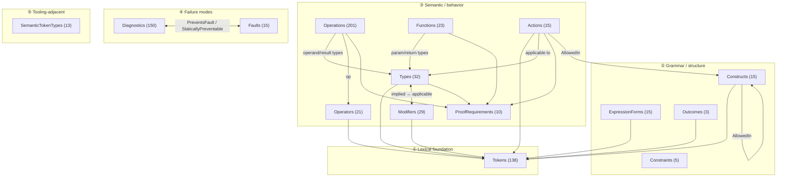
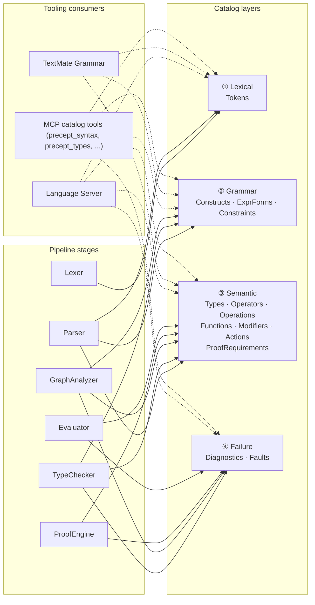
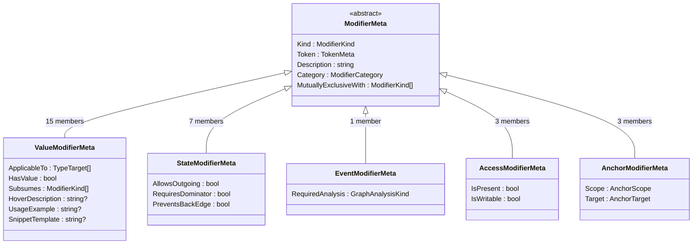
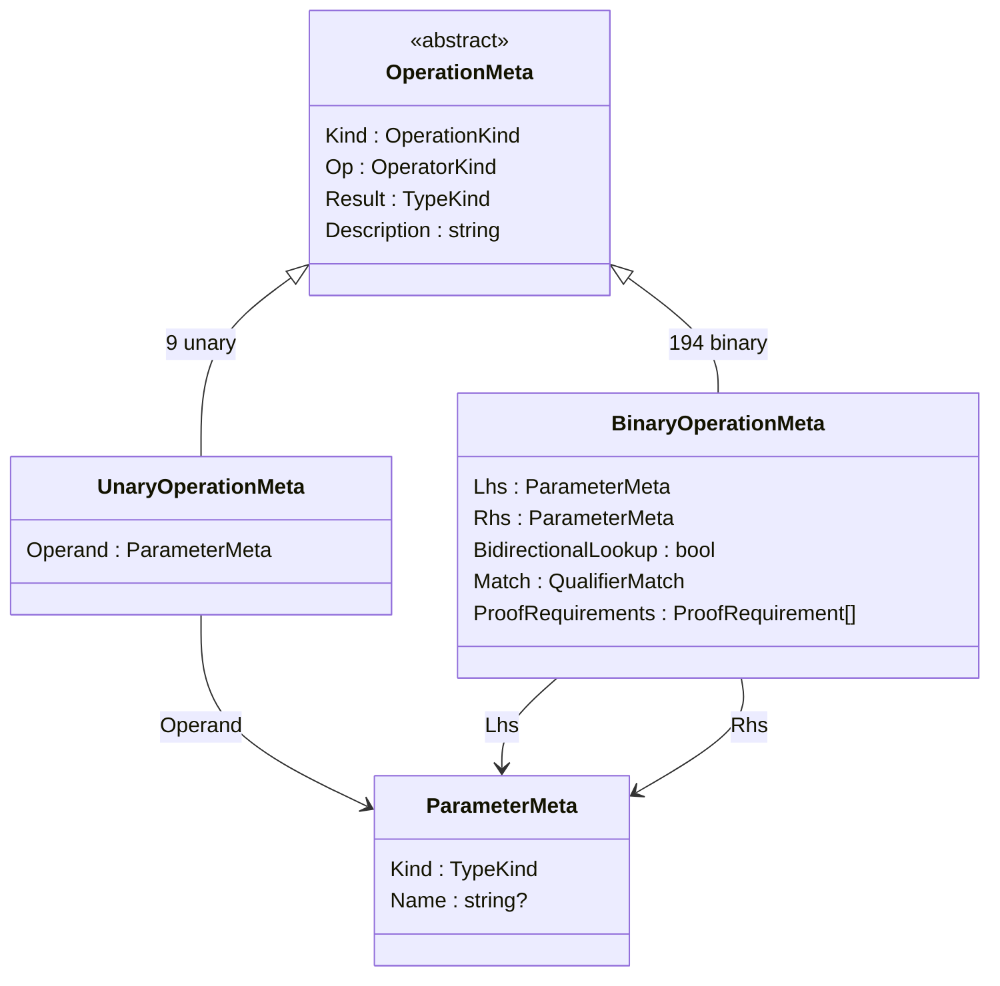
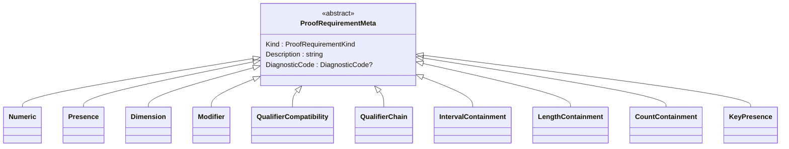

# Catalog System

---

## Status

| Property | Value |
|---|---|
| Doc maturity | Full |
| Implementation state | Implemented — all catalogs in `src/Precept/`; team review complete (2026-04-25) |
| Related | `docs/compiler/diagnostic-system.md` · `docs/runtime/fault-system.md` · `docs/compiler-and-runtime-design.md` |

> **Catalog inventory.** The catalogs describe what the language IS (Tokens, Types, Functions, Operators, Operations, Modifiers, Actions, Constructs, ExpressionForms, Constraints, ProofRequirements, Outcomes) and how it reports failures (Diagnostics, Faults). One is tooling-adjacent: **SemanticTokenTypes**, which carries visual classification metadata consumed by the TextMate grammar generator and the LSP semantic-tokens handler. The Slice-10 architectural decision (`docs/Working/Archive/language-server-implementation-plan.md:641, 645`) treats SemanticTokenTypes as a first-class catalog rather than a hardcoded TokenMeta → scope mapping. **This document is the canonical inventory; other docs reference catalogs by name, not by count.**

> [!IMPORTANT]
> **Non-Negotiable Rules — Read Before Implementing**
>
> - **Catalog the full language surface** — everything language-relevant belongs in a catalog: keywords, types, operators, actions, modifiers, constructs, constraints, proof requirements, diagnostics, and faults. See [§Vision: Metadata for the Entire Language](#vision-metadata-for-the-entire-language) and [§Completeness Principle](#completeness-principle).
> - **Keep pipeline stages generic** — parser, type checker, proof engine, evaluator, tooling, and docs consumers read catalog metadata; they do not encode language knowledge themselves. See [§Architectural Identity: Metadata-Driven](#architectural-identity-metadata-driven).
> - **Put per-member behavior in metadata** — if behavior varies by catalog member, that behavior belongs in the catalog entry's metadata rather than switch statements on enum identity. See [§Architectural Identity: Metadata-Driven](#architectural-identity-metadata-driven) and [§Pattern Definition](#pattern-definition).
> - **Match metadata shape to member shape** — use a discriminated union when members need different metadata shapes, use a flat sealed record when they do not, and never paper over shape differences with nullable fields. See [§Pattern Definition](#pattern-definition) and [§Proof Obligations](#proof-obligations).
> - **Derive from catalogs, never mirror them** — do not maintain parallel token sets, keyword lists, or other copies of knowledge the catalogs already own. See [§Architectural Identity: Metadata-Driven](#architectural-identity-metadata-driven), [§Cross-Catalog Derivation](#cross-catalog-derivation), and [§Pipeline Stage Impact](#pipeline-stage-impact).

## Contents

- [Overview](#overview)
- [Vision: Metadata for the Entire Language](#vision-metadata-for-the-entire-language)
- [Completeness Principle](#completeness-principle)
  - [Enums that remain bare](#enums-that-remain-bare)
- [Architectural Identity: Metadata-Driven](#architectural-identity-metadata-driven)
  - [Vision precedes consumers](#vision-precedes-consumers)
  - [The decision framework](#the-decision-framework)
  - [Enforcement](#enforcement)
  - [Derive, never duplicate](#derive-never-duplicate)
- [Catalog Schema](#catalog-schema)
  - [Level 1 — Catalog Overview Map](#level-1--catalog-overview-map)
  - [Level 2 — Schema Anatomy](#level-2--schema-anatomy)
  - [Level 3 — Member Inventories](#level-3--member-inventories)
- [Pattern Definition](#pattern-definition)
  - [1. Kind enum — the closed set](#1-kind-enum--the-closed-set)
  - [2. Meta record — what consumers need to know](#2-meta-record--what-consumers-need-to-know)
  - [Meta record shape: flat record vs discriminated union](#meta-record-shape-flat-record-vs-discriminated-union)
  - [3. Static catalog class — the exhaustive switch](#3-static-catalog-class--the-exhaustive-switch)
  - [4. Output value type — what the pipeline produces](#4-output-value-type--what-the-pipeline-produces)
- [Why Exhaustive Switch, Not Attributes + Reflection](#why-exhaustive-switch-not-attributes--reflection)
- [Roslyn Enforcement Layer](#roslyn-enforcement-layer)
  - [Implemented Rules](#implemented-rules)
  - [Two-Layer Enforcement Model](#two-layer-enforcement-model)
  - [Future Rules](#future-rules)
- [Exhaustiveness Enforcement Strategies](#exhaustiveness-enforcement-strategies)
  - [Strategy 1: CS8509 — Compiler-Enforced Exhaustive Switch](#strategy-1-cs8509--compiler-enforced-exhaustive-switch)
  - [Strategy 2: `[HandlesCatalogExhaustively]` + `[HandlesCatalogMember]` — Analyzer-Enforced Distributed Dispatch](#strategy-2-handlescatalogexhaustively--handlescatalogmember--analyzer-enforced-distributed-dispatch)
  - [Decision Rule for New Dispatchers](#decision-rule-for-new-dispatchers)
  - [Implementation Dispatchers](#implementation-dispatchers)
- [Naming Convention](#naming-convention)
- [Catalog Inventory](#catalog-inventory) (pointer to source + MCP tools)
- [Supporting Types](#supporting-types)
  - [TypeTarget discriminated union](#typetarget-discriminated-union)
- [Qualifier Propagation](#qualifier-propagation)
  - [The split](#the-split)
  - [Qualifier propagation patterns](#qualifier-propagation-patterns)
  - [Five qualifier-bearing types](#five-qualifier-bearing-types)
  - [Unknown qualifier handling](#unknown-qualifier-handling)
- [Proof Obligations](#proof-obligations)
  - [ProofSubject discriminated union](#proofsubject-discriminated-union)
  - [ProofRequirement discriminated union](#proofrequirement-discriminated-union)
  - [Valid subjects and requirement types per catalog entry](#valid-subjects-and-requirement-types-per-catalog-entry)
  - [ParameterMeta — object-reference safety](#parametermeta--object-reference-safety)
  - [Complete proof obligation inventory](#complete-proof-obligation-inventory)
- [Construct Slot Model](#construct-slot-model)
- [Qualifier Registries (Not Catalogs)](#qualifier-registries-not-catalogs)
- [Syntax Reference](#syntax-reference)
- [Cross-Catalog Derivation](#cross-catalog-derivation)
- [Future Opportunities](#future-opportunities)
- [Test Strategy](#test-strategy)
  - [Non-negotiable rules](#non-negotiable-rules)
  - [Cross-catalog integrity tests](#cross-catalog-integrity-tests)
- [Pipeline Stage Impact](#pipeline-stage-impact)
  - [Parser-catalog integration pattern](#parser-catalog-integration-pattern)
  - [TypeChecker-catalog integration pattern](#typechecker-catalog-integration-pattern)
  - [GraphAnalyzer-catalog integration pattern](#graphanalyzer-catalog-integration-pattern)
  - [ProofEngine-catalog integration pattern](#proofengine-catalog-integration-pattern)
  - [Evaluator-catalog integration pattern](#evaluator-catalog-integration-pattern)
  - [PreceptBuilder-catalog integration pattern](#preceptbuilder-catalog-integration-pattern)
  - [LanguageServer-catalog integration pattern](#languageserver-catalog-integration-pattern)
- [Open Questions / Implementation Notes](#open-questions--implementation-notes)
  - [ValueModifierMeta.ProofSatisfactions](#valuemodifiermetaproofsatisfactions)
  - [ConstructMeta.ModelContribution (Candidate)](#constructmetamodelcontribution-candidate)
  - [FieldDescriptor.AccessModes](#fielddescriptoraccessmodes)
  - [Catalog documentation strings (HoverDescription) — CC#19](#catalog-documentation-strings-hoverdescription--cc19)
- [Cross-References](#cross-references)

## Overview

The catalog system is the **authoritative machine-readable definition of the Precept language.** The catalogs — describing what the language IS, how it reports failures, and (in the tooling-adjacent case) visual classification — form a closed, compiler-enforced registry. This document defines the catalog pattern, the canonical catalog inventory, their shapes, cross-catalog derivation relationships, and future opportunities.

## Vision: Metadata for the Entire Language

Every aspect of Precept — its keywords, types, functions, operators, operations, modifiers, actions, grammar forms, expression forms, constraints, proof requirements, outcome forms, diagnostics, faults, and visual classification — is defined as structured metadata in a static, compiler-enforced catalog. Fifteen catalogs cover the complete language surface (twelve language-definition + two failure-mode + one tooling-adjacent). Their union IS the language specification in machine-readable form.

Every consumer reads from these catalogs:

| Consumer | What it reads |
|----------|---------------|
| MCP catalog-reference tools (`precept_syntax`, `precept_types`, `precept_operations`, `precept_domains`, `precept_proofs`, `precept_patterns`, `precept_diagnostic`) | All keywords, types, operators, operations, functions, constraints, grammar forms, outcome forms — projected per tool from the relevant catalogs |
| TextMate grammar | Token keyword alternations, type name alternations, construct slot patterns, `SemanticTokenTypeMeta.TextMateScope` |
| LS completions | Types, functions, modifiers, actions, outcome forms — context-dependent |
| LS hover | Type documentation, function signatures, operator descriptions, outcome descriptions |
| LS semantic tokens | `TokenMeta.VisualCategory` → `SemanticTokenTypeMeta.CustomType` |
| Type checker | Modifier applicability, function signatures, operation legality |
| Parser (outcome dispatch) | `Outcomes.ByLeadingToken`, `OutcomeMeta.ArgumentKind` |
| AI grounding | All catalogs — complete language knowledge |
| Reference docs | All 12 language definition catalogs |

No consumer maintains its own parallel copy. Adding a language feature to an enum is the single atomic act that propagates it to every surface. The compiler refuses to build if any member is missing metadata.

## Completeness Principle

> If something is part of the Precept language, it gets cataloged.

The test: **if I enumerated every catalog's `All` property, would I have a complete description of Precept?** The catalogs needed are those whose union covers the entire language surface.

Fifteen catalogs in three groups (12 language-definition + 2 failure-mode + 1 tooling-adjacent).

**Language Definition (what the language IS):**

| # | Catalog | What it covers |
|---|---------|----------------|
| 1 | **Tokens** | Lexical vocabulary |
| 2 | **Types** | Type system families |
| 3 | **Functions** | Built-in function library |
| 4 | **Operators** | Operator symbols — precedence, associativity, arity |
| 5 | **Operations** | Typed operator combinations — what (op, lhs, rhs) triples are legal |
| 6 | **Modifiers** | Declaration-attached modifiers — field constraints, state lifecycle, event modifiers, access modes, anchors (DU with 5 subtypes) |
| 7 | **Actions** | State-machine action verbs |
| 8 | **Constructs** | Grammar forms / declaration shapes |
| 9 | **ExpressionForms** | Expression grammar forms — expression node kinds (literal, identifier, binary op, function call, quantifier, CI function call, etc.) |
| 10 | **Constraints** | Constraint declaration forms — invariant, state-anchored, event precondition (DU as identity) |
| 11 | **ProofRequirements** | Proof obligation kinds — 10 members (numeric, presence, dimension, modifier, qualifier compatibility, qualifier chain, interval / length / count containment, key presence) — DU as identity; see § 11 ProofRequirements for the full inventory |
| 12 | **Outcomes** | Transition-row outcome forms — transition, no transition, reject (closed 3-member vocabulary) |

**Failure Modes (how it tells you what's wrong):**

| # | Catalog | What it covers |
|---|---------|----------------|
| 13 | **Diagnostics** | Compile-time rules |
| 14 | **Faults** | Runtime failure modes |

**Tooling-Adjacent (visual classification):**

| # | Catalog | What it covers |
|---|---------|----------------|
| 15 | **SemanticTokenTypes** | LSP semantic-token custom types and TextMate scopes for visual classification — the single-axis bridge `TokenMeta.VisualCategory → SemanticTokenTypeMeta` that powers both the TextMate grammar generator and the LSP semantic-tokens handler |

If a further aspect of the language emerges that isn't covered, it needs a catalog. The system is complete when the catalogs are.

### Enums that remain bare

Not every enum becomes a catalog. Supporting enums stay bare:

| Enum | Why bare |
|------|----------|
| `DiagnosticStage` | 5 values, classification axis for diagnostics, no per-member metadata |
| `Severity` | 3 values, no per-member metadata |
| `TokenCategory` | ~17 values. Grouping key — consumers iterate tokens grouped by category, not categories themselves |

These are internal classification axes. They organize catalog members or AST nodes but don't independently describe the language surface.

**Previously bare, now absorbed by the Modifiers DU:** `StateModifierKind`, `AccessMode`, `EnsureAnchor`, `StateActionAnchor` — these are first-class language surface members as `StateModifierMeta`, `AccessModifierMeta`, and `AnchorModifierMeta` subtypes in `Modifiers.All`.

## Architectural Identity: Metadata-Driven

Precept's compiler and runtime follow a **metadata-driven architecture.** Domain knowledge is declared as structured metadata in catalogs. Pipeline stages are generic machinery that reads it.

This inverts the traditional compiler model:

| | Traditional (Roslyn, GCC, TypeScript) | Precept |
|---|---|---|
| Where domain knowledge lives | Scattered across pipeline stage implementations | Declared in metadata catalogs |
| What a pipeline stage is | A domain-expert that knows the language | Generic machinery that reads metadata |
| How you add a language feature | Touch dozens of files across the pipeline | Add an enum member, fill the exhaustive switch — propagation is automatic |
| What the compiler refuses to build | Code that doesn't compile | Code with incomplete metadata (CS8509 on every exhaustive switch) |
| What tests verify | Implementation behavior | Metadata completeness and correctness |
| What consumers read | Their own parallel copies | The single source of truth |

The catalogs are expressions of this principle — not the principle itself. The principle is: **if something is domain knowledge, it is metadata; if it is metadata, it has a declared shape; if shapes vary by kind, the shape is a discriminated union.** Pipeline stages, tooling, and consumers derive from the metadata — they never maintain parallel copies or encode domain knowledge in their own logic.

**External reference data is distinct from catalogs.** ISO 4217 and UCUM are authoritative third-party data sources that Precept validates against, but they are not themselves part of the Precept language specification. They ship as embedded XML resources with lazy loaders because the data belongs to the outside world. The test is: *is this part of a complete description of Precept?* `TypeMeta` for `currency` is Precept. The 159 currently admitted currency codes are not.

### Vision precedes consumers

The catalog-driven architecture means: **describe the language completely in metadata, then consumers derive from it.** The vision precedes the consumers — not the other way around.

This ordering is non-negotiable. The catalog is not built bottom-up from consumer demand. It is built top-down from language reality. If something IS the language — if it appears in `.precept` files, if it carries semantics, if it would appear in a complete description of Precept — it gets cataloged. Period. Whether any consumer currently reads that metadata is irrelevant to the cataloging decision.

**"No consumer currently uses it" is never a valid argument against cataloging something that IS the language.** This argument inverts the architectural vision. It says: "build the spec from what consumers happen to need today." That is the traditional compiler model — domain knowledge scattered across implementations, maintained as parallel copies, accruing drift. It is exactly what the catalog system exists to prevent.

The correct reasoning is:

1. **Is it language surface?** → Catalog it.
2. **Do consumers exist that read it?** → Irrelevant to step 1. Consumers will derive from it when they need it. The catalog is ready before the consumer arrives.
3. **Does cataloging it have "value" today?** → Yes. Completeness IS the value. A machine-readable spec with gaps is not a spec — it is a collection of implementation notes.

Future agents, reviewers, and architects: if you find yourself arguing "but nothing reads this yet" as grounds to reject a catalog entry, you are repeating the mistake this principle exists to prevent. Stop. Re-read this section. The catalog describes the language. The language is not defined by what consumers happen to query.

### The decision framework

When evaluating whether something belongs in a catalog:

1. **Is it language surface?** Does it appear in `.precept` files, carry semantics that consumers need, or represent a concept that would appear in a complete description of the Precept language?
   - No → bare enum, internal classification axis (e.g., `DiagnosticStage`, `Severity`)
   - Yes → it gets cataloged. Continue:
2. **Do all members share the same metadata shape?** → flat `sealed record`
3. **Do members have varying metadata by kind?** (e.g., field modifiers need `ApplicableTo` but state modifiers need `AllowsOutgoing`) → DU: `abstract record` base + `sealed` subtypes, each carrying exactly its consumers' metadata
4. **No per-member metadata beyond identity?** → still catalog, minimal record `(Kind, Keyword, Description)`

**Anti-pattern: "small enum = bare."** Size is irrelevant. `AccessMode` has 3 values but each has distinct behavioral semantics (`IsPresent`, `IsWritable`) that consumers need. The question is never "how many members?" — it's "do consumers hardcode per-member knowledge that should be metadata?"

**Anti-pattern: "flat record with inapplicable fields."** If a flat metadata record has fields that are meaningless for some members, that's a signal for a DU — not a signal to reject cataloging. The DU ensures each subtype carries exactly the fields its consumers need.

**Anti-pattern: "no consumer currently uses it."** The absence of a current consumer is not evidence against cataloging. It is evidence that the catalog is ahead of the consumers — which is the correct ordering. The catalog is the machine-readable language specification. A spec does not omit sections because no reader has asked about them yet. If the element is language surface, it is cataloged — consumer demand is not a prerequisite.

### Enforcement

The exhaustive switch is the enforcement — the C# compiler refuses to build if any member is missing metadata (CS8509). The `All` property is the enumeration surface — MCP and LS iterate it rather than maintaining their own lists. The `Create()` factory is the derivation path — pipeline stages produce output values from the catalog rather than constructing them ad hoc.

### Derive, never duplicate

The catalogs cover vocabulary, types, functions, operators, operations, modifiers, actions, grammar constructs, expression forms, constraints, proof requirements, outcome forms, compile-time rules, runtime failure modes, and visual classification. Their union is the language. Every downstream artifact — grammar, completions, hover, MCP output, documentation — derives from catalog metadata. No consumer maintains a parallel copy. Adding a language feature to an enum is the single atomic act that propagates it to every surface.

### Architectural Violation Patterns

Pipeline-stage code that violates the catalog-driven contract reliably falls into one of eight recurring shapes. Naming them gives reviewers a shared vocabulary for spotting drift and gives authors a checklist to consult before writing pipeline code that "looks fine but answers a language question locally."

| Pattern | Symptom | Catalog remediation |
|---|---|---|
| **A — Hardcoded token allowlist** | A method whitelists specific `TokenKind` values when deciding whether to start parsing an expression, modifier value, or message body. | Derive the allowlist from catalog metadata such as `ExpressionStartTokens`, `TokenMeta.IsMessagePosition`, or per-construct slot start sets. |
| **B — Enum-identity switch on `*Kind` to dispatch per-member behavior** | `kind switch { FooKind.Bar => …, FooKind.Baz => … }` where each arm exists "because the language says so." Per-member behavior leaks from metadata into the consumer. | Move the behavior onto the catalog's meta record; consumer becomes a generic walker. (Switching on a DU **subtype** remains correct — the subtype IS the metadata shape.) |
| **C — Bypassed metadata shape** | A specialized path parses or validates a construct using a stripped-down grammar that ignores the catalog's declared shape (e.g., event-argument modifiers skipping `ValueModifierMeta.HasValue`). | Reuse the shared metadata-driven path. Specializations of grammar are catalog gaps; encode them on the meta record. |
| **D — Hardcoded language fact** | An operator-implication table, type-default table, collection-suffix table, or operator-folding table lives in C# code. The next reader has to discover the table. | Promote to catalog metadata (`OperatorMeta.InverseComparison`, `TypeMeta.AbstractDefaultValue`, `TypeMeta.CollectionSyntax`, etc.). |
| **E — Sentinel-encoded semantics** | A wildcard or broadcast target is carried as `null`, `"any"`, or a magic string instead of a typed metadata field. Consumers re-derive its meaning by literal comparison. | Add a typed metadata field (`TokenMeta.IsStateWildcard`, `FieldTargetKind`, broadcast policy on transition rows). The sentinel disappears. |
| **F — Proof-engine local knowledge** | Proof discharge, diagnostic mapping, or guard reasoning encodes operator/accessor/requirement semantics in handwritten switches. | Add proof metadata to the relevant catalog (`ProofRequirementMeta.FailureDiagnostic`, `OperatorMeta.SatisfactionCovers`, accessor-level `LogicalRole`). The discharge engine becomes generic. |
| **G — Reserved** | (Reserved — no representative violations in current audit; kept for taxonomy stability.) | — |
| **H — Out-of-band classification axis** | A consumer maintains a side-channel taxonomy (`if mod == X || mod == Y` checks for "initial-ish" modifiers, paired-bound modifier checks) rather than reading a metadata flag. | Add the semantic role flag to the catalog (`Modifiers.BoundCounterpart`, `MarksInitial`, `AffectsPresence`, `AffectsWritability`). |

**Reviewer rule.** Any new pipeline-stage code that adds switch statements over `*Kind`, parses tokens by hand-crafted allowlists, or encodes language facts as local C# tables should be referred back to the catalog. If the catalog cannot express the needed metadata, the gap is the actual deliverable — not a workaround in the consumer.

These eight patterns originated in the 2026-05 catalog compliance audit. See [`docs/Working/Archive/catalog-compliance-audit.md`](../Working/Archive/catalog-compliance-audit.md) for the historical violation inventory and bug map.

---

## Catalog Schema

Three levels of detail. Use the overview map to see the full 15-catalog topology at a glance, the schema anatomy sections to understand the structurally complex catalogs, and the reference tables for complete member inventories.

---

### Level 1 — Catalog Overview Map

Two views of the same system. The **topology** diagram shows the four-layer catalog structure and cross-catalog references. The **consumer landscape** diagram shows which pipeline stages and tooling derive from which layers.

**Catalog topology**



**Consumer landscape**



**Reading the diagrams:**

- **Tokens** is the lexical foundation — six catalogs carry direct `TokenMeta` or `TokenKind` references upward to it.
- **Types** and **Constructs** are the twin semantic hubs — Types for runtime behavior, Constructs for grammar schema.
- **Operations** is the typed-legality hub — it ties Operators + Types + ProofRequirements together.
- **Diagnostics ↔ Faults** is the only bidirectional pair — each points to the other via `PreventsFault` / `[StaticallyPreventable]`.
- **SemanticTokenTypes** is tooling-adjacent — `TokenMeta.VisualCategory` points upward to it, and both the TextMate grammar generator and the LSP semantic-tokens handler read its metadata. See §Catalog Inventory → SemanticTokenTypes for the one-field architecture rationale.
- `ConstructSlotKind` is a helper enum embedded in the Constructs schema surface, not a catalog — it carries no `GetMeta()` or `All`; see Level 3 for its 20-member inventory and the `SlotVocabulary` enum that pairs with it.
- In the consumer diagram, each layer box aggregates multiple catalogs. Solid arrows = pipeline stages; dashed arrows = tooling. No consumer maintains its own parallel list — all derive from catalog `All` properties.

---

### Level 2 — Schema Anatomy

Schema detail for the five structurally complex catalogs.

---

#### Constructs — grammar schema hub

`ConstructMeta` is the grammar schema hub — every declaration shape in the language maps to one entry. The schema hangs off three supporting types.

```
ConstructMeta
├── Kind              : ConstructKind                         identity
├── Name              : string                                human-readable name
├── Description       : string                                purpose description
├── UsageExample      : string                                DSL snippet
├── AllowedIn         : ConstructKind[]                  ◄── self-reference: nesting rules (empty = top-level)
├── Slots             : IReadOnlyList<ConstructSlot>     ◄── ordered schema of declaration positions
├── Entries           : ImmutableArray<DisambiguationEntry>   ◄── leading-token routing map
├── RoutingFamily     : RoutingFamily                         parser dispatch category
└── SnippetTemplate   : string?                               optional LS completion snippet

ConstructSlot
├── Kind                 : ConstructSlotKind                ◄── 20-member helper enum (see Level 3)
├── IsRequired           : bool                                  whether slot is mandatory
├── Description          : string?                               optional hint
├── TerminationTokens    : TokenKind[]?                          optional slot-local Pratt terminators
├── IsList               : bool                                  slot accepts comma- or introducer-separated items
├── IsChainable          : bool                                  slot accepts an arrow chain (action chains)
├── ItemIntroducerToken  : TokenKind?                            separator/introducer token between list items
└── Vocabulary           : SlotVocabulary                        completion vocabulary (13-member enum) for this slot position

DisambiguationEntry
├── LeadingToken      : TokenKind                        ◄── anchors to Tokens catalog
├── DisambiguationTokens : ImmutableArray<TokenKind>?         second-token disambiguation set
└── LeadingTokenSlot  : ConstructSlotKind?                    which slot the leading token occupies
```

`RoutingFamily` controls parser dispatch:

| Value | Meaning |
|-------|---------|
| `Header` | Pre-loop preamble — not through standard dispatch |
| `Direct` | Unique leading token; routed directly |
| `StateScoped` | Shares `in`/`to`/`from`; routed via `DisambiguationEntry` |
| `EventScoped` | Shares `on`; routed via `DisambiguationEntry` |

`Constructs.ByLeadingToken` is the derived index — maps each leading `TokenKind` to all construct entries that begin with it. The parser derives disambiguation from this index, not from hardcoded token sets.

---

#### Modifiers — 5-subtype discriminated union

`ModifierMeta` is a discriminated union with **5 sealed subtypes** — the clearest example of the catalog-system thesis. Previously four bare enums (`StateModifierKind`, `AccessMode`, `EnsureAnchor`, `StateActionAnchor`) are now first-class catalog members.



**Subtype member distribution (29 total):**

| Subtype | Count | Representative members |
|---------|------:|------------------------|
| `ValueModifierMeta` | 15 | `optional`, `writable`, `nonnegative`, `positive`, `notempty`, `min`, `max`, `ordered` |
| `StateModifierMeta` | 7 | `initial` (state), `terminal`, `required`, `irreversible`, `success`, `warning`, `error` |
| `EventModifierMeta` | 1 | `initial` (event) |
| `AccessModifierMeta` | 3 | `editable` (Write), `readonly` (Read), `omit` (Omit) |
| `AnchorModifierMeta` | 3 | `in`, `to`, `from` |

> The `modify` keyword is a construct-level verb that introduces the AccessMode construct — it is not a `ModifierKind` member. The access adjective (`editable`, `readonly`) or the `omit` verb determines the `ModifierKind`. The `initial` keyword appears in two subtypes— `InitialState` (`StateModifierMeta`) and `InitialEvent` (`EventModifierMeta`) — same token text, different subtypes, different metadata. `AnchorTarget` disambiguates the three anchor kinds between ensure and state-action contexts.

---

#### Operations — typed-legality hub

`OperationMeta` is a discriminated union with **2 sealed subtypes**. 201 entries cover every legal `(operator, operand type(s)) → result type` combination in the language.



- **`ParameterMeta`** uses object identity — `ParamSubject` holds a direct reference to the `ParameterMeta` instance in the containing operation or overload, enforcing referential integrity across the catalog (see Proof Obligations).
- **`BidirectionalLookup = true`** registers both `(op, lhs, rhs)` and `(op, rhs, lhs)` in the index so commutative operations use one entry for both orderings.
- **`QualifierMatch`** handles the two operations whose result type depends on qualifier comparison (`money/money`, `quantity/quantity`): `Same` → ratio result, `Different` → currency-pair or compound-unit result.

---

#### ProofRequirements — catalog meta vs. obligation instances

Two separate type hierarchies: **catalog meta** (static identity, 10 members in `ProofRequirements.All`) and **obligation instances** (per-use payload, carried inside other catalog entries that declare requirements).

**Catalog meta — DU as identity (10 members):**



The base record carries a `DiagnosticCode? DiagnosticCode` field (F-LANG-CAT-09) — the catalog-mediated diagnostic emitted when this obligation kind fails. Null only for `Numeric` (1:many mapping; routes to `DivisionByZero`, `SqrtOfNegative`, `UnguardedCollectionAccess`, or `UnguardedCollectionMutation` depending on context) and `KeyPresence` (routes to `PRE0099` or `PRE0101` depending on `RequireAbsence`). Source: `src/Precept/Language/ProofRequirement.cs:204`.

**Obligation instances — DU with per-kind payloads:**

```mermaid
classDiagram
    class ProofRequirement {
        <<abstract>>
        Kind : ProofRequirementKind
        Description : string
    }
    class NumericProofRequirement {
        Subject : ProofSubject
        Comparison : OperatorKind
        Threshold : decimal
    }
    class PresenceProofRequirement {
        Subject : ProofSubject
    }
    class DimensionProofRequirement {
        Subject : ProofSubject
        RequiredDimension : PeriodDimension
    }
    class QualifierCompatibilityProofRequirement {
        LeftSubject : ProofSubject
        RightSubject : ProofSubject
        Axis : QualifierAxis
    }
    class QualifierChainProofRequirement {
        LeftSubject : ProofSubject
        LeftAxis : QualifierAxis
        RightSubject : ProofSubject
        RightAxis : QualifierAxis
    }
    class ModifierRequirement {
        Subject : ProofSubject
        Required : ModifierKind
    }
    class IntervalContainmentProofRequirement {
        Subject : ProofSubject
        TargetField : string
        DeclaredMin/Max : decimal?
        AuthoredMin/Max : decimal?
    }
    class LengthContainmentProofRequirement {
        Subject : ProofSubject
        TargetField : string
        DeclaredMinLength/MaxLength : int?
    }
    class CountContainmentProofRequirement {
        Subject : ProofSubject
        TargetField : string
        DeclaredMinCount/MaxCount : int?
    }
    class KeyPresenceProofRequirement {
        Subject : ProofSubject
        RequireAbsence : bool
    }
    ProofRequirement <|-- NumericProofRequirement
    ProofRequirement <|-- PresenceProofRequirement
    ProofRequirement <|-- DimensionProofRequirement
    ProofRequirement <|-- QualifierCompatibilityProofRequirement
    ProofRequirement <|-- QualifierChainProofRequirement
    ProofRequirement <|-- ModifierRequirement
    ProofRequirement <|-- IntervalContainmentProofRequirement
    ProofRequirement <|-- LengthContainmentProofRequirement
    ProofRequirement <|-- CountContainmentProofRequirement
    ProofRequirement <|-- KeyPresenceProofRequirement
```



`QualifierCompatibilityProofRequirement` and `QualifierChainProofRequirement` are dual-subject — they carry both `LeftSubject` and `RightSubject` independently. Consumers check `meta is ProofRequirementMeta.QualifierCompatibility` (or `.QualifierChain`) to detect dual-subject obligations without a `SubjectArity` field. Source: `src/Precept/Language/ProofRequirement.cs`.

Obligation instances are declared **inside other catalog entries** (`BinaryOperationMeta.ProofRequirements`, `FunctionOverload.ProofRequirements`, `TypeAccessor.ProofRequirements`, `ActionMeta.ProofRequirements`). The `ProofRequirementMeta` catalog describes obligation *kinds* — the instances are the actual declared obligations attached to specific catalog entries.

---

#### Diagnostics and Faults — bidirectional failure-mode pair

The only bidirectional catalog pair. Each catalog points to the other.

```
DiagnosticMeta                                       FaultMeta
─────────────────────────────────────────────        ─────────────────────────────────────
Code              : string                           Code            : string
Stage             : DiagnosticStage                  MessageTemplate : string
Severity          : Severity                         Severity        : FaultSeverity = Fatal
MessageTemplate   : string                           RecoveryHint    : string?
Category          : DiagnosticCategory
RelatedCodes      : DiagnosticCode[]?
FixHint           : string?
PreventsFault     : FaultCode?         ──────────►
SuggestionSources : SuggestionSource[]?              FaultCode enum members decorated with:
TriggerCondition  : string?                ◄─────── [StaticallyPreventable(DiagnosticCode.X)]
RecoverySteps     : string[]?
ExampleBefore     : string?
ExampleAfter      : string?
```

`DiagnosticMeta` (source: `src/Precept/Language/Diagnostics.cs:23`) carries 13 fields. Beyond the original 8 above, five additional fields drive richer LS / MCP surfacing (F-LANG-CAT-12):

- **`SuggestionSources : SuggestionSource[]?`** — identifies the symbol namespaces the language server searches for "did you mean?" suggestions. The `SuggestionSource` enum has 4 members: `UserFields`, `UserStates`, `UserEvents`, `FunctionCatalog`.
- **`TriggerCondition : string?`** — human-readable description of the exact source-code condition that triggers this diagnostic. Surfaced by MCP `precept_diagnostic` for AI grounding.
- **`RecoverySteps : string[]?`** — ordered remediation steps shown to users when the diagnostic fires.
- **`ExampleBefore : string?`** / **`ExampleAfter : string?`** — minimal source-text examples bracketing the fix. MCP and LS both surface these.

`FaultMeta` (source: `src/Precept/Language/Faults.cs:3`) carries 4 fields: `Code`, `MessageTemplate`, `Severity` (`FaultSeverity.Fatal` for every shipping fault — the field exists so non-fatal severities are representable when the runtime grows them; F-LANG-CAT-14), and a per-fault `RecoveryHint` populated on every member.

**Two enforcement layers close the loop:**

| Mechanism | What it enforces |
|-----------|-----------------|
| `DiagnosticMeta.PreventsFault` | Every diagnostic that prevents a runtime fault names which fault |
| `[StaticallyPreventable(DiagnosticCode.X)]` on `FaultCode` | Every runtime fault names the compile-time rule that should prevent it — **PRECEPT0002** fires if a `FaultCode` member lacks this attribute |

The pair is bidirectional by design: diagnostics are the compile-time face, faults are the runtime face. Every fault that can be statically prevented has a corresponding diagnostic, and every diagnostic that prevents a fault names it. Any gap in the linkage is a build error.

---

### Level 3 — Member Inventories

This document deliberately does not enumerate catalog members. The canonical inventory lives in `src/Precept/Language/*.cs` (one file per catalog: `TokenKind.cs`, `Tokens.cs`, `TypeKind.cs`, `Types.cs`, `FunctionKind.cs`, etc.). Maintaining a parallel inventory in markdown would be exactly the failure mode the catalog system is designed to prevent — applying the catalog-driven discipline to the doc about the catalog system.

To enumerate members at any granularity, query the MCP catalog-reference tools — they iterate the catalogs at request time and produce complete, always-accurate output:

- `precept_syntax` — tokens, keywords, syntactic categories
- `precept_types` — type system surface (primitives, temporal, business-domain, collection)
- `precept_operations` — operations catalog with operand and result types
- `precept_domains` — domain catalogs (currencies, units, timezones)
- `precept_proofs` — proof obligations and fault catalog
- `precept_patterns` — DSL patterns and anti-patterns
- `precept_diagnostic <CODE>` — individual diagnostic detail

Architecture and pipeline-integration content for each catalog lives in the rest of this document.

---

## Pattern Definition

A catalog has four parts:

### 1. Kind enum — the closed set

```csharp
public enum TokenKind
{
    // ── Keywords: Declaration ───────────────────────────
    Precept,
    Field,
    State,
    Writable,
    ...
}
```

A plain C# `enum`. One member per distinct entry. No attributes — metadata lives in the switch, not on the enum. Grouped by section with comment headers for readability.

### 2. Meta record — what consumers need to know

```csharp
public sealed record TokenMeta(
    TokenKind                      Kind,
    string?                        Text,
    IReadOnlyList<TokenCategory>   Categories,
    string                         Description,
    SemanticTokenTypeKind?         VisualCategory = null,
    TokenKind[]?                   ValidAfter = null,
    bool                           IsAccessModeAdjective = false,
    bool                           IsStateWildcard = false,
    bool                           IsFieldBroadcast = false,
    bool                           IsFunctionCallLeader = false,
    bool                           IsMessagePosition = false
)
{
    // Computed — derived from Types.All accessor names; not a constructor parameter.
    public bool IsValidAsMemberName { get; }
}
```

`TokenMeta` now carries one lightweight visual-catalog link: `VisualCategory` points to `SemanticTokenTypes` by enum kind. The bridge direction remains **unidirectional upward** for object references: downstream catalogs (Types, Operators, Modifiers, Actions) point up to Tokens via `TokenMeta Token` object references. Consumers that need reverse direction (token → catalog entry or token → visual metadata) use **derived frozen indexes** built at startup or the corresponding catalog lookup:

```csharp
// Derived at startup from the catalog that owns the relationship
FrozenDictionary<TokenKind, TypeMeta>     TypesByToken     = Types.All.ToFrozenDictionary(t => t.Token.Kind);
FrozenDictionary<TokenKind, OperatorMeta> OperatorsByToken = Operators.All.ToFrozenDictionary(o => o.Token.Kind);
```

This avoids cross-ref fields on `TokenMeta` that would be inapplicable for most members (only ~25 of 91+ tokens are type keywords, ~16 are operators). It also avoids the dual-use problem — `Set` is both an action and a type, `Min`/`Max` are both modifiers and functions — which would require either multiple nullable fields or a DU wrapper. Derived indexes handle dual-use naturally: each catalog builds its own index from its own `All` property.

The LS never needs token → catalog entry lookups — it works from AST nodes and resolved symbols, which already carry the typed `Kind`. MCP iterates each catalog's `All` directly. The reverse index exists for any consumer that needs it, derived from the source of truth (the downstream catalog's `Token` field).

An immutable record holding all metadata for a single enum member. The shape varies per catalog — each Meta type carries exactly the fields its consumers need, no more. Shared fields across all catalogs:

| Field | Purpose |
|-------|---------|
| The kind enum value | Identity — which member this metadata describes |
| A string code or text | Stable string identity for serialization (MCP, LS) |
| A description or message template | Human-readable explanation |

Domain-specific fields are added as needed. `TokenMeta` has `Categories` and nullable `Text`. `DiagnosticMeta` has `Stage` and `Severity`. `FaultMeta` has only `Code` and `MessageTemplate`. The meta type is right-sized for its consumers.

### Meta record shape: flat record vs discriminated union

When all catalog members share the same metadata shape, the meta type is a **flat sealed record**. When members fall into groups with genuinely different fields, the meta type is a **discriminated union** — an abstract record base with sealed subtypes.

**DU with different fields** — the subtype carries fields that only make sense for that group. `ModifierMeta` and `OperationMeta` use this pattern:

```csharp
// ValueModifierMeta carries ApplicableTo, Subsumes — inapplicable to StateModifierMeta
public sealed record ValueModifierMeta(..., TypeTarget[] ApplicableTo, ...) : ModifierMeta(...);
// StateModifierMeta carries AllowsOutgoing, RequiresDominator — inapplicable to ValueModifierMeta
public sealed record StateModifierMeta(..., bool AllowsOutgoing, ...) : ModifierMeta(...);
```

**DU as identity** — subtypes carry no unique fields, but the type IS the semantic signal. `ConstraintMeta` and `ProofRequirementMeta` use this pattern. Consumers pattern-match exhaustively; the compiler catches unhandled cases when new members are added:

```csharp
public abstract record ConstraintMeta(ConstraintKind Kind, string Description)
{
    public sealed record Invariant()     : ConstraintMeta(...);
    public abstract record StateAnchored(ConstraintKind Kind, string Description) : ConstraintMeta(Kind, Description);
    public sealed record StateResident() : StateAnchored(...);  // in <State> ensure
    public sealed record StateEntry()    : StateAnchored(...);  // to <State> ensure
    public sealed record StateExit()     : StateAnchored(...);  // from <State> ensure (three subtypes under StateAnchored)
    public sealed record EventPrecondition() : ConstraintMeta(...);
}

// Consumer: type IS the signal — no field check needed
var plan = meta switch
{
    ConstraintMeta.Invariant         => alwaysBucket,
    ConstraintMeta.StateAnchored     => stateBucket,  // matches all three state kinds
    ConstraintMeta.EventPrecondition => eventBucket,
};
```

The full five-subtype hierarchy: `Invariant`, `StateResident`, `StateEntry`, `StateExit`, and `EventPrecondition`. `StateResident`, `StateEntry`, and `StateExit` are all subtypes of the `StateAnchored` abstract intermediate. Canonical shape locked in `precept-builder.md` §Pass 4 (CC#7).

This is **not** an enum in disguise. The DU provides:
1. **Compile-time exhaustiveness** — a new enum member without a matching subtype is a build error at every pattern-match site
2. **Type IS the semantic signal** — `meta is StateAnchored` is structurally safer than `meta.Scope == ConstraintScope.State`; no field value can be misassigned
3. **Hierarchy encodes grouping** — the intermediate `StateAnchored` abstract layer expresses that three kinds share a scope axis without needing an extra `ConstraintScope` enum field
4. **Extensibility** — adding a field to one subtype later is non-breaking; flat records require all-member changes

The rule: if you find yourself adding a `ScopeKind`, `SubjectArity`, or similar classification field whose values map 1:1 to subsets of enum members, that field is a sign the meta should be a DU instead.

### 3. Static catalog class — the exhaustive switch

```csharp
public static class Diagnostics
{
    public static DiagnosticMeta GetMeta(DiagnosticCode code) => code switch
    {
        DiagnosticCode.UnterminatedStringLiteral => new(nameof(...), ...),
        DiagnosticCode.InvalidCharacter          => new(nameof(...), ...),
        ...
        _ => throw new ArgumentOutOfRangeException(nameof(code), code, null),
    };

    public static IReadOnlyList<DiagnosticMeta> All { get; } =
        Enum.GetValues<DiagnosticCode>().Select(GetMeta).ToList();

    public static Diagnostic Create(DiagnosticCode code, SourceSpan span, params object?[] args)
    {
        var meta = GetMeta(code);
        return new(meta.Severity, meta.Stage, meta.Code,
            string.Format(meta.MessageTemplate, args), span);
    }
}
```

Three members:

| Member | Purpose | Present in all catalogs |
|--------|---------|------------------------|
| `GetMeta(Kind)` | Exhaustive switch — every enum member maps to its metadata | Yes — this is the catalog |
| `All` | `IReadOnlyList<Meta>` built from `Enum.GetValues<Kind>().Select(GetMeta)` | Yes — MCP enumeration surface |
| `Create(...)` | Factory that formats a runtime output value from the metadata | When the catalog has an associated output type |

Domain-specific members are added as needed. `Tokens` has a `Keywords` frozen dictionary for lexer keyword lookup, derived from `All`.

### 4. Output value type — what the pipeline produces

```csharp
public readonly record struct Diagnostic(
    Severity        Severity,
    DiagnosticStage Stage,
    string          Code,
    string          Message,
    SourceSpan      Span
);
```

Constructed exclusively through the catalog's `Create()` factory, which derives fields from the meta. Not all catalogs have an output type — `Tokens.All` is consumed directly as metadata, with `Token` being the lexer's own output type.

## Why Exhaustive Switch, Not Attributes + Reflection

An alternative approach: decorate enum members with attributes (`[TokenCategory]`, `[TokenDescription]`) and read them via reflection at startup. That works, but: **a missing attribute is a runtime failure, not a compile-time failure.** Closing the gap requires a custom Roslyn analyzer — two layers doing related work.

The exhaustive switch uses the C# compiler directly:

- Add an enum member without a switch arm → **CS8509** (non-exhaustive switch expression). With `<TreatWarningsAsErrors>true</TreatWarningsAsErrors>` → **build fails**.
- No custom Roslyn rule needed for catalog completeness.
- No reflection. No source generator. No startup cost.
- The switch IS the catalog. The compiler IS the enforcement.

The trade-off: the switch is more verbose than attributes. At Precept's scale (50–170 enum members per catalog), this is acceptable.

## Roslyn Enforcement Layer

The exhaustive switch (CS8509) enforces catalog completeness — every enum member must have metadata. But the catalog system has obligations the C# compiler cannot see: that every `FaultCode` member is linked to a preventing diagnostic; that the `Diagnostic` and `Fault` output values are constructed via their factory rather than with arbitrary string codes; that `ParamSubject` parameter references stay reference-equal to the owning overload's `ParameterMeta` instances; that every catalog DU base is sealed and every subtype is exhaustively pattern-matched. These cross-file, semantic obligations require analyzers.

**Why two gates exist.** The analyzer family enforces a single architectural guarantee: **the catalog's declared promises are kept and stay kept.** Adding a new diagnostic code without an emission site silently degrades user experience — the spec advertises a compiler check the compiler does not run. Adding an emission site without a test allows regressions to slip through. **Gate 1** (`PRECEPT0027`) requires every declared `DiagnosticCode` either to have an emission site (direct `Diagnostics.Create(...)` call, catalog-mediated `CIDiagnosticCode`, or proof-engine dispatch) or to be on the allow-list with a tracking comment. **Gate 2** (`PRECEPT0028`) requires every emitted code to be referenced in at least one test file. The allow-list hygiene rules (`PRECEPT0029`, `PRECEPT0030`) prevent the allow-list itself from becoming a quiet dumping ground for unmet obligations — every allow-list entry must be a tracked, time-bounded debt. Together this is the answer to "how do we know the catalog's promises are kept?"

**Catalog DU discipline.** A catalog whose meta is a discriminated union (`ModifierMeta`, `OperationMeta`, `ConstraintMeta`, `ProofRequirementMeta`, etc.) only delivers its safety guarantee when the hierarchy is **sealed** (no out-of-tree subclassing can bypass the catalog) and when every consumer pattern-matches the base type **exhaustively** (no `_ => default` wildcard arm that silently swallows a new subtype). `PRECEPT0025` forbids wildcard arms on catalog DU pattern matches, and `PRECEPT0026` verifies every concrete subtype has a corresponding arm. Without these, the DU degrades to "switch-on-enum with an inert subtype hierarchy" — the failure mode the DU exists to prevent.

### Enforcement Rules — Categorized

The ten categories below cover every analyzer rule currently shipping in `src/Precept.Analyzers/`. Each row points to the source file(s) for the per-rule mechanics — this table intentionally does not duplicate them.

| # | Category | What it enforces (one line) | Rule prefix(es) | Source file(s) |
|---|---|---|---|---|
| 1 | Fault / diagnostic conventions | `Fail(...)` must pass a `FaultCode` first; output values (`Diagnostic`, `Fault`) must go through the `Create()` factory; every `FaultCode` carries `[StaticallyPreventable(DiagnosticCode.X)]`. | `PRECEPT0001`–`PRECEPT0004` | `Precept0001FailMustUseFaultCode.cs`, `Precept0002FaultCodeMustHaveStaticallyPreventable.cs`, `Precept0003DiagnosticMustUseCreate.cs`, `Precept0004FaultMustUseCreate.cs` |
| 2 | `GetMeta` exhaustiveness | Every catalog's `GetMeta(...)` switch covers every enum member; missing arms are a build error rather than a runtime throw. | `PRECEPT0007` | `Precept0007GetMetaExhaustiveness.cs` |
| 3 | Per-catalog cross-reference integrity | Every cross-catalog reference is resolvable and consistent — `Types ↔ Tokens`, `Operations ↔ Operators`, `Modifiers ↔ TypeTarget`, `Functions ↔ Types`, `Actions ↔ TypeTarget`, `Constructs ↔ TokenKind`, `Diagnostics ↔ FaultCode`, `Faults ↔ DiagnosticCode`, `Operators ↔ TokenKind`. | `PRECEPT0008`–`PRECEPT0017` (subset) | `Precept0008TypesCrossRef.cs`, `Precept0009OperationsCrossRef.cs`, `Precept0011ModifiersCrossRef.cs`, `Precept0012FunctionsCrossRef.cs`, `Precept0013ActionsCrossRef.cs`, `Precept0014ConstructsCrossRef.cs`, `Precept0015DiagnosticsCrossRef.cs`, `Precept0016FaultsCrossRef.cs`, `Precept0017OperatorsCrossRef.cs` |
| 4 | Semantic enum zero-slot enforcement | An enum used as a semantic axis must explicitly declare a sentinel zero member (or carry the `[AllowZeroDefault]` annotation), preventing a silently-defaulted zero from becoming an unintended axis value. | `PRECEPT0018` | `Precept0018SemanticEnumZeroSlot.cs` |
| 5 | Pipeline exhaustiveness (`[HandlesCatalogExhaustively]`) | A class decorated with `[HandlesCatalogExhaustively(typeof(Kind))]` must carry `[HandlesCatalogMember(Kind.X)]` annotations whose union covers every member of the catalog. Used where dispatch is distributed across multiple methods and CS8509 cannot see across the split (canonical example: `ExpressionFormKind` in the Pratt parser). | `PRECEPT0019` | `Precept0019PipelineCoverageExhaustiveness.cs` |
| 6 | Operator / token integrity | An operator's token reference is unique (no two `OperatorMeta` instances share a token); no `TokenMeta.Text` collisions across the Tokens catalog; operator metadata is declared via the canonical `Operators.cs` factory rather than inline; `OperatorMeta` DU shape invariants are upheld. | `PRECEPT0020`–`PRECEPT0023` | `Precept0020OperatorsTokenCollision.cs`, `Precept0021TokensDuplicateText.cs`, `Precept0022OperatorsInlineToken.cs`, `Precept0023OperatorsDUShapeInvariants.cs` |
| 7 | Catalog DU discipline (sealed hierarchies + completeness) | Catalog DU base records must be sealed at the family root (no wildcard `_ => default` arms); every concrete subtype must have a pattern-match arm at every consumer site. Drives the DU-as-identity safety guarantee. | `PRECEPT0024`–`PRECEPT0026` | `Precept0024AntiMirroringEnforcement.cs`, `Precept0025CatalogDUWildcard.cs`, `Precept0026CatalogDUCompleteness.cs` |
| 8 | Diagnostic emission gate (Gate 1) | Every `DiagnosticCode` member must have at least one emission site (direct `Diagnostics.Create(...)`, catalog-mediated `CIDiagnosticCode`, or proof-engine dispatch) — or be allow-listed with a tracking entry. Prevents catalog-declared diagnostics from advertising checks the compiler does not actually run. | `PRECEPT0027` | `Precept0027DiagnosticEmissionCoverage.cs`, `DiagnosticCoverageScanner.cs` |
| 9 | Diagnostic test gate (Gate 2) | Every emitted `DiagnosticCode` must be referenced in at least one test file. Scoped to codes that pass Gate 1 — codes on the Gate 1 allow-list have no test obligation. Prevents emitted diagnostics from regressing untested. | `PRECEPT0028` | `Precept0028DiagnosticTestCoverage.cs`, `DiagnosticCoverageScanner.cs` |
| 10 | Allow-list hygiene | Allow-list entries for Gate 1 / Gate 2 must carry tracking metadata (issue link or deadline marker) and must not be stale; analyzer flags entries that have been on the list past their tracking horizon. | `PRECEPT0029`, `PRECEPT0030` | `DiagnosticCoverageAllowLists.cs` |

**Two-layer enforcement model.** The C# compiler enforces metadata completeness through CS8509 on every `GetMeta()` switch (no analyzer needed — the switch IS the catalog). The Roslyn layer enforces everything CS8509 cannot see: cross-file references, factory discipline, distributed dispatch coverage, catalog DU hierarchy invariants, and the catalog-promises-are-kept gates.

| Layer | Mechanism | What it enforces | Scope |
|-------|-----------|-----------------|-------|
| **Compiler** | CS8509 (exhaustive switch) | Every enum member has a metadata entry in its catalog's `GetMeta()` switch | All catalogs |
| **Roslyn** | `PRECEPT0001`–`PRECEPT0030` | The 10 categories above | Diagnostics + Faults + cross-catalog references + DU discipline + emission/test gates |

For per-rule mechanics — error message, severity, code shape, suppression mechanism, allow-list format — read the source files cited above. They are short and self-contained; duplicating their text here is the failure mode the pointer-philosophy rewrite is meant to prevent.

## Exhaustiveness Enforcement Strategies

The catalog system uses two distinct enforcement strategies for dispatch over catalog enum types. The choice depends on the dispatch topology — whether responsibility is centralized in a single switch or distributed across multiple handler methods.

### Strategy 1: CS8509 — Compiler-Enforced Exhaustive Switch

**When to use:** A single centralized C# switch expression dispatches over all members of a catalog enum type.

The compiler fires CS8509 (non-exhaustive switch expression) at the switch site if a new named member is added without a corresponding arm. With `<TreatWarningsAsErrors>true</TreatWarningsAsErrors>`, this is a build-breaking error. No annotation or analyzer is needed — the compiler enforces it directly.

**Current dispatch sites using CS8509:**

| Catalog Enum | Dispatch Site | What it builds |
|---|---|---|
| `ConstructKind` | `BuildNode` | AST node construction per grammar construct |
| `ActionKind` | `ParseSetStatement`, `ParseTransitionStatement`, `ParseEmitStatement`, `ParseFailStatement` | Action parsing — shape-partitioned across four switch expressions |
| `ActionSyntaxShape` | `ParseActionStatement` | Action verb → syntax shape routing |
| `ConstructSlotKind` | `InvokeSlotParser` | Slot kind → parser method dispatch |

In each case, the switch expression covers the full enum surface in one location. Adding a member without an arm is a compile error at that exact site.

### Strategy 2: `[HandlesCatalogExhaustively]` + `[HandlesCatalogMember]` — Analyzer-Enforced Distributed Dispatch

**When to use:** Dispatch is distributed across multiple handler methods with no single switch expression covering all members. CS8509 physically cannot see across the dispatch split — each method handles a subset of members, but no location covers the whole enum.

The canonical example is `ExpressionFormKind` in the Pratt parser. The nud/led architecture splits responsibility:

- **`ParseAtom`** handles null-denotation forms: literals, identifiers, prefix operators, parenthesized expressions, function calls
- **`ParseExpression`** handles left-denotation forms: infix operators, postfix operators, method calls

No single switch covers all 11 expression forms. Adding `ExpressionFormKind.NewForm` without a corresponding handler method would silently leave it unhandled — the compiler cannot see the gap.

**Enforcement mechanism:**

1. The class (or partial primary declaration) is annotated with `[HandlesCatalogExhaustively(typeof(ExpressionFormKind))]` — declaring "this class collectively handles every member of this catalog enum."
2. Each handler method is annotated with `[HandlesCatalogMember(ExpressionFormKind.Literal)]` (one per form handled) — declaring "this method is responsible for this specific catalog member."
3. **PRECEPT0019** (pipeline coverage exhaustiveness analyzer) verifies: the union of all `[HandlesCatalogMember]` annotations on the class covers the full enum. If a member is missing, PRECEPT0019 fires a diagnostic.

This gives the same safety guarantee as CS8509 — no member goes unhandled — but operates across distributed dispatch boundaries where the compiler's switch exhaustiveness cannot reach.

### Decision Rule for New Dispatchers

When adding a new dispatcher over a catalog enum type, choose at the same commit:

| Dispatch topology | Enforcement | Annotation needed |
|---|---|---|
| Single centralized switch expression | CS8509 (compiler) | None |
| Distributed handler methods (multiple methods, no unified switch) | PRECEPT0019 (analyzer) | `[HandlesCatalogExhaustively(typeof(T))]` on class + `[HandlesCatalogMember(Kind.X)]` on each handler |

Do not defer this decision. The enforcement mechanism is chosen at the commit that introduces the dispatch, not retrofitted later.

### Implementation Dispatchers

Implementation dispatchers (TypeChecker, ProofEngine, Evaluator, etc.) follow the same decision rule: if the dispatch uses a centralized switch expression, CS8509 enforces exhaustiveness automatically; if the dispatch uses distributed handler methods, use `[HandlesCatalogExhaustively]` + `[HandlesCatalogMember]` and PRECEPT0019 enforcement. See the decision rule table above. The catalog metadata itself may drive behavior generically (no per-kind switch) — in that case, neither enforcement mechanism applies because there is no per-kind dispatch to exhaust.

## Naming Convention

| Part | Convention | Examples |
|------|-----------|----------|
| Kind enum | `{Thing}Kind` or `{Thing}Code` | `TokenKind`, `DiagnosticCode`, `FaultCode` |
| Meta record | `{Thing}Meta` | `TokenMeta`, `DiagnosticMeta`, `FaultMeta` |
| Catalog class | `{Thing}s` (plural) | `Tokens`, `Diagnostics`, `Faults` |
| Output value | `{Thing}` (singular) | `Token`, `Diagnostic`, `Fault` |

**Kind vs Code:** Use `Kind` when the enum classifies a *kind of thing* (tokens have kinds, types have kinds). Use `Code` when the enum identifies a *rule or failure mode* (diagnostics have codes, faults have codes).

## Catalog Inventory

The canonical catalog inventory lives in `src/Precept/Language/*.cs` (one file per catalog: `TokenKind.cs` + `Tokens.cs`, `TypeKind.cs` + `Types.cs`, `FunctionKind.cs` + `Functions.cs`, etc.). This document deliberately does not maintain a parallel listing — applying the catalog-driven philosophy to the doc about the catalog system.

To enumerate members at any granularity, query the MCP catalog-reference tools — they iterate the catalogs at request time and produce complete, always-accurate output:

- **`precept_syntax`** — tokens, keywords, syntactic categories
- **`precept_types`** — type system surface (primitives, temporal, business-domain, collection)
- **`precept_operations`** — operations catalog with operand and result types
- **`precept_domains`** — domain catalogs (currencies, units, timezones)
- **`precept_proofs`** — proof obligations and fault catalog
- **`precept_patterns`** — DSL patterns and anti-patterns
- **`precept_diagnostic <CODE>`** — individual diagnostic detail

For architecture and pipeline-integration content for each catalog, the rest of this document remains the canonical reference — [§ Pattern Definition](#pattern-definition), [§ Roslyn Enforcement Layer](#roslyn-enforcement-layer), [§ Qualifier Propagation](#qualifier-propagation), [§ Proof Obligations](#proof-obligations), [§ Pipeline Stage Impact](#pipeline-stage-impact), and the rest cover what catalogs *are* and how stages *consume* them. Member lists belong in the catalogs themselves.

## Supporting Types

These record types are shared across multiple catalogs. They are not catalogs themselves — they have no `Kind` enum or `All` property — but they are part of the catalog system's vocabulary.

### TypeTarget discriminated union

Used in `ModifierMeta.ApplicableTo` and `ActionMeta.ApplicableTo`. Replaces `TypeKind[]` wherever a catalog entry needs to declare type applicability with optional modifier requirements.

```csharp
public record TypeTarget(TypeKind Kind);

public sealed record ModifiedTypeTarget(
    TypeKind?      Kind,
    ModifierKind[] RequiredModifiers
) : TypeTarget(Kind ?? TypeKind.Error);
```

- `TypeTarget(Kind)` — applies to fields of the given type, no modifier requirement.
- `ModifiedTypeTarget(Kind, RequiredModifiers)` — applies when the field has the given type AND all listed modifiers. `Kind = null` means "any type."
- List = OR semantics. Each entry in an `ApplicableTo` array is checked independently. Each `ModifiedTypeTarget.RequiredModifiers` array is an AND condition.

```csharp
public static bool IsApplicable(TypeTarget target, Type fieldType, IReadOnlyList<ModifierKind> fieldModifiers)
    => target switch
    {
        ModifiedTypeTarget m => (m.Kind == null || fieldType.Kind == m.Kind)
                                && m.RequiredModifiers.All(fieldModifiers.Contains),
        TypeTarget t         => fieldType.Kind == t.Kind,
    };
```

---

## Qualifier Propagation

The Operations catalog declares **what** each operation produces, including conditional results via `QualifierMatch`. The type checker implements **how** qualifiers propagate through expressions — taking the catalog's result `TypeKind` and constructing the fully-qualified result `Type`.

### The split

| Concern | Owner | Needs qualifier values? |
|---------|-------|------------------------|
| Operation legality + result TypeKind | Operations catalog | No — `QualifierMatch` discriminator handles branching |
| Qualifier compatibility (same-currency check, same-dimension check) | Type checker | Yes |
| Result qualifier construction (which currency/unit does the result carry?) | Type checker | Yes |
| Diagnostic emission (`CrossCurrencyArithmetic`, etc.) | Type checker | Yes |
| Proof obligations for unknown qualifiers | Type checker → proof engine | Yes |

The catalog is the source of truth for result types. The type checker is the source of truth for qualifier-level reasoning. These are complementary, not competing.

### Qualifier propagation patterns

All qualifier-bearing operations follow one of four patterns. The type checker applies these after the catalog lookup succeeds:

**Pattern A — Homogeneous ±:** Both operands must have compatible qualifiers. Result inherits the resolved qualifier. (`money ± money`, `quantity ± quantity`, `price ± price`)

**Pattern B — Scalar scaling:** The qualified operand's qualifiers pass through unchanged. (`money * decimal`, `quantity / decimal`, etc.)

**Pattern C — Dimensional cancellation / derivation:** Result qualifiers are derived from input qualifiers. Operation-specific: `price * quantity → money` takes currency from price and cancels unit; `exchangerate * money → money` verifies pair alignment. (`price * quantity → money`, `money / quantity → price`, `exchangerate * money → money`)

**Pattern D — Same-type ratio:** Qualifiers must be compatible (same as Pattern A), but result is dimensionless — `DecimalType()` with no qualifier. (`money / money` same currency, `quantity / quantity` same dimension)

### Five qualifier-bearing types

| Type | Qualifier axes | Pattern A ops | Pattern B ops | Pattern C ops | Pattern D ops |
|------|---------------|---------------|---------------|---------------|---------------|
| `money` | Currency | `money ± money` | `money * decimal` | `exchangerate * money`, `price * quantity` | `money / money` (same) |
| `quantity` | Unit, Dimension | `quantity ± quantity` | `quantity * decimal` | `price * quantity` (cancel), `money / quantity` | `quantity / quantity` (same) |
| `period` | Unit, Dimension | `period ± period` | — | `price * period` (cancel) | — |
| `price` | Currency, Unit, Dimension | `price ± price` | `price * decimal` | `money / quantity → price` | — |
| `exchangerate` | FromCurrency, ToCurrency | — | `exchangerate * decimal` | `money / money → exchangerate` (diff) | — |

### Unknown qualifier handling

When qualifiers are statically unknown (open field, no `in` constraint, no guard), the type checker follows the three-tier enforcement model from the business-domain-types spec:

- **Tier 1 (compile time):** Both qualifiers known → resolve immediately
- **Tier 2 (proof engine):** One or both unknown → emit proof obligation ("prove these currencies match at this execution point")
- **Tier 3 (runtime boundary):** Qualifier validated at fire/update boundary before engine runs

---

## Proof Obligations

Catalog entries declare proof obligations they impose on the type checker and proof engine. The proof layer reads these from catalog metadata — no hardcoded obligation lists in the proof engine.

### ProofSubject discriminated union

```csharp
public abstract record ProofSubject;

// References a parameter by object identity — no index, no string.
// Must be reference-equal to one of the ParameterMeta instances in the
// containing overload's Parameters list. Enforced by Roslyn analyzer.
public sealed record ParamSubject(ParameterMeta Parameter) : ProofSubject;

// References the receiver of an accessor or action.
// Accessor is a TypeAccessor reference (e.g. the count accessor) — not a string.
// Null Accessor means "the field itself" — used for PresenceProofRequirement.
public sealed record SelfSubject(TypeAccessor? Accessor = null) : ProofSubject;
```

### ProofRequirement discriminated union

```csharp
public abstract record ProofRequirement(ProofSubject Subject, string Description);

// Numeric interval proof: subject comparison threshold must hold
public sealed record NumericProofRequirement(
    ProofSubject Subject,
    OperatorKind Comparison,
    decimal      Threshold,
    string       Description
) : ProofRequirement(Subject, Description);

// Presence proof: optional field must be set before access
public sealed record PresenceProofRequirement(
    ProofSubject Subject,
    string       Description
) : ProofRequirement(Subject, Description);

// Dimension proof: period operand must have a specific time dimension.
// Valid only on BinaryOperationMeta.ProofRequirements.
public enum PeriodDimension { Any, Date, Time }

public sealed record DimensionProofRequirement(
    ProofSubject    Subject,
    PeriodDimension RequiredDimension,
    string          Description
) : ProofRequirement(Subject, Description);
```

`OperatorKind` is reused directly — no parallel enum.

### Valid subjects and requirement types per catalog entry

| Catalog entry | Valid proof requirement types |
|---|---|
| `FunctionOverload.ProofRequirements` | `NumericProofRequirement`, `PresenceProofRequirement` |
| `BinaryOperationMeta.ProofRequirements` | `NumericProofRequirement`, `DimensionProofRequirement` |
| `TypeAccessor.ProofRequirements` | `NumericProofRequirement`, `PresenceProofRequirement` |
| `ActionMeta.ProofRequirements` | `NumericProofRequirement` |

Enforced by Roslyn analyzer — see PRECEPT0005/PRECEPT0006.

### ParameterMeta — object-reference safety

`ParameterMeta` is shared across `FunctionOverload.Parameters` and `BinaryOperationMeta.Lhs`/`Rhs`. Parameters are declared as named statics; `ParamSubject` holds a direct reference to the `ParameterMeta` instance. The Roslyn analyzer verifies `ParamSubject.Parameter` is reference-equal to one of the containing overload/operation's parameter instances — compile-time referential integrity with no strings.

### Complete proof obligation inventory

| Obligation | Catalog entry | Requirement type | Subject | Condition |
|---|---|---|---|---|
| Divisor safety | `BinaryOperationMeta` `/` and `%` | `NumericProofRequirement` | `ParamSubject(Rhs)` | `!= 0` |
| Sqrt non-negative | `FunctionOverload` sqrt | `NumericProofRequirement` | `ParamSubject(Input)` | `>= 0` |
| Pow exponent non-negative | `FunctionOverload` pow(integer,integer) | `NumericProofRequirement` | `ParamSubject(Exponent)` | `>= 0` |
| Collection accessor (peek, min, max) | `TypeAccessor` | `NumericProofRequirement` | `SelfSubject(countAccessor)` | `> 0` |
| Dequeue / Pop | `ActionMeta` | `NumericProofRequirement` | `SelfSubject(countAccessor)` | `> 0` |
| Optional field access | `TypeAccessor` on optional field | `PresenceProofRequirement` | `SelfSubject()` | is set |
| Date + period dimension | `BinaryOperationMeta` date±period | `DimensionProofRequirement` | `ParamSubject(Period)` | Date dimension |
| Time + period dimension | `BinaryOperationMeta` time±period | `DimensionProofRequirement` | `ParamSubject(Period)` | Time dimension |

---

## Construct Slot Model

**Precept has no block-structured constructs.** Every declaration is line-oriented — a single line introduced by a leading keyword (`field`, `state`, `on`, `from`, `rule`, …) followed by an ordered sequence of slots. There is no `{ … }` body that nests further declarations. The lone brace-delimited form in the language is **interpolation** — `"… {expr} …"` and `'… {expr} …'` inside string and typed-constant literals — which holds an embedded **expression**, not a nested construct. This is why `ConstructMeta.Slots` is a flat ordered list rather than a tree, and why grammar generation is single-pass.

The construct slot model is the machine-readable form of this fact. Each entry in `Constructs.GetMeta(...)` declares an ordered list of `ConstructSlot` records describing the slots a parser must fill to recognize the construct.

**Canonical sources:**

- **`src/Precept/Language/ConstructSlot.cs`** — the canonical record shape, the `ConstructSlotKind` enum (20 members), the paired `SlotVocabulary` enum (13 members) declaring per-slot completion vocabulary, and the optional fields (`IsList`, `IsChainable`, `ItemIntroducerToken`, `Vocabulary`) that govern parser dispatch and LS completion behavior.
- **`docs/compiler/grammar-generator.md`** — the canonical grammar-generation rules: how slot arrays + Tokens + Types compose into TextMate patterns, how termination tokens (`SlotGuardClause`, `SlotEnsureClause`) constrain Pratt parsing, how `ItemIntroducerToken` drives list-slot recognition.

**Two-layer visual-classification story** (TextMate vs LSP semantic tokens):

| Surface | Built from | Generator |
|---|---|---|
| **TextMate grammar** | `Tokens × SemanticTokenTypes` — every `TokenMeta.VisualCategory` resolves to a `SemanticTokenTypeMeta.TextMateScope`, and the grammar generator emits one alternation per visual category. | The grammar generator in `tools/Precept.LanguageServer.GrammarGenerator/` (see `docs/compiler/grammar-generator.md`). |
| **LSP semantic tokens** | `SemanticIndex` + interpolation traversal — the LS walks the resolved semantic index for declaration-position tokens and re-tokenizes interpolated expressions inside `"…{…}…"` and `'…{…}…'` literals. | `tools/Precept.LanguageServer/SemanticTokens/` (see `docs/tooling/language-server.md`). |

The TextMate layer is **catalog-driven and static** — every member of `Tokens` × `SemanticTokenTypes` is enumerable, and the grammar is regenerated whenever either catalog changes. The LSP layer is **AST-driven and dynamic** — it needs the resolved meaning of an identifier (state name vs event name vs field name) and the recursive expression structure inside interpolations, neither of which is statically expressible in TextMate. The two layers cover complementary surfaces of the same visual model; both read `SemanticTokenTypes` for the visual category lookup.

---

## Qualifier Registries (Not Catalogs)

Currency codes and measurement units are validated at type-check time, but they are NOT catalogs. They are **reference data registries**:

| Registry | Shape | Size | Source |
|----------|-------|------|--------|
| ISO 4217 currencies | Embedded XML + lazy-loaded frozen set/dictionary | 159 admitted codes after Precept exclusions | ISO 4217 `list-one.xml` |
| UCUM units | Embedded XML + lazy-loaded atom/prefix catalogs plus compositional parser | Open compositional space over seeded atoms/prefixes | UCUM `ucum-essence.xml` |

**Why not catalogs:** These are not aspects of the *language* — they are aspects of the *data domain*. Adding a new currency code doesn't change the language; adding a new type keyword does. Currency codes don't have per-member metadata that consumers need; they have a single validation predicate ("is this a valid code?"). Catalogs describe the language surface; registries validate domain values. External reference data uses embedded XML plus lazy loading, not the catalog pattern.

---

## Syntax Reference

The catalogs cover the language's *vocabulary* exhaustively. The language also has *grammar meta-rules* — singular facts about how source text is structured — that consumers need but that have no per-member enum. These are language-level constants, not catalogs.

`SyntaxReference` is a static class with typed properties, part of the same metadata-driven source of truth:

```csharp
public static class SyntaxReference
{
    public static string GrammarModel       => "line-oriented";
    public static string CommentSyntax      => "# to end of line";
    public static string IdentifierRules    => "Starts with letter, alphanumeric + underscore, case-sensitive";
    public static string StringLiteralRules => "Double-quoted, \\\" escape only, no interpolation";
    public static string NumberLiteralRules => "Integers (42), decimals (3.14), no hex/scientific/underscore separators";
    public static string WhitespaceRules    => "Not significant — indentation is cosmetic, line breaks separate declarations";
    public static string NullNarrowing      => "if Field is set narrows to non-nullable in the then branch";
    public static IReadOnlyList<string> ConventionalOrder => ["header", "fields", "rules", "states", "ensures", "accessModes", "events", "event ensures", "transitions", "state actions"];
}
```

**Consumers:**

| Consumer | How it reads |
|----------|-------------|
| MCP `precept_syntax` | Serializes to a `syntaxReference` JSON object in the response |
| Human reference docs | Generates a "Grammar Basics" section from the same properties |
| LS hover | Tooltip text for identifier tokens, comment tokens, etc. |
| AI grounding | Reads alongside catalog data for complete language understanding |

This is not a catalog — there is no enum, no `GetMeta()`, no `All`. It is structured metadata about the grammar as a whole, derived from the same codebase. No hand-written docs page that drifts from the implementation.

---

## Cross-Catalog Derivation

The test of completeness: every cell should trace back to a catalog, never to hardcoded consumer logic.

| Consumer surface | Catalogs read | How |
|------------------|---------------|-----|
| **TextMate grammar** | Constructs → Tokens → Types | **Generated** from catalog metadata. Construct slot arrays generate patterns; token keywords generate keyword alternations; type keywords via `Types.All` filtered by `Token.Text`. No hand-maintained alternation lists. Tests verify the generator produces correct output. |
| **MCP catalog-reference tools** | Each tool reads the relevant catalogs' `.All` + `SyntaxReference` | Union of all catalog enumerations IS the language spec. Each MCP catalog tool projects one slice (syntax, types, operations, domains, proofs, patterns, per-code diagnostic). `SyntaxReference` adds grammar meta-rules consumed by `precept_syntax`. |
| **LS completions** | Tokens + Types + Functions + Modifiers + Actions | **Generated** from catalog metadata. Context-filtered: type position → `Types.All`; expression → `Functions.All`; after type → `Modifiers.All` filtered by `ApplicableTo`; event body → `Actions.All`. No hand-maintained completion lists. |
| **LS hover** | Types + Functions + Operators + Operations + Constraints | Per-member descriptions from catalog metadata. `ConstraintMeta.Description` populates hover for `rule`/`ensure` declarations. |
| **LS semantic tokens** | Tokens (via `TokenMeta.Categories`) | Token categories map directly to semantic token types |
| **Type checker validation** | Types + Functions + Operations + Modifiers + Actions + ProofRequirements | Catalog lookups replace hand-coded validation logic: modifier applicability → `Modifiers.GetMeta().ApplicableTo`; function signatures → `Functions.GetMeta()`; operation legality → `Operations.Resolve()`; type keyword resolution → `Types.All` frozen dictionary keyed by `Token.Kind`; typed-constant validation registration → `TypeMeta.ContentValidation`; proof obligation kinds → `ProofRequirements.GetMeta()` |
| **Parser vocabulary** | Operators + Types + Modifiers + Actions + Constructs | Frozen dictionaries derived from catalogs at startup: `Operators.All` → precedence table; `Types.All` → type keyword mapping; `Modifiers.All` → recognition sets; `Actions.All` → action keywords. No hand-maintained vocabulary tables. |
| **Plan router / Precept Builder** | Constraints | `Constraints.GetMeta(kind)` routes each `ConstraintDescriptor` into the correct activation bucket (`always`, `StateResident`, `StateEntry`, `StateExit`, `EventPrecondition`). `ConstraintMeta.StateAnchored` groups all state-scoped kinds without per-member checks. |
| **Proof engine** | ProofRequirements | `ProofRequirements.GetMeta(kind)` dispatches proof obligation instances by kind. `ProofRequirementMeta.QualifierCompatibility` identifies dual-subject obligations without per-kind conditionals. |
| **Evaluator dispatch** | Functions + Operations + Constraints | Binary/unary dispatch: builder embeds `static readonly` executor delegates (from `TypeRuntimeMeta.BinaryExecutors`/`UnaryExecutors`) directly in `BinaryOp`/`UnaryOp` opcodes at compile time; evaluator calls `opcode.Executor(l, r)` — no lookup, no switch. `Constraints.GetMeta()` drives constraint activation timing — no hardcoded per-kind activation logic. Function execution dispatch delegate design is pending. |
| **Typed constant dispatcher** | Types | `TypedConstantValidation.Validate(...)` reads `TypeMeta.ContentValidation` and dispatches on the DU subtype. No parallel validator registry. |
| **Runtime boundary validation** | Modifiers | `ValueModifierMeta.ApplicableTo` and `HasValue` drive boundary checks. No `switch` on `ModifierKind`. |
| **Reference documentation** | All 12 language-definition catalogs + `SyntaxReference` | **Generated** from catalog metadata. Tables, syntax sections, grammar reference all derived from `All` properties. |
| **AI grounding** | All catalogs + `SyntaxReference` | Complete, always-accurate language reference — AI grounded on catalog output cannot hallucinate features |

No consumer surface maintains its own parallel list. Every fact comes from a catalog `All` property, `GetMeta()` call, or `SyntaxReference` property. TextMate grammar, LS completions, and reference documentation are **generated** from catalogs — not hand-maintained. Tests verify the generators produce correct output.

---

## Future Opportunities

These are enabled by the catalog system but not part of the initial implementation:

1. **Error message enrichment** — diagnostics that cross-reference catalog entries (e.g., "did you mean `MoneyType`?" suggestions from `Types.All`).
2. **Quick fixes / code actions** — LS code actions derived from catalog metadata (e.g., suggest valid modifiers for a type from `Modifiers.All` filtered by `ApplicableTo`).
3. **Parser validation** — Catalog-driven parser conformance generation from construct slot sequences, optional-slot presence matrices, and disambiguation paths.
4. **Version diffing** — catalog snapshots as changelog. Diff two versions of `All` to produce a human-readable changelog of language surface changes.
5. **Playground / explorer UI** — all catalog-derived. Browse the language interactively from the catalog data.

---

## Test Strategy

Catalogs are the language specification in machine-readable form. Tests verify that the specification is correct, complete, and that all generated artifacts match.

### Non-negotiable rules

1. **No catalog without snapshot test.** Every catalog's `All` property is snapshotted to a golden file. Any change to the catalog requires explicit snapshot update. This catches unintended metadata changes.

2. **Exhaustive matrix green before old logic deleted.** When a catalog replaces hand-coded logic (e.g., `Operations` replaces `OperatorTable`), the new catalog-driven path must have complete test coverage before the old procedural path is removed. Clean replacement — not parallel old+new.

3. **Property-based test generation from catalogs.** The catalogs ARE the test oracle. Tests are generated from catalog metadata:
   - Every `(OperatorKind × TypeKind × TypeKind)` combination tested for legality against `Operations.All`
   - Every `(ModifierKind × TypeKind)` combination tested for applicability against `Modifiers.All`
   - Every `FunctionOverload` tested with valid and invalid argument types
   - Every `TypeAccessor` tested for return type correctness
   - Every cross-catalog reference validated (e.g., every `TypeMeta.Token.TypeKind` equals `TypeMeta.Kind`)
   - Projected: ~15,500+ auto-generated test cases

4. **Generated artifact tests.** TextMate grammar, LS completions, and MCP vocabulary are generated from catalogs. Tests verify the generators produce correct output — not that hand-maintained copies match. There are no hand-maintained copies to drift.

### Cross-catalog integrity tests

| Invariant | Test |
|-----------|------|
| Every type has a valid token | `Types.All.All(t => t.Token.Categories.Contains(TokenCategory.Type))` |
| Every operator has a valid token | `Operators.All.All(o => o.Token.Categories.Contains(TokenCategory.Operator))` |
| Token→Type index is complete | `Types.All.Select(t => t.Token.Kind).Distinct().Count() == Types.All.Count` (no two types share a token) |
| Widening acyclicity | No circular chains in `TypeMeta.WidensTo` |
| Subsumption acyclicity | No circular chains in `ValueModifierMeta.Subsumes` |
| `ParamSubject` referential integrity | Every `ParamSubject.Parameter` is reference-equal to a `ParameterMeta` in the containing overload/operation |
| Proof requirement type validity | `DimensionProofRequirement` only on `BinaryOperationMeta`, etc. (per PRECEPT0006 rules) |

---

## Pipeline Stage Impact

As catalogs are implemented, each pipeline stage gets thinner — domain knowledge migrates from hand-coded logic into metadata, and stages become generic machinery that reads catalog data.

| Stage | Current state | Catalog impact |
|-------|--------------|----------------|
| **Lexer** | Already uses `Tokens.Keywords` for keyword classification | Minimal further impact. Operator scan priority derivable from `Operators.All` sorted by `Token.Text.Length` descending. |
| **Parser** | Hand-coded vocabulary tables + recursive descent grammar | Vocabulary tables — operator precedence, type keyword mappings, modifier/action recognition sets (~40–50% of language knowledge decisions) — migrate to catalog-derived frozen dictionaries at startup. Grammar productions stay hand-written. Construct slots enable test generation and LS completions. When a new type, modifier, operator, or action is added to a catalog, the parser adapts automatically — no parser edit needed. |
| **TypeChecker** | Catalog-driven validation | Full design documented in `docs/compiler/type-checker.md`. Modifier applicability/exclusivity → `ValueModifierMeta.ApplicableTo`, `ModifierMeta.MutuallyExclusiveWith`; modifier subsumption → `ValueModifierMeta.Subsumes`; access-mode semantics → `AccessModifierMeta.IsPresent`, `IsWritable`; anchor scope/target → `AnchorModifierMeta.Scope`, `Target`; function resolution → `Functions.FindByName(name)`, `FunctionMeta.Overloads`, `FunctionOverload.Match`, `FunctionMeta.HasCIVariant`, `FunctionMeta.CIVariantOf`; operator resolution → `Operations.FindUnary(op, type)`, `Operations.FindCandidates(op, lhs, rhs)`; type widening/traits/qualifiers/implied modifiers → `TypeMeta.WidensTo`, `Traits`, `QualifierShape`, `ImpliedModifiers`, `Accessors`; action legality → `ActionMeta.ApplicableTo`, `AllowedIn`, `SyntaxShape`, `ValueRequired`, `IntoSupported`; proof obligations → `ProofRequirements.GetMeta()`. |
| **GraphAnalyzer** | Hand-coded state reachability, modifier semantics | Moderate: state modifier structural semantics (`AllowsOutgoing`, `RequiresDominator`, `PreventsBackEdge`) are catalog metadata on `StateModifierMeta`. Event modifier graph requirements → `EventModifierMeta.RequiredAnalysis`. Graph algorithms (reachability, dominator trees, SCC) remain generic machinery. |
| **ProofEngine** | Catalog-declared obligations | Full design documented in `docs/compiler/proof-engine.md`. `ProofRequirement[]` on `BinaryOperationMeta`, `FunctionOverload`, `TypeAccessor`, and `ActionMeta` carry all proof obligations as metadata. `ProofRequirements.GetMeta(kind)` dispatches obligation instances. `ValueModifierMeta.ProofDischarges` enables catalog-driven modifier-proof strategy (CC#5 resolved). |
| **PreceptBuilder** | Catalog-driven routing | Full design documented in `docs/runtime/precept-builder.md`. `Constraints.GetMeta(kind)` routes each `ConstraintDescriptor` into the correct activation bucket. Pattern-match on `ConstraintMeta` DU subtypes (`Invariant`, `StateResident`, `StateEntry`, `StateExit`, `EventPrecondition`) — not the `ConstraintKind` enum directly. `ConstraintMeta.StateAnchored` groups the three state-scoped subtypes for shared graph-analysis paths. `ActionMeta.SyntaxShape` drives action plan opcode emission. |
| **Evaluator** | Stub — full design in `docs/runtime/evaluator.md` | Constraint activation timing → `Constraints.GetMeta(kind)` → `ConstraintMeta` DU subtype; modifier boundary validation → `ValueModifierMeta.ApplicableTo`, `HasValue`; accessor metadata → `TypeMeta.Accessors`, `TypeAccessor.ParameterType`, `RequiredTraits`; access mode enforcement → `FieldDescriptor.AccessModes` (pending — see Open Questions). Binary/unary operation dispatch: executor delegates are embedded in `BinaryOp`/`UnaryOp` opcodes at build time (fetched from `TypeRuntimeMeta.BinaryExecutors`/`UnaryExecutors`); evaluator calls `opcode.Executor(l, r)` — no per-`OperationKind` switch, no catalog lookup at evaluation time. Function and action execution dispatch delegate design is pending. |

Pattern: domain knowledge → metadata. Stages → generic machinery that reads catalogs.

### Parser-catalog integration pattern

The parser is the most common site for accidentally re-encoding catalog knowledge as hardcoded sets. The rule: **before writing any `FrozenSet<TokenKind>` or lookahead condition in the parser, check whether the catalog already encodes the distinction.**

| Parser need | Catalog source |
|---|---|
| Which tokens lead a construct | `Constructs.ByLeadingToken.Keys` |
| Which tokens disambiguate constructs with the same leader | `DisambiguationEntry.DisambiguationTokens` (via `ConstructMeta.Entries`) |
| Which tokens are valid modifier keywords | `Modifiers.All.OfType<ValueModifierMeta>().Select(m => m.Token.Kind)` |
| Which tokens are type keywords | `Types.ByToken.Keys` |
| Which tokens are action keywords | `Actions.All.Select(a => a.Token.Kind)` |
| Operator precedence and associativity | `Operators.All` |

**Canonical example — `in`/`to` qualifier disambiguation:**

```csharp
// Derived from Constructs.ByLeadingToken — never hardcoded.
// Maps each qualifier-preposition token that is also a declaration leader to the
// catalog-derived set of its disambiguation verbs.
//   In → {Ensure, Modify, Omit}
//   To → {Arrow, Ensure}
internal static readonly FrozenDictionary<TokenKind, FrozenSet<TokenKind>>
    AmbiguousQualifierPrepositions =
        new[] { TokenKind.In, TokenKind.To }
            .Where(Constructs.ByLeadingToken.ContainsKey)
            .ToFrozenDictionary(
                k => k,
                k => Constructs.ByLeadingToken[k]
                    .Where(c => c.Entry.DisambiguationTokens is { IsDefaultOrEmpty: false })
                    .SelectMany(c => c.Entry.DisambiguationTokens!.Value)
                    .ToFrozenSet());
```

When a new `in`-construct is added to the catalog (e.g., `in State flag Field`), its disambiguation token is automatically included in `AmbiguousQualifierPrepositions` — the parser adapts for free. No parser edit required.

**The failure mode to avoid:** a hardcoded `FrozenSet<TokenKind>` in the parser that encodes `{Modify, Omit, Ensure}` directly. This is catalog knowledge in the wrong layer — it becomes stale the moment a new construct is added.

---

### TypeChecker-catalog integration pattern

Before writing any `switch` on modifier, type, function, operator, or action identity in the type checker, check whether the catalog already carries the distinction as metadata.

| TypeChecker need | Catalog source |
|---|---|
| Modifier applicability to a type | `ValueModifierMeta.ApplicableTo` |
| Modifier mutual exclusion | `ModifierMeta.MutuallyExclusiveWith` |
| Modifier subsumption | `ValueModifierMeta.Subsumes` |
| Access-mode semantics | `AccessModifierMeta.IsPresent`, `IsWritable` |
| Anchor scope and target | `AnchorModifierMeta.Scope`, `Target` |
| Function name resolution | `Functions.FindByName(name)` → `FunctionMeta.Overloads` → `FunctionOverload.Match`; CI-qualified lookup additionally uses `FunctionMeta.HasCIVariant` / `CIVariantOf` |
| Operator resolution | `Operations.FindUnary(op, operandType)` / `Operations.FindCandidates(op, lhs, rhs)` |
| Type widening compatibility | `TypeMeta.WidensTo` |
| Type traits (orderable, equality, choice-element) | `TypeMeta.Traits` |
| Type qualifier shape | `TypeMeta.QualifierShape` |
| Implied modifiers for a type | `TypeMeta.ImpliedModifiers` |
| Field accessor signatures | `TypeMeta.Accessors`, `TypeAccessor.ParameterType`, `TypeAccessor.RequiredTraits` |
| Action legality and shape | `ActionMeta.ApplicableTo`, `AllowedIn`, `SyntaxShape`, `ValueRequired`, `PrimaryActionKind`; slot structure via `Actions.GetShapeMeta(SyntaxShape)` |
| Proof obligations (all sources) | `BinaryOperationMeta.ProofRequirements`, `FunctionOverload.ProofRequirements`, `TypeAccessor.ProofRequirements`, `ActionMeta.ProofRequirements` |

**The failure mode:** `switch (modifierKind) { case ModifierKind.Nonnegative: /* check applies to number */ ... }` or `switch (typeKind) { case TypeKind.Integer: ... }`. These are catalog-known facts displaced into stage logic. Use `ValueModifierMeta.ApplicableTo` and `TypeMeta.Traits` instead.

---

### GraphAnalyzer-catalog integration pattern

Before hardcoding state or event modifier semantics into graph algorithms, check catalogs:

| GraphAnalyzer need | Catalog source |
|---|---|
| Whether a state modifier allows outgoing transitions | `StateModifierMeta.AllowsOutgoing` |
| Whether a state modifier requires a dominator state | `StateModifierMeta.RequiresDominator` |
| Whether a state modifier prevents back-edges | `StateModifierMeta.PreventsBackEdge` |
| Which graph analysis an event modifier triggers | `EventModifierMeta.RequiredAnalysis` (e.g. `GraphAnalysisKind.InitialEventCompatibility`) |
| Modifier metadata lookup | `Modifiers.GetMeta(kind)` → pattern-match on `StateModifierMeta` / `EventModifierMeta` |

Graph algorithms themselves (reachability, dominator trees, SCCs) are generic machinery and stay hand-written. Only the *meaning* of each modifier is catalog-driven.

---

### ProofEngine-catalog integration pattern

Proof obligations are declared in catalog metadata — never hardcoded per operator/function/accessor/action. Before writing obligation lists for any construct:

| ProofEngine need | Catalog source |
|---|---|
| Obligations for a binary operator | `BinaryOperationMeta.ProofRequirements` |
| Obligations for a function overload | `FunctionOverload.ProofRequirements` |
| Obligations for a type accessor | `TypeAccessor.ProofRequirements` |
| Obligations for an action | `ActionMeta.ProofRequirements` |
| Obligation dispatch by kind | `ProofRequirements.GetMeta(kind)` |

Subject shape (what the obligation applies to) is encoded in the requirement instance (`ParamSubject`, `SelfSubject`, etc.) — do not hardcode per-requirement subject logic.

---

### Evaluator-catalog integration pattern

| Evaluator need | Catalog source | Status |
|---|---|---|
| Constraint activation timing | `Constraints.GetMeta(kind)` → `ConstraintMeta` DU subtype | Available |
| Modifier boundary validation | `ValueModifierMeta.ApplicableTo`, `HasValue` | Available |
| Accessor signatures | `TypeMeta.Accessors`, `TypeAccessor.ParameterType`, `RequiredTraits` | Available |
| Access mode enforcement | `FieldDescriptor.AccessModes` | Pending (see Open Questions) |
| Operation dispatch | `Operations.FindUnary` / `FindCandidates` | Delegate design pending |
| Function dispatch | `Functions.GetMeta(kind)` | Delegate design pending |
| Action dispatch | `Actions.GetMeta(kind)` | Delegate design pending |

Execution dispatch delegate design is pending. The evaluator's core loop (expression tree walking, working copy, atomicity) remains hand-written.

---

### PreceptBuilder-catalog integration pattern

The Precept Builder transforms analysis artifacts into the executable runtime model. Its catalog integrations:

| Builder need | Catalog source |
|---|---|
| Constraint activation bucket routing | `Constraints.GetMeta(kind)` → `ConstraintMeta` DU subtype (`Invariant`, `StateAnchored`, `EventPrecondition`) |
| Constraint anchor family grouping | `ConstraintMeta.StateAnchored` — groups `StateResident`, `StateEntry`, `StateExit` |
| Action plan shape determination | `ActionMeta.SyntaxShape` — drives `ActionPlan` opcode emission |
| Modifier lists on descriptors | `Modifiers.GetMeta(kind)` — populates `FieldDescriptor.Modifiers[]` |
| Construct model contribution | `ConstructMeta.ModelContribution` (pending — see Open Questions) |

**The failure mode:** Hardcoding which ConstraintKind values are "state-scoped" in the builder's routing logic. Use `Constraints.GetMeta(kind)` and pattern-match on `ConstraintMeta` DU subtypes — the subtype IS the routing decision.

---

### LanguageServer-catalog integration pattern

The language server produces editor artifacts from catalog metadata and compiler output. Its catalog integrations:

| LS feature | Catalog source |
|---|---|
| Semantic token classification (Pass 1) | `TokenMeta.VisualCategory` + `SemanticTokenTypes.GetMeta(...).CustomType` — maps token kinds to LSP custom token types |
| Completion candidates — type position | `Types.All` |
| Completion candidates — modifier position | `Modifiers.All` filtered by `ApplicableTo(constructKind)` |
| Completion candidates — action verb position | `Actions.All` |
| Completion candidates — function position | `Functions.All` |
| Hover text for keywords | Routed to higher-level catalog: `TypeMeta` / `ValueModifierMeta` / `OperatorMeta` / `ActionMeta` / `FunctionMeta` `.HoverDescription` per CC#19 (`TokenMeta` carries no `HoverDescription` field by design) |
| Hover text for types | `TypeMeta.HoverDescription` |
| Hover text for functions | `FunctionMeta.HoverDescription` |
| TextMate grammar patterns | `TokenMeta.VisualCategory` + `SemanticTokenTypes.GetMeta(...).TextMateScope` (plus grammar-local structural patterns where needed) |

**The failure mode:** Hardcoding completion candidate lists in LS code. The LS derives candidates from catalogs — new language features appear automatically in completions when added to the catalog.

---

## Open Questions / Implementation Notes

The following catalog additions have been identified by pipeline stage design documents but are not yet implemented. Each entry specifies what's being added, the proposed shape, which consumer reads it, and implementation steps.

### ValueModifierMeta.ProofSatisfactions

**Source:** `docs/compiler/proof-engine.md` §7 Strategy 2: Modifier Proof

**Status:** ✅ Resolved (CC#5, 2026-05-06; renamed ProofDischarges → ProofSatisfactions in Phase A)

`ProofSatisfaction[] ProofSatisfactions = []` on `ValueModifierMeta` carries the discharge table used by proof engine Strategy 2. The `ProofSatisfaction` abstract DU record (with `Numeric`, `Presence`, `Dimension`, `Modifier`, `QualifierCompatibility` subtypes) is defined in `ProofRequirement.cs`. See the `ValueModifierMeta` shape definition above for the canonical form.

**Implementation checklist:**
- [x] Add `ProofSatisfaction` DU to `src/Precept/Language/ProofRequirement.cs`
- [x] Add `ProofSatisfactions` property to `ValueModifierMeta` (canonical shape above)
- [x] Update `Modifiers.GetMeta()` entries with satisfaction tables per modifier

---

### ConstructMeta.ModelContribution (Candidate)

**Source:** `docs/runtime/precept-builder.md` §13 Open Questions

**Purpose:** Make the Precept Builder's assembly loop fully generic by declaring what each construct contributes to the `Precept` model.

**Status:** Candidate — value is marginal for ~12 constructs. Pending owner ruling.

**Proposed shape:**

```csharp
public enum ModelContribution
{
    None,              // No model contribution
    DeclaresField,     // Adds a FieldDescriptor
    DeclaresState,     // Adds a StateDescriptor
    DeclaresEvent,     // Adds an EventDescriptor
    AddsTransition,    // Adds an ExecutionRow
    AddsConstraint,    // Adds a ConstraintDescriptor
    AddsAccessMode,    // Modifies FieldDescriptor access mode
    AddsStateHook,     // Adds entry/exit actions
}

// Add to ConstructMeta:
ModelContribution Contribution
```

**Consumer:** PreceptBuilder dispatches on `construct.Meta.Contribution` instead of `ConstructKind`.

**Implementation checklist:**
- [ ] Owner decision on marginal value vs. catalog complexity
- [ ] If approved: Add `ModelContribution` enum and `ConstructMeta.Contribution` property
- [ ] If approved: Update `Constructs.GetMeta()` entries
- [ ] If approved: Refactor builder to dispatch on contribution

---

### FieldDescriptor.AccessModes

**Source:** `docs/runtime/evaluator.md` §7.5 Access Mode Enforcement

**Purpose:** Enable the evaluator to check field access modes without re-deriving from modifiers at runtime.

**Proposed shape:**

```csharp
public enum AccessMode { Writable = 1, ReadOnly = 2, Omit = 3 }

// Add to FieldDescriptor:
IReadOnlyDictionary<StateDescriptor?, AccessMode> AccessModes
```

**Consumer:** Evaluator reads `field.AccessModes[currentState]` during Update operations for O(1) access mode lookup.

**Implementation checklist:**
- [ ] Add `AccessMode` enum to `src/Precept/Runtime/Descriptors.cs`
- [ ] Add `AccessModes` property to `FieldDescriptor`
- [ ] Update Precept Builder to resolve access modes during descriptor pass
- [ ] Update evaluator's `Update` operation to use `AccessModes`

**Open question:** Dictionary vs. array representation — dictionary is O(1) but has overhead; array is cache-friendly but O(n). For typical 3–10 states, difference is negligible. Recommend dictionary for clarity.

---

### Catalog documentation strings (HoverDescription) — CC#19

**Source:** `docs/tooling/language-server.md` § 7.4 Hover Design

**Status:** ✅ Resolved (CC#19, 2026-05-06) — TokenMeta.HoverDescription deliberately NOT added.

`HoverDescription` ships on **5 of the 6 catalogs** that feed LS hover:

| Catalog | `HoverDescription` field | Source |
|---|---|---|
| `TypeMeta` | ✅ present (nullable string) | `src/Precept/Language/Type.cs:218` |
| `FunctionMeta` | ✅ present (nullable string) | `src/Precept/Language/Function.cs:46` |
| `OperatorMeta` (and `SingleTokenOp`/`MultiTokenOp` subtypes) | ✅ present (nullable string) | `src/Precept/Language/Operator.cs:47, 66, 87` |
| `ValueModifierMeta` | ✅ present (nullable string) | `src/Precept/Language/Modifier.cs:137` |
| `ActionMeta` | ✅ present (nullable string) | `src/Precept/Language/Action.cs:20` |
| `TokenMeta` | ❌ **deliberately absent** | `src/Precept/Language/Token.cs` (no field) |

**Structural reason for the asymmetry.** Token-level hover routes through the higher-level catalog that the token resolves to, not through `TokenMeta` directly. When the editor hovers a keyword in source, the language server resolves the token to its semantic referent — a type keyword (`money`) routes to `TypeMeta.HoverDescription`; a modifier keyword (`nonnegative`) routes to `ValueModifierMeta.HoverDescription`; an operator (`==`) routes to `OperatorMeta.HoverDescription`; an action verb (`add`) routes to `ActionMeta.HoverDescription`. There is no token whose hover content is *only* expressible at the token level: every keyword is either a type, a modifier, an operator, an action, or a structural keyword whose role is described by the construct that contains it. Adding a `HoverDescription` field to `TokenMeta` would duplicate the catalog-level descriptions and create a per-token override site whose drift would silently degrade hover quality. The fall-through default (`meta.HoverDescription ?? meta.Description`) at every hover-provider site uses the higher-level catalog's `Description` when no per-member `HoverDescription` is authored — making the route to `TokenMeta`-only content structurally unnecessary.

**Hover routing canonical doc:** see `docs/tooling/language-server.md § 7.4 Hover Design` for the full per-token-category dispatch table and interval-hover (proof-engine bound display) behavior. Both `hover-design.md` and `interval-hover-design.md` from the Archive are promoted there.

---

## Cross-References

| Document | Relationship |
|---|---|
| [Compiler and Runtime Design](../compiler-and-runtime-design.md) | Architectural grounding — metadata-driven identity established here |
| [Diagnostic System](../compiler/diagnostic-system.md) | Catalog 13 — `DiagnosticCode` + `DiagnosticMeta` shapes defined there |
| [Fault System](../runtime/fault-system.md) | Catalog 14 — `FaultCode` + `FaultMeta` shapes; StaticallyPreventable chain |
| [Graph Analyzer Roadmap](graph-analyzer-roadmap.md) | Deferred event/state graph-property modifiers — referenced from §6 Modifiers > GraphAnalysisKind |
| [Language Server](../tooling/language-server.md) | § 7.4 Hover Design — token-level hover routing (referenced from §Open Questions > CC#19) |
| [Language Spec](precept-language-spec.md) | Consumers of catalog metadata for each pipeline stage |
| [Primitive Types](primitive-types.md) | `Types` catalog is the machine-readable version of primitive type rules |

