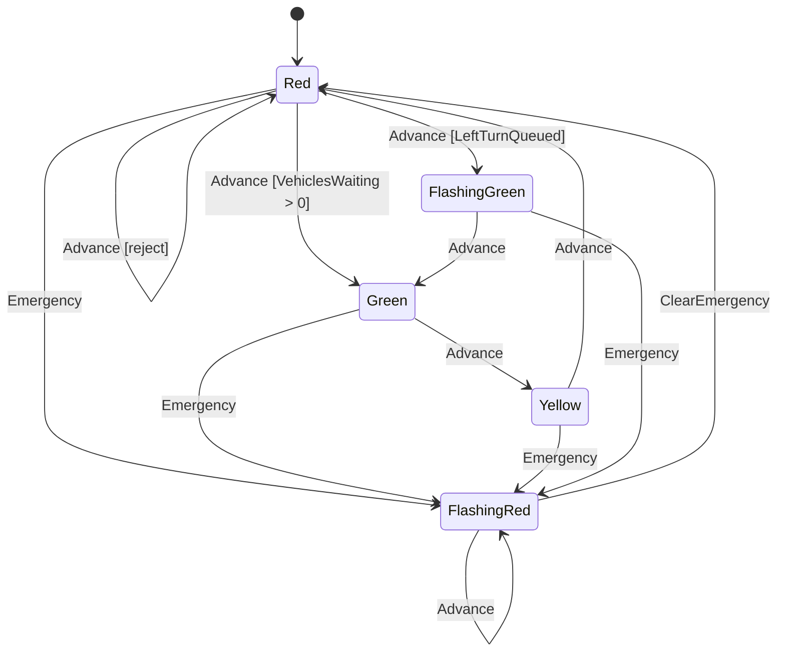

# Precept Authoring Workflow

Follow these steps when creating or editing a `.precept` file.

## Step 1: Understand the DSL Vocabulary

Call `precept_language` to get the current keyword categories, operators, type system, expression scopes, and constraint forms. This is the authoritative reference — do not guess syntax.

## Step 2: Gather Conventions

If the workspace contains existing `.precept` files, read at least one to learn the local style (naming conventions, comment placement, field ordering, guard patterns). If no local files exist, use the structure returned by `precept_language` as your guide.

## Step 3: Design the Model

Before writing code, outline the domain model:

1. **States** — identify the distinct lifecycle stages. Mark one as `initial`.
2. **Fields** — identify the data tracked across states. Choose types (`string`, `number`, `boolean`), set defaults, and mark nullable fields.
3. **Events** — identify the actions that cause transitions. Define event arguments with types and defaults.
4. **Invariants** — identify rules that must hold in every state.
5. **State constraints** — identify assertions that must be true when entering or remaining in a specific state.
6. **Event assertions** — identify validation rules on event arguments.
7. **Transitions** — map out `from <State> on <Event>` rules with guards (`when`), field mutations (`set`), and outcomes (`transition`, `no transition`, `reject`).
8. **Edit declarations** — identify which fields are directly editable in which states.

## Step 4: Write the Precept

Author the `.precept` file following this canonical order:

```
precept <Name>

# Description comment

# Fields
field <Name> as <type> [nullable] [default <value>]

# Invariants
invariant <expr> because "<message>"

# States
state <Name> [initial]

# State constraints
in <State> assert <expr> because "<message>"

# Edit declarations
in <State> edit <Field1>, <Field2>

# Events and event assertions
event <Name> [with <Arg> as <type> [default <value>], ...]
on <Event> assert <expr> because "<message>"

# Transitions
from <State|any> on <Event> [when <guard>] -> <action chain>
```

Action chains use `->` to sequence: `set <field> = <expr>`, `transition <State>`, `no transition`, `reject "<message>"`.

## Step 5: Compile and Fix

Call `precept_compile` with the full text. If there are diagnostics:
- **Errors**: fix immediately — these prevent the definition from loading.
- **Warnings**: review each one. Common warnings include unreachable states, dead-end states, and unused fields.
- **Hints**: informational — address if they reveal design gaps.

Repeat until the definition compiles cleanly.

## Step 6: Verify Behavior

Verification is sequential, not unconditional:

1. Use `precept_inspect` only after `precept_compile` succeeds.
2. If `precept_inspect` fails because the definition is invalid or the chosen snapshot is inconsistent, fix that problem before continuing.
3. Use `precept_fire` only after `precept_inspect` succeeds and identifies a concrete event worth tracing.
4. Do not run `precept_fire` just because it is the next step in the workflow; run it only when it adds new behavioral evidence beyond compile or inspect.

Use `precept_inspect` with a state and data snapshot to confirm which events are available and what each would do. Use `precept_fire` to trace individual transitions and verify field mutations and guard evaluation.

## Step 7: State Diagram

After the precept compiles successfully, generate a Mermaid `stateDiagram-v2` diagram from the `precept_compile` output. Use the `transitions` array to build the diagram:

- Each unique `from → to` pair becomes an arrow.
- Label arrows with the event name.
- If a transition has a guard, append it in brackets: `Event [guard]`.
- Mark the initial state with `[*] --> StateName`.
- If there are reject outcomes, add a note: `StateName --> StateName : Event [reject]`.
- A Mermaid diagram is optional. Use it when it would help the user understand all or part of the precept, or when the user explicitly asks for a diagram.
- When you do present a user-facing diagram in chat, prefer the Mermaid render tool over pasting raw Mermaid source.
- Do not also paste the Mermaid source in the same response unless the user explicitly asks for the source or asks to place it in a file.
- If Mermaid source is shown, label it clearly as source text and do not imply that the chat itself is rendering it.
- If a guard-heavy label fails to render cleanly, simplify the label text for the diagram and explain that the exact guard remains in the precept source.

Example:



## Common Patterns

### Guard priority
Place more specific guards before less specific ones. The first matching `from/on` rule wins.

```
from Red on Advance when LeftTurnQueued -> ...
from Red on Advance when VehiclesWaiting > 0 -> ...
from Red on Advance -> reject "No demand"
```

### Catch-all events
Use `from any on <Event>` for events that apply regardless of state.

```
from any on VehiclesArrive -> set VehiclesWaiting = VehiclesWaiting + VehiclesArrive.Count -> no transition
```

### Nullable field clearing
Set a nullable field to `null` to clear it.

```
from FlashingRed on ClearEmergency -> set EmergencyReason = null -> transition Red
```

## Language Evolution — Designing New Syntax

When proposing syntax for a new DSL construct (not just authoring within existing syntax), apply these heuristics in order:

1. **Reuse before invention.** Check whether existing DSL tokens already carry the needed semantic. `->` means "results in" (broadly: context → consequence). Don't introduce new keywords for relationships that existing tokens already express.
2. **Subtract before adding.** Start from the minimal unambiguous form and justify each added token. If removing a keyword changes nothing for the parser or reader, it's ceremony.
3. **Read principles broadly.** Design principles describe intent, not specific constructs. Extend them to new constructs rather than working around them.
4. **Test against rhythm.** Paste the proposed syntax into an actual sample file. Does it blend with existing `field`, `state`, `event`, and `from...on` declarations?
5. **Generate from principles, don't enumerate options.** Ask: what relationship does this express? Which existing token means that? What's the minimal sequence? The answer IS the proposal.
