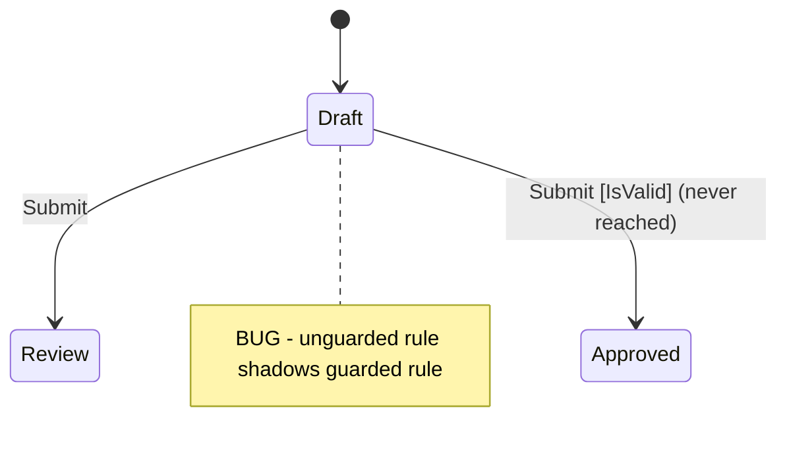

# Precept Debugging Workflow

Follow these steps when diagnosing problems in a `.precept` file.

## Step 1: Compile First

Call `precept_compile` with the full precept text. This is always the first step — it catches syntax errors, type errors, and structural issues before you look at runtime behavior.

Read the diagnostics carefully:
- **Errors** block the definition from loading. Fix these first.
- **Warnings** reveal structural problems: unreachable states, dead-end states, unused fields, shadowed transitions.
- **Hints** are informational but may point to design gaps.

## Step 2: Understand the Structure

From the `precept_compile` output, review:
- **States**: which states exist, which is initial
- **Fields**: names, types, defaults, nullability
- **Events**: names, arguments, assertions
- **Transitions**: the full `from/on/when/actions` table — this is the core logic

If the user reports a specific problem, locate the relevant transitions in this table.

## Step 3: Inspect from the Problem State

Call `precept_inspect` with the precept text, the state where the problem occurs, and the current data snapshot. The response shows:
- Which events are available from this state
- What each event would do (transition target, field changes, or rejection)
- Which fields are editable in this state

This tells you what the runtime *would* do without actually executing anything.

## Step 4: Trace with Fire

If the problem involves a specific event, call `precept_fire` with the precept text, current state, event name, data, and event arguments. The response shows the full execution pipeline:
1. Event assertion evaluation
2. Transition rule matching (which `from/on` rule matched)
3. Guard evaluation (did the `when` clause pass or fail?)
4. Action execution (field mutations)
5. State constraint evaluation (post-transition assertions)
6. Outcome (transition, no transition, or reject with reason)

Compare the actual outcome against what the user expected. The mismatch reveals the bug.

## Step 5: Test Field Edits

If the problem involves field editing or constraint violations during data entry, call `precept_update` with the precept text, current state, data, and the fields being changed. This tests the `in <State> edit` declarations and any associated constraints.

## Common Diagnostic Patterns

### "My event doesn't do anything" / Wrong transition fires
The most common cause is **guard ordering**. Rules are evaluated top-to-bottom; the first matching rule wins. Check whether a less-specific rule appears before the intended one:
```
# BUG: the unguarded rule matches first, so the guarded rule never fires
from Draft on Submit -> transition Review
from Draft on Submit when IsValid -> transition Approved
```
Fix: move the guarded rule above the unguarded catch-all.

### "Unreachable state" warning
A state has no incoming transitions. Either:
- Add a transition that targets it, or
- Remove the state if it's no longer part of the design.

### "Dead-end state" warning
A state has no outgoing transitions (no `from <State> on ...` rules). Either:
- Add transitions from this state, or
- This is intentional (a terminal state like `Closed` or `Funded`).

### Constraint violation on transition
A `in <State> assert ...` constraint fails when entering the target state. The data after field mutations doesn't satisfy the state's assertion. Check:
1. Are the `set` actions producing the right values?
2. Is the assertion's condition correct for this scenario?
3. Does a previous step need to set a field that the constraint requires?

### Event assertion rejection
An `on <Event> assert ...` fails before any transition logic runs. The event arguments don't satisfy the assertion. Check:
1. Are the argument values being passed correctly?
2. Is the assertion condition correct?

## Step 6: State Diagram for Diagnosis

When explaining structure or transition behavior, generate a focused Mermaid `stateDiagram-v2` showing only the relevant subset. Annotate the diagram:

- Guards in brackets: `Event [guard condition]`
- Reject branches as self-transitions: `State --> State : Event [reject]`
- Problematic transitions with a note

If `precept_compile` reported warnings, annotate them:
- Unreachable states: add a note `note right of StateName : UNREACHABLE`
- Dead-end states: add a note `note right of StateName : DEAD END`

Example showing a guard ordering bug:


