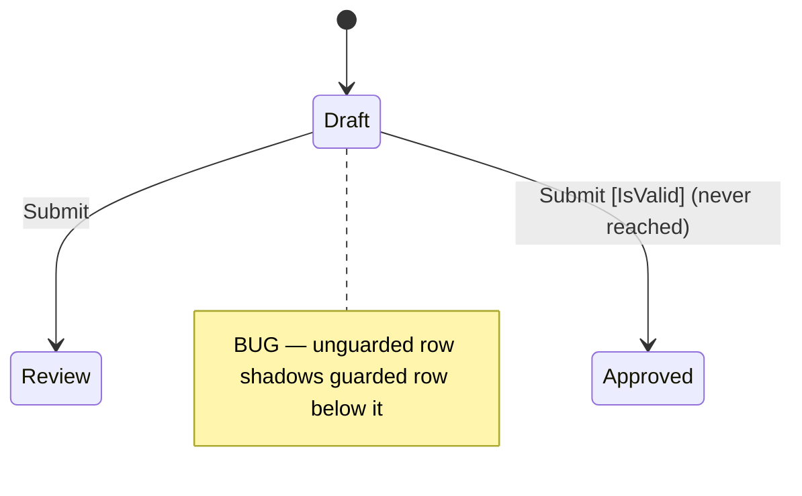

# Precept Debugging Workflow

Step-by-step companion to the precept-author agent for diagnosing problems in a `.precept` file. The runtime has no MCP-accessible introspection — **all diagnosis is static**, from compile output and reasoning about the transition table. Do not suggest "trace" or "run" steps.

When proposing a fix, match local `.precept` conventions where samples or nearby definitions establish style.

## Step 1: Compile First

Call `precept_compile` with the full precept text. This is always the first step — never skip it. It catches syntax errors, type errors, and structural issues, and returns the full definition structure (states, fields, events, transitions).

> **Stale-server caveat:** the precept MCP server serves the build from when it last spawned. If the compiler source (`src/Precept`) or `tools/Precept.Mcp` was changed this session, `precept_compile` reflects *old* behavior — ask the owner to run **`/mcp reconnect precept`** (rebuilds on reconnect, no session restart) before trusting its output. Diagnosing a `.precept` against a stale compiler chases phantom errors.

Read the diagnostics carefully:

- **Errors** — block the definition from loading. Fix these first.
- **Warnings** — reveal structural problems: unreachable states, dead-end states, unused fields, shadowed transitions.
- **Hints** — informational but may point to design gaps.

## Step 2: Look Up Each Diagnostic

For every diagnostic code in the compile output, call `precept_diagnostic` with the code name (e.g., `UndeclaredField`) or PRE-number (e.g., `PRE0017`). It returns the trigger condition, recovery steps, and before/after fix examples. Do not guess what a diagnostic means — look it up.

## Step 3: Understand the Structure

From the `precept_compile` output, review:

- **States** — which exist, which is initial, which are terminal.
- **Fields** — names, types, defaults, nullability.
- **Events** — names, arguments, ensures.
- **Transitions** — the full `from / on / when / actions` table. This is the core logic.

If the user reports a specific problem, locate the relevant transition rows in this table.

## Step 4: Consult Reference Tools for Expression and Type Issues

Use these tools when the problem is in expression syntax, type usage, or operator combinations:

- `precept_syntax` — malformed construct syntax, incorrect action chain, operator usage.
- `precept_types` — field type declarations, modifier usage, built-in function calls.
- `precept_operations` — operator-type mismatches. Pass a type name to filter.
- `precept_proofs` — guard evaluation, constraint violations. Shows what the proof engine expects and what runtime faults result.

## Step 5: Reason from the Compile Output

Common patterns that can be fully diagnosed from the compile output:

### Guard ordering issues
Transition rows are evaluated top-to-bottom. **The first matching `from/on` row wins.** An unguarded catch-all row shadows any guarded rows below it.

```
# BUG: the unguarded row matches first — the guarded row is never reached
from Draft on Submit -> transition Review
from Draft on Submit when IsValid -> transition Approved
```

Move the guarded row above the catch-all.

### Unreachable states
A state has no incoming transitions. Either add a transition that targets it or remove the state.

### Dead-end states
A non-terminal state has no outgoing transitions. Either add an outgoing transition, mark the state `terminal`, or remove it.

### Constraint violations on transition
If a state `ensure` fails after a transition, the `set` actions on the transition row produced data that doesn't satisfy the target state's constraints. Check whether the actions need to compute different values, or whether the ensure is over-constrained.

### Event ensure rejection
If an `on <Event> ensure ...` fails, the event is rejected *before* any transition row is selected. Check the provided event arguments, not the current state.

### Same-type qualifier mismatch
`PriceGreaterThanOrEqualPrice`, `MoneyGreaterThanOrEqualMoney`, and all same-type comparison operators have `qualifierMatch: Same` — both operands must have identical qualifiers (currency AND unit for `price`; currency for `money`). Two `price` values with different denominator units (e.g., `price in 'USD' of 'SaleUnit'` vs `price in 'USD' of 'StockingUnit'`) will fail with a type mismatch even though both are `price`.

Call `precept_operations` filtered by the operand type and check the `qualifierMatch` field on the failing operator before concluding the types themselves are wrong.

### Proof failures (PRE0078, PRE0079, etc.)
The proof engine couldn't prove an obligation. Common causes:

- Division where the divisor isn't proven non-zero
- Arithmetic where overflow isn't ruled out
- Field reads where the field isn't proven present in the current state

`precept_proofs` returns the obligation catalog. Add constraints (`rule`, `ensure`, or modifier like `nonnegative`/`positive`) that establish the missing fact.

## Step 6: Optional State Diagram for Diagnosis

When transition structure is the problem, a focused Mermaid `stateDiagram-v2` from the compile output can make the bug obvious by revealing shadowed rows or unreachable states.


